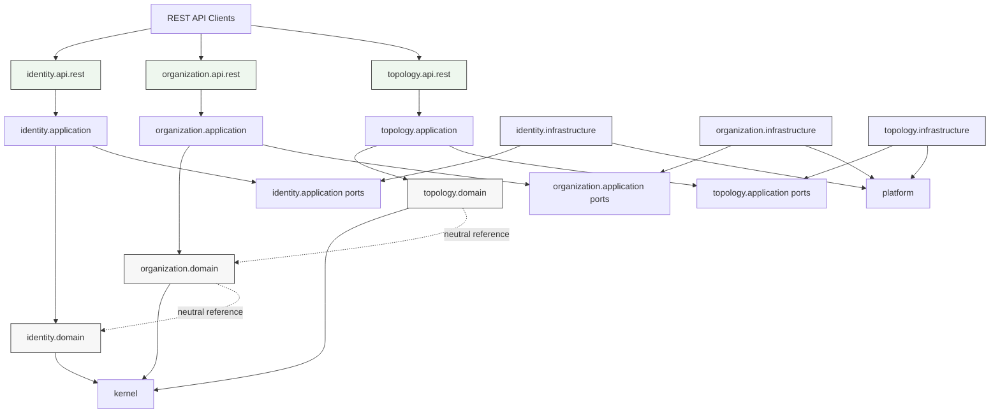
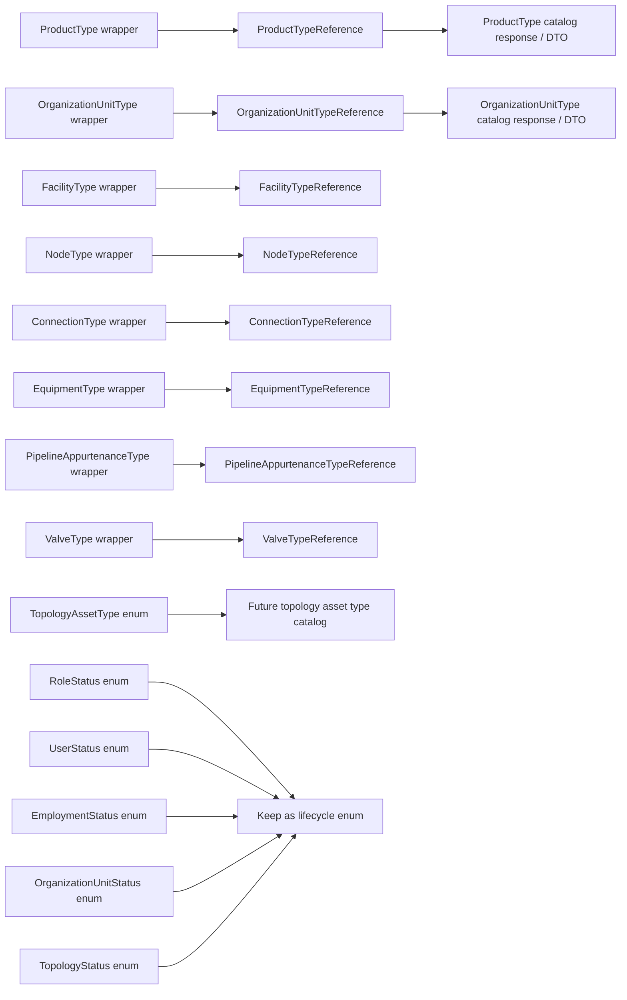
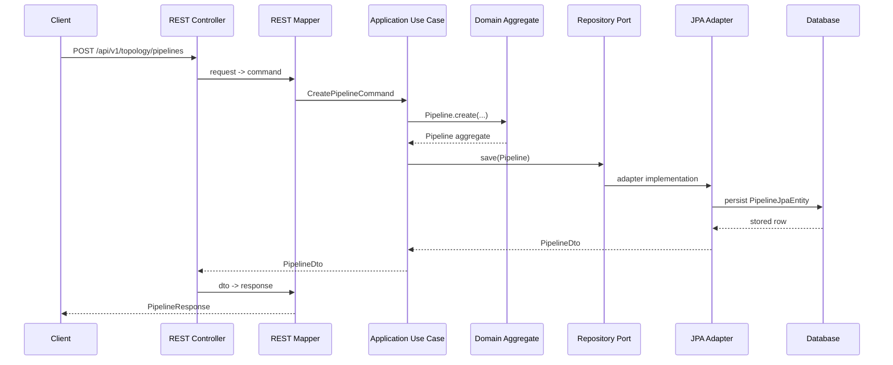

# HidraAPI Domain Schema

## 1. Purpose

This document records the high-level HidraAPI domain structure for the current modular monolith.

It focuses on:

```text
identity
organization
topology
kernel
platform
```

The diagrams are intentionally architectural and module-oriented. They are not a replacement for source code or database migrations.

---

## 2. High-Level Module Diagram



Boundary rule:

```text
Domain modules may use neutral references to other modules, but must not import foreign aggregate classes.
```

---

## 3. Domain Class Diagram

```mermaid
classDiagram
    class User {
      <<AggregateRoot>>
      UserId id
      Username username
      EmailAddress emailAddress
      UserStatus status
      EmployeeReference employeeReference
    }

    class Role {
      <<AggregateRoot>>
      RoleId id
      RoleCode code
      RoleName name
      RoleStatus status
    }

    class Permission {
      <<Entity>>
      PermissionId id
      PermissionCode code
    }

    class UserRoleAssignment {
      <<Entity>>
      RoleId roleId
      RoleCode roleCode
    }

    class RolePermissionAssignment {
      <<Entity>>
      PermissionId permissionId
      PermissionCode permissionCode
    }

    class Employee {
      <<AggregateRoot>>
      EmployeeId id
      EmployeeNumber employeeNumber
      EmployeeFullName fullName
      EmploymentStatus status
      IdentityUserReference identityUserReference
    }

    class OrganizationUnit {
      <<AggregateRoot>>
      OrganizationUnitId id
      OrganizationUnitCode code
      OrganizationUnitName name
      OrganizationUnitStatus status
      OrganizationUnitTypeReference type
    }

    class Position {
      <<AggregateRoot>>
      PositionId id
      PositionCode code
      PositionTitle title
    }

    class PipelineSystem {
      <<AggregateRoot>>
      PipelineSystemId id
      TopologyCode code
      TopologyName name
      ProductTypeReference productType
      TopologyStatus status
    }

    class Pipeline {
      <<AggregateRoot>>
      PipelineId id
      PipelineSystemId pipelineSystemId
      TopologyCode code
      TopologyMultilingualName name
      TopologyMultilingualDescription description
      ProductTypeReference productType
      TopologyStatus status
    }

    class Facility {
      <<AggregateRoot>>
      FacilityId id
      TopologyCode code
      TopologyName name
      FacilityTypeReference facilityType
      ProductTypeReference productType
      TopologyStatus status
    }

    class TopologyNode {
      <<AggregateRoot>>
      TopologyNodeId id
      TopologyCode code
      TopologyName name
      NodeTypeReference nodeType
      TopologyStatus status
    }

    class PipelineAppurtenance {
      <<AggregateRoot>>
      PipelineAppurtenanceId id
      PipelineId pipelineId
      PipelineAppurtenanceTypeReference appurtenanceType
      ValveTypeReference valveType
      TopologyStatus status
    }

    class TopologyConnection {
      <<AggregateRoot>>
      TopologyConnectionId id
      ConnectionTypeReference connectionType
      TopologyStatus status
    }

    class Equipment {
      <<AggregateRoot>>
      EquipmentId id
      EquipmentTypeReference equipmentType
      ValveTypeReference valveType
      TopologyStatus status
    }

    class ProductTypeReference {
      <<ReferenceObject>>
      id
      code
    }

    class OrganizationUnitTypeReference {
      <<ReferenceObject>>
      id
      code
    }

    class FacilityTypeReference {
      <<ReferenceObject>>
      id
      code
    }

    class NodeTypeReference {
      <<ReferenceObject>>
      id
      code
    }

    class ConnectionTypeReference {
      <<ReferenceObject>>
      id
      code
    }

    class EquipmentTypeReference {
      <<ReferenceObject>>
      id
      code
    }

    class PipelineAppurtenanceTypeReference {
      <<ReferenceObject>>
      id
      code
    }

    class ValveTypeReference {
      <<ReferenceObject>>
      id
      code
    }

    User *-- UserRoleAssignment : composes
    Role *-- RolePermissionAssignment : composes
    RolePermissionAssignment o-- Permission : references
    User o-- Employee : EmployeeReference
    Employee o-- User : IdentityUserReference
    OrganizationUnit o-- OrganizationUnit : parent reference
    OrganizationUnit o-- OrganizationUnitTypeReference : catalog reference
    Position o-- OrganizationUnit : assigned through employee assignment

    PipelineSystem o-- ProductTypeReference : catalog reference
    Pipeline o-- PipelineSystem : parent reference
    Pipeline o-- ProductTypeReference : catalog reference
    Facility o-- FacilityTypeReference : catalog reference
    Facility o-- ProductTypeReference : catalog reference
    TopologyNode o-- NodeTypeReference : catalog reference
    PipelineAppurtenance o-- PipelineAppurtenanceTypeReference : catalog reference
    PipelineAppurtenance o-- ValveTypeReference : catalog reference
    TopologyConnection o-- ConnectionTypeReference : catalog reference
    Equipment o-- EquipmentTypeReference : catalog reference
    Equipment o-- ValveTypeReference : catalog reference
```



---

## 4. Enum / Reference Classification Map



Meaning:

```text
Status enums stay as lifecycle enums.
User-facing type classifications move to catalog references.
Deprecated wrapper classes are transitional and scheduled for removal.
```

---

## 5. Request-to-Domain-to-Persistence Trace



---

## 6. Modeling Notes

```text
- Composition is shown with solid diamond relationships.
- Neutral cross-module references are shown as ordinary references, not aggregate imports.
- Catalog-backed user-facing classifications are shown as reference objects.
- Deprecated wrappers are shown only in the conversion map, not as target domain design.
- Pipeline labels are trilingual after COR2-008.
- Business display name value objects are trilingual after COR2-009.
```
