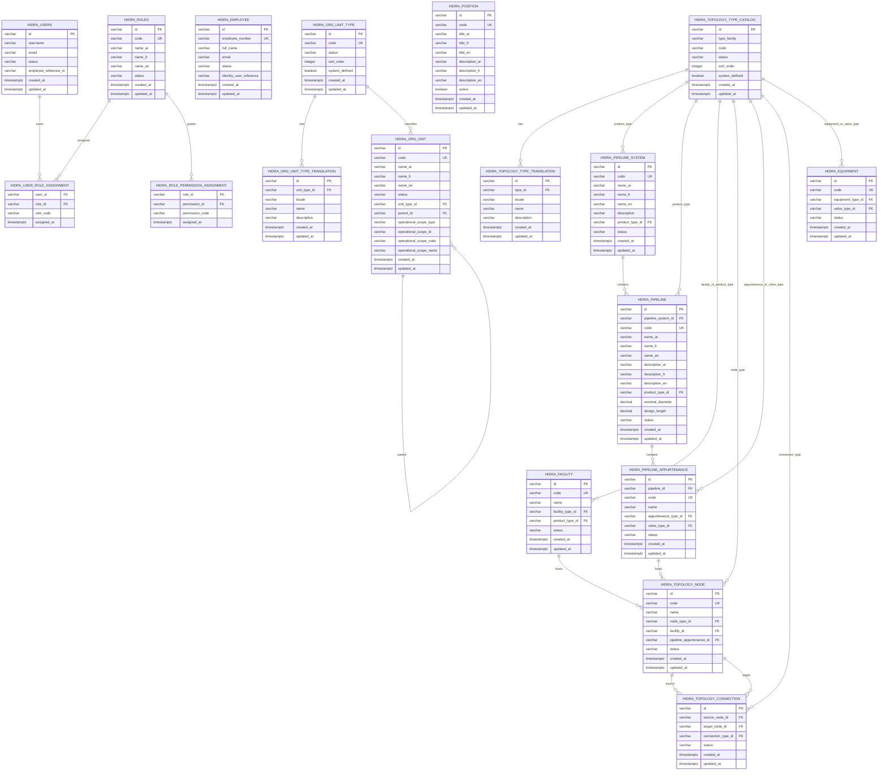
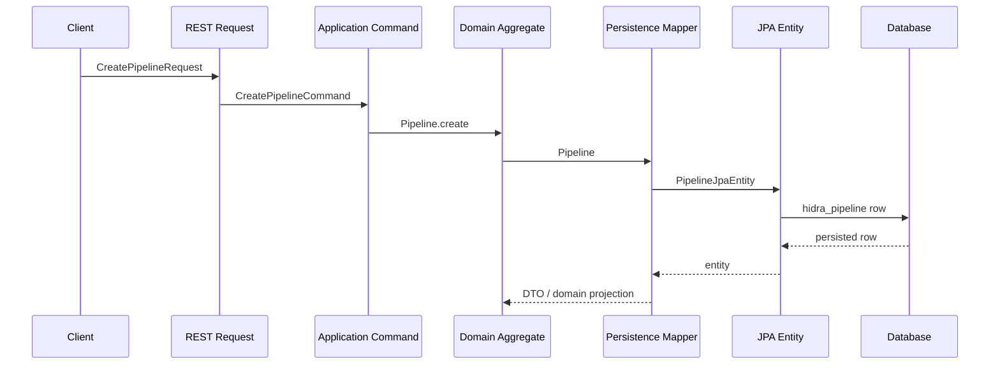

# HidraAPI Persistence Schema

## 1. Purpose

This document records a high-level persistence view for HidraAPI.

It focuses on the main JPA tables and relationships used by:

```text
identity
organization
topology
catalog reference data
```

The diagram is architectural. The exact schema source of truth remains the JPA entities and Flyway migrations.

---

## 2. Persistence ER Diagram



---

## 3. Multilingual Persistence Convention

Business labels use explicit multilingual columns.

Names:

```text
name_ar
name_fr
name_en
```

Titles:

```text
title_ar
title_fr
title_en
```

Descriptions:

```text
description_ar
description_fr
description_en
```

Single-value exceptions:

```text
technical codes
ids
usernames
email addresses
employee full names
external immutable reference names
```

---

## 4. Catalog Persistence Convention

User-facing type classifications are persisted as catalog tables or catalog entries.

The target catalog structure is:

```text
catalog table:
  id
  code
  status
  sort_order
  system_defined
  created_at
  updated_at

translation table:
  id
  catalog_entry_id
  locale
  name
  description
  created_at
  updated_at
```

Reference objects in domain code carry only:

```text
id
code
```

Labels are resolved through catalog application/API projections, not hardcoded in reference objects.

---

## 5. Request-to-Persistence Trace



---

## 6. Notes

```text
- Flyway migrations are the database schema source of truth.
- JPA entities mirror the active schema.
- Domain aggregates do not import JPA.
- Domain references store catalog ids/codes; translated labels live in catalog tables or API DTOs.
- Pipeline label persistence is multilingual after COR2-008.
- Role, organization unit, and position label persistence is multilingual after COR2-010.
```
