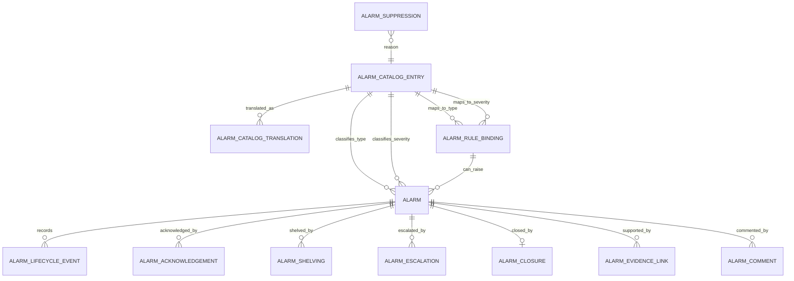

# HIDRA — Alarm Management Module Data Definition Document

```text
Document        : HIDRA-ALARM-MANAGEMENT-DATA-DEFINITION-DOCUMENT
Module          : alarm-management / alarms
Namespace       : dz.sh.hidra.modules.alarms
Product         : Hidra - Hydrocarbon Intelligence for Data, Risk, and Analytics
Author          : Abir MEDJERAB
Owner           : Sonatrach / TRC : Digitalization Initiative
Status          : Target DDD; no implemented Java module found in connected repository searches
Evidence level  : Target architecture grounded in Hidra monitoring scope
CreatedOn       : 2026-06-11
```

---

## 1. Purpose

The Alarm Management module turns confirmed operational abnormality evidence into a controlled alarm lifecycle.

It answers:

```text
Which abnormal condition became a formal alarm?
Where did it happen?
When was it raised, acknowledged, shelved, suppressed, cleared, or closed?
Who acknowledged it?
Why was it suppressed, shelved, escalated, or closed?
What operational asset and evidence does it refer to?
Is it still active?
Was it escalated to incident management?
```

Alarm Management is not the same as Monitoring.

```text
Monitoring detects candidates.
Alarm Management controls formal alarms.
Incident Management controls incidents created from alarms.
```

---

## 2. Source-of-truth position

Direct repository searches did not reveal an implemented `alarms` Java module in the connected repositories.

Therefore this document defines the target data model using the established Hidra operational chain:

```text
Topology
  -> Telemetry
      -> Planning
          -> Monitoring
              -> Alarm Management
                  -> Leak Detection
                      -> Incident Management
```

The Monitoring scope already identifies alert candidates and acknowledgements as monitoring output/evidence, but Alarm Management must own the formal alarm lifecycle.

---

## 3. Module ownership

Alarm Management owns:

```text
Alarm
AlarmLifecycleEvent
AlarmAcknowledgement
AlarmShelving
AlarmSuppression
AlarmEscalation
AlarmClosure
AlarmEvidenceLink
AlarmComment
AlarmRuleBinding
AlarmCatalogEntry
AlarmCatalogTranslation
```

Alarm Management references:

```text
MonitoringAlertCandidate reference
MonitoringEvaluation reference
TelemetryReading reference
TopologyAsset reference
PlanningTarget reference
Actor snapshot
OrganizationUnit snapshot
Workflow reference
Incident reference
```

Alarm Management does not own:

```text
telemetry readings
monitoring rules
monitoring thresholds
plan targets
topology assets
workflow tasks
incident lifecycle
notification delivery
risk scoring
SCADA control actions
```

---

## 4. Boundary rules

### 4.1 Monitoring versus alarms

Monitoring is allowed to produce an alert/alarm candidate.
Alarm Management decides whether the candidate becomes a formal operational alarm.

```text
MonitoringAlertCandidate -> Alarm
```

Not every candidate becomes an alarm.

### 4.2 Alarm versus incident

An alarm is an operational abnormality record.
An incident is a managed operational problem with investigation, response actions, impact, root cause, and closure evidence.

```text
Alarm -> may escalate to Incident
Incident -> references Alarm
```

Alarm Management does not own incident resolution.

### 4.3 Alarm versus notification

Alarm Management records alarm lifecycle state.
Notification delivers messages through channels such as email, SMS, push, Teams, or dashboard.

```text
AlarmManagement -> creates alarm events
Notification -> delivers notification messages
```

### 4.4 Alarm versus SCADA/control

Alarm Management is decision-support only. It must never actuate valves, pumps, compressors, RTUs, PLCs, ESD, SIS, or SCADA control points.

Forbidden:

```text
Alarm.closeValve()
Alarm.stopPump()
Alarm.writeScadaTag()
Alarm.triggerEsiAction()
```

Allowed:

```text
Alarm records operational evidence.
Alarm records acknowledgement, shelving, suppression, escalation, and closure.
```

---

## 5. Entity overview

| Entity | Ownership | Description |
|---|---|---|
| `Alarm` | Alarm Management | Formal operational alarm instance. |
| `AlarmLifecycleEvent` | Alarm Management | Append-only lifecycle event timeline. |
| `AlarmAcknowledgement` | Alarm Management | Actor acknowledgement of an alarm. |
| `AlarmShelving` | Alarm Management | Temporary operator-approved hiding/postponing of alarm visibility. |
| `AlarmSuppression` | Alarm Management | Rule-based or manual suppression of alarm generation/visibility. |
| `AlarmEscalation` | Alarm Management | Escalation of alarm to a higher responsibility level or incident. |
| `AlarmClosure` | Alarm Management | Closure record after clear/normalization and review. |
| `AlarmEvidenceLink` | Alarm Management | Links alarm to telemetry, monitoring, planning, topology, documents, or incident references. |
| `AlarmComment` | Alarm Management | Human comment/note on alarm. |
| `AlarmRuleBinding` | Alarm Management | Mapping between monitoring candidates/rules and formal alarm classes. |
| `AlarmCatalogEntry` | Alarm Management | Controlled vocabulary for alarm type, severity, priority, cause, state reason, shelving reason, suppression reason. |
| `AlarmCatalogTranslation` | Alarm Management | Multilingual labels for alarm catalog entries. |

---

## 6. Common reference value objects

### 6.1 TopologyAssetReference

Telemetry and Monitoring already use neutral topology references. Alarm Management must do the same.

| Field | Type | Required | Description |
|---|---:|---:|---|
| `topologyAssetTypeCode` | String | Yes | Asset type code, for example `PIPELINE`, `FACILITY`, `EQUIPMENT`, `NODE`, `SEGMENT`. |
| `topologyAssetId` | String | Yes | Stable asset ID owned by Topology. |
| `topologyAssetCode` | String | Yes | Asset code snapshot. |
| `topologyAssetNameSnapshot` | String | No | Display name snapshot at alarm time. |

### 6.2 ActorSnapshot

| Field | Type | Required | Description |
|---|---:|---:|---|
| `actorId` | String | Yes | Identity actor ID or system actor reference. |
| `actorDisplayName` | String | No | Actor display name snapshot. |
| `actorType` | Catalog/String | No | `USER`, `SYSTEM`, `INTEGRATION`, `SCHEDULER`. |

### 6.3 OrganizationUnitSnapshot

| Field | Type | Required | Description |
|---|---:|---:|---|
| `organizationUnitId` | String | No | Organization unit reference. |
| `organizationUnitCode` | String | No | Organization unit code snapshot. |
| `organizationUnitNameSnapshot` | String | No | Organization unit display name snapshot. |

---

# 7. Entity data definitions

---

## 7.1 Alarm

### Description

`Alarm` is the formal operational alarm instance.

It is created from monitoring evidence, telemetry quality conditions, manual operational declaration, or external integration input. It owns lifecycle status but does not own the original monitoring/telemetry/topology facts.

### Table

```text
hidra_alarm
```

### Fields

| Field | Type | Required | Description |
|---|---:|---:|---|
| `id` | String/UUID | Yes | Stable alarm identifier. |
| `alarmNumber` | String | Yes | Human-readable unique alarm number, for example `ALM-2026-000001`. |
| `alarmTypeId` | String | Yes | Catalog entry reference for alarm type. |
| `severityId` | String | Yes | Catalog entry reference for severity. |
| `priorityId` | String | No | Catalog entry reference for operational priority. |
| `titleAr` | String | No | Arabic title/message snapshot. |
| `titleFr` | String | Yes | French title/message snapshot. |
| `titleEn` | String | No | English title/message snapshot. |
| `descriptionAr` | Text | No | Arabic detailed description. |
| `descriptionFr` | Text | No | French detailed description. |
| `descriptionEn` | Text | No | English detailed description. |
| `sourceType` | String/Catalog | Yes | `MONITORING_CANDIDATE`, `TELEMETRY_QUALITY`, `MANUAL`, `INTEGRATION`, `LEAK_DETECTION`, `SAFETY_SYSTEM`. |
| `sourceReferenceId` | String | No | Generic source reference ID. |
| `monitoringAlertCandidateId` | String | No | Reference to Monitoring alert candidate when created from monitoring. |
| `monitoringEvaluationId` | String | No | Reference to Monitoring evaluation when available. |
| `telemetryReadingId` | String | No | Reference to source telemetry reading if directly involved. |
| `planningTargetId` | String | No | Reference to planning target if plan-vs-actual related. |
| `topologyAssetTypeCode` | String | Yes | Referenced topology asset type code. |
| `topologyAssetId` | String | Yes | Referenced topology asset ID. |
| `topologyAssetCode` | String | Yes | Referenced topology asset code snapshot. |
| `topologyAssetNameSnapshot` | String | No | Referenced topology asset name snapshot. |
| `currentState` | String/Enum | Yes | `RAISED`, `ACTIVE`, `ACKNOWLEDGED`, `SHELVED`, `SUPPRESSED`, `CLEARED`, `CLOSED`, `ESCALATED`, `CANCELLED`. |
| `raisedAt` | Instant | Yes | Timestamp when alarm was formally raised. |
| `firstDetectedAt` | Instant | No | Timestamp of first evidence detection. |
| `lastUpdatedAt` | Instant | Yes | Last lifecycle update timestamp. |
| `clearedAt` | Instant | No | Timestamp when abnormal condition cleared. |
| `closedAt` | Instant | No | Timestamp when alarm was administratively closed. |
| `acknowledgedAt` | Instant | No | Timestamp of latest acknowledgement. |
| `acknowledgedByActorId` | String | No | Latest acknowledging actor ID snapshot. |
| `owningOrganizationUnitId` | String | No | Responsible organization unit reference. |
| `owningOrganizationUnitCode` | String | No | Responsible organization unit code snapshot. |
| `owningOrganizationUnitNameSnapshot` | String | No | Responsible organization unit name snapshot. |
| `workflowInstanceId` | String | No | Workflow reference if alarm needs approval/review. |
| `incidentId` | String | No | Incident reference if escalated to incident. |
| `correlationId` | String | No | Cross-module correlation ID. |
| `createdAt` | Instant | Yes | Creation timestamp. |
| `updatedAt` | Instant | Yes | Last update timestamp. |

### Constraints

```text
UNIQUE(alarmNumber)
INDEX(currentState, severityId)
INDEX(topologyAssetTypeCode, topologyAssetId)
INDEX(monitoringAlertCandidateId)
INDEX(raisedAt)
INDEX(owningOrganizationUnitId)
```

### Rules

```text
Alarm must reference a topology asset snapshot.
Alarm must have a severity.
Alarm cannot be closed before it is cleared unless explicitly cancelled.
Alarm cannot be acknowledged after closure.
Alarm escalation to incident stores only incidentId reference; incident lifecycle remains outside alarms.
```

---

## 7.2 AlarmLifecycleEvent

### Description

Append-only timeline event for every important alarm state/action.

### Table

```text
hidra_alarm_lifecycle_event
```

### Fields

| Field | Type | Required | Description |
|---|---:|---:|---|
| `id` | String/UUID | Yes | Stable event ID. |
| `alarmId` | String | Yes | Parent alarm ID. |
| `eventType` | String/Catalog | Yes | `RAISED`, `ACKNOWLEDGED`, `SHELVED`, `UNSHELVED`, `SUPPRESSED`, `UNSUPPRESSED`, `CLEARED`, `CLOSED`, `ESCALATED`, `COMMENTED`, `ASSIGNED`, `CANCELLED`. |
| `previousState` | String | No | Alarm state before event. |
| `newState` | String | Yes | Alarm state after event. |
| `reasonId` | String | No | Catalog reason reference. |
| `reasonText` | Text | No | Human-entered explanation. |
| `actorId` | String | Yes | Actor or system that caused the event. |
| `actorDisplayName` | String | No | Actor display name snapshot. |
| `organizationUnitId` | String | No | Acting organization unit reference. |
| `organizationUnitCode` | String | No | Acting organization unit code snapshot. |
| `organizationUnitNameSnapshot` | String | No | Acting organization unit name snapshot. |
| `occurredAt` | Instant | Yes | Event occurrence timestamp. |
| `correlationId` | String | No | Correlation ID. |
| `metadataJson` | JSON/Text | No | Technical metadata snapshot. |

### Constraints

```text
INDEX(alarmId, occurredAt)
INDEX(eventType, occurredAt)
```

### Rules

```text
Lifecycle events are append-only.
No update/delete except technical correction under audit control.
Every state change must produce exactly one lifecycle event.
```

---

## 7.3 AlarmAcknowledgement

### Description

Records that an actor has seen and taken responsibility for an alarm.

### Table

```text
hidra_alarm_acknowledgement
```

### Fields

| Field | Type | Required | Description |
|---|---:|---:|---|
| `id` | String/UUID | Yes | Acknowledgement ID. |
| `alarmId` | String | Yes | Alarm being acknowledged. |
| `acknowledgedByActorId` | String | Yes | Actor ID. |
| `acknowledgedByDisplayName` | String | No | Actor display name snapshot. |
| `organizationUnitId` | String | No | Actor organization unit reference. |
| `organizationUnitCode` | String | No | Organization unit code snapshot. |
| `acknowledgedAt` | Instant | Yes | Timestamp. |
| `comment` | Text | No | Optional acknowledgement comment. |
| `correlationId` | String | No | Correlation ID. |

### Constraints

```text
INDEX(alarmId, acknowledgedAt)
INDEX(acknowledgedByActorId, acknowledgedAt)
```

---

## 7.4 AlarmShelving

### Description

Temporary, time-bounded shelving of an alarm by an authorized actor.

Shelving keeps the alarm known but reduces visibility/noise for a defined period.

### Table

```text
hidra_alarm_shelving
```

### Fields

| Field | Type | Required | Description |
|---|---:|---:|---|
| `id` | String/UUID | Yes | Shelving record ID. |
| `alarmId` | String | Yes | Alarm being shelved. |
| `shelvingReasonId` | String | Yes | Catalog reason reference. |
| `reasonText` | Text | No | Explanation. |
| `shelvedByActorId` | String | Yes | Actor who shelved the alarm. |
| `shelvedAt` | Instant | Yes | Start timestamp. |
| `shelvedUntil` | Instant | Yes | Automatic unshelving timestamp. |
| `unshelvedAt` | Instant | No | Actual unshelving timestamp. |
| `unshelvedByActorId` | String | No | Actor or system that unshelved it. |
| `status` | String/Enum | Yes | `ACTIVE`, `EXPIRED`, `CANCELLED`, `COMPLETED`. |
| `correlationId` | String | No | Correlation ID. |

### Rules

```text
shelvedUntil must be after shelvedAt.
Only active/open alarms may be shelved.
A closed alarm cannot be shelved.
Only one active shelving record per alarm is allowed.
```

---

## 7.5 AlarmSuppression

### Description

Suppression prevents alarm generation or visibility under controlled conditions.

Suppression can be manual, planned-maintenance related, rule-based, or integration-driven.

### Table

```text
hidra_alarm_suppression
```

### Fields

| Field | Type | Required | Description |
|---|---:|---:|---|
| `id` | String/UUID | Yes | Suppression record ID. |
| `scopeType` | String/Catalog | Yes | `ALARM`, `ALARM_TYPE`, `TOPOLOGY_ASSET`, `MONITORING_RULE`, `SOURCE`. |
| `scopeReferenceId` | String | Yes | Target of suppression. |
| `alarmId` | String | No | Alarm reference when suppression targets one alarm. |
| `alarmTypeId` | String | No | Type reference when suppressing by type. |
| `topologyAssetTypeCode` | String | No | Asset type when suppression is asset-scoped. |
| `topologyAssetId` | String | No | Asset ID when suppression is asset-scoped. |
| `suppressionReasonId` | String | Yes | Catalog reason reference. |
| `reasonText` | Text | No | Explanation. |
| `suppressedByActorId` | String | Yes | Actor or system that activated suppression. |
| `suppressedAt` | Instant | Yes | Start timestamp. |
| `suppressedUntil` | Instant | No | Optional end timestamp. |
| `releasedAt` | Instant | No | Release timestamp. |
| `releasedByActorId` | String | No | Actor or system that released suppression. |
| `status` | String/Enum | Yes | `ACTIVE`, `EXPIRED`, `RELEASED`, `CANCELLED`. |
| `workflowInstanceId` | String | No | Workflow approval reference if suppression requires approval. |
| `correlationId` | String | No | Correlation ID. |

### Rules

```text
Suppression must always have a reason.
Open-ended suppression must be exceptional and approval-controlled.
Suppression does not delete existing alarms.
Suppression must be visible in audit and operations review.
```

---

## 7.6 AlarmEscalation

### Description

Escalation record showing that an alarm has been escalated to another responsibility level, workflow, or incident.

### Table

```text
hidra_alarm_escalation
```

### Fields

| Field | Type | Required | Description |
|---|---:|---:|---|
| `id` | String/UUID | Yes | Escalation ID. |
| `alarmId` | String | Yes | Alarm being escalated. |
| `escalationLevel` | Integer | Yes | Numeric escalation level. |
| `escalationType` | String/Catalog | Yes | `ORGANIZATION`, `WORKFLOW`, `INCIDENT`, `SUPERVISOR`, `ON_CALL`, `MANUAL`. |
| `targetOrganizationUnitId` | String | No | Target organization unit reference. |
| `targetActorId` | String | No | Target actor reference. |
| `workflowInstanceId` | String | No | Workflow reference. |
| `incidentId` | String | No | Incident reference if incident created. |
| `reasonId` | String | No | Catalog reason reference. |
| `reasonText` | Text | No | Explanation. |
| `escalatedByActorId` | String | Yes | Actor/system escalating. |
| `escalatedAt` | Instant | Yes | Timestamp. |
| `status` | String/Enum | Yes | `OPEN`, `ACCEPTED`, `REJECTED`, `CANCELLED`, `COMPLETED`. |
| `correlationId` | String | No | Correlation ID. |

### Rules

```text
Alarm escalation to incident does not make alarms own incident lifecycle.
Incident Management owns response, root cause, impact, and resolution.
```

---

## 7.7 AlarmClosure

### Description

Administrative closure record after the abnormal condition has cleared or alarm has been cancelled.

### Table

```text
hidra_alarm_closure
```

### Fields

| Field | Type | Required | Description |
|---|---:|---:|---|
| `id` | String/UUID | Yes | Closure ID. |
| `alarmId` | String | Yes | Closed alarm. |
| `closureType` | String/Catalog | Yes | `NORMALIZED`, `FALSE_ALARM`, `DUPLICATE`, `MAINTENANCE`, `CANCELLED`, `ESCALATED_TO_INCIDENT`. |
| `closureReasonId` | String | No | Catalog reason reference. |
| `closureComment` | Text | No | Explanation. |
| `closedByActorId` | String | Yes | Closing actor/system. |
| `closedAt` | Instant | Yes | Closure timestamp. |
| `requiresReview` | Boolean | Yes | Whether post-closure review is required. |
| `reviewWorkflowInstanceId` | String | No | Workflow reference if review is required. |
| `correlationId` | String | No | Correlation ID. |

### Rules

```text
Only one closure record per alarm.
Closure must create an AlarmLifecycleEvent.
Closure should preserve reason and actor snapshot.
```

---

## 7.8 AlarmEvidenceLink

### Description

Links an alarm to the evidence that supports it.

### Table

```text
hidra_alarm_evidence_link
```

### Fields

| Field | Type | Required | Description |
|---|---:|---:|---|
| `id` | String/UUID | Yes | Evidence link ID. |
| `alarmId` | String | Yes | Alarm ID. |
| `evidenceType` | String/Catalog | Yes | `MONITORING_CANDIDATE`, `MONITORING_EVALUATION`, `TELEMETRY_READING`, `PLANNING_TARGET`, `TOPOLOGY_ASSET`, `DOCUMENT`, `WORKFLOW`, `INCIDENT`, `EXTERNAL_REFERENCE`. |
| `evidenceReferenceId` | String | Yes | Referenced entity ID. |
| `evidenceCodeSnapshot` | String | No | Code snapshot if available. |
| `evidenceNameSnapshot` | String | No | Display name snapshot if available. |
| `description` | Text | No | Explanation of evidence. |
| `createdAt` | Instant | Yes | Creation timestamp. |

### Constraints

```text
INDEX(alarmId)
INDEX(evidenceType, evidenceReferenceId)
```

---

## 7.9 AlarmComment

### Description

Human note/comment attached to an alarm timeline.

### Table

```text
hidra_alarm_comment
```

### Fields

| Field | Type | Required | Description |
|---|---:|---:|---|
| `id` | String/UUID | Yes | Comment ID. |
| `alarmId` | String | Yes | Alarm ID. |
| `commentText` | Text | Yes | Comment content. |
| `visibility` | String/Enum | Yes | `INTERNAL`, `OPERATIONS`, `AUDIT`, `INCIDENT_HANDOVER`. |
| `createdByActorId` | String | Yes | Actor ID. |
| `createdByDisplayName` | String | No | Actor display snapshot. |
| `createdAt` | Instant | Yes | Creation timestamp. |
| `updatedAt` | Instant | No | Update timestamp, if editable. |

### Rules

```text
Operational comments should normally be append-only.
If comments are editable, previous versions must be auditable.
```

---

## 7.10 AlarmRuleBinding

### Description

Configuration linking monitoring candidates/rules to formal alarm classification.

This is not a monitoring threshold. It defines how a candidate becomes a formal alarm class.

### Table

```text
hidra_alarm_rule_binding
```

### Fields

| Field | Type | Required | Description |
|---|---:|---:|---|
| `id` | String/UUID | Yes | Binding ID. |
| `code` | String | Yes | Unique binding code. |
| `nameAr` | String | No | Arabic label. |
| `nameFr` | String | Yes | French label. |
| `nameEn` | String | No | English label. |
| `monitoringRuleId` | String | No | Monitoring rule reference. |
| `monitoringThresholdId` | String | No | Monitoring threshold reference. |
| `candidateTypeId` | String | No | Candidate type catalog reference. |
| `alarmTypeId` | String | Yes | Resulting alarm type. |
| `defaultSeverityId` | String | Yes | Default alarm severity. |
| `defaultPriorityId` | String | No | Default operational priority. |
| `autoRaise` | Boolean | Yes | Whether candidate may automatically raise an alarm. |
| `requiresOperatorConfirmation` | Boolean | Yes | Whether candidate must be confirmed manually. |
| `active` | Boolean | Yes | Whether binding is active. |
| `effectiveFrom` | Instant | Yes | Validity start. |
| `effectiveTo` | Instant | No | Validity end. |
| `createdAt` | Instant | Yes | Creation timestamp. |
| `updatedAt` | Instant | Yes | Last update timestamp. |

### Rules

```text
AlarmRuleBinding must not duplicate MonitoringRule thresholds.
It maps detection evidence into formal alarm classification.
```

---

## 7.11 AlarmCatalogEntry

### Description

Controlled vocabulary entry for alarm taxonomy.

Used for:

```text
ALARM_TYPE
ALARM_SEVERITY
ALARM_PRIORITY
ALARM_STATE
ALARM_EVENT_TYPE
SHELVING_REASON
SUPPRESSION_REASON
CLOSURE_REASON
ESCALATION_TYPE
EVIDENCE_TYPE
```

### Table

```text
hidra_alarm_catalog_entry
```

### Fields

| Field | Type | Required | Description |
|---|---:|---:|---|
| `id` | String/UUID | Yes | Catalog entry ID. |
| `catalogName` | String | Yes | Catalog family name. |
| `code` | String | Yes | Stable code. |
| `active` | Boolean | Yes | Whether entry is active. |
| `sortOrder` | Integer | Yes | Display order. |
| `systemDefined` | Boolean | Yes | Whether entry is system-defined. |
| `severityRank` | Integer | No | Numeric rank for severity entries. |
| `colorCode` | String | No | Optional UI color code. |
| `createdAt` | Instant | Yes | Creation timestamp. |
| `updatedAt` | Instant | Yes | Last update timestamp. |

### Constraints

```text
UNIQUE(catalogName, code)
INDEX(catalogName, active)
```

---

## 7.12 AlarmCatalogTranslation

### Description

Localized labels and descriptions for alarm catalog entries.

### Table

```text
hidra_alarm_catalog_translation
```

### Fields

| Field | Type | Required | Description |
|---|---:|---:|---|
| `id` | String/UUID | Yes | Translation ID. |
| `catalogEntryId` | String | Yes | Parent catalog entry. |
| `locale` | String | Yes | `ar`, `fr`, `en`. |
| `name` | String | Yes | Localized name. |
| `description` | Text | No | Localized description. |
| `createdAt` | Instant | Yes | Creation timestamp. |
| `updatedAt` | Instant | Yes | Last update timestamp. |

### Constraints

```text
UNIQUE(catalogEntryId, locale)
```

---

# 8. Relationship model

```text
MonitoringAlertCandidate
  -> Alarm
      -> AlarmLifecycleEvent
      -> AlarmAcknowledgement
      -> AlarmShelving
      -> AlarmSuppression
      -> AlarmEscalation
      -> AlarmClosure
      -> AlarmEvidenceLink
      -> AlarmComment

AlarmRuleBinding
  -> MonitoringRule reference
  -> MonitoringThreshold reference
  -> AlarmCatalogEntry(ALARM_TYPE)
  -> AlarmCatalogEntry(ALARM_SEVERITY)

Alarm
  -> TopologyAssetReference
  -> TelemetryReading reference
  -> PlanningTarget reference
  -> WorkflowInstance reference
  -> Incident reference
```

---

# 9. Mermaid ER diagram



---

# 10. State model

## 10.1 Alarm states

```text
RAISED
ACTIVE
ACKNOWLEDGED
SHELVED
SUPPRESSED
CLEARED
CLOSED
ESCALATED
CANCELLED
```

## 10.2 Typical lifecycle

```text
RAISED
  -> ACTIVE
      -> ACKNOWLEDGED
          -> CLEARED
              -> CLOSED
```

Alternative paths:

```text
ACTIVE -> SHELVED -> ACTIVE
ACTIVE -> SUPPRESSED -> ACTIVE
ACTIVE -> ESCALATED -> ACTIVE or CLOSED
ACTIVE -> CANCELLED
```

---

# 11. Severity model

Recommended default severity catalog:

| Code | Meaning | Rank |
|---|---|---:|
| `INFO` | Informational abnormality | 10 |
| `WARNING` | Warning requiring attention | 20 |
| `MINOR` | Minor operational issue | 30 |
| `MAJOR` | Major operational issue | 40 |
| `CRITICAL` | Critical operational issue | 50 |
| `EMERGENCY` | Emergency requiring immediate escalation | 60 |

Severity is user-facing and should be catalog-backed, not hard-coded only as a Java enum.

---

# 12. Alarm creation rules

An alarm may be created from:

```text
MonitoringAlertCandidate
MonitoringEvaluation
TelemetryQualityAssessment
Manual operator declaration
Integration input
Leak detection result
Safety system indication
```

Minimum creation data:

```text
alarmTypeId
severityId
sourceType
topology asset reference
raisedAt
title/message
```

Recommended anti-noise rules:

```text
Do not create duplicate active alarm for same topology asset + alarm type + source reference.
Use suppression rules before creation where applicable.
Escalate repeated/frequent alarms to monitoring/risk analysis, not by duplicating alarm rows.
```

---

# 13. Suppression versus shelving

| Concept | Meaning | Scope | Typical owner |
|---|---|---|---|
| Shelving | Temporarily hide/postpone an already raised alarm. | One alarm. | Operator/supervisor. |
| Suppression | Prevent or hide alarms under controlled conditions. | Alarm, type, asset, rule, source. | Supervisor/engineering/admin. |

Rules:

```text
Shelving must be time-bounded.
Suppression must be reasoned and visible.
Suppression should normally require approval if broad or open-ended.
Neither shelving nor suppression deletes alarm evidence.
```

---

# 14. Escalation to incidents

Alarm Management may request or record escalation to Incident Management.

It may store:

```text
incidentId
incidentCodeSnapshot
escalatedAt
escalatedByActorId
escalationReason
```

It must not store:

```text
rootCause
impactAssessment
responseActions
incidentResolution
incidentClosureEvidence
```

Those belong to Incident Management.

---

# 15. Recommended indexes

```text
hidra_alarm(alarm_number)
hidra_alarm(current_state, severity_id)
hidra_alarm(topology_asset_type_code, topology_asset_id)
hidra_alarm(monitoring_alert_candidate_id)
hidra_alarm(raised_at)
hidra_alarm(owning_organization_unit_id)
hidra_alarm_lifecycle_event(alarm_id, occurred_at)
hidra_alarm_acknowledgement(alarm_id, acknowledged_at)
hidra_alarm_shelving(alarm_id, status)
hidra_alarm_suppression(scope_type, scope_reference_id, status)
hidra_alarm_escalation(alarm_id, escalated_at)
hidra_alarm_evidence_link(evidence_type, evidence_reference_id)
hidra_alarm_catalog_entry(catalog_name, code)
hidra_alarm_catalog_translation(catalog_entry_id, locale)
```

---

# 16. Implementation package recommendation

```text
dz.sh.hidra.modules.alarms
  api.rest.request
  api.rest.response
  api.rest.mapper
  api.rest.controller
  application.command
  application.query
  application.dto
  application.port.in
  application.port.out
  application.service
  domain.model
  domain.value
  domain.event
  domain.policy
  domain.service
  domain.exception
  infrastructure.persistence.entity
  infrastructure.persistence.repository
  infrastructure.persistence.mapper
  infrastructure.persistence.adapter
  infrastructure.configuration
```

Forbidden package names:

```text
shared
common
core
utils
helper
helpers
misc
```

---

# 17. Allowed and forbidden imports

Allowed:

```text
dz.sh.hidra.modules.alarms.domain.* -> dz.sh.hidra.kernel.domain.*
dz.sh.hidra.modules.alarms.application.* -> dz.sh.hidra.modules.alarms.domain.*
dz.sh.hidra.modules.alarms.infrastructure.* -> dz.sh.hidra.modules.alarms.application.port.out.*
```

Forbidden:

```text
dz.sh.hidra.modules.alarms.domain.* -> dz.sh.hidra.modules.telemetry.*
dz.sh.hidra.modules.alarms.domain.* -> dz.sh.hidra.modules.monitoring.*
dz.sh.hidra.modules.alarms.domain.* -> dz.sh.hidra.modules.topology.*
dz.sh.hidra.modules.alarms.domain.* -> dz.sh.hidra.modules.incidents.*
dz.sh.hidra.modules.alarms.* -> dz.sh.hidra.modules.telemetry.infrastructure.*
dz.sh.hidra.modules.alarms.* -> dz.sh.hidra.modules.monitoring.infrastructure.*
dz.sh.hidra.modules.alarms.* -> dz.sh.hidra.modules.topology.infrastructure.*
```

Use neutral references only.

---

# 18. Acceptance criteria

Alarm Management is accepted when:

```text
formal alarm can be created from monitoring alert candidate
alarm references topology asset snapshot
alarm severity/type are catalog-backed and multilingual
alarm lifecycle is append-only and traceable
alarm can be acknowledged with actor/time/comment
alarm can be shelved with reason and expiry
alarm can be suppressed with scope/reason/validity
alarm can be escalated to workflow or incident by reference
closed alarm preserves closure reason and actor snapshot
alarm does not mutate telemetry, monitoring, planning, topology, or incident records
no SCADA/PLC/RTU actuation behavior exists in alarms
```

---

# 19. Final design rule

```text
Monitoring detects abnormality.
Alarm Management controls alarm lifecycle.
Incident Management controls response lifecycle.
Notification delivers messages.
SCADA remains outside Hidra write control.
```
