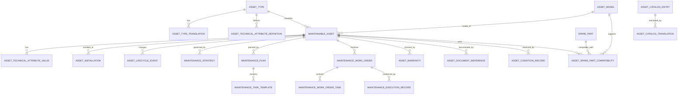

# HIDRA Asset Management Module — Data Definition Document

```text
Document name : HIDRA-ASSET-MANAGEMENT-DATA-DEFINITION-DOCUMENT
Module        : assets / asset-management
Namespace     : dz.sh.hidra.modules.assets
Product       : Hidra — Hydrocarbon Intelligence for Data, Risk, and Analytics
Owner         : Sonatrach / TRC Digitalization Initiative
Author        : Abir MEDJERAB
Status        : Target DDD, repository-aligned boundary definition
CreatedOn     : 2026-06-11
```

---

## 1. Purpose

The **Asset Management** module manages the lifecycle, maintainability, configuration, ownership, warranty, spare-parts relation, and maintenance readiness of operational assets used in hydrocarbon transportation.

It answers:

```text
What maintainable asset exists?
What is its tag/code/serial/manufacturer/model?
Where is it installed or associated?
What is its lifecycle state?
What maintenance strategy applies?
What work is required or has been performed?
Which spare parts are associated?
What warranties/contracts/documents/evidence support it?
```

Asset Management is **not** the owner of physical topology. Topology owns the network structure and asset placement. Asset Management references topology assets and equipment using stable neutral references.

---

## 2. Evidence and alignment

### 2.1 Repository baseline

The current repository does not show a separate implemented `assets` Java module. However, topology already contains `EquipmentJpaEntity`, with fields such as `id`, `code`, `name`, `equipmentTypeId`, `parentAssetType`, `parentAssetId`, and `status`. That means physical equipment identity/placement currently exists under topology, and Asset Management must not duplicate topology ownership.

### 2.2 Target correction

The recommended split is:

```text
Topology
  owns: physical network structure, facility/equipment placement, connectivity, parent asset references.

Asset Management
  owns: asset lifecycle, maintainability, maintenance strategy, asset technical register,
        serial/manufacturer/model, warranty, spare parts, maintenance work records,
        condition records not owned by integrity.

Network Integrity
  owns: integrity assessments, corrosion/defect evidence, remaining-life estimates,
        integrity recommendations.
```

---

## 3. Module ownership

Asset Management owns:

```text
MaintainableAsset
AssetType
AssetTypeTranslation
AssetTechnicalAttributeDefinition
AssetTechnicalAttributeValue
AssetInstallation
AssetManufacturerReference
AssetModel
AssetSerialIdentity
AssetLifecycleEvent
MaintenanceStrategy
MaintenancePlan
MaintenanceTaskTemplate
MaintenanceWorkOrder
MaintenanceWorkOrderTask
MaintenanceExecutionRecord
SparePart
AssetSparePartCompatibility
AssetDocumentReference
AssetWarranty
AssetServiceContractReference
AssetConditionRecord
AssetMeterReadingReference
AssetCatalogEntry
AssetCatalogTranslation
```

Asset Management references but does not own:

```text
Topology assets and equipment
Organization units and employees
Identity users, groups, roles, permissions
Workflow instances and tasks
Incident records
Integrity cases and defects
Telemetry readings
Documents
External parties/vendors/manufacturers if Party module exists
Audit records
```

---

## 4. Boundary rules

### 4.1 Topology boundary

Asset Management must not import topology domain classes. It stores neutral references only:

```text
topologyAssetTypeCode
topologyAssetId
topologyAssetCode
topologyAssetNameSnapshot
```

Use this reference for installed location or linked topology equipment.

Bad:

```text
Asset.facility: Facility
Asset.pipeline: Pipeline
Asset.equipment: EquipmentJpaEntity
```

Good:

```text
AssetTopologyReference(topologyAssetTypeCode, topologyAssetId, topologyAssetCode, topologyAssetNameSnapshot)
```

### 4.2 Integrity boundary

Asset Management may record general condition and maintenance observations, but it must not own engineering integrity decisions.

Asset Management can store:

```text
asset condition record
maintenance inspection result
repair completion record
```

Network Integrity owns:

```text
pipeline defect
wall thickness measurement
corrosion feature
remaining life estimate
integrity recommendation
integrity case
```

### 4.3 Incident boundary

Asset Management may link a work order to an incident, but it does not own incident lifecycle.

### 4.4 Workflow boundary

Workflow owns approval/routing; Asset Management stores only workflow references and business state.

### 4.5 Party/vendor boundary

Asset Management should not store vendor/manufacturer names as free text when a Party module exists.

Good:

```text
manufacturerPartyId
manufacturerCodeSnapshot
manufacturerNameSnapshot
```

Temporary acceptable field before Party module:

```text
manufacturerReferenceText
```

but it must be migration-ready.

---

## 5. Core relationship model

```text
AssetType
  -> AssetTypeTranslation
  -> AssetTechnicalAttributeDefinition

MaintainableAsset
  -> AssetTechnicalAttributeValue
  -> AssetInstallation
  -> AssetLifecycleEvent
  -> MaintenanceStrategy
  -> MaintenancePlan
      -> MaintenanceTaskTemplate
  -> MaintenanceWorkOrder
      -> MaintenanceWorkOrderTask
      -> MaintenanceExecutionRecord
  -> AssetSparePartCompatibility
      -> SparePart
  -> AssetWarranty
  -> AssetDocumentReference
  -> AssetConditionRecord
```

---

## 6. Entities

## 6.1 MaintainableAsset

### Description

Represents a maintainable asset known to asset management. It may correspond to topology equipment, a facility component, a station asset, a meter, a pump, a compressor, a valve, a PLC cabinet, a skid, a generator, a tank component, a metering train, or any operational asset requiring lifecycle tracking.

It must not be used to redefine topology.

### Table

```text
hidra_asset_maintainable_asset
```

| Field | Type | Required | Description |
|---|---:|---:|---|
| `id` | String/UUID | Yes | Stable asset identifier. |
| `code` | String | Yes | Unique Hidra asset code. |
| `tagCode` | String | No | Operational tag code, if different from internal asset code. |
| `nameAr` | String | No | Arabic display name. |
| `nameFr` | String | Yes | French display name. |
| `nameEn` | String | No | English display name. |
| `assetTypeId` | FK/String | Yes | Asset type catalog reference. |
| `assetClassId` | FK/String | No | Optional asset class catalog reference, such as rotating equipment, static equipment, instrumentation, electrical, civil. |
| `criticalityId` | FK/String | No | Asset criticality catalog reference. |
| `lifecycleStatus` | Enum/String | Yes | `REGISTERED`, `IN_SERVICE`, `OUT_OF_SERVICE`, `STANDBY`, `UNDER_MAINTENANCE`, `RETIRED`, `DISPOSED`. |
| `maintainable` | Boolean | Yes | Whether asset can receive work orders. |
| `serialNumber` | String | No | Manufacturer serial number. |
| `modelId` | FK/String | No | Asset model reference. |
| `manufacturerPartyId` | String | No | Party reference for manufacturer when Party module exists. |
| `manufacturerCodeSnapshot` | String | No | Manufacturer code snapshot. |
| `manufacturerNameSnapshot` | String | No | Manufacturer display snapshot. |
| `commissioningDate` | Date | No | Date asset was commissioned. |
| `installationDate` | Date | No | Date asset was installed. |
| `retirementDate` | Date | No | Date asset was retired. |
| `topologyAssetTypeCode` | String | No | Referenced topology asset type. |
| `topologyAssetId` | String | No | Referenced topology asset ID. |
| `topologyAssetCode` | String | No | Referenced topology asset code. |
| `topologyAssetNameSnapshot` | String | No | Snapshot of topology asset name. |
| `organizationUnitReferenceId` | String | No | Responsible organization unit reference. |
| `organizationUnitCodeSnapshot` | String | No | Org unit code snapshot. |
| `organizationUnitNameSnapshot` | String | No | Org unit name snapshot. |
| `createdAt` | Instant | Yes | Creation timestamp. |
| `updatedAt` | Instant | Yes | Last update timestamp. |

### Constraints

```text
unique(code)
index(tagCode)
index(assetTypeId)
index(lifecycleStatus)
index(topologyAssetTypeCode, topologyAssetId)
index(organizationUnitReferenceId)
```

---

## 6.2 AssetType

### Description

Catalog-backed type of maintainable asset. This avoids hard-coded Java enums for business-facing asset taxonomy.

Examples:

```text
PUMP
COMPRESSOR
VALVE
METER
FLOW_COMPUTER
TANK
PLC
RTU
GENERATOR
FILTER
HEAT_EXCHANGER
PIPELINE_SECTION_COMPONENT
CATHODIC_PROTECTION_RECTIFIER
```

### Table

```text
hidra_asset_type
```

| Field | Type | Required | Description |
|---|---:|---:|---|
| `id` | String/UUID | Yes | Stable type ID. |
| `code` | String | Yes | Unique type code. |
| `parentTypeId` | FK/String | No | Optional parent type for hierarchy. |
| `categoryCode` | String | No | Broad category such as `ROTATING`, `STATIC`, `INSTRUMENTATION`, `ELECTRICAL`, `CIVIL`, `CONTROL_SYSTEM`. |
| `maintainableDefault` | Boolean | Yes | Default maintainability for this type. |
| `systemDefined` | Boolean | Yes | Whether type is system-defined. |
| `status` | String | Yes | `ACTIVE`, `INACTIVE`, `DEPRECATED`. |
| `sortOrder` | Integer | Yes | UI ordering. |
| `createdAt` | Instant | Yes | Creation timestamp. |
| `updatedAt` | Instant | Yes | Last update timestamp. |

---

## 6.3 AssetTypeTranslation

### Table

```text
hidra_asset_type_translation
```

| Field | Type | Required | Description |
|---|---:|---:|---|
| `id` | String/UUID | Yes | Translation ID. |
| `assetTypeId` | FK/String | Yes | Asset type. |
| `locale` | String | Yes | `ar`, `fr`, `en`. |
| `name` | String | Yes | Localized name. |
| `description` | String | No | Localized description. |
| `createdAt` | Instant | Yes | Creation timestamp. |
| `updatedAt` | Instant | Yes | Last update timestamp. |

### Constraints

```text
unique(assetTypeId, locale)
```

---

## 6.4 AssetTechnicalAttributeDefinition

### Description

Configurable technical attributes per asset type. This avoids creating one hard-coded profile table for each equipment family.

Examples:

```text
nominalPowerKw
nominalFlowRate
maximumPressure
ratedVoltage
calibrationRequired
sealType
impellerDiameter
actuatorType
meteringClass
```

### Table

```text
hidra_asset_technical_attribute_definition
```

| Field | Type | Required | Description |
|---|---:|---:|---|
| `id` | String/UUID | Yes | Attribute definition ID. |
| `assetTypeId` | FK/String | Yes | Asset type owning this attribute. |
| `code` | String | Yes | Stable attribute code. |
| `labelAr` | String | No | Arabic label. |
| `labelFr` | String | Yes | French label. |
| `labelEn` | String | No | English label. |
| `dataType` | String | Yes | `TEXT`, `NUMBER`, `BOOLEAN`, `DATE`, `TIMESTAMP`, `CATALOG`, `REFERENCE`, `JSON`. |
| `unitCategory` | String | No | Unit family such as pressure, flow, power, temperature. |
| `defaultUnitId` | String | No | Default unit reference. |
| `required` | Boolean | Yes | Required for this asset type. |
| `multiValue` | Boolean | Yes | Allows multiple values. |
| `catalogCode` | String | No | Catalog name if data type is catalog. |
| `referenceTargetType` | String | No | Reference target if data type is reference. |
| `displayOrder` | Integer | Yes | UI ordering. |
| `searchable` | Boolean | Yes | Whether searchable. |
| `status` | String | Yes | `ACTIVE`, `INACTIVE`, `DEPRECATED`. |
| `createdAt` | Instant | Yes | Creation timestamp. |
| `updatedAt` | Instant | Yes | Last update timestamp. |

### Constraints

```text
unique(assetTypeId, code)
```

---

## 6.5 AssetTechnicalAttributeValue

### Table

```text
hidra_asset_technical_attribute_value
```

| Field | Type | Required | Description |
|---|---:|---:|---|
| `id` | String/UUID | Yes | Value ID. |
| `assetId` | FK/String | Yes | Maintainable asset. |
| `attributeDefinitionId` | FK/String | Yes | Attribute definition. |
| `valueText` | Text | No | Text value. |
| `valueNumber` | Decimal | No | Numeric value. |
| `valueBoolean` | Boolean | No | Boolean value. |
| `valueDate` | Date | No | Date value. |
| `valueTimestamp` | Instant | No | Timestamp value. |
| `valueCatalogCode` | String | No | Catalog code value. |
| `valueReferenceId` | String | No | Referenced entity ID. |
| `valueJson` | JSON/Text | No | Complex value. |
| `unitId` | String | No | Unit reference. |
| `validFrom` | Date | No | Value validity start. |
| `validTo` | Date | No | Value validity end. |
| `createdAt` | Instant | Yes | Creation timestamp. |
| `updatedAt` | Instant | Yes | Last update timestamp. |

### Rule

Exactly one typed value column should be populated unless `dataType = JSON`.

---

## 6.6 AssetInstallation

### Description

Represents installation history of an asset at a topology location.

### Table

```text
hidra_asset_installation
```

| Field | Type | Required | Description |
|---|---:|---:|---|
| `id` | String/UUID | Yes | Installation ID. |
| `assetId` | FK/String | Yes | Installed asset. |
| `topologyAssetTypeCode` | String | Yes | Topology asset type. |
| `topologyAssetId` | String | Yes | Topology asset ID. |
| `topologyAssetCode` | String | Yes | Topology asset code. |
| `topologyAssetNameSnapshot` | String | No | Topology asset display snapshot. |
| `installationRoleId` | FK/String | No | Role such as primary, standby, bypass, spare installed. |
| `installedAt` | Date | Yes | Installation date. |
| `removedAt` | Date | No | Removal date. |
| `active` | Boolean | Yes | Active installation marker. |
| `installedByOrganizationUnitId` | String | No | Responsible org unit reference. |
| `workOrderId` | String | No | Work order that installed the asset. |
| `createdAt` | Instant | Yes | Creation timestamp. |
| `updatedAt` | Instant | Yes | Last update timestamp. |

### Constraints

```text
index(assetId, active)
index(topologyAssetTypeCode, topologyAssetId, active)
```

---

## 6.7 AssetLifecycleEvent

### Description

Append-style history of important lifecycle events.

### Table

```text
hidra_asset_lifecycle_event
```

| Field | Type | Required | Description |
|---|---:|---:|---|
| `id` | String/UUID | Yes | Event ID. |
| `assetId` | FK/String | Yes | Asset. |
| `eventTypeId` | FK/String | Yes | Event type catalog reference. |
| `previousStatus` | String | No | Previous lifecycle status. |
| `newStatus` | String | No | New lifecycle status. |
| `eventDate` | Date | Yes | Business date of event. |
| `description` | Text | No | Event description. |
| `actorIdSnapshot` | String | No | Actor snapshot. |
| `organizationUnitIdSnapshot` | String | No | Org unit snapshot. |
| `workOrderId` | String | No | Related work order. |
| `incidentId` | String | No | Related incident. |
| `integrityCaseId` | String | No | Related integrity case. |
| `createdAt` | Instant | Yes | Creation timestamp. |

---

## 6.8 MaintenanceStrategy

### Description

Defines how an asset should be maintained.

### Table

```text
hidra_asset_maintenance_strategy
```

| Field | Type | Required | Description |
|---|---:|---:|---|
| `id` | String/UUID | Yes | Strategy ID. |
| `assetId` | FK/String | Yes | Asset. |
| `strategyTypeId` | FK/String | Yes | `PREVENTIVE`, `CORRECTIVE`, `CONDITION_BASED`, `PREDICTIVE`, `RUN_TO_FAILURE`, etc. |
| `priorityId` | FK/String | No | Maintenance priority. |
| `effectiveFrom` | Date | Yes | Start date. |
| `effectiveTo` | Date | No | End date. |
| `active` | Boolean | Yes | Active flag. |
| `description` | Text | No | Strategy description. |
| `createdAt` | Instant | Yes | Creation timestamp. |
| `updatedAt` | Instant | Yes | Last update timestamp. |

---

## 6.9 MaintenancePlan

### Description

A plan grouping scheduled maintenance templates/tasks for assets.

### Table

```text
hidra_asset_maintenance_plan
```

| Field | Type | Required | Description |
|---|---:|---:|---|
| `id` | String/UUID | Yes | Plan ID. |
| `code` | String | Yes | Unique plan code. |
| `nameAr` | String | No | Arabic name. |
| `nameFr` | String | Yes | French name. |
| `nameEn` | String | No | English name. |
| `assetId` | FK/String | No | Specific asset. |
| `assetTypeId` | FK/String | No | Asset type if plan applies to all assets of a type. |
| `planningHorizon` | String | No | Monthly, quarterly, yearly. |
| `status` | String | Yes | `DRAFT`, `ACTIVE`, `SUSPENDED`, `RETIRED`. |
| `effectiveFrom` | Date | Yes | Start date. |
| `effectiveTo` | Date | No | End date. |
| `workflowReferenceId` | String | No | Approval workflow reference. |
| `createdAt` | Instant | Yes | Creation timestamp. |
| `updatedAt` | Instant | Yes | Last update timestamp. |

### Rule

A plan must target either one asset or one asset type, not both unless explicitly allowed by policy.

---

## 6.10 MaintenanceTaskTemplate

### Table

```text
hidra_asset_maintenance_task_template
```

| Field | Type | Required | Description |
|---|---:|---:|---|
| `id` | String/UUID | Yes | Task template ID. |
| `maintenancePlanId` | FK/String | Yes | Maintenance plan. |
| `code` | String | Yes | Template code. |
| `titleAr` | String | No | Arabic title. |
| `titleFr` | String | Yes | French title. |
| `titleEn` | String | No | English title. |
| `taskTypeId` | FK/String | Yes | Inspection, lubrication, calibration, replacement, functional test, etc. |
| `frequencyValue` | Integer | No | Frequency number. |
| `frequencyUnit` | String | No | `DAY`, `WEEK`, `MONTH`, `YEAR`, `RUN_HOUR`, `CYCLE`. |
| `estimatedDurationMinutes` | Integer | No | Estimated duration. |
| `requiresShutdown` | Boolean | Yes | Whether shutdown is required. |
| `requiresPermit` | Boolean | Yes | Whether permit is required. |
| `procedureDocumentId` | String | No | Procedure document reference. |
| `active` | Boolean | Yes | Active flag. |
| `createdAt` | Instant | Yes | Creation timestamp. |
| `updatedAt` | Instant | Yes | Last update timestamp. |

---

## 6.11 MaintenanceWorkOrder

### Description

Represents a maintenance work order. It tracks work execution lifecycle but does not replace workflow approvals or document management.

### Table

```text
hidra_asset_maintenance_work_order
```

| Field | Type | Required | Description |
|---|---:|---:|---|
| `id` | String/UUID | Yes | Work order ID. |
| `code` | String | Yes | Unique work order code. |
| `assetId` | FK/String | Yes | Target asset. |
| `workOrderTypeId` | FK/String | Yes | Preventive, corrective, emergency, calibration, inspection. |
| `priorityId` | FK/String | Yes | Priority. |
| `status` | String | Yes | `DRAFT`, `PLANNED`, `APPROVED`, `SCHEDULED`, `IN_PROGRESS`, `COMPLETED`, `CANCELLED`, `CLOSED`. |
| `sourceType` | String | No | `MANUAL`, `MAINTENANCE_PLAN`, `INCIDENT`, `ALARM`, `INTEGRITY_RECOMMENDATION`, `MONITORING`, `LEAK_DETECTION`. |
| `sourceReferenceId` | String | No | Source record ID. |
| `requestedByActorId` | String | No | Requesting actor snapshot. |
| `responsibleOrganizationUnitId` | String | No | Responsible org unit. |
| `plannedStartAt` | Instant | No | Planned start. |
| `plannedEndAt` | Instant | No | Planned end. |
| `actualStartAt` | Instant | No | Actual start. |
| `actualEndAt` | Instant | No | Actual end. |
| `description` | Text | No | Work description. |
| `workflowReferenceId` | String | No | Workflow reference. |
| `createdAt` | Instant | Yes | Creation timestamp. |
| `updatedAt` | Instant | Yes | Last update timestamp. |

### Constraints

```text
unique(code)
index(assetId, status)
index(sourceType, sourceReferenceId)
index(plannedStartAt, plannedEndAt)
```

---

## 6.12 MaintenanceWorkOrderTask

### Table

```text
hidra_asset_maintenance_work_order_task
```

| Field | Type | Required | Description |
|---|---:|---:|---|
| `id` | String/UUID | Yes | Work order task ID. |
| `workOrderId` | FK/String | Yes | Parent work order. |
| `templateId` | FK/String | No | Source task template. |
| `sequenceNumber` | Integer | Yes | Execution order. |
| `titleAr` | String | No | Arabic title. |
| `titleFr` | String | Yes | French title. |
| `titleEn` | String | No | English title. |
| `taskTypeId` | FK/String | Yes | Task type. |
| `status` | String | Yes | `PENDING`, `IN_PROGRESS`, `DONE`, `SKIPPED`, `FAILED`. |
| `assignedEmployeeReferenceId` | String | No | Assigned employee reference. |
| `resultSummary` | Text | No | Result summary. |
| `completedAt` | Instant | No | Completion timestamp. |
| `createdAt` | Instant | Yes | Creation timestamp. |
| `updatedAt` | Instant | Yes | Last update timestamp. |

---

## 6.13 MaintenanceExecutionRecord

### Description

Execution evidence for work actually performed.

### Table

```text
hidra_asset_maintenance_execution_record
```

| Field | Type | Required | Description |
|---|---:|---:|---|
| `id` | String/UUID | Yes | Execution record ID. |
| `workOrderId` | FK/String | Yes | Work order. |
| `assetId` | FK/String | Yes | Asset. |
| `executedByEmployeeReferenceId` | String | No | Employee reference. |
| `executedByOrganizationUnitId` | String | No | Organization unit reference. |
| `executionStartAt` | Instant | Yes | Execution start. |
| `executionEndAt` | Instant | No | Execution end. |
| `outcomeId` | FK/String | Yes | Outcome catalog reference. |
| `conditionBeforeId` | FK/String | No | Condition before work. |
| `conditionAfterId` | FK/String | No | Condition after work. |
| `notes` | Text | No | Execution notes. |
| `createdAt` | Instant | Yes | Creation timestamp. |

---

## 6.14 SparePart

### Table

```text
hidra_asset_spare_part
```

| Field | Type | Required | Description |
|---|---:|---:|---|
| `id` | String/UUID | Yes | Spare part ID. |
| `code` | String | Yes | Unique spare part code. |
| `partNumber` | String | No | Manufacturer part number. |
| `nameAr` | String | No | Arabic name. |
| `nameFr` | String | Yes | French name. |
| `nameEn` | String | No | English name. |
| `sparePartTypeId` | FK/String | No | Type catalog. |
| `manufacturerPartyId` | String | No | Manufacturer party reference. |
| `manufacturerCodeSnapshot` | String | No | Snapshot. |
| `manufacturerNameSnapshot` | String | No | Snapshot. |
| `unitOfMeasureId` | String | No | UOM. |
| `status` | String | Yes | `ACTIVE`, `INACTIVE`, `OBSOLETE`. |
| `createdAt` | Instant | Yes | Creation timestamp. |
| `updatedAt` | Instant | Yes | Last update timestamp. |

### Boundary note

Inventory quantity, warehouse stock, purchase orders, and procurement are not owned by Asset Management unless explicitly added later. This entity only describes spare-part master data and compatibility.

---

## 6.15 AssetSparePartCompatibility

### Table

```text
hidra_asset_spare_part_compatibility
```

| Field | Type | Required | Description |
|---|---:|---:|---|
| `id` | String/UUID | Yes | Compatibility ID. |
| `assetId` | FK/String | No | Specific asset. |
| `assetTypeId` | FK/String | No | Asset type. |
| `assetModelId` | FK/String | No | Model. |
| `sparePartId` | FK/String | Yes | Spare part. |
| `quantityRecommended` | Decimal | No | Recommended quantity. |
| `replacementFrequencyValue` | Integer | No | Replacement frequency number. |
| `replacementFrequencyUnit` | String | No | Frequency unit. |
| `criticalityId` | FK/String | No | Criticality. |
| `active` | Boolean | Yes | Active flag. |
| `createdAt` | Instant | Yes | Creation timestamp. |
| `updatedAt` | Instant | Yes | Last update timestamp. |

### Rule

Compatibility should target one of:

```text
assetId
assetTypeId
assetModelId
```

unless a specific policy allows combined matching.

---

## 6.16 AssetWarranty

### Table

```text
hidra_asset_warranty
```

| Field | Type | Required | Description |
|---|---:|---:|---|
| `id` | String/UUID | Yes | Warranty ID. |
| `assetId` | FK/String | Yes | Asset. |
| `providerPartyId` | String | No | Warranty provider party reference. |
| `providerCodeSnapshot` | String | No | Snapshot. |
| `providerNameSnapshot` | String | No | Snapshot. |
| `warrantyReference` | String | No | Warranty reference number. |
| `warrantyTypeId` | FK/String | No | Warranty type. |
| `startDate` | Date | Yes | Start date. |
| `endDate` | Date | No | End date. |
| `coverageDescription` | Text | No | Coverage description. |
| `status` | String | Yes | `ACTIVE`, `EXPIRED`, `VOID`, `CLAIMED`. |
| `documentReferenceId` | String | No | Document reference. |
| `createdAt` | Instant | Yes | Creation timestamp. |
| `updatedAt` | Instant | Yes | Last update timestamp. |

---

## 6.17 AssetDocumentReference

### Table

```text
hidra_asset_document_reference
```

| Field | Type | Required | Description |
|---|---:|---:|---|
| `id` | String/UUID | Yes | Reference ID. |
| `assetId` | FK/String | Yes | Asset. |
| `documentId` | String | Yes | External document module reference. |
| `documentTypeId` | FK/String | No | Datasheet, manual, certificate, drawing, inspection report, procedure. |
| `documentCodeSnapshot` | String | No | Document code snapshot. |
| `documentTitleSnapshot` | String | No | Document title snapshot. |
| `validFrom` | Date | No | Validity start. |
| `validTo` | Date | No | Validity end. |
| `active` | Boolean | Yes | Active reference. |
| `createdAt` | Instant | Yes | Creation timestamp. |

---

## 6.18 AssetConditionRecord

### Description

General condition record for asset-management use. Engineering integrity decisions remain in Network Integrity.

### Table

```text
hidra_asset_condition_record
```

| Field | Type | Required | Description |
|---|---:|---:|---|
| `id` | String/UUID | Yes | Condition record ID. |
| `assetId` | FK/String | Yes | Asset. |
| `conditionDate` | Instant | Yes | Condition observation time. |
| `conditionSourceType` | String | Yes | `WORK_ORDER`, `INSPECTION`, `OPERATOR_OBSERVATION`, `TELEMETRY_REFERENCE`, `INCIDENT`, `INTEGRITY_REFERENCE`. |
| `conditionSourceReferenceId` | String | No | Source record ID. |
| `conditionRatingId` | FK/String | Yes | Condition rating catalog reference. |
| `availabilityImpactId` | FK/String | No | Availability impact. |
| `description` | Text | No | Condition description. |
| `observedByActorId` | String | No | Actor snapshot. |
| `observedByOrganizationUnitId` | String | No | Org unit snapshot. |
| `createdAt` | Instant | Yes | Creation timestamp. |

---

## 6.19 AssetModel

### Table

```text
hidra_asset_model
```

| Field | Type | Required | Description |
|---|---:|---:|---|
| `id` | String/UUID | Yes | Model ID. |
| `code` | String | Yes | Unique model code. |
| `assetTypeId` | FK/String | Yes | Asset type. |
| `manufacturerPartyId` | String | No | Manufacturer party reference. |
| `manufacturerCodeSnapshot` | String | No | Snapshot. |
| `manufacturerNameSnapshot` | String | No | Snapshot. |
| `modelName` | String | Yes | Manufacturer model name. |
| `modelVersion` | String | No | Model version. |
| `description` | Text | No | Description. |
| `status` | String | Yes | `ACTIVE`, `INACTIVE`, `OBSOLETE`. |
| `createdAt` | Instant | Yes | Creation timestamp. |
| `updatedAt` | Instant | Yes | Last update timestamp. |

---

## 6.20 AssetCatalogEntry

### Description

Generic asset-management controlled vocabulary table for business-facing catalogs.

Catalog names:

```text
ASSET_CLASS
ASSET_CRITICALITY
INSTALLATION_ROLE
MAINTENANCE_STRATEGY_TYPE
MAINTENANCE_PRIORITY
WORK_ORDER_TYPE
MAINTENANCE_TASK_TYPE
MAINTENANCE_OUTCOME
CONDITION_RATING
DOCUMENT_TYPE
WARRANTY_TYPE
SPARE_PART_TYPE
LIFECYCLE_EVENT_TYPE
```

### Table

```text
hidra_asset_catalog_entry
```

| Field | Type | Required | Description |
|---|---:|---:|---|
| `id` | String/UUID | Yes | Catalog entry ID. |
| `catalogName` | String | Yes | Catalog name. |
| `code` | String | Yes | Entry code. |
| `active` | Boolean | Yes | Active flag. |
| `systemDefined` | Boolean | Yes | Whether system-defined. |
| `sortOrder` | Integer | Yes | UI order. |
| `createdAt` | Instant | Yes | Creation timestamp. |
| `updatedAt` | Instant | Yes | Last update timestamp. |

### Constraints

```text
unique(catalogName, code)
```

---

## 6.21 AssetCatalogTranslation

### Table

```text
hidra_asset_catalog_translation
```

| Field | Type | Required | Description |
|---|---:|---:|---|
| `id` | String/UUID | Yes | Translation ID. |
| `catalogEntryId` | FK/String | Yes | Catalog entry. |
| `locale` | String | Yes | `ar`, `fr`, `en`. |
| `name` | String | Yes | Localized name. |
| `description` | String | No | Localized description. |
| `createdAt` | Instant | Yes | Creation timestamp. |
| `updatedAt` | Instant | Yes | Last update timestamp. |

### Constraints

```text
unique(catalogEntryId, locale)
```

---

## 7. Recommended lifecycle statuses

### 7.1 Asset lifecycle status

```text
REGISTERED
IN_SERVICE
STANDBY
OUT_OF_SERVICE
UNDER_MAINTENANCE
RETIRED
DISPOSED
```

### 7.2 Work order status

```text
DRAFT
PLANNED
APPROVED
SCHEDULED
IN_PROGRESS
COMPLETED
CANCELLED
CLOSED
```

### 7.3 Condition rating

Catalog-backed values, not hard-coded enums:

```text
GOOD
ACCEPTABLE
DEGRADED
CRITICAL
UNKNOWN
```

---

## 8. Relationship cardinalities

| Relationship | Cardinality | Rule |
|---|---:|---|
| `AssetType -> MaintainableAsset` | 1:N | Every asset has one type. |
| `AssetType -> AssetTypeTranslation` | 1:N | One row per locale. |
| `AssetType -> AssetTechnicalAttributeDefinition` | 1:N | Configurable technical attributes. |
| `MaintainableAsset -> AssetTechnicalAttributeValue` | 1:N | Values for the asset. |
| `MaintainableAsset -> AssetInstallation` | 1:N | Installation history. |
| `MaintainableAsset -> AssetLifecycleEvent` | 1:N | Lifecycle history. |
| `MaintainableAsset -> MaintenanceStrategy` | 1:N | Historical strategies. |
| `MaintainableAsset -> MaintenanceWorkOrder` | 1:N | Work order history. |
| `MaintenanceWorkOrder -> MaintenanceWorkOrderTask` | 1:N | Work order tasks. |
| `MaintenanceWorkOrder -> MaintenanceExecutionRecord` | 1:N | Execution records. |
| `MaintainableAsset -> AssetWarranty` | 1:N | Warranty records. |
| `MaintainableAsset -> AssetDocumentReference` | 1:N | Linked documents. |
| `MaintainableAsset -> AssetConditionRecord` | 1:N | Condition history. |
| `SparePart -> AssetSparePartCompatibility` | 1:N | Compatible assets/types/models. |

---

## 9. Data validation rules

```text
1. Asset code must be unique.
2. Asset type must be active when creating an asset.
3. Retired or disposed assets cannot receive new active work orders unless explicitly allowed.
4. Work order actual end must be after actual start.
5. Planned end must be after planned start.
6. Approved or closed work orders cannot be edited directly.
7. Maintenance plan revision should create a new version or lifecycle event.
8. Asset installation history must not contain overlapping active installations for the same asset unless multi-installation is explicitly allowed.
9. Asset technical attribute values must match their definition data type.
10. Asset Management must store topology links as references only.
11. Spare-part compatibility must target asset, model, or type consistently.
12. Condition records must not overwrite integrity assessment records.
```

---

## 10. Index recommendations

```sql
CREATE UNIQUE INDEX uk_hidra_asset_code
    ON hidra_asset_maintainable_asset (code);

CREATE INDEX idx_hidra_asset_tag_code
    ON hidra_asset_maintainable_asset (tag_code);

CREATE INDEX idx_hidra_asset_type
    ON hidra_asset_maintainable_asset (asset_type_id);

CREATE INDEX idx_hidra_asset_status
    ON hidra_asset_maintainable_asset (lifecycle_status);

CREATE INDEX idx_hidra_asset_topology_reference
    ON hidra_asset_maintainable_asset (topology_asset_type_code, topology_asset_id);

CREATE UNIQUE INDEX uk_hidra_asset_type_code
    ON hidra_asset_type (code);

CREATE UNIQUE INDEX uk_hidra_asset_type_translation_locale
    ON hidra_asset_type_translation (asset_type_id, locale);

CREATE INDEX idx_hidra_work_order_asset_status
    ON hidra_asset_maintenance_work_order (asset_id, status);

CREATE INDEX idx_hidra_work_order_source
    ON hidra_asset_maintenance_work_order (source_type, source_reference_id);

CREATE INDEX idx_hidra_asset_installation_topology
    ON hidra_asset_installation (topology_asset_type_code, topology_asset_id, active);
```

---

## 11. Mermaid ER diagram



---

## 12. Implementation package target

```text
dz.sh.hidra.modules.assets
  api.rest.controller
  api.rest.request
  api.rest.response
  api.rest.mapper
  application.command
  application.query
  application.dto
  application.port.in
  application.port.out
  application.service
  domain.model
  domain.value
  domain.event
  domain.policy
  domain.service
  domain.exception
  infrastructure.persistence.entity
  infrastructure.persistence.repository
  infrastructure.persistence.mapper
  infrastructure.persistence.adapter
  infrastructure.configuration
```

Forbidden packages:

```text
shared
common
core
utils
helper
helpers
misc
```

---

## 13. Events

Recommended domain events:

```text
AssetRegisteredEvent
AssetInstalledEvent
AssetRemovedEvent
AssetLifecycleStatusChangedEvent
MaintenancePlanActivatedEvent
MaintenanceWorkOrderCreatedEvent
MaintenanceWorkOrderScheduledEvent
MaintenanceWorkOrderStartedEvent
MaintenanceWorkOrderCompletedEvent
MaintenanceWorkOrderClosedEvent
AssetConditionRecordedEvent
AssetWarrantyRegisteredEvent
```

---

## 14. Final opinionated rule

```text
Topology tells where assets are in the network.
Asset Management tells how maintainable assets live, age, fail, get repaired, and are documented.
Network Integrity tells whether pipeline integrity is acceptable.
Incidents tell how operational problems are handled.
Workflow tells who approves and routes work.
```

Do not merge these responsibilities.

