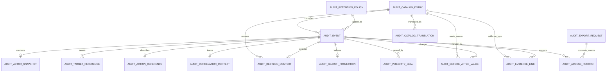

# HIDRA — Audit Data Definition Document

```text
Document code : HIDRA-AUDIT-DDD
Module        : audit
Package       : dz.sh.hidra.modules.audit
Product       : Hidra - Hydrocarbon Intelligence for Data, Risk, and Analytics
Author        : Abir MEDJERAB
CreatedOn     : 2025-06-26
UpdatedOn     : 2026-06-11
Status        : Target DDD, architecture-aligned
Evidence      : Hidra V1 audit readiness, Hidra V1.1 audit hardening scope, Hidra macro architecture
```

---

## 1. Purpose

The **audit** module provides durable, append-only, searchable evidence for important actions and state changes in Hidra.

Audit answers:

```text
Who acted?
What did they do?
Which object was affected?
What changed?
Why did it change?
Which workflow decision or state was involved?
What correlation/request context existed?
Can the evidence be searched and proven later?
```

Audit is not application logging.

Audit is not workflow.

Audit is not analytics.

Audit is the evidence ledger for business and security accountability.

---

## 2. Source-of-truth position

Audit is a **cross-cutting evidence bounded context**.

It stores facts about actions that already happened in other modules.

It must not become the owner of those modules' business state.

```text
Business module owns the business fact.
Workflow owns the process decision.
Audit owns durable evidence that the fact or decision happened.
```

---

## 3. Ownership boundaries

### 3.1 Audit owns

```text
AuditEvent
AuditActorSnapshot
AuditTargetReference
AuditActionReference
AuditDecisionContext
AuditBeforeAfterValue
AuditCorrelationContext
AuditEvidenceLink
AuditSearchProjection
AuditIntegritySeal
AuditRetentionPolicy
AuditExportRequest
AuditAccessRecord
AuditCatalogEntry
AuditCatalogTranslation
```

### 3.2 Audit references

```text
identity actor reference snapshot
organization unit snapshot
workflow instance/action/task reference
telemetry reading reference
planning plan/target reference
monitoring evaluation/alert candidate reference
alarm reference
leak detection case reference
incident reference
integrity case reference
asset/work-order reference
custody ticket reference
hse case reference
integration job/message reference
```

### 3.3 Audit does not own

```text
identity users, roles, permissions, credentials
organization employees, positions, units
workflow routing, task lifecycle, or decision rules
telemetry readings or reading state
planning targets or plans
monitoring rules, thresholds, or deviations
alarm lifecycle
incident lifecycle
asset maintenance execution
risk scoring
analytics models
notification delivery
external integration execution
```

---

## 4. Module boundary rule

```text
Audit records evidence.
Audit does not decide, approve, reject, validate, repair, reconcile, calculate, notify, or integrate.
```

Forbidden patterns:

```text
Business module imports audit.domain model directly.
Audit table is updated to modify business state.
Audit event is used as the source of operational truth.
Audit record is edited after creation.
Sensitive values are stored unmasked.
Controller writes audit rows directly instead of using application ports/events.
```

Allowed integration style:

```text
source module emits audit-ready event
  -> AuditRecordPort / event consumer
      -> audit application validation
          -> append AuditEvent
              -> update searchable projection
```

---

## 5. Canonical data flow

```text
Actor performs action in source module
  -> source module applies business rule
      -> source module changes business state or records decision
          -> source module emits audit-ready event
              -> audit module records immutable AuditEvent
                  -> audit module indexes AuditSearchProjection
                      -> auditors search/export evidence
```

Workflow-driven example:

```text
WorkflowAction(APPROVE telemetry reading)
  -> workflow preserves actor, target, reason, comment, timestamp
      -> workflow emits WorkflowAuditEventPort payload
          -> audit records AuditEvent
              -> telemetry remains owner of reading state
```

---

## 6. Entity model overview

```text
AuditEvent
  -> AuditActorSnapshot
  -> AuditTargetReference
  -> AuditActionReference
  -> AuditDecisionContext
  -> AuditBeforeAfterValue
  -> AuditCorrelationContext
  -> AuditEvidenceLink
  -> AuditIntegritySeal

AuditEvent
  -> AuditSearchProjection

AuditRetentionPolicy
AuditExportRequest
AuditAccessRecord
AuditCatalogEntry
  -> AuditCatalogTranslation
```

---

## 7. Entity definitions

## 7.1 AuditEvent

### Responsibility

Canonical append-only audit record.

Each important action, decision, or state change creates one `AuditEvent`.

### Table

```text
hidra_audit_event
```

### Fields

| Field | Type | Required | Description |
|---|---:|---:|---|
| id | AuditEventId | yes | Stable audit event identifier. |
| eventTypeId | AuditCatalogEntryId | yes | Catalog-backed event type. Example: WORKFLOW_ACTION_COMPLETED, TELEMETRY_READING_APPROVED. |
| eventCategoryId | AuditCatalogEntryId | yes | Catalog-backed category. Example: BUSINESS, SECURITY, WORKFLOW, DATA_CHANGE, INTEGRATION. |
| severityId | AuditCatalogEntryId | no | Optional audit severity. Example: INFO, WARNING, CRITICAL. |
| sourceModule | String(80) | yes | Module where the action originated. Example: workflow, telemetry, identity. |
| sourceComponent | String(120) | no | Optional source service/component name. |
| sourceEventId | String(120) | no | Upstream domain event id or workflow action id. |
| actionCode | String(120) | yes | Stable action code. Example: APPROVE, REJECT, CREATE, UPDATE, DELETE, LOGIN_SUCCESS. |
| actionLabelSnapshot | String(240) | no | Human-readable action label at event time. |
| eventStatus | String(40) | yes | RECORDED, SEALED, REDACTED, EXPORT_LOCKED. |
| actorId | String(120) | no | Actor identifier snapshot. Null only for technical/system events if justified. |
| actorType | String(40) | yes | USER, SYSTEM, INTEGRATION, SCHEDULED_JOB, SERVICE_ACCOUNT. |
| actorDisplayNameSnapshot | String(160) | no | Actor display name at event time. |
| actorUsernameSnapshot | String(120) | no | Username/login snapshot, when applicable. |
| actorRoleCodeSnapshot | String(120) | no | Role/authority/position code snapshot if relevant. |
| organizationUnitId | String(120) | no | Organization unit reference snapshot. |
| organizationUnitCodeSnapshot | String(120) | no | Organization unit code snapshot. |
| organizationUnitNameSnapshot | String(160) | no | Organization unit name snapshot. |
| targetModule | String(80) | yes | Module owning the target business object. |
| targetType | String(120) | yes | Target type code. Example: TELEMETRY_READING, INCIDENT, WORKFLOW_TASK. |
| targetId | String(120) | yes | Target object identifier. |
| targetCodeSnapshot | String(120) | no | Business code snapshot. |
| targetLabelSnapshot | String(240) | no | Human-readable target label at event time. |
| operation | String(60) | yes | CREATE, UPDATE, DELETE, READ, EXPORT, APPROVE, REJECT, CORRECT, ESCALATE, DELEGATE, LOGIN. |
| decisionCode | String(120) | no | Decision code when the event is a decision. |
| reasonId | AuditCatalogEntryId | no | Catalog-backed reason reference. |
| reasonText | String(1000) | no | Free explanation, masked/sanitized if required. |
| commentText | String(2000) | no | Optional actor comment, masked/sanitized if required. |
| workflowInstanceId | String(120) | no | Workflow instance involved in the action. |
| workflowTaskId | String(120) | no | Workflow task involved in the action. |
| workflowActionId | String(120) | no | Workflow action reference. |
| workflowFromState | String(80) | no | Previous workflow state/status. |
| workflowToState | String(80) | no | New workflow state/status. |
| requestId | String(120) | no | Request id for HTTP/API traceability. |
| correlationId | String(120) | no | Correlation id across modules and events. |
| causationId | String(120) | no | Parent event/action id if this event was caused by another event. |
| ipAddressMasked | String(80) | no | Masked IP address, when needed for security audit. |
| userAgentSnapshot | String(500) | no | User-agent snapshot, optional and sanitized. |
| sourceSystemCode | String(120) | no | External/integration source system code. |
| occurredAt | Instant | yes | Business occurrence time. |
| recordedAt | Instant | yes | Time audit event was stored. |
| retentionPolicyId | AuditRetentionPolicyId | no | Retention policy applied to the event. |
| hashValue | String(256) | no | Integrity hash for tamper-evidence. |
| previousHashValue | String(256) | no | Previous hash value for hash-chain support. |
| payloadJson | Json | no | Optional structured metadata. Must be sanitized and size-limited. |

### Rules

```text
AuditEvent is append-only.
AuditEvent must never be updated to change business meaning.
AuditEvent must preserve actor, action, target, timestamp, and correlation context when available.
Sensitive before/after values must be masked or excluded.
AuditEvent cannot be used as a business command.
```

---

## 7.2 AuditActorSnapshot

### Responsibility

Optional normalized actor snapshot when actor information is too rich to store directly on `AuditEvent`.

### Table

```text
hidra_audit_actor_snapshot
```

### Fields

| Field | Type | Required | Description |
|---|---:|---:|---|
| id | AuditActorSnapshotId | yes | Stable snapshot identifier. |
| auditEventId | AuditEventId | yes | Owning audit event. |
| actorId | String(120) | no | Identity actor id or system actor id. |
| actorType | String(40) | yes | USER, SYSTEM, SERVICE_ACCOUNT, INTEGRATION, SCHEDULED_JOB. |
| usernameSnapshot | String(120) | no | Username snapshot. |
| displayNameSnapshot | String(160) | no | Display name snapshot. |
| emailMasked | String(160) | no | Masked email when needed. |
| roleCodeSnapshot | String(120) | no | Security role/authority snapshot if relevant. |
| employeeId | String(120) | no | Organization employee reference snapshot. |
| employeeNumberSnapshot | String(80) | no | Employee number snapshot. |
| organizationUnitId | String(120) | no | Organization unit reference. |
| organizationUnitCodeSnapshot | String(120) | no | Organization unit code snapshot. |
| organizationUnitNameSnapshot | String(160) | no | Organization unit name snapshot. |
| positionCodeSnapshot | String(120) | no | Organization position snapshot. |
| capturedAt | Instant | yes | Snapshot capture time. |

### Rules

```text
Actor snapshot is evidence, not identity truth.
Identity remains owner of users/roles/permissions.
Organization remains owner of employees/positions/units.
```

---

## 7.3 AuditTargetReference

### Responsibility

Normalized target object reference.

### Table

```text
hidra_audit_target_reference
```

### Fields

| Field | Type | Required | Description |
|---|---:|---:|---|
| id | AuditTargetReferenceId | yes | Stable identifier. |
| auditEventId | AuditEventId | yes | Owning audit event. |
| targetModule | String(80) | yes | Module owning the target. |
| targetType | String(120) | yes | Target type code. |
| targetId | String(120) | yes | Target identifier. |
| targetCodeSnapshot | String(120) | no | Target business code snapshot. |
| targetLabelSnapshot | String(240) | no | Target display label snapshot. |
| targetVersion | String(80) | no | Target version/revision/snapshot id. |
| topologyAssetTypeCode | String(120) | no | Optional topology asset type if target is tied to topology. |
| topologyAssetId | String(120) | no | Optional topology asset reference. |
| topologyAssetCodeSnapshot | String(120) | no | Optional topology asset business code. |
| capturedAt | Instant | yes | Snapshot capture time. |

### Rules

```text
AuditTargetReference must not import foreign domain classes.
The target module remains owner of target lifecycle and state.
```

---

## 7.4 AuditActionReference

### Responsibility

Stores normalized action semantics when more structure is needed than `AuditEvent.actionCode`.

### Table

```text
hidra_audit_action_reference
```

### Fields

| Field | Type | Required | Description |
|---|---:|---:|---|
| id | AuditActionReferenceId | yes | Stable identifier. |
| auditEventId | AuditEventId | yes | Owning audit event. |
| actionCode | String(120) | yes | Stable action code. |
| actionTypeId | AuditCatalogEntryId | yes | Catalog-backed action type. |
| operation | String(60) | yes | CREATE, UPDATE, DELETE, READ, EXPORT, APPROVE, REJECT, CORRECT, ESCALATE, DELEGATE, LOGIN. |
| commandName | String(160) | no | Application command/use-case name. |
| resultStatus | String(40) | yes | SUCCESS, FAILURE, DENIED, PARTIAL, CANCELLED. |
| failureReasonCode | String(120) | no | Failure reason if result is not success. |
| capturedAt | Instant | yes | Snapshot capture time. |

### Rules

```text
Action codes must be stable.
User-facing action labels must come from catalog translation where needed.
```

---

## 7.5 AuditDecisionContext

### Responsibility

Stores decision-specific evidence for approvals, rejections, corrections, escalations, delegations, overrides, and closures.

### Table

```text
hidra_audit_decision_context
```

### Fields

| Field | Type | Required | Description |
|---|---:|---:|---|
| id | AuditDecisionContextId | yes | Stable identifier. |
| auditEventId | AuditEventId | yes | Owning audit event. |
| decisionCode | String(120) | yes | APPROVE, REJECT, REQUEST_CORRECTION, DELEGATE, ESCALATE, CANCEL, CLOSE, OVERRIDE. |
| decisionTypeId | AuditCatalogEntryId | no | Catalog-backed decision type. |
| reasonId | AuditCatalogEntryId | no | Catalog-backed reason. |
| reasonText | String(1000) | no | Human explanation. |
| commentText | String(2000) | no | Optional decision comment. |
| policyCode | String(120) | no | Policy/rule involved in decision. |
| workflowInstanceId | String(120) | no | Workflow instance reference. |
| workflowTaskId | String(120) | no | Workflow task reference. |
| workflowActionId | String(120) | no | Workflow action reference. |
| fromState | String(80) | no | Previous state/status. |
| toState | String(80) | no | New state/status. |
| decidedAt | Instant | yes | Decision timestamp. |

### Rules

```text
DecisionContext records the evidence of a decision.
Workflow remains owner of process routing.
Target module remains owner of business state transition.
```

---

## 7.6 AuditBeforeAfterValue

### Responsibility

Stores field-level before/after evidence for selected changes.

### Table

```text
hidra_audit_before_after_value
```

### Fields

| Field | Type | Required | Description |
|---|---:|---:|---|
| id | AuditBeforeAfterValueId | yes | Stable identifier. |
| auditEventId | AuditEventId | yes | Owning audit event. |
| fieldPath | String(240) | yes | Logical field path. Example: status, assignedActorId, qualityCodeId. |
| fieldLabelSnapshot | String(240) | no | Optional human label. |
| valueType | String(40) | yes | STRING, NUMBER, BOOLEAN, DATE, TIMESTAMP, CATALOG, REFERENCE, JSON, MASKED. |
| beforeValueText | String(2000) | no | Before value as sanitized text. |
| afterValueText | String(2000) | no | After value as sanitized text. |
| beforeValueHash | String(256) | no | Hash of original before value if storing value is not allowed. |
| afterValueHash | String(256) | no | Hash of original after value if storing value is not allowed. |
| masked | Boolean | yes | Whether value was masked. |
| maskReasonId | AuditCatalogEntryId | no | Reason for masking. |
| changed | Boolean | yes | Whether the value changed. |
| recordedAt | Instant | yes | Capture time. |

### Rules

```text
Do not store passwords, secrets, tokens, private keys, session tokens, client secrets, certificates, or raw credentials.
Prefer hashes or MASKED markers for sensitive values.
Before/after capture is selective, not automatic dumping of full objects.
```

---

## 7.7 AuditCorrelationContext

### Responsibility

Stores request/correlation/causation context used to reconstruct end-to-end operational flows.

### Table

```text
hidra_audit_correlation_context
```

### Fields

| Field | Type | Required | Description |
|---|---:|---:|---|
| id | AuditCorrelationContextId | yes | Stable identifier. |
| auditEventId | AuditEventId | yes | Owning audit event. |
| correlationId | String(120) | no | Correlation id shared across events. |
| requestId | String(120) | no | API request id. |
| causationId | String(120) | no | Parent action/event id. |
| sessionIdHash | String(256) | no | Hash of session id if security audit needs it. |
| traceId | String(120) | no | Distributed trace id if available. |
| spanId | String(120) | no | Span id if available. |
| sourceSystemCode | String(120) | no | External system code for integration-originated actions. |
| sourceMessageId | String(120) | no | External message id. |
| capturedAt | Instant | yes | Capture time. |

---

## 7.8 AuditEvidenceLink

### Responsibility

Links audit events to documents, attachments, external references, or supporting records without storing document content in audit.

### Table

```text
hidra_audit_evidence_link
```

### Fields

| Field | Type | Required | Description |
|---|---:|---:|---|
| id | AuditEvidenceLinkId | yes | Stable identifier. |
| auditEventId | AuditEventId | yes | Owning audit event. |
| evidenceTypeId | AuditCatalogEntryId | yes | DOCUMENT, ATTACHMENT, IMAGE, REPORT, EXTERNAL_RECORD, WORKFLOW_ACTION, DOMAIN_EVENT. |
| referenceModule | String(80) | no | Module owning the evidence. |
| referenceType | String(120) | yes | Reference type code. |
| referenceId | String(120) | yes | Referenced object id. |
| referenceCodeSnapshot | String(120) | no | Evidence code snapshot. |
| referenceLabelSnapshot | String(240) | no | Evidence label snapshot. |
| externalUriMasked | String(500) | no | Sanitized external URI if allowed. |
| checksum | String(256) | no | Optional checksum of evidence artifact. |
| linkedAt | Instant | yes | Link creation time. |

### Rules

```text
Audit stores the link and checksum, not the full document payload.
Documents module owns document storage.
```

---

## 7.9 AuditSearchProjection

### Responsibility

Query-optimized projection for audit searches.

It is derived from `AuditEvent` and related records and can be rebuilt.

### Table

```text
hidra_audit_search_projection
```

### Fields

| Field | Type | Required | Description |
|---|---:|---:|---|
| id | AuditSearchProjectionId | yes | Stable projection id. |
| auditEventId | AuditEventId | yes | Source audit event. |
| sourceModule | String(80) | yes | Source module. |
| eventCategoryCode | String(120) | yes | Category code snapshot. |
| eventTypeCode | String(120) | yes | Event type code snapshot. |
| actionCode | String(120) | yes | Action code. |
| actorId | String(120) | no | Actor id. |
| actorDisplayNameSearch | String(240) | no | Normalized actor display name. |
| organizationUnitId | String(120) | no | Organization unit id. |
| targetModule | String(80) | yes | Target module. |
| targetType | String(120) | yes | Target type. |
| targetId | String(120) | yes | Target id. |
| targetSearchText | String(500) | no | Normalized searchable target text. |
| decisionCode | String(120) | no | Decision code. |
| correlationId | String(120) | no | Correlation id. |
| requestId | String(120) | no | Request id. |
| occurredAt | Instant | yes | Event occurrence time. |
| recordedAt | Instant | yes | Audit record time. |
| indexedAt | Instant | yes | Projection index time. |

### Rules

```text
Projection is not source of truth.
Projection may be rebuilt from AuditEvent.
Projection may denormalize non-sensitive searchable fields.
```

---

## 7.10 AuditIntegritySeal

### Responsibility

Tamper-evidence record for audit event batches, hash chains, or periodic seals.

### Table

```text
hidra_audit_integrity_seal
```

### Fields

| Field | Type | Required | Description |
|---|---:|---:|---|
| id | AuditIntegritySealId | yes | Stable seal identifier. |
| sealTypeId | AuditCatalogEntryId | yes | EVENT_HASH, DAILY_CHAIN, EXPORT_SEAL, MANUAL_SEAL. |
| auditEventId | AuditEventId | no | Single sealed event if applicable. |
| fromRecordedAt | Instant | no | Start of sealed period. |
| toRecordedAt | Instant | no | End of sealed period. |
| eventCount | Integer | yes | Number of events covered. |
| hashAlgorithm | String(80) | yes | Hash algorithm. Example: SHA-256. |
| rootHash | String(256) | yes | Hash/root hash value. |
| previousSealHash | String(256) | no | Previous seal hash for chain continuity. |
| sealedByActorId | String(120) | no | Actor/system that sealed the records. |
| sealedAt | Instant | yes | Seal timestamp. |
| verificationStatus | String(40) | yes | NOT_VERIFIED, VALID, INVALID, BROKEN_CHAIN. |
| verifiedAt | Instant | no | Last verification time. |

### Rules

```text
Integrity seal does not replace database access control.
Integrity seal supports tamper-evidence and later compliance hardening.
```

---

## 7.11 AuditRetentionPolicy

### Responsibility

Defines retention and archival behavior for audit evidence classes.

### Table

```text
hidra_audit_retention_policy
```

### Fields

| Field | Type | Required | Description |
|---|---:|---:|---|
| id | AuditRetentionPolicyId | yes | Stable policy id. |
| code | String(120) | yes | Unique policy code. |
| nameAr | String(160) | no | Arabic label. |
| nameFr | String(160) | yes | French label. |
| nameEn | String(160) | no | English label. |
| eventCategoryId | AuditCatalogEntryId | no | Category to which policy applies. |
| retentionDays | Integer | yes | Retention duration in days. |
| archiveAfterDays | Integer | no | Optional archive threshold. |
| legalHoldSupported | Boolean | yes | Whether legal hold can override retention. |
| purgeAllowed | Boolean | yes | Whether purge is ever allowed. |
| active | Boolean | yes | Whether policy is active. |
| validFrom | LocalDate | yes | Policy start date. |
| validTo | LocalDate | no | Policy end date. |
| createdAt | Instant | yes | Creation time. |
| updatedAt | Instant | yes | Last update time. |

### Rules

```text
Retention policy cannot allow modification of audit event content.
Retention changes must themselves be audited.
```

---

## 7.12 AuditExportRequest

### Responsibility

Tracks controlled audit export requests for auditors or compliance users.

### Table

```text
hidra_audit_export_request
```

### Fields

| Field | Type | Required | Description |
|---|---:|---:|---|
| id | AuditExportRequestId | yes | Stable export request id. |
| requestedByActorId | String(120) | yes | Actor requesting export. |
| requestedByDisplayNameSnapshot | String(160) | no | Actor display name snapshot. |
| purposeId | AuditCatalogEntryId | yes | Export purpose. Example: INTERNAL_AUDIT, INCIDENT_REVIEW, COMPLIANCE. |
| filterJson | Json | yes | Export filter criteria. Must be sanitized. |
| format | String(40) | yes | CSV, XLSX, PDF, JSON. |
| status | String(40) | yes | REQUESTED, APPROVED, REJECTED, RUNNING, COMPLETED, FAILED, EXPIRED. |
| workflowInstanceId | String(120) | no | Approval workflow if export requires approval. |
| resultDocumentReferenceId | String(120) | no | Documents module reference to export artifact. |
| recordCount | Integer | no | Number of exported audit events. |
| checksum | String(256) | no | Export artifact checksum. |
| requestedAt | Instant | yes | Request time. |
| completedAt | Instant | no | Completion time. |
| expiresAt | Instant | no | Export artifact expiry time. |

### Rules

```text
Audit export must be audited.
Sensitive values remain masked in exports unless explicitly authorized by policy.
```

---

## 7.13 AuditAccessRecord

### Responsibility

Records access to audit evidence itself.

### Table

```text
hidra_audit_access_record
```

### Fields

| Field | Type | Required | Description |
|---|---:|---:|---|
| id | AuditAccessRecordId | yes | Stable access record id. |
| actorId | String(120) | yes | Actor accessing audit evidence. |
| actorDisplayNameSnapshot | String(160) | no | Actor display name snapshot. |
| accessType | String(40) | yes | SEARCH, VIEW, EXPORT, VERIFY_SEAL, ARCHIVE, PURGE_REQUEST. |
| auditEventId | AuditEventId | no | Viewed audit event if access was event-specific. |
| searchFilterHash | String(256) | no | Hash of search filter. |
| exportRequestId | AuditExportRequestId | no | Export request reference. |
| resultCount | Integer | no | Search/export result count. |
| purposeText | String(500) | no | Access purpose. |
| accessedAt | Instant | yes | Access timestamp. |
| correlationId | String(120) | no | Correlation id. |

### Rules

```text
Access to audit evidence is itself auditable.
AuditAccessRecord is append-only.
```

---

## 7.14 AuditCatalogEntry

### Responsibility

Controlled vocabulary for audit event types, categories, reasons, severities, export purposes, masking reasons, evidence types, and seal types.

### Table

```text
hidra_audit_catalog_entry
```

### Fields

| Field | Type | Required | Description |
|---|---:|---:|---|
| id | AuditCatalogEntryId | yes | Stable catalog entry id. |
| catalogName | String(80) | yes | EVENT_TYPE, EVENT_CATEGORY, SEVERITY, DECISION_REASON, MASK_REASON, EVIDENCE_TYPE, EXPORT_PURPOSE, SEAL_TYPE. |
| code | String(120) | yes | Stable code unique within catalog. |
| active | Boolean | yes | Whether entry is active. |
| sortOrder | Integer | yes | Display order. |
| systemDefined | Boolean | yes | Whether entry is system-defined. |
| createdAt | Instant | yes | Creation time. |
| updatedAt | Instant | yes | Last update time. |

### Rules

```text
User-facing audit taxonomy must be catalog-backed, not hard-coded in Java enums.
Technical lifecycle statuses may remain constrained technical values.
```

---

## 7.15 AuditCatalogTranslation

### Responsibility

Multilingual labels for audit catalog entries.

### Table

```text
hidra_audit_catalog_translation
```

### Fields

| Field | Type | Required | Description |
|---|---:|---:|---|
| id | AuditCatalogTranslationId | yes | Stable translation id. |
| catalogEntryId | AuditCatalogEntryId | yes | Catalog entry reference. |
| locale | String(10) | yes | ar, fr, en. |
| name | String(160) | yes | Localized label. |
| description | String(500) | no | Localized description. |
| createdAt | Instant | yes | Creation time. |
| updatedAt | Instant | yes | Last update time. |

---

## 8. Relationships and cardinality

| Relationship | Cardinality | Rule |
|---|---:|---|
| AuditEvent -> AuditActorSnapshot | 1 -> 0..1 | Actor can be embedded or normalized. |
| AuditEvent -> AuditTargetReference | 1 -> 1..n | At least one target is required. Multiple affected targets are allowed. |
| AuditEvent -> AuditActionReference | 1 -> 0..1 | Optional normalized action record. |
| AuditEvent -> AuditDecisionContext | 1 -> 0..1 | Required only for decision events. |
| AuditEvent -> AuditBeforeAfterValue | 1 -> 0..n | Captured only for selected state changes. |
| AuditEvent -> AuditCorrelationContext | 1 -> 0..1 | Recommended for all events. |
| AuditEvent -> AuditEvidenceLink | 1 -> 0..n | Supporting evidence references. |
| AuditEvent -> AuditSearchProjection | 1 -> 0..1 | Derived searchable projection. |
| AuditIntegritySeal -> AuditEvent | 0..1 -> 1 | Optional event-level seal. |
| AuditRetentionPolicy -> AuditEvent | 1 -> 0..n | Policy may apply to many events. |
| AuditExportRequest -> AuditAccessRecord | 1 -> 0..n | Export access is tracked. |
| AuditCatalogEntry -> AuditCatalogTranslation | 1 -> 0..n | Multilingual catalog labels. |

---

## 9. Recommended indexes and constraints

```sql
CREATE UNIQUE INDEX uk_hidra_audit_event_source_event
ON hidra_audit_event (source_module, source_event_id)
WHERE source_event_id IS NOT NULL;

CREATE INDEX idx_hidra_audit_event_actor_time
ON hidra_audit_event (actor_id, occurred_at DESC);

CREATE INDEX idx_hidra_audit_event_target_time
ON hidra_audit_event (target_module, target_type, target_id, occurred_at DESC);

CREATE INDEX idx_hidra_audit_event_correlation
ON hidra_audit_event (correlation_id);

CREATE INDEX idx_hidra_audit_event_request
ON hidra_audit_event (request_id);

CREATE INDEX idx_hidra_audit_event_workflow
ON hidra_audit_event (workflow_instance_id, workflow_task_id, workflow_action_id);

CREATE INDEX idx_hidra_audit_event_recorded_at
ON hidra_audit_event (recorded_at DESC);

CREATE INDEX idx_hidra_audit_before_after_event
ON hidra_audit_before_after_value (audit_event_id);

CREATE INDEX idx_hidra_audit_search_projection_target
ON hidra_audit_search_projection (target_module, target_type, target_id, occurred_at DESC);

CREATE INDEX idx_hidra_audit_search_projection_actor
ON hidra_audit_search_projection (actor_id, occurred_at DESC);
```

Recommended constraints:

```text
recordedAt >= occurredAt is preferred but not always mandatory for imported legacy events.
AuditEvent.targetModule, targetType, targetId are required.
AuditEvent.actionCode is required.
AuditEvent.actorType is required.
Before/after values marked masked must not store raw sensitive value text.
Catalog uniqueness: (catalogName, code).
Catalog translation uniqueness: (catalogEntryId, locale).
```

---

## 10. Event categories

Recommended initial catalog values for `EVENT_CATEGORY`:

```text
BUSINESS
SECURITY
WORKFLOW
DATA_CHANGE
INTEGRATION
CONFIGURATION
ACCESS
EXPORT
SYSTEM
COMPLIANCE
```

Recommended initial catalog values for `EVENT_TYPE`:

```text
USER_LOGIN_SUCCESS
USER_LOGIN_FAILURE
PERMISSION_DECISION_RECORDED
WORKFLOW_INSTANCE_STARTED
WORKFLOW_TASK_ASSIGNED
WORKFLOW_ACTION_COMPLETED
WORKFLOW_TASK_DELEGATED
WORKFLOW_TASK_ESCALATED
TELEMETRY_READING_VALIDATED
TELEMETRY_READING_REJECTED
PLANNING_PLAN_APPROVED
MONITORING_DEVIATION_ACKNOWLEDGED
ALARM_ACKNOWLEDGED
INCIDENT_OPENED
INCIDENT_CLOSED
INTEGRATION_JOB_STARTED
INTEGRATION_JOB_FAILED
AUDIT_EXPORT_REQUESTED
AUDIT_EXPORT_COMPLETED
CONFIGURATION_CHANGED
```

---

## 11. Append-only policy

Audit data is append-only by default.

Allowed operations:

```text
append new event
append new evidence link
append new access record
append new export request
append integrity seal
append redaction marker event
append retention/legal-hold marker event
rebuild projection
```

Forbidden operations:

```text
update original actor/action/target/decision fields
delete audit event to hide evidence
replace before/after values
rewrite timestamps
change event status to alter business meaning
```

Exception handling:

```text
If an audit record contains sensitive data by mistake:
  do not edit the original semantic evidence silently
  create a redaction event
  mask the sensitive projection/export values
  preserve a controlled internal trace that redaction occurred
```

---

## 12. Sensitive data policy

Never store these raw values in audit:

```text
passwords
password hashes
access tokens
refresh tokens
session tokens
client secrets
private keys
certificates
LDAP bind passwords
OAuth/OIDC tokens
API keys
SCADA credentials
database credentials
full personal identifiers unless approved
unmasked private contact data unless required
```

Use one of:

```text
MASKED
HASHED
REDACTED
REFERENCE_ONLY
```

---

## 13. Cross-module examples

### 13.1 Workflow approval

```text
sourceModule = workflow
targetModule = telemetry
targetType = TELEMETRY_READING
actionCode = APPROVE
decisionCode = APPROVE
workflowInstanceId = ...
workflowTaskId = ...
workflowActionId = ...
reasonId = ...
correlationId = ...
```

Telemetry remains owner of reading state.

Workflow remains owner of approval task/action.

Audit records evidence that the approval happened.

---

### 13.2 Incident closure

```text
sourceModule = incidents
targetModule = incidents
targetType = INCIDENT
actionCode = CLOSE
decisionCode = CLOSE
reasonId = ...
beforeAfterValue: status OPEN -> CLOSED
```

Incidents remain owner of incident lifecycle.

Audit records closure evidence.

---

### 13.3 Integration import failure

```text
sourceModule = integration
targetModule = integration
targetType = INTEGRATION_JOB_RUN
actionCode = FAIL
reasonText = sanitized failure message
correlationId = integration job correlation id
```

Integration remains owner of retry/dead-letter handling.

Audit records evidence of the failure.

---

## 14. Application ports

Recommended inbound ports:

```text
RecordAuditEventUseCase
SearchAuditEventsUseCase
GetAuditEventDetailsUseCase
RequestAuditExportUseCase
RecordAuditAccessUseCase
VerifyAuditIntegritySealUseCase
```

Recommended outbound ports:

```text
AuditEventRepository
AuditSearchProjectionRepository
AuditCatalogRepository
AuditExportDocumentPort
AuditHashingPort
AuditClockPort
AuditAuthorizationPort
```

Recommended source-module outbound port name:

```text
AuditRecordPort
```

Workflow-specific already established style:

```text
WorkflowAuditEventPort
```

---

## 15. Validation rules

```text
Audit event must contain actionCode, targetModule, targetType, targetId, actorType, occurredAt, recordedAt.
If actorType = USER, actorId should be present unless the event is a failed unauthenticated action.
If decisionCode is REJECT, REQUEST_CORRECTION, RETURN, DELEGATE, ESCALATE, or CANCEL, reason should be present.
If before/after value is sensitive, raw values must not be stored.
If event is exported, access/export must itself be audited.
If event is sealed, hash algorithm and root hash are required.
```

---

## 16. Mermaid ER diagram



---

## 17. Acceptance criteria

Audit module is accepted when:

```text
audit events are append-only
workflow decisions are auditable
domain state changes can publish audit events
before/after values can be captured where applicable
sensitive values can be masked or hashed
audit events are searchable by actor, target, action, time, and correlation id
audit access and export are themselves auditable
audit records do not mutate business state
audit projections are rebuildable
audit supports future integrity seal/hash-chain hardening
```

---

## 18. Implementation recommendation

Phase 1:

```text
AuditEvent
AuditTargetReference
AuditBeforeAfterValue
AuditSearchProjection
AuditCatalogEntry
AuditCatalogTranslation
RecordAuditEventUseCase
SearchAuditEventsUseCase
```

Phase 2:

```text
AuditAccessRecord
AuditExportRequest
AuditRetentionPolicy
AuditEvidenceLink
```

Phase 3:

```text
AuditIntegritySeal
hash-chain verification
legal hold support
advanced audit export governance
```

---

## 19. Final opinionated rule

```text
Logs help developers debug.
Audit helps the company prove what happened.
Do not confuse them.
```
