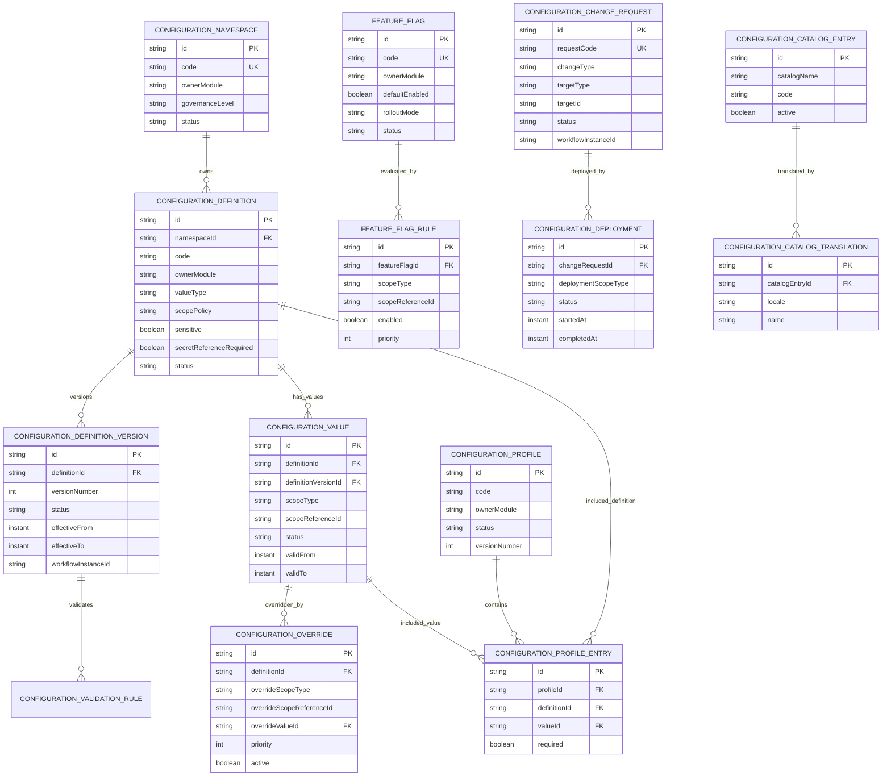

# Hidra Configuration Module — Data Definition Document

```text
Document code : HIDRA-CONFIGURATION-DDD
Module        : configuration
Package       : dz.sh.hidra.modules.configuration
Product       : Hidra - Hydrocarbon Intelligence for Data, Risk, and Analytics
Owner         : Sonatrach / TRC : Digitalization Initiative
Author        : Abir MEDJERAB
CreatedOn     : 2026-06-11
Status        : Target data definition
Source level  : Target architecture; platform typed configuration exists, no implemented configuration Java module found in connected repository search
```

---

## 1. Purpose

The `configuration` module governs runtime-controlled Hidra settings, operational parameters, scoped overrides, feature flags, parameter profiles, validation rules, activation windows, and configuration change history.

It answers:

```text
Which configurable parameter exists?
Who owns its meaning?
What type of value is allowed?
Which value is active for this scope?
Is the value global, module-specific, organization-specific, asset-specific, or environment-specific?
Was the change approved?
When did it become effective?
Can the active configuration be reconstructed later?
```

The module is **not** a generic key-value dump. It is a governed configuration registry for Hidra runtime behavior and cross-cutting operational settings.

---

## 2. Important distinction: platform configuration vs configuration module

Hidra already has typed platform properties for technical boot-time behavior.

Examples:

```text
hidra.platform.observability
hidra.platform.security
hidra.platform.persistence
hidra.platform.events
hidra.platform.tenancy
```

Those properties belong to `platform` and are normally loaded from application configuration, environment variables, deployment configuration, or secret-management infrastructure.

The `configuration` module is different.

It owns **runtime-governed configuration data** that can be searched, versioned, scoped, approved, activated, and audited.

Use this rule:

```text
Platform configuration = technical boot/runtime infrastructure properties.
Configuration module  = governed business/runtime settings managed as Hidra data.
```

Examples of platform-owned configuration:

```text
correlation header name
request header name
CORS settings
CSRF setting
outbox table name
outbox batch size
default tenancy scope
```

Examples of configuration-module-owned data:

```text
feature flags
module parameter sets
scoped runtime overrides
operator-managed thresholds not owned by monitoring
default approval SLA values
integration retry profiles
document retention profiles
report export defaults
cross-module operational preferences
```

---

## 3. Source-of-truth precedence

For this document, the source precedence is:

1. Existing Hidra architecture and bounded-context rules.
2. Existing platform typed configuration model.
3. Existing module DDD boundaries already defined for topology, telemetry, planning, monitoring, alarms, incidents, workflow, audit, documents, integration, HSE, custody, and assets.
4. Target architecture for a dedicated `configuration` bounded context.

Repository searches did not reveal an implemented `configuration` Java module, so the model below is a target DDD and future implementation reference.

---

## 4. Module ownership

### 4.1 Configuration owns

```text
configuration namespaces
configuration definitions
configuration definition versions
configuration values
scoped configuration overrides
configuration profiles
profile entries
feature flags
feature flag rules
configuration validation rules
configuration change requests
configuration deployments
resolved configuration snapshots
configuration external references
configuration catalogs and translations
```

### 4.2 Configuration does not own

```text
platform technical property binding
secrets or secret values
business taxonomies owned by modules
workflow definitions or workflow routing
monitoring thresholds owned by monitoring
alarm rules owned by alarm management
telemetry point definitions
topology asset types
identity roles and permissions
organization units or employees
integration connector execution
report generation logic
audit event ledger
```

### 4.3 Core boundary rule

```text
Configuration owns governed settings.
The owning business module owns the meaning of its business rules.
Platform owns technical boot/runtime infrastructure properties.
Secrets remain outside Hidra tables.
```

---

## 5. What must not become configuration

The following are **not** valid uses of the configuration module:

```text
facility types owned by topology
telemetry quality codes owned by telemetry
workflow definitions owned by workflow
monitoring thresholds owned by monitoring
alarm severity model owned by alarm management
incident classification owned by incidents
HSE compliance obligations owned by HSE
custody calculation formulas owned by custody transfer
asset maintenance strategies owned by asset management
identity permissions owned by identity
organization hierarchy owned by organization
```

If a value has strong business meaning inside one bounded context, that bounded context owns it.

Configuration can hold only:

```text
cross-cutting parameters
runtime toggles
scoped overrides
activation metadata
operator preferences
technical references that need governance
```

---

## 6. Canonical package

```text
dz.sh.hidra.modules.configuration
  api
    rest
      controller
      request
      response
      mapper
  application
    command
    query
    dto
    port
      in
      out
    service
    mapper
  domain
    model
    value
    event
    policy
    service
    exception
  infrastructure
    persistence
      entity
      repository
      mapper
      adapter
    cache
    configuration
```

Forbidden package names inside the module:

```text
shared
common
core
utils
helper
helpers
misc
```

---

## 7. Entity inventory

```text
ConfigurationNamespace
ConfigurationDefinition
ConfigurationDefinitionVersion
ConfigurationValue
ConfigurationOverride
ConfigurationProfile
ConfigurationProfileEntry
FeatureFlag
FeatureFlagRule
ConfigurationValidationRule
ConfigurationChangeRequest
ConfigurationDeployment
ResolvedConfigurationSnapshot
ConfigurationExternalReference
ConfigurationCatalogEntry
ConfigurationCatalogTranslation
```

---

# 8. Entity definitions

---

## 8.1 ConfigurationNamespace

### Purpose

Represents a controlled namespace for configuration values.

A namespace groups related configuration definitions and assigns ownership.

Examples:

```text
GLOBAL
PLATFORM_RUNTIME
INTEGRATION_RUNTIME
DOCUMENT_RETENTION
REPORT_EXPORT
UI_PREFERENCES
WORKFLOW_DEFAULTS
```

A namespace is not a module package. It is a governance boundary for configuration entries.

### Table

```text
hidra_configuration_namespace
```

### Fields

| Field | Type | Required | Description |
|---|---:|:---:|---|
| id | string(80) | yes | Stable namespace identifier. |
| code | string(120) | yes | Unique namespace code. |
| nameAr | string(160) | no | Arabic namespace name. |
| nameFr | string(160) | yes | French namespace name. |
| nameEn | string(160) | no | English namespace name. |
| description | string(500) | no | Business purpose of the namespace. |
| ownerModule | string(80) | no | Module that owns the meaning, when applicable. |
| governanceLevel | catalog reference | yes | Governance level: SYSTEM, OPERATOR, ADMIN, TECHNICAL, REGULATED. |
| status | technical enum | yes | ACTIVE, INACTIVE, RETIRED. |
| systemDefined | boolean | yes | Indicates bootstrap/system namespace. |
| createdAt | instant | yes | Creation timestamp. |
| updatedAt | instant | yes | Last update timestamp. |

### Rules

```text
Namespace code must be unique.
A retired namespace cannot receive new definitions.
A namespace must identify an ownerModule when its settings affect a bounded context.
```

---

## 8.2 ConfigurationDefinition

### Purpose

Defines a configurable parameter, its value type, its ownership, allowed scope, sensitivity, validation model, and lifecycle.

This is the schema of a setting, not the setting value.

### Table

```text
hidra_configuration_definition
```

### Fields

| Field | Type | Required | Description |
|---|---:|:---:|---|
| id | string(80) | yes | Stable definition identifier. |
| namespaceId | FK | yes | Owning configuration namespace. |
| code | string(160) | yes | Definition code unique within namespace. |
| nameAr | string(160) | no | Arabic display name. |
| nameFr | string(160) | yes | French display name. |
| nameEn | string(160) | no | English display name. |
| description | string(1000) | no | Meaning and usage of the parameter. |
| ownerModule | string(80) | no | Module responsible for semantic meaning. |
| valueType | technical enum | yes | TEXT, NUMBER, BOOLEAN, DATE, TIMESTAMP, JSON, CATALOG_CODE, REFERENCE, DURATION, LIST. |
| unitCategory | string(80) | no | Unit category if numeric. |
| defaultUnitId | string(80) | no | Optional unit reference. |
| required | boolean | yes | Whether a value is mandatory. |
| multiValue | boolean | yes | Whether multiple values are allowed. |
| sensitive | boolean | yes | Whether value must be masked in logs/API/audit. |
| secretReferenceRequired | boolean | yes | Indicates that only a secret reference is allowed, never the secret value. |
| scopePolicy | catalog reference | yes | GLOBAL_ONLY, MODULE, ORGANIZATION, TOPOLOGY_ASSET, ENVIRONMENT, MULTI_SCOPE. |
| allowedCatalogName | string(120) | no | Catalog when valueType is CATALOG_CODE. |
| referenceTargetType | string(120) | no | Target type when valueType is REFERENCE. |
| defaultValueExpression | string(1000) | no | Optional safe expression or default reference. |
| status | technical enum | yes | DRAFT, ACTIVE, INACTIVE, RETIRED. |
| createdByActorId | string(80) | no | Actor that created definition. |
| createdAt | instant | yes | Creation timestamp. |
| updatedAt | instant | yes | Last update timestamp. |

### Rules

```text
ConfigurationDefinition defines meaning and allowed shape only.
It must not store active runtime value.
Sensitive values must never be stored as plain text.
If secretReferenceRequired=true, only a secret reference may be stored in ConfigurationValue.
Business-module-owned definitions must declare ownerModule.
```

---

## 8.3 ConfigurationDefinitionVersion

### Purpose

Versions a configuration definition so validation rules and allowed value shape can evolve without destroying historical meaning.

### Table

```text
hidra_configuration_definition_version
```

### Fields

| Field | Type | Required | Description |
|---|---:|:---:|---|
| id | string(80) | yes | Stable definition-version identifier. |
| definitionId | FK | yes | Configuration definition. |
| versionNumber | integer | yes | Monotonic version number. |
| status | technical enum | yes | DRAFT, ACTIVE, SUPERSEDED, RETIRED. |
| effectiveFrom | instant | no | Start of applicability. |
| effectiveTo | instant | no | End of applicability. |
| validationSummary | string(1000) | no | Human-readable summary of changed constraints. |
| workflowInstanceId | string(80) | no | Workflow approval reference. |
| createdByActorId | string(80) | no | Actor that created version. |
| approvedByActorId | string(80) | no | Actor that approved version. |
| approvedAt | instant | no | Approval timestamp. |
| createdAt | instant | yes | Creation timestamp. |
| updatedAt | instant | yes | Last update timestamp. |

### Rules

```text
Active definition versions cannot be edited directly.
Changing value type, scope policy, or validation rules requires a new version.
Only one ACTIVE version may exist per definition at a given time.
```

---

## 8.4 ConfigurationValue

### Purpose

Stores a concrete value for a configuration definition in a specific scope and validity period.

### Table

```text
hidra_configuration_value
```

### Fields

| Field | Type | Required | Description |
|---|---:|:---:|---|
| id | string(80) | yes | Stable value identifier. |
| definitionId | FK | yes | Configuration definition. |
| definitionVersionId | FK | yes | Definition version used to validate this value. |
| scopeType | technical enum | yes | GLOBAL, MODULE, ORGANIZATION_UNIT, TOPOLOGY_ASSET, ENVIRONMENT, USER, INTEGRATION_SYSTEM. |
| scopeReferenceId | string(120) | no | Scope object identifier when not GLOBAL. |
| scopeReferenceCode | string(120) | no | Optional snapshot code. |
| valueText | text | no | Text value. |
| valueNumber | decimal(24,8) | no | Numeric value. |
| valueBoolean | boolean | no | Boolean value. |
| valueDate | date | no | Date value. |
| valueTimestamp | instant | no | Timestamp value. |
| valueCatalogCode | string(120) | no | Catalog-code value. |
| valueReferenceId | string(120) | no | Reference value. |
| valueJson | json | no | Structured value for controlled complex cases. |
| unitId | string(80) | no | Unit used by numeric value. |
| valueHash | string(128) | no | Hash for sensitive/secret-reference values. |
| secretReference | string(300) | no | External secret reference, not secret value. |
| status | technical enum | yes | DRAFT, ACTIVE, INACTIVE, SUPERSEDED, REJECTED. |
| validFrom | instant | yes | Effective start timestamp. |
| validTo | instant | no | Effective end timestamp. |
| changeRequestId | string(80) | no | Change request that introduced the value. |
| createdByActorId | string(80) | no | Actor that created value. |
| createdAt | instant | yes | Creation timestamp. |
| updatedAt | instant | yes | Last update timestamp. |

### Rules

```text
Exactly one value shape must be populated, except valueJson for controlled complex settings.
GLOBAL values must have null scopeReferenceId.
Non-GLOBAL values must have scopeReferenceId.
Sensitive values must be masked in API responses, audit details, and logs.
Secret values must not be stored; only secretReference is allowed.
Overlapping ACTIVE values for the same definition and same scope are forbidden.
```

---

## 8.5 ConfigurationOverride

### Purpose

Stores an explicit scoped override that takes precedence over a broader configuration value.

Example:

```text
Global value      -> report export timeout = 60 seconds
Module override   -> integration export timeout = 120 seconds
Asset override    -> specific remote site timeout = 180 seconds
```

### Table

```text
hidra_configuration_override
```

### Fields

| Field | Type | Required | Description |
|---|---:|:---:|---|
| id | string(80) | yes | Stable override identifier. |
| baseValueId | FK | no | Broader value being overridden. |
| definitionId | FK | yes | Configuration definition. |
| overrideScopeType | technical enum | yes | MODULE, ORGANIZATION_UNIT, TOPOLOGY_ASSET, ENVIRONMENT, USER, INTEGRATION_SYSTEM. |
| overrideScopeReferenceId | string(120) | yes | Scope identifier. |
| overrideValueId | FK | yes | Value used as override. |
| priority | integer | yes | Resolution priority. |
| reasonId | catalog reference | no | Business reason. |
| reasonComment | string(1000) | no | Explanation. |
| active | boolean | yes | Whether override participates in resolution. |
| validFrom | instant | yes | Effective start. |
| validTo | instant | no | Effective end. |
| createdAt | instant | yes | Creation timestamp. |
| updatedAt | instant | yes | Last update timestamp. |

### Rules

```text
Overrides must be explicit and traceable.
Most-specific scope wins only if priority and effective period allow it.
Conflicting same-priority overrides for the same definition and same scope are forbidden.
```

---

## 8.6 ConfigurationProfile

### Purpose

Represents a named set of configuration values used together.

Examples:

```text
DEFAULT_PRODUCTION_RUNTIME
TEST_INTEGRATION_PROFILE
REMOTE_SITE_LOW_BANDWIDTH_PROFILE
DOCUMENT_RETENTION_STANDARD_PROFILE
```

### Table

```text
hidra_configuration_profile
```

### Fields

| Field | Type | Required | Description |
|---|---:|:---:|---|
| id | string(80) | yes | Stable profile identifier. |
| code | string(160) | yes | Unique profile code. |
| nameAr | string(160) | no | Arabic display name. |
| nameFr | string(160) | yes | French display name. |
| nameEn | string(160) | no | English display name. |
| ownerModule | string(80) | no | Module or platform area that uses profile. |
| purpose | string(500) | no | Business purpose. |
| status | technical enum | yes | DRAFT, ACTIVE, INACTIVE, RETIRED. |
| versionNumber | integer | yes | Profile version. |
| workflowInstanceId | string(80) | no | Approval workflow reference. |
| createdByActorId | string(80) | no | Actor that created profile. |
| createdAt | instant | yes | Creation timestamp. |
| updatedAt | instant | yes | Last update timestamp. |

### Rules

```text
Active profiles cannot be edited directly.
A profile revision creates a new version.
Profiles must not hide ownership of individual definitions.
```

---

## 8.7 ConfigurationProfileEntry

### Purpose

Associates configuration values with a profile.

### Table

```text
hidra_configuration_profile_entry
```

### Fields

| Field | Type | Required | Description |
|---|---:|:---:|---|
| id | string(80) | yes | Stable profile-entry identifier. |
| profileId | FK | yes | Configuration profile. |
| definitionId | FK | yes | Definition included in profile. |
| valueId | FK | yes | Configuration value. |
| required | boolean | yes | Whether profile requires this entry. |
| displayOrder | integer | yes | Display order. |
| createdAt | instant | yes | Creation timestamp. |
| updatedAt | instant | yes | Last update timestamp. |

### Rules

```text
A profile cannot contain two active entries for the same definition unless multiValue is allowed.
Profile entries must reference values validated against the correct definition version.
```

---

## 8.8 FeatureFlag

### Purpose

Controls rollout of application behavior without redeployment.

Feature flags are configuration records, but they deserve explicit modeling because they affect runtime behavior and often need targeted rollout.

### Table

```text
hidra_configuration_feature_flag
```

### Fields

| Field | Type | Required | Description |
|---|---:|:---:|---|
| id | string(80) | yes | Stable feature-flag identifier. |
| code | string(160) | yes | Unique feature code. |
| nameAr | string(160) | no | Arabic label. |
| nameFr | string(160) | yes | French label. |
| nameEn | string(160) | no | English label. |
| ownerModule | string(80) | yes | Module owning behavior guarded by flag. |
| description | string(1000) | no | Purpose and expected behavior. |
| defaultEnabled | boolean | yes | Default evaluation result. |
| rolloutMode | technical enum | yes | GLOBAL, SCOPE_RULES, PERCENTAGE, MANUAL. |
| status | technical enum | yes | DRAFT, ACTIVE, DISABLED, RETIRED. |
| createdByActorId | string(80) | no | Actor that created flag. |
| createdAt | instant | yes | Creation timestamp. |
| updatedAt | instant | yes | Last update timestamp. |

### Rules

```text
Feature flags must not permanently replace domain rules.
Retired flags should be removed from code after migration.
Feature flag changes must be auditable.
```

---

## 8.9 FeatureFlagRule

### Purpose

Defines scoped rules for evaluating a feature flag.

### Table

```text
hidra_configuration_feature_flag_rule
```

### Fields

| Field | Type | Required | Description |
|---|---:|:---:|---|
| id | string(80) | yes | Stable rule identifier. |
| featureFlagId | FK | yes | Feature flag. |
| scopeType | technical enum | yes | GLOBAL, ORGANIZATION_UNIT, USER, MODULE, ENVIRONMENT, TOPOLOGY_ASSET. |
| scopeReferenceId | string(120) | no | Scope reference when not GLOBAL. |
| conditionExpression | string(1000) | no | Safe expression evaluated by application service. |
| enabled | boolean | yes | Result when rule matches. |
| percentage | integer | no | Rollout percentage when rolloutMode=PERCENTAGE. |
| priority | integer | yes | Evaluation priority. |
| validFrom | instant | yes | Effective start. |
| validTo | instant | no | Effective end. |
| active | boolean | yes | Whether rule participates in evaluation. |
| createdAt | instant | yes | Creation timestamp. |
| updatedAt | instant | yes | Last update timestamp. |

### Rules

```text
Rules are evaluated by priority.
Unsafe expressions or direct code execution are forbidden.
Percentage rollout must be deterministic by actor/scope key.
```

---

## 8.10 ConfigurationValidationRule

### Purpose

Defines validation logic for configuration values.

### Table

```text
hidra_configuration_validation_rule
```

### Fields

| Field | Type | Required | Description |
|---|---:|:---:|---|
| id | string(80) | yes | Stable validation-rule identifier. |
| definitionVersionId | FK | yes | Definition version to which rule applies. |
| ruleType | catalog reference | yes | REQUIRED, MIN, MAX, REGEX, ALLOWED_VALUES, JSON_SCHEMA, REFERENCE_EXISTS, CUSTOM_EXPRESSION. |
| ruleExpression | string(2000) | no | Safe expression or schema reference. |
| minNumber | decimal(24,8) | no | Numeric lower bound. |
| maxNumber | decimal(24,8) | no | Numeric upper bound. |
| minLength | integer | no | Text minimum length. |
| maxLength | integer | no | Text maximum length. |
| severity | technical enum | yes | ERROR, WARNING. |
| messageAr | string(500) | no | Arabic validation message. |
| messageFr | string(500) | yes | French validation message. |
| messageEn | string(500) | no | English validation message. |
| active | boolean | yes | Whether rule is active. |
| createdAt | instant | yes | Creation timestamp. |
| updatedAt | instant | yes | Last update timestamp. |

### Rules

```text
ERROR rules block activation.
WARNING rules require acknowledgement but may allow activation by policy.
Custom expressions must use a restricted expression language, not arbitrary code.
```

---

## 8.11 ConfigurationChangeRequest

### Purpose

Tracks a requested change to definitions, values, overrides, profiles, or feature flags.

### Table

```text
hidra_configuration_change_request
```

### Fields

| Field | Type | Required | Description |
|---|---:|:---:|---|
| id | string(80) | yes | Stable change-request identifier. |
| requestCode | string(120) | yes | Human-readable change request code. |
| changeType | technical enum | yes | CREATE_DEFINITION, UPDATE_DEFINITION, SET_VALUE, OVERRIDE_VALUE, ACTIVATE_PROFILE, FEATURE_FLAG_CHANGE, RETIRE. |
| targetType | string(120) | yes | Target record type. |
| targetId | string(120) | no | Existing target id, if any. |
| summary | string(500) | yes | Change summary. |
| justification | string(2000) | no | Business/technical justification. |
| riskLevel | catalog reference | no | Operational risk level. |
| requestedByActorId | string(80) | yes | Actor that requested change. |
| requestedAt | instant | yes | Request timestamp. |
| status | technical enum | yes | DRAFT, SUBMITTED, UNDER_REVIEW, APPROVED, REJECTED, CANCELLED, DEPLOYED. |
| workflowInstanceId | string(80) | no | Approval workflow reference. |
| approvedByActorId | string(80) | no | Approver actor. |
| approvedAt | instant | no | Approval timestamp. |
| rejectedByActorId | string(80) | no | Rejecting actor. |
| rejectedAt | instant | no | Rejection timestamp. |
| rejectionReason | string(1000) | no | Reason for rejection. |
| createdAt | instant | yes | Creation timestamp. |
| updatedAt | instant | yes | Last update timestamp. |

### Rules

```text
High-risk configuration changes require workflow approval.
Rejected requests cannot be deployed.
Approved requests should be immutable except deployment metadata.
```

---

## 8.12 ConfigurationDeployment

### Purpose

Tracks activation/deactivation of configuration changes into a target environment or scope.

### Table

```text
hidra_configuration_deployment
```

### Fields

| Field | Type | Required | Description |
|---|---:|:---:|---|
| id | string(80) | yes | Stable deployment identifier. |
| changeRequestId | FK | yes | Approved change request. |
| deploymentCode | string(120) | yes | Deployment code. |
| deploymentScopeType | technical enum | yes | GLOBAL, ENVIRONMENT, MODULE, ORGANIZATION_UNIT, TOPOLOGY_ASSET. |
| deploymentScopeReferenceId | string(120) | no | Scope reference when not GLOBAL. |
| status | technical enum | yes | PLANNED, DEPLOYING, DEPLOYED, FAILED, ROLLED_BACK. |
| scheduledAt | instant | no | Planned deployment timestamp. |
| startedAt | instant | no | Deployment start. |
| completedAt | instant | no | Deployment completion. |
| deployedByActorId | string(80) | no | Actor that deployed. |
| rollbackOfDeploymentId | string(80) | no | Deployment being rolled back. |
| failureReason | string(2000) | no | Failure details. |
| createdAt | instant | yes | Creation timestamp. |
| updatedAt | instant | yes | Last update timestamp. |

### Rules

```text
Only approved change requests can be deployed.
Deployment must preserve correlation/audit references.
Failed deployments must retain failure reason.
Rollback creates a new deployment record; it does not delete history.
```

---

## 8.13 ResolvedConfigurationSnapshot

### Purpose

Stores a point-in-time resolved view of configuration for a module/scope.

It is a rebuildable projection, but useful for traceability and deterministic evaluation.

### Table

```text
hidra_configuration_resolved_snapshot
```

### Fields

| Field | Type | Required | Description |
|---|---:|:---:|---|
| id | string(80) | yes | Stable snapshot identifier. |
| snapshotCode | string(120) | yes | Snapshot code. |
| targetModule | string(80) | yes | Module for which configuration was resolved. |
| scopeType | technical enum | yes | GLOBAL, ORGANIZATION_UNIT, TOPOLOGY_ASSET, ENVIRONMENT, USER, INTEGRATION_SYSTEM. |
| scopeReferenceId | string(120) | no | Scope object id. |
| resolvedAt | instant | yes | Resolution timestamp. |
| resolvedByActorId | string(80) | no | Actor/service that requested snapshot. |
| effectiveAt | instant | yes | Effective time used for resolution. |
| configurationHash | string(128) | yes | Hash of resolved configuration payload. |
| payloadJson | json | yes | Resolved key/value payload; sensitive values masked or references only. |
| sourceVersionSummary | text | no | Summary of participating definitions/values. |
| createdAt | instant | yes | Creation timestamp. |

### Rules

```text
Snapshots must not expose secrets.
Snapshots are immutable after creation.
Operational decisions may store snapshot id to prove which configuration was used.
```

---

## 8.14 ConfigurationExternalReference

### Purpose

Links Hidra configuration entries to external configuration systems or deployment records.

### Table

```text
hidra_configuration_external_reference
```

### Fields

| Field | Type | Required | Description |
|---|---:|:---:|---|
| id | string(80) | yes | Stable external-reference identifier. |
| targetType | string(120) | yes | Hidra configuration record type. |
| targetId | string(120) | yes | Hidra configuration record id. |
| externalSystemId | string(80) | yes | External system reference. |
| externalReferenceType | catalog reference | yes | PARAMETER, SECRET_REFERENCE, CONFIG_FILE, DEPLOYMENT, TICKET. |
| externalReference | string(300) | yes | External id/path/reference. |
| active | boolean | yes | Whether link is active. |
| createdAt | instant | yes | Creation timestamp. |
| updatedAt | instant | yes | Last update timestamp. |

### Rules

```text
External references do not make external systems owners of Hidra configuration data.
Secret references must point to secret storage, not contain secret values.
```

---

## 8.15 ConfigurationCatalogEntry

### Purpose

Stores configuration-specific controlled vocabularies.

### Table

```text
hidra_configuration_catalog_entry
```

### Fields

| Field | Type | Required | Description |
|---|---:|:---:|---|
| id | string(80) | yes | Stable catalog entry identifier. |
| catalogName | string(120) | yes | Catalog group name. |
| code | string(120) | yes | Entry code unique within catalog. |
| active | boolean | yes | Whether entry can be used. |
| sortOrder | integer | yes | UI/API ordering. |
| systemDefined | boolean | yes | Whether entry is system-defined. |
| createdAt | instant | yes | Creation timestamp. |
| updatedAt | instant | yes | Last update timestamp. |

### Recommended catalog names

```text
GOVERNANCE_LEVEL
SCOPE_POLICY
VALUE_TYPE
CHANGE_TYPE
CHANGE_RISK_LEVEL
CHANGE_REASON
DEPLOYMENT_STATUS_REASON
FEATURE_ROLLOUT_MODE
VALIDATION_RULE_TYPE
EXTERNAL_REFERENCE_TYPE
```

### Rules

```text
Configuration catalogs are only for the configuration module.
They must not replace business catalogs owned by other modules.
```

---

## 8.16 ConfigurationCatalogTranslation

### Purpose

Stores multilingual labels for configuration catalog entries.

### Table

```text
hidra_configuration_catalog_translation
```

### Fields

| Field | Type | Required | Description |
|---|---:|:---:|---|
| id | string(80) | yes | Stable translation identifier. |
| catalogEntryId | FK | yes | Configuration catalog entry. |
| locale | string(10) | yes | Locale code: ar, fr, en. |
| name | string(160) | yes | Localized name. |
| description | string(500) | no | Localized description. |
| createdAt | instant | yes | Creation timestamp. |
| updatedAt | instant | yes | Last update timestamp. |

### Rules

```text
At minimum, French labels are required.
Arabic and English should be added for operational UI readiness.
Only one translation per catalog entry and locale is allowed.
```

---

# 9. Relationship model

```text
ConfigurationNamespace
  -> ConfigurationDefinition
      -> ConfigurationDefinitionVersion
          -> ConfigurationValidationRule
      -> ConfigurationValue
          -> ConfigurationOverride

ConfigurationProfile
  -> ConfigurationProfileEntry
      -> ConfigurationDefinition
      -> ConfigurationValue

FeatureFlag
  -> FeatureFlagRule

ConfigurationChangeRequest
  -> ConfigurationDeployment

ResolvedConfigurationSnapshot
  references ConfigurationDefinition / ConfigurationValue by payload and hash

ConfigurationCatalogEntry
  -> ConfigurationCatalogTranslation
```

---

# 10. Scope resolution rule

Configuration values must be resolved from broadest to most specific scope.

Recommended precedence:

```text
GLOBAL
  -> ENVIRONMENT
      -> MODULE
          -> ORGANIZATION_UNIT
              -> TOPOLOGY_ASSET
                  -> INTEGRATION_SYSTEM
                      -> USER
```

Resolution must be deterministic:

```text
same definition + same scope + same effective time = same resolved value
```

If two values conflict at the same scope and priority, resolution must fail loudly.

---

# 11. Validation and safety rules

## 11.1 Value shape rule

```text
A ConfigurationValue must use exactly one typed value field:
valueText OR valueNumber OR valueBoolean OR valueDate OR valueTimestamp OR valueCatalogCode OR valueReferenceId OR valueJson OR secretReference
```

## 11.2 Secret rule

```text
Secret values are forbidden in Hidra configuration tables.
Only secret references are allowed.
```

Examples of forbidden values:

```text
password
API token
private key
certificate private material
LDAP bind password
client secret
SCADA credential
historian credential
```

## 11.3 Ownership rule

```text
Configuration cannot take ownership of a parameter when a business module owns its meaning.
```

## 11.4 Approval rule

```text
High-risk configuration changes require workflow approval before deployment.
```

## 11.5 Audit rule

```text
Configuration changes must publish audit-ready events.
Audit owns durable audit evidence.
Configuration owns the changed setting.
```

## 11.6 Safe expression rule

```text
Validation and feature-flag expressions must be sandboxed and declarative.
Arbitrary code execution is forbidden.
```

---

# 12. Events

Recommended domain events:

```text
ConfigurationNamespaceCreatedEvent
ConfigurationDefinitionCreatedEvent
ConfigurationDefinitionVersionActivatedEvent
ConfigurationValueSubmittedEvent
ConfigurationValueActivatedEvent
ConfigurationValueSupersededEvent
ConfigurationOverrideActivatedEvent
ConfigurationProfileActivatedEvent
FeatureFlagActivatedEvent
FeatureFlagRuleChangedEvent
ConfigurationChangeRequestedEvent
ConfigurationChangeApprovedEvent
ConfigurationDeploymentCompletedEvent
ConfigurationDeploymentFailedEvent
ConfigurationSnapshotCreatedEvent
```

Events should include:

```text
eventId
occurredAt
actorId
correlationId
requestId
targetType
targetId
changeRequestId
workflowInstanceId when applicable
sensitiveValueMasked flag
```

---

# 13. Indexes and constraints

Recommended constraints:

```text
UNIQUE hidra_configuration_namespace(code)
UNIQUE hidra_configuration_definition(namespace_id, code)
UNIQUE hidra_configuration_definition_version(definition_id, version_number)
UNIQUE active value per definition/scope/effective interval policy
UNIQUE hidra_configuration_profile(code, version_number)
UNIQUE hidra_configuration_profile_entry(profile_id, definition_id) unless definition.multiValue=true
UNIQUE hidra_configuration_feature_flag(code)
UNIQUE hidra_configuration_catalog_entry(catalog_name, code)
UNIQUE hidra_configuration_catalog_translation(catalog_entry_id, locale)
```

Recommended indexes:

```text
idx_configuration_definition_namespace
idx_configuration_definition_owner_module
idx_configuration_value_definition_scope
idx_configuration_value_validity
idx_configuration_override_definition_scope
idx_configuration_feature_flag_status
idx_configuration_change_request_status
idx_configuration_deployment_status
idx_configuration_snapshot_target_scope
idx_configuration_external_reference_target
```

---

# 14. API ownership

Recommended REST groups:

```text
/api/v1/configuration/namespaces
/api/v1/configuration/definitions
/api/v1/configuration/values
/api/v1/configuration/overrides
/api/v1/configuration/profiles
/api/v1/configuration/feature-flags
/api/v1/configuration/change-requests
/api/v1/configuration/deployments
/api/v1/configuration/snapshots
/api/v1/configuration/catalogs
```

Recommended application ports:

```text
CreateConfigurationDefinitionUseCase
CreateConfigurationValueUseCase
SubmitConfigurationChangeRequestUseCase
ApproveConfigurationChangeUseCase
DeployConfigurationChangeUseCase
ResolveConfigurationUseCase
CreateResolvedConfigurationSnapshotUseCase
EvaluateFeatureFlagUseCase
ListConfigurationCatalogUseCase
```

Recommended outbound ports:

```text
ConfigurationAuditEventPort
ConfigurationWorkflowPort
ConfigurationSecretReferenceValidatorPort
ConfigurationExternalSystemLookupPort
ConfigurationCacheInvalidationPort
```

---

# 15. Mermaid ER diagram



---

# 16. Implementation decision tests

Ask these questions before adding something to `configuration`:

```text
Is it a runtime/governed setting rather than source code?          -> maybe configuration
Does one business module own its semantic meaning?                 -> put it in that module
Is it a technical boot property?                                   -> platform/config files
Is it a secret?                                                    -> external secret store only
Does it require approval, activation, and effective dating?         -> configuration
Is it just a label/type catalog for one module?                     -> owning module catalog
Does it change operational behavior across modules?                 -> configuration candidate
```

---

# 17. Final rule

```text
Use Configuration for governed runtime settings.
Use module catalogs for business taxonomy.
Use Platform for technical boot properties.
Use external secret storage for secrets.
Never turn Configuration into a shared/common/masterdata dumping ground.
```
