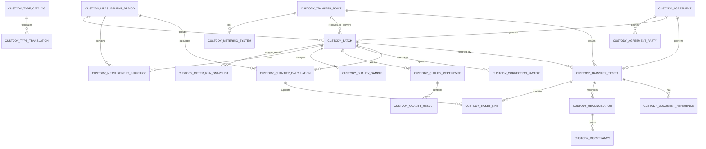

# HIDRA Custody Transfer Module — Data Definition Document

```text
Document code : HIDRA-CUSTODY-TRANSFER-DDD
Module        : custody
Package       : dz.sh.hidra.modules.custody
Product       : Hidra - Hydrocarbon Intelligence for Data, Risk, and Analytics
Owner         : Sonatrach / TRC : Digitalization Initiative
Author        : Abir MEDJERAB
CreatedOn     : 2026-06-11
Status        : Target data definition
Evidence      : Target architecture; no implemented custody module found in connected repository searches
```

---

## 1. Purpose

The `custody` module owns the official operational/fiscal record of hydrocarbon custody transfer.

Custody Transfer answers:

```text
Which product quantity was officially transferred?
At which custody point?
Between which parties?
For which period, batch, delivery, receipt, or nomination?
Using which official metering evidence?
Using which quality evidence?
Which corrections/calculations were applied?
Was the quantity accepted, disputed, reconciled, or approved?
Which official ticket/certificate supports the transfer?
```

Custody Transfer is not raw telemetry ingestion, not SCADA, not planning, not invoicing, and not generic reporting.

---

## 2. Source-of-truth position

Custody Transfer is downstream from the operational foundation.

```text
Topology
  -> defines physical custody points, facilities, meter locations, pipeline systems

Telemetry
  -> provides trusted measurement readings and measurement evidence

Planning
  -> provides nominations, expected deliveries, expected receipts, and planned periods

Custody Transfer
  -> freezes official accepted quantities and transfer evidence

Workflow
  -> approves, rejects, requests correction, or escalates custody records

Audit
  -> stores immutable audit evidence

Reporting / Integration
  -> publishes custody reports and exports accepted quantities
```

---

## 3. Ownership boundary

### 3.1 Custody owns

```text
CustodyTransferPoint
CustodyAgreement
CustodyAgreementParty
CustodyMeasurementPeriod
CustodyBatch
CustodyMeteringSystem
CustodyMeterRunSnapshot
CustodyMeasurementSnapshot
CustodyQualitySample
CustodyQualityCertificate
CustodyQuantityCalculation
CustodyCorrectionFactor
CustodyTransferTicket
CustodyTicketLine
CustodyReconciliation
CustodyDiscrepancy
CustodyApprovalReference
CustodyDocumentReference
CustodyCatalogEntry
CustodyCatalogTranslation
```

### 3.2 Custody references but does not own

```text
Topology assets
Telemetry readings
Planning nominations and plan targets
Workflow instances and tasks
Organization units and employees
Identity actors
Party/legal entity master data
Documents binary storage
Audit records
Reports and dashboards
Invoices, payments, and accounting documents
```

### 3.3 Custody must not own

```text
raw telemetry readings
telemetry devices/tags/sources
pipeline topology
facilities/equipment physical placement
planning targets
monitoring deviations
alarm lifecycle
incident lifecycle
maintenance work orders
financial invoicing
ERP accounting postings
SCADA/PLC/RTU actuation
```

---

## 4. Core design rule

```text
Telemetry says what was measured.
Planning says what was expected.
Custody says what was officially transferred and accepted.
Finance/ERP says what was invoiced or posted.
```

Custody must store immutable snapshots of the evidence used for official transfer decisions, because telemetry values, topology names, party names, and quality definitions may evolve later.

---

## 5. Main business flow

```text
Define custody transfer point
  -> bind to topology asset reference
  -> define custody agreement and parties
  -> define measurement period or batch
  -> collect trusted telemetry/manual evidence
  -> collect quality certificate/sample evidence
  -> calculate corrected official quantities
  -> create transfer ticket
  -> reconcile against nomination/expected quantity
  -> approve through workflow
  -> freeze accepted custody quantity
  -> publish event/report/integration export
```

---

## 6. Entities

## 6.1 CustodyTransferPoint

Represents an official custody transfer point, such as a delivery point, receipt point, export terminal metering point, interconnection point, storage handover point, or fiscal metering station.

**Table:** `hidra_custody_transfer_point`

| Field | Type | Required | Description |
|---|---:|:---:|---|
| `id` | varchar(80) | yes | Stable custody transfer point identifier. |
| `code` | varchar(80) | yes | Unique business code. |
| `nameAr` | varchar(160) | no | Arabic display name. |
| `nameFr` | varchar(160) | yes | French display name. |
| `nameEn` | varchar(160) | no | English display name. |
| `pointTypeId` | varchar(80) | yes | Catalog reference: RECEIPT, DELIVERY, INTERCONNECTION, EXPORT, IMPORT, STORAGE_HANDOVER, INTERNAL_TRANSFER. |
| `productTypeId` | varchar(80) | yes | Catalog/product reference. |
| `topologyAssetTypeCode` | varchar(80) | yes | Referenced topology asset type: FACILITY, EQUIPMENT, MEASUREMENT_LOCATION, PIPELINE_SYSTEM, PIPELINE. |
| `topologyAssetId` | varchar(120) | yes | Referenced topology asset ID. |
| `topologyAssetCodeSnapshot` | varchar(120) | no | Topology asset code snapshot. |
| `topologyAssetNameSnapshot` | varchar(160) | no | Topology asset name snapshot. |
| `defaultUnitId` | varchar(80) | no | Default official quantity unit. |
| `status` | varchar(40) | yes | ACTIVE, INACTIVE, RETIRED. |
| `validFrom` | date | yes | Start of validity. |
| `validTo` | date | no | End of validity. |
| `createdAt` | timestamptz | yes | Creation timestamp. |
| `updatedAt` | timestamptz | yes | Last update timestamp. |

**Rules**

```text
A custody point must reference a valid topology asset by neutral reference.
A retired custody point cannot receive new transfer tickets.
A custody point code must be unique.
Topology remains the owner of the physical asset.
```

---

## 6.2 CustodyAgreement

Defines the contractual/operational framework under which custody quantities are accepted.

**Table:** `hidra_custody_agreement`

| Field | Type | Required | Description |
|---|---:|:---:|---|
| `id` | varchar(80) | yes | Stable agreement identifier. |
| `code` | varchar(80) | yes | Unique agreement code. |
| `title` | varchar(240) | yes | Agreement title. |
| `agreementTypeId` | varchar(80) | yes | Catalog reference: TRANSPORT, SUPPLY, DELIVERY, RECEIPT, INTERCONNECTION, EXPORT, INTERNAL_TRANSFER. |
| `productTypeId` | varchar(80) | yes | Product concerned by the agreement. |
| `measurementStandardId` | varchar(80) | no | Measurement standard/catalog reference. |
| `quantityBasisId` | varchar(80) | yes | VOLUME, MASS, ENERGY, STANDARD_VOLUME. |
| `defaultQuantityUnitId` | varchar(80) | yes | Default official unit. |
| `tolerancePercent` | decimal(10,5) | no | Accepted tolerance between expected and measured quantity. |
| `status` | varchar(40) | yes | DRAFT, ACTIVE, SUSPENDED, EXPIRED, RETIRED. |
| `effectiveFrom` | date | yes | Start of agreement validity. |
| `effectiveTo` | date | no | End of agreement validity. |
| `workflowInstanceId` | varchar(80) | no | Approval workflow reference. |
| `createdAt` | timestamptz | yes | Creation timestamp. |
| `updatedAt` | timestamptz | yes | Last update timestamp. |

**Rules**

```text
Approved or active agreements cannot be overwritten directly.
Changing a critical agreement parameter requires a new revision or new agreement version.
Custody may reference a party master, but it does not own party identity.
```

---

## 6.3 CustodyAgreementParty

Associates parties with a custody agreement using controlled roles.

**Table:** `hidra_custody_agreement_party`

| Field | Type | Required | Description |
|---|---:|:---:|---|
| `id` | varchar(80) | yes | Stable agreement-party identifier. |
| `agreementId` | varchar(80) | yes | Parent custody agreement. |
| `partyId` | varchar(80) | yes | Referenced party/legal entity ID. |
| `partyCodeSnapshot` | varchar(80) | yes | Party code snapshot. |
| `partyNameSnapshot` | varchar(240) | yes | Party name snapshot. |
| `partyRoleId` | varchar(80) | yes | SHIPPER, RECEIVER, DELIVERER, OPERATOR, OWNER, BUYER, SELLER, TRANSPORTER, WITNESS. |
| `primaryRole` | boolean | yes | Whether this is the primary party for the role. |
| `validFrom` | date | yes | Start of validity. |
| `validTo` | date | no | End of validity. |
| `createdAt` | timestamptz | yes | Creation timestamp. |
| `updatedAt` | timestamptz | yes | Last update timestamp. |

**Rules**

```text
Do not store free-text counterparty names as the final source of truth.
Use Party reference + snapshots.
Misspellings and aliases must be handled by Party/master-data governance, not custody records.
```

---

## 6.4 CustodyMeasurementPeriod

Defines the fiscal/official measurement period for custody calculation.

**Table:** `hidra_custody_measurement_period`

| Field | Type | Required | Description |
|---|---:|:---:|---|
| `id` | varchar(80) | yes | Stable period identifier. |
| `code` | varchar(80) | yes | Period business code. |
| `periodTypeId` | varchar(80) | yes | HOURLY, DAILY, MONTHLY, BATCH, SHIPMENT, CUSTOM. |
| `startedAt` | timestamptz | yes | Period start. |
| `endedAt` | timestamptz | yes | Period end. |
| `timezone` | varchar(80) | yes | Timezone used for official period boundary. |
| `status` | varchar(40) | yes | OPEN, CLOSED, LOCKED, CANCELLED. |
| `closedByActorId` | varchar(80) | no | Actor that closed the period. |
| `closedAt` | timestamptz | no | Closing timestamp. |
| `createdAt` | timestamptz | yes | Creation timestamp. |
| `updatedAt` | timestamptz | yes | Last update timestamp. |

**Rules**

```text
Period end must be after period start.
Locked periods cannot receive new official tickets except through formal correction workflow.
Period boundaries must be explicit; do not rely on server timezone.
```

---

## 6.5 CustodyBatch

Represents an official batch, shipment, delivery lot, receipt lot, or transfer lot.

**Table:** `hidra_custody_batch`

| Field | Type | Required | Description |
|---|---:|:---:|---|
| `id` | varchar(80) | yes | Stable batch identifier. |
| `batchCode` | varchar(80) | yes | Unique batch or shipment code. |
| `agreementId` | varchar(80) | no | Related custody agreement. |
| `transferPointId` | varchar(80) | yes | Custody point. |
| `measurementPeriodId` | varchar(80) | no | Related measurement period. |
| `productTypeId` | varchar(80) | yes | Product being transferred. |
| `planningNominationId` | varchar(80) | no | Planning nomination reference. |
| `sourceLocationReference` | varchar(160) | no | Optional source location snapshot/reference. |
| `destinationLocationReference` | varchar(160) | no | Optional destination location snapshot/reference. |
| `startedAt` | timestamptz | no | Batch start timestamp. |
| `endedAt` | timestamptz | no | Batch end timestamp. |
| `status` | varchar(40) | yes | DRAFT, OPEN, MEASURED, CALCULATED, TICKETED, APPROVED, DISPUTED, CANCELLED. |
| `createdAt` | timestamptz | yes | Creation timestamp. |
| `updatedAt` | timestamptz | yes | Last update timestamp. |

**Rules**

```text
A custody batch must reference either a measurement period or an explicit start/end interval.
A ticketed batch cannot be modified directly.
A batch may reference planning, but planning remains owner of nominations.
```

---

## 6.6 CustodyMeteringSystem

Represents the official metering setup used for custody transfer.

This is not telemetry source/device ownership. It is custody's official view of which metering system is accepted for fiscal/official measurement.

**Table:** `hidra_custody_metering_system`

| Field | Type | Required | Description |
|---|---:|:---:|---|
| `id` | varchar(80) | yes | Stable metering system identifier. |
| `code` | varchar(80) | yes | Unique metering system code. |
| `transferPointId` | varchar(80) | yes | Custody transfer point. |
| `meteringSystemTypeId` | varchar(80) | yes | ORIFICE, ULTRASONIC, TURBINE, CORIOLIS, TANK_GAUGE, WEIGHBRIDGE, MANUAL. |
| `topologyAssetTypeCode` | varchar(80) | no | Referenced physical asset type. |
| `topologyAssetId` | varchar(120) | no | Referenced topology equipment/location. |
| `assetReferenceId` | varchar(120) | no | Maintainable asset reference if asset module manages lifecycle. |
| `official` | boolean | yes | Whether this metering system is official for custody. |
| `status` | varchar(40) | yes | ACTIVE, STANDBY, OUT_OF_SERVICE, RETIRED. |
| `validFrom` | date | yes | Start of validity. |
| `validTo` | date | no | End of validity. |
| `createdAt` | timestamptz | yes | Creation timestamp. |
| `updatedAt` | timestamptz | yes | Last update timestamp. |

**Rules**

```text
Only active official metering systems may be used for approved custody tickets.
Asset maintenance and calibration execution belong to Asset Management.
Custody stores the fiscal snapshot/evidence used for transfer acceptance.
```

---

## 6.7 CustodyMeterRunSnapshot

Freezes meter-run details used at calculation time.

**Table:** `hidra_custody_meter_run_snapshot`

| Field | Type | Required | Description |
|---|---:|:---:|---|
| `id` | varchar(80) | yes | Stable snapshot identifier. |
| `meteringSystemId` | varchar(80) | yes | Parent metering system. |
| `batchId` | varchar(80) | no | Related batch. |
| `measurementPeriodId` | varchar(80) | no | Related period. |
| `meterRunCodeSnapshot` | varchar(80) | yes | Meter run code at time of transfer. |
| `meterSerialNumberSnapshot` | varchar(120) | no | Meter serial number at time of transfer. |
| `meterTypeSnapshot` | varchar(80) | no | Meter type snapshot. |
| `calibrationReference` | varchar(120) | no | Calibration/proving reference used for custody. |
| `provingRecordId` | varchar(80) | no | Custody proving record reference. |
| `createdAt` | timestamptz | yes | Creation timestamp. |

**Rules**

```text
Do not rely only on live asset/equipment state for official custody tickets.
Freeze the meter configuration used for official calculation.
```

---

## 6.8 CustodyMeasurementSnapshot

Stores immutable measurement values used for official custody calculation.

**Table:** `hidra_custody_measurement_snapshot`

| Field | Type | Required | Description |
|---|---:|:---:|---|
| `id` | varchar(80) | yes | Stable measurement snapshot identifier. |
| `batchId` | varchar(80) | no | Related batch. |
| `measurementPeriodId` | varchar(80) | no | Related period. |
| `meteringSystemId` | varchar(80) | yes | Related metering system. |
| `measurementTypeId` | varchar(80) | yes | OPENING_READING, CLOSING_READING, FLOW_TOTALIZER, TEMPERATURE, PRESSURE, DENSITY, BS_W, GCV, ENERGY. |
| `telemetryReadingId` | varchar(80) | no | Referenced trusted telemetry reading. |
| `manualEntryReferenceId` | varchar(80) | no | Manual entry reference if no telemetry reading exists. |
| `numericValue` | decimal(24,8) | no | Numeric value snapshot. |
| `textValue` | varchar(240) | no | Text value snapshot. |
| `unitId` | varchar(80) | no | Unit reference. |
| `qualityCodeId` | varchar(80) | no | Quality code used at snapshot time. |
| `sourceTimestamp` | timestamptz | yes | Measurement timestamp. |
| `snapshotAt` | timestamptz | yes | Snapshot creation timestamp. |
| `sourceType` | varchar(40) | yes | TELEMETRY, MANUAL, IMPORTED, CALCULATED. |
| `acceptedForCustody` | boolean | yes | Whether this evidence is accepted for official calculation. |
| `rejectionReasonId` | varchar(80) | no | Reason if not accepted. |

**Rules**

```text
CustodyMeasurementSnapshot is immutable after ticket approval.
Custody references telemetry but does not alter telemetry readings.
At least one value shape must be present when sourceType is not CALCULATED_NULL.
Accepted evidence must have a valid unit and quality state when numeric.
```

---

## 6.9 CustodyQualitySample

Represents quality sampling evidence associated with a custody transfer.

**Table:** `hidra_custody_quality_sample`

| Field | Type | Required | Description |
|---|---:|:---:|---|
| `id` | varchar(80) | yes | Stable sample identifier. |
| `sampleCode` | varchar(80) | yes | Sample code. |
| `batchId` | varchar(80) | no | Related batch. |
| `transferPointId` | varchar(80) | yes | Custody point. |
| `sampleTypeId` | varchar(80) | yes | ONLINE, MANUAL, COMPOSITE, TANK, LINE. |
| `sampledAt` | timestamptz | yes | Sampling timestamp. |
| `sampledByActorId` | varchar(80) | no | Actor who sampled. |
| `laboratoryReference` | varchar(120) | no | External/internal lab reference. |
| `status` | varchar(40) | yes | COLLECTED, ANALYZED, ACCEPTED, REJECTED, CANCELLED. |
| `createdAt` | timestamptz | yes | Creation timestamp. |
| `updatedAt` | timestamptz | yes | Last update timestamp. |

**Rules**

```text
Custody stores quality evidence required for custody acceptance.
A future laboratory/LIMS module may own full lab process; custody references its certificate/results.
```

---

## 6.10 CustodyQualityCertificate

Official quality certificate or quality result set used for custody acceptance.

**Table:** `hidra_custody_quality_certificate`

| Field | Type | Required | Description |
|---|---:|:---:|---|
| `id` | varchar(80) | yes | Stable certificate identifier. |
| `certificateNumber` | varchar(120) | yes | Official certificate number. |
| `qualitySampleId` | varchar(80) | no | Related quality sample. |
| `batchId` | varchar(80) | no | Related batch. |
| `issuedByPartyId` | varchar(80) | no | Party/lab issuing certificate. |
| `issuedByNameSnapshot` | varchar(240) | no | Issuer snapshot. |
| `issuedAt` | timestamptz | yes | Issue timestamp. |
| `productTypeId` | varchar(80) | yes | Product type. |
| `qualityStatus` | varchar(40) | yes | ACCEPTED, OFF_SPEC, CONDITIONAL, REJECTED. |
| `documentReferenceId` | varchar(80) | no | Document reference. |
| `createdAt` | timestamptz | yes | Creation timestamp. |
| `updatedAt` | timestamptz | yes | Last update timestamp. |

---

## 6.11 CustodyQualityResult

Individual property/result inside a quality certificate.

**Table:** `hidra_custody_quality_result`

| Field | Type | Required | Description |
|---|---:|:---:|---|
| `id` | varchar(80) | yes | Stable result identifier. |
| `certificateId` | varchar(80) | yes | Parent quality certificate. |
| `propertyTypeId` | varchar(80) | yes | Density, sulfur, water content, GCV, NCV, API gravity, BS&W, etc. |
| `numericValue` | decimal(24,8) | no | Numeric result. |
| `textValue` | varchar(240) | no | Textual result. |
| `unitId` | varchar(80) | no | Unit reference. |
| `methodReference` | varchar(120) | no | Test method/reference standard. |
| `withinSpecification` | boolean | no | Whether result is within accepted spec. |
| `createdAt` | timestamptz | yes | Creation timestamp. |

---

## 6.12 CustodyCorrectionFactor

Stores correction factors applied during quantity calculation.

**Table:** `hidra_custody_correction_factor`

| Field | Type | Required | Description |
|---|---:|:---:|---|
| `id` | varchar(80) | yes | Stable correction factor identifier. |
| `batchId` | varchar(80) | no | Related batch. |
| `measurementPeriodId` | varchar(80) | no | Related measurement period. |
| `factorTypeId` | varchar(80) | yes | TEMPERATURE_CORRECTION, PRESSURE_CORRECTION, DENSITY_CORRECTION, METER_FACTOR, SHRINKAGE, QUALITY_ADJUSTMENT. |
| `factorValue` | decimal(24,10) | yes | Factor value. |
| `basisMeasurementSnapshotId` | varchar(80) | no | Input measurement snapshot. |
| `basisQualityResultId` | varchar(80) | no | Input quality result. |
| `methodReference` | varchar(120) | no | Standard/method used. |
| `calculatedAt` | timestamptz | yes | Calculation timestamp. |
| `calculatedByActorId` | varchar(80) | no | Actor or system performing calculation. |

**Rules**

```text
Every official correction factor must be traceable to a measurement, quality result, method, or controlled manual input.
```

---

## 6.13 CustodyQuantityCalculation

Stores official gross/net/standard quantity calculation results.

**Table:** `hidra_custody_quantity_calculation`

| Field | Type | Required | Description |
|---|---:|:---:|---|
| `id` | varchar(80) | yes | Stable calculation identifier. |
| `batchId` | varchar(80) | no | Related batch. |
| `measurementPeriodId` | varchar(80) | no | Related measurement period. |
| `transferPointId` | varchar(80) | yes | Custody point. |
| `calculationMethodId` | varchar(80) | yes | Catalog/method reference. |
| `grossQuantity` | decimal(24,8) | no | Gross quantity. |
| `netQuantity` | decimal(24,8) | yes | Net accepted quantity. |
| `standardQuantity` | decimal(24,8) | no | Standard-condition quantity. |
| `massQuantity` | decimal(24,8) | no | Mass quantity if applicable. |
| `energyQuantity` | decimal(24,8) | no | Energy quantity if applicable. |
| `quantityUnitId` | varchar(80) | yes | Quantity unit. |
| `calculationStatus` | varchar(40) | yes | DRAFT, CALCULATED, VALIDATED, APPROVED, REJECTED, SUPERSEDED. |
| `calculatedAt` | timestamptz | yes | Calculation timestamp. |
| `calculatedByActorId` | varchar(80) | no | Actor/system performing calculation. |
| `validatedByActorId` | varchar(80) | no | Validator actor. |
| `validatedAt` | timestamptz | no | Validation timestamp. |
| `workflowInstanceId` | varchar(80) | no | Workflow reference. |
| `correlationId` | varchar(120) | no | Correlation ID. |
| `createdAt` | timestamptz | yes | Creation timestamp. |
| `updatedAt` | timestamptz | yes | Last update timestamp. |

**Rules**

```text
An approved calculation is immutable.
A recalculation creates a new calculation and marks the previous one SUPERSEDED.
A transfer ticket must reference an approved or validated calculation depending on policy.
```

---

## 6.14 CustodyTransferTicket

Official custody transfer ticket/document header.

**Table:** `hidra_custody_transfer_ticket`

| Field | Type | Required | Description |
|---|---:|:---:|---|
| `id` | varchar(80) | yes | Stable ticket identifier. |
| `ticketNumber` | varchar(120) | yes | Official ticket number. |
| `ticketTypeId` | varchar(80) | yes | DELIVERY_TICKET, RECEIPT_TICKET, TRANSFER_TICKET, EXPORT_TICKET, CORRECTION_TICKET. |
| `agreementId` | varchar(80) | no | Agreement reference. |
| `batchId` | varchar(80) | no | Batch reference. |
| `measurementPeriodId` | varchar(80) | no | Measurement period reference. |
| `transferPointId` | varchar(80) | yes | Custody point. |
| `ticketDate` | date | yes | Official ticket date. |
| `status` | varchar(40) | yes | DRAFT, GENERATED, UNDER_REVIEW, APPROVED, DISPUTED, CANCELLED, SUPERSEDED. |
| `issuedByActorId` | varchar(80) | no | Issuing actor. |
| `issuedAt` | timestamptz | no | Issue timestamp. |
| `approvedByActorId` | varchar(80) | no | Approver actor. |
| `approvedAt` | timestamptz | no | Approval timestamp. |
| `workflowInstanceId` | varchar(80) | no | Workflow reference. |
| `documentReferenceId` | varchar(80) | no | Rendered/signed document reference. |
| `correlationId` | varchar(120) | no | Correlation ID. |
| `createdAt` | timestamptz | yes | Creation timestamp. |
| `updatedAt` | timestamptz | yes | Last update timestamp. |

**Rules**

```text
Approved tickets are immutable.
Correction requires a correction ticket or superseding ticket.
A ticket number must be unique within ticket type or official numbering scope.
```

---

## 6.15 CustodyTicketLine

Quantity line inside a custody transfer ticket.

**Table:** `hidra_custody_ticket_line`

| Field | Type | Required | Description |
|---|---:|:---:|---|
| `id` | varchar(80) | yes | Stable line identifier. |
| `ticketId` | varchar(80) | yes | Parent transfer ticket. |
| `lineNumber` | integer | yes | Line order. |
| `productTypeId` | varchar(80) | yes | Product type. |
| `quantityCalculationId` | varchar(80) | yes | Quantity calculation reference. |
| `grossQuantity` | decimal(24,8) | no | Gross quantity snapshot. |
| `netQuantity` | decimal(24,8) | yes | Net quantity snapshot. |
| `standardQuantity` | decimal(24,8) | no | Standard quantity snapshot. |
| `massQuantity` | decimal(24,8) | no | Mass quantity snapshot. |
| `energyQuantity` | decimal(24,8) | no | Energy quantity snapshot. |
| `quantityUnitId` | varchar(80) | yes | Unit reference. |
| `qualityCertificateId` | varchar(80) | no | Quality certificate reference. |
| `remarks` | varchar(1000) | no | Optional line remarks. |

---

## 6.16 CustodyReconciliation

Compares official measured quantity against expected/planned/contractual quantity.

**Table:** `hidra_custody_reconciliation`

| Field | Type | Required | Description |
|---|---:|:---:|---|
| `id` | varchar(80) | yes | Stable reconciliation identifier. |
| `ticketId` | varchar(80) | no | Related ticket. |
| `batchId` | varchar(80) | no | Related batch. |
| `measurementPeriodId` | varchar(80) | no | Related period. |
| `planningNominationId` | varchar(80) | no | Planning nomination reference. |
| `expectedQuantity` | decimal(24,8) | no | Expected/planned quantity. |
| `measuredQuantity` | decimal(24,8) | yes | Official measured quantity. |
| `differenceQuantity` | decimal(24,8) | no | Difference quantity. |
| `differencePercent` | decimal(12,6) | no | Difference percentage. |
| `quantityUnitId` | varchar(80) | yes | Unit reference. |
| `tolerancePercent` | decimal(10,5) | no | Tolerance used. |
| `reconciliationStatus` | varchar(40) | yes | WITHIN_TOLERANCE, OUT_OF_TOLERANCE, DISPUTED, ACCEPTED_WITH_REMARKS, REJECTED. |
| `reviewedByActorId` | varchar(80) | no | Reviewer actor. |
| `reviewedAt` | timestamptz | no | Review timestamp. |
| `createdAt` | timestamptz | yes | Creation timestamp. |
| `updatedAt` | timestamptz | yes | Last update timestamp. |

---

## 6.17 CustodyDiscrepancy

Records a custody discrepancy, dispute, or exception.

**Table:** `hidra_custody_discrepancy`

| Field | Type | Required | Description |
|---|---:|:---:|---|
| `id` | varchar(80) | yes | Stable discrepancy identifier. |
| `reconciliationId` | varchar(80) | no | Related reconciliation. |
| `ticketId` | varchar(80) | no | Related ticket. |
| `discrepancyTypeId` | varchar(80) | yes | QUANTITY_VARIANCE, QUALITY_OFF_SPEC, METER_FAILURE, MISSING_READING, MANUAL_OVERRIDE, PARTY_DISPUTE. |
| `severityId` | varchar(80) | yes | Severity catalog reference. |
| `description` | varchar(2000) | yes | Discrepancy description. |
| `status` | varchar(40) | yes | OPEN, UNDER_REVIEW, RESOLVED, REJECTED, CANCELLED. |
| `openedByActorId` | varchar(80) | no | Actor who opened discrepancy. |
| `openedAt` | timestamptz | yes | Opening timestamp. |
| `resolvedByActorId` | varchar(80) | no | Resolving actor. |
| `resolvedAt` | timestamptz | no | Resolution timestamp. |
| `resolutionNote` | varchar(2000) | no | Resolution note. |
| `workflowInstanceId` | varchar(80) | no | Workflow reference. |

---

## 6.18 CustodyApprovalReference

Optional local reference to workflow approval state for custody records.

**Table:** `hidra_custody_approval_reference`

| Field | Type | Required | Description |
|---|---:|:---:|---|
| `id` | varchar(80) | yes | Stable approval reference identifier. |
| `targetType` | varchar(80) | yes | TICKET, CALCULATION, AGREEMENT, DISCREPANCY, PERIOD_CLOSE. |
| `targetId` | varchar(80) | yes | Custody-owned target ID. |
| `workflowInstanceId` | varchar(80) | yes | Workflow instance reference. |
| `approvalStatus` | varchar(40) | yes | PENDING, APPROVED, REJECTED, REQUEST_CORRECTION, CANCELLED. |
| `lastDecisionAt` | timestamptz | no | Last workflow decision timestamp. |
| `lastDecisionByActorId` | varchar(80) | no | Last decision actor. |
| `createdAt` | timestamptz | yes | Creation timestamp. |
| `updatedAt` | timestamptz | yes | Last update timestamp. |

**Rule**

```text
Workflow owns the approval process.
Custody stores only a reference/snapshot needed to enforce custody lifecycle rules.
```

---

## 6.19 CustodyDocumentReference

References official custody documents without owning binary storage.

**Table:** `hidra_custody_document_reference`

| Field | Type | Required | Description |
|---|---:|:---:|---|
| `id` | varchar(80) | yes | Stable document reference identifier. |
| `targetType` | varchar(80) | yes | TICKET, CERTIFICATE, AGREEMENT, DISCREPANCY, CALCULATION. |
| `targetId` | varchar(80) | yes | Custody target ID. |
| `documentId` | varchar(80) | yes | Documents module reference. |
| `documentTypeId` | varchar(80) | yes | Signed ticket, certificate, attachment, report, etc. |
| `documentNumber` | varchar(120) | no | Official document number. |
| `documentTitle` | varchar(240) | no | Document title snapshot. |
| `addedByActorId` | varchar(80) | no | Actor adding reference. |
| `addedAt` | timestamptz | yes | Add timestamp. |

---

## 6.20 CustodyCatalogEntry

Controlled vocabulary for custody business values.

**Table:** `hidra_custody_type_catalog`

| Field | Type | Required | Description |
|---|---:|:---:|---|
| `id` | varchar(80) | yes | Stable catalog entry identifier. |
| `catalogName` | varchar(80) | yes | Catalog family name. |
| `code` | varchar(120) | yes | Business code unique within catalog. |
| `active` | boolean | yes | Whether entry is active. |
| `sortOrder` | integer | yes | Display order. |
| `systemDefined` | boolean | yes | True for system-seeded entries. |
| `createdAt` | timestamptz | yes | Creation timestamp. |
| `updatedAt` | timestamptz | yes | Last update timestamp. |

Recommended custody catalog names:

```text
TRANSFER_POINT_TYPE
AGREEMENT_TYPE
AGREEMENT_PARTY_ROLE
PERIOD_TYPE
TICKET_TYPE
BATCH_STATUS
TICKET_STATUS
MEASUREMENT_TYPE
METERING_SYSTEM_TYPE
QUANTITY_BASIS
CALCULATION_METHOD
CORRECTION_FACTOR_TYPE
QUALITY_PROPERTY_TYPE
QUALITY_STATUS
DISCREPANCY_TYPE
SEVERITY
RECONCILIATION_STATUS
DOCUMENT_TYPE
MEASUREMENT_STANDARD
```

---

## 6.21 CustodyCatalogTranslation

Multilingual labels for custody catalog entries.

**Table:** `hidra_custody_type_translation`

| Field | Type | Required | Description |
|---|---:|:---:|---|
| `id` | varchar(80) | yes | Stable translation identifier. |
| `typeId` | varchar(80) | yes | Catalog entry ID. |
| `locale` | varchar(10) | yes | `ar`, `fr`, `en`, etc. |
| `name` | varchar(160) | yes | Localized label. |
| `description` | varchar(500) | no | Localized description. |
| `createdAt` | timestamptz | yes | Creation timestamp. |
| `updatedAt` | timestamptz | yes | Last update timestamp. |

---

## 7. Relationship model

```text
CustodyTransferPoint
  -> CustodyMeteringSystem
  -> CustodyBatch
  -> CustodyTransferTicket

CustodyAgreement
  -> CustodyAgreementParty
  -> CustodyBatch
  -> CustodyTransferTicket

CustodyMeasurementPeriod
  -> CustodyBatch
  -> CustodyMeasurementSnapshot
  -> CustodyQuantityCalculation
  -> CustodyTransferTicket

CustodyBatch
  -> CustodyMeasurementSnapshot
  -> CustodyQualitySample
  -> CustodyQualityCertificate
  -> CustodyCorrectionFactor
  -> CustodyQuantityCalculation
  -> CustodyTransferTicket

CustodyTransferTicket
  -> CustodyTicketLine
  -> CustodyReconciliation
  -> CustodyDiscrepancy
  -> CustodyDocumentReference

WorkflowInstance
  <- CustodyApprovalReference
```

---

## 8. Mermaid ER diagram



---

## 9. Lifecycle state machines

### 9.1 Transfer ticket lifecycle

```text
DRAFT
  -> GENERATED
      -> UNDER_REVIEW
          -> APPROVED
          -> DISPUTED
          -> CANCELLED
          -> SUPERSEDED
```

Rules:

```text
Only GENERATED tickets can enter review.
Only UNDER_REVIEW tickets can be approved by workflow.
APPROVED tickets are immutable.
SUPERSEDED tickets must reference a correction or replacement ticket.
```

### 9.2 Quantity calculation lifecycle

```text
DRAFT
  -> CALCULATED
      -> VALIDATED
          -> APPROVED
          -> REJECTED
          -> SUPERSEDED
```

Rules:

```text
A ticket line must reference a VALIDATED or APPROVED calculation.
Recalculation creates a new calculation record.
A rejected calculation must have a reason.
```

### 9.3 Reconciliation lifecycle

```text
WITHIN_TOLERANCE
OUT_OF_TOLERANCE
DISPUTED
ACCEPTED_WITH_REMARKS
REJECTED
```

Rules:

```text
Out-of-tolerance reconciliation should open a CustodyDiscrepancy or require a review decision.
Tolerance must come from agreement, policy, or explicit controlled override.
```

---

## 10. Validation rules

```text
1. Custody point must reference a topology asset using neutral reference fields only.
2. Official tickets must reference a custody point.
3. Approved tickets cannot be updated destructively.
4. A correction must create a correction/superseding ticket.
5. Official quantity calculation must preserve input measurement snapshots.
6. CustodyMeasurementSnapshot cannot update telemetry readings.
7. Every quantity must have a unit.
8. Every official calculation must have a method reference.
9. Every correction factor must be traceable.
10. Every approved ticket must preserve actor, timestamp, workflow, and document references where applicable.
11. Counterparties must be Party references and snapshots, not uncontrolled free text.
12. Reconciliation must compare official measured quantity with a controlled expected/planned quantity when available.
13. Locked measurement periods cannot receive new tickets except through formal correction workflow.
14. Quality off-spec status must trigger discrepancy or explicit acceptance with remarks.
15. Manual measurement evidence must preserve actor, timestamp, reason, and source context.
```

---

## 11. Recommended indexes and constraints

```sql
CREATE UNIQUE INDEX uk_hidra_custody_transfer_point_code
    ON hidra_custody_transfer_point (code);

CREATE INDEX idx_hidra_custody_transfer_point_topology
    ON hidra_custody_transfer_point (topology_asset_type_code, topology_asset_id);

CREATE UNIQUE INDEX uk_hidra_custody_agreement_code
    ON hidra_custody_agreement (code);

CREATE INDEX idx_hidra_custody_agreement_status_period
    ON hidra_custody_agreement (status, effective_from, effective_to);

CREATE UNIQUE INDEX uk_hidra_custody_batch_code
    ON hidra_custody_batch (batch_code);

CREATE INDEX idx_hidra_custody_batch_point_period
    ON hidra_custody_batch (transfer_point_id, measurement_period_id);

CREATE UNIQUE INDEX uk_hidra_custody_ticket_number_type
    ON hidra_custody_transfer_ticket (ticket_type_id, ticket_number);

CREATE INDEX idx_hidra_custody_ticket_status_date
    ON hidra_custody_transfer_ticket (status, ticket_date);

CREATE INDEX idx_hidra_custody_measurement_snapshot_batch_type_time
    ON hidra_custody_measurement_snapshot (batch_id, measurement_type_id, source_timestamp);

CREATE INDEX idx_hidra_custody_measurement_snapshot_telemetry
    ON hidra_custody_measurement_snapshot (telemetry_reading_id);

CREATE INDEX idx_hidra_custody_quantity_calculation_batch_status
    ON hidra_custody_quantity_calculation (batch_id, calculation_status);

CREATE INDEX idx_hidra_custody_reconciliation_status
    ON hidra_custody_reconciliation (reconciliation_status);

CREATE UNIQUE INDEX uk_hidra_custody_type_catalog_name_code
    ON hidra_custody_type_catalog (catalog_name, code);

CREATE UNIQUE INDEX uk_hidra_custody_type_translation_locale
    ON hidra_custody_type_translation (type_id, locale);
```

---

## 12. Module integration contracts

### 12.1 Incoming references

| Source module | Referenced by custody | Purpose |
|---|---|---|
| `topology` | `topologyAssetTypeCode`, `topologyAssetId`, snapshots | Locate custody point and metering assets. |
| `telemetry` | `telemetryReadingId`, quality/unit snapshots | Use trusted readings as official evidence. |
| `planning` | `planningNominationId`, plan target references | Reconcile planned/expected vs transferred. |
| `organization` | organization unit snapshots | Responsibility and approval context. |
| `identity` | actor IDs and snapshots | Issuer, validator, approver, reviewer. |
| `workflow` | `workflowInstanceId` | Approval and correction workflow. |
| `documents` | `documentId` | Ticket/certificate file references. |
| `party` or organization master data | `partyId`, snapshots | Shipper/receiver/operator/buyer/seller roles. |

### 12.2 Outgoing events

Recommended domain events:

```text
CustodyTicketGeneratedEvent
CustodyTicketApprovedEvent
CustodyTicketDisputedEvent
CustodyTicketSupersededEvent
CustodyQuantityCalculatedEvent
CustodyDiscrepancyOpenedEvent
CustodyDiscrepancyResolvedEvent
CustodyPeriodClosedEvent
```

Events must carry references and snapshots, not foreign module objects.

---

## 13. Package structure

```text
dz.sh.hidra.modules.custody
  api
    rest
      controller
      request
      response
      mapper
  application
    command
    query
    dto
    service
    port
      in
      out
  domain
    model
    value
    event
    policy
    service
    exception
  infrastructure
    configuration
    persistence
      entity
      repository
      mapper
      adapter
    messaging
    projection
```

Forbidden package names:

```text
shared
common
core
utils
helper
helpers
misc
```

---

## 14. Implementation priority

### Phase 1 — Custody foundation

```text
CustodyTransferPoint
CustodyAgreement
CustodyAgreementParty
CustodyMeasurementPeriod
CustodyCatalogEntry
CustodyCatalogTranslation
```

### Phase 2 — Measurement evidence and calculation

```text
CustodyMeteringSystem
CustodyMeterRunSnapshot
CustodyMeasurementSnapshot
CustodyQualitySample
CustodyQualityCertificate
CustodyQualityResult
CustodyCorrectionFactor
CustodyQuantityCalculation
```

### Phase 3 — Tickets and reconciliation

```text
CustodyTransferTicket
CustodyTicketLine
CustodyReconciliation
CustodyDiscrepancy
CustodyDocumentReference
```

### Phase 4 — Workflow, audit, integration

```text
CustodyApprovalReference
Workflow integration
Audit events
ERP/export integration
Reporting projections
```

---

## 15. Acceptance criteria

Custody Transfer is accepted when:

```text
custody transfer points can be defined and bound to topology references
custody agreements and agreement parties are controlled
measurement periods and batches can be created
trusted telemetry/manual evidence can be snapshotted
quality certificates and results can be linked
quantity calculations preserve input evidence and correction factors
transfer tickets can be generated, reviewed, approved, disputed, cancelled, and superseded
reconciliation can compare expected vs official measured quantities
approved tickets and calculations are immutable
workflow references can be attached without workflow owning custody facts
audit-ready events are emitted
no custody table owns telemetry, topology, planning, identity, organization, audit, document binary, or ERP accounting data
```

---

## 16. Final boundary decision

```text
Custody Transfer owns official transfer evidence and accepted quantities.
Telemetry owns measurement facts.
Planning owns expected movements.
Topology owns physical transfer locations.
Workflow owns approval process.
Documents owns binary documents.
Audit owns immutable evidence trail.
Finance/ERP owns invoicing and accounting postings.
```
