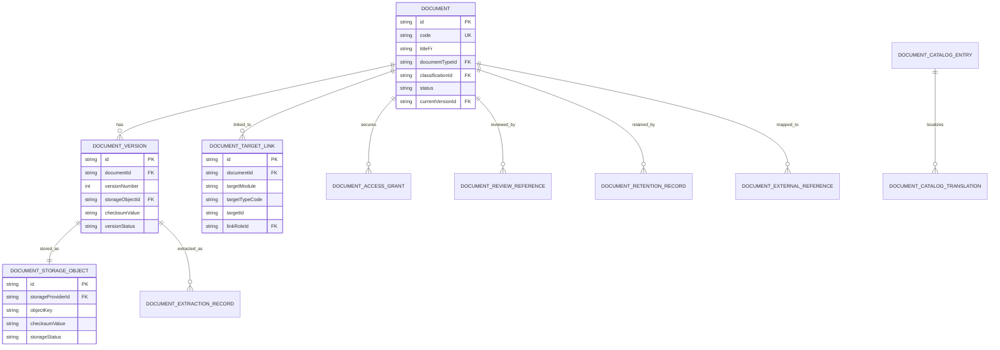

# Hidra Documents Module — Data Definition Document

```text
Document code : HIDRA-DOCS-DDD
Module        : documents
Package       : dz.sh.hidra.modules.documents
Product       : Hidra - Hydrocarbon Intelligence for Data, Risk, and Analytics
Owner         : Sonatrach / TRC : Digitalization Initiative
Author        : Abir MEDJERAB
CreatedOn     : 2026-06-11
Status        : Target data definition
Source level  : Target architecture; no implemented Java module found in connected repository search
```

---

## 1. Purpose

The `documents` module manages controlled operational document metadata, document versions, storage references, document links to business objects, classification, retention, access grants, and lifecycle state.

It answers:

```text
Which document exists?
What business object is it attached to?
Which version is current?
Where is the file stored?
Who uploaded it?
Who can access it?
Is it approved, obsolete, archived, or retained?
Can the document be referenced by incidents, HSE, assets, custody, workflow, audit, and reporting?
```

The module is not a file server and not an audit ledger. It is the business document registry and metadata owner for Hidra.

---

## 2. Source-of-truth precedence

For this document, the source precedence is:

1. Hidra modular architecture and bounded-context rules.
2. Existing module data-definition work: incidents, HSE, asset management, custody, audit, workflow, integration.
3. Target architecture for a dedicated `documents` module.

Repository searches did not reveal an implemented `documents` Java module, so the model below is a target DDD and future implementation reference.

---

## 3. Module ownership

### 3.1 Documents owns

```text
Document metadata
Document storage object reference
Document versioning
Document classification
Document links to target business objects
Document lifecycle state
Document access grants
Document retention metadata
Document review/approval reference
Document extraction metadata
Document file checksum metadata
Document external reference metadata
```

### 3.2 Documents does not own

```text
Audit event ledger
Workflow task routing
Incident lifecycle
HSE case lifecycle
Asset maintenance lifecycle
Custody transfer calculation
Report generation logic
Notification delivery
External storage engine internals
Identity users, roles, or permissions
Business objects to which documents are attached
```

### 3.3 Core boundary rule

```text
Documents owns file metadata and business attachment.
Audit owns evidence of who did what and when.
Workflow owns approval/routing.
Business modules own the business object being documented.
Storage infrastructure owns the binary object.
```

---

## 4. Canonical package

```text
dz.sh.hidra.modules.documents
  api
    rest
      controller
      request
      response
      mapper
  application
    command
    query
    dto
    port
      in
      out
    service
    mapper
  domain
    model
    value
    event
    policy
    service
    exception
  infrastructure
    persistence
      entity
      repository
      mapper
      adapter
    storage
    integration
    configuration
```

Forbidden package names inside the module:

```text
shared
common
core
utils
helper
helpers
misc
```

---

## 5. Main aggregate model

```text
Document
  -> DocumentVersion
  -> DocumentStorageObject
  -> DocumentTargetLink
  -> DocumentAccessGrant
  -> DocumentReviewReference
  -> DocumentRetentionRecord
  -> DocumentExtractionRecord
  -> DocumentExternalReference

DocumentCatalogEntry
  -> DocumentCatalogTranslation
```

Recommended aggregate roots:

```text
Document
DocumentCatalogEntry
```

---

## 6. Entity definitions

## 6.1 Document

Business meaning: stable business document identity independent from file versions.

Suggested table:

```text
hidra_documents_document
```

| Field | Type | Required | Description |
|---|---:|:---:|---|
| id | varchar(80) | yes | Stable document identifier. |
| code | varchar(120) | yes | Unique document business code. |
| titleAr | varchar(240) | no | Arabic title. |
| titleFr | varchar(240) | yes | French title. |
| titleEn | varchar(240) | no | English title. |
| documentTypeId | varchar(80) | yes | Catalog reference: certificate, procedure, drawing, report, permit, photo, attachment, contract, etc. |
| documentCategoryId | varchar(80) | no | Catalog reference for business category. |
| classificationId | varchar(80) | yes | Catalog reference: PUBLIC, INTERNAL, CONFIDENTIAL, RESTRICTED, SAFETY_CRITICAL, etc. |
| confidentialityLevel | integer | yes | Numeric confidentiality ordering for policy checks. |
| status | varchar(40) | yes | DRAFT, ACTIVE, UNDER_REVIEW, APPROVED, OBSOLETE, ARCHIVED, DELETED_LOGICAL. |
| currentVersionId | varchar(80) | no | Current approved or active version. |
| ownerModule | varchar(80) | no | Optional owning business context if one module is primary owner. |
| ownerTargetTypeCode | varchar(80) | no | Optional owner business object type. |
| ownerTargetId | varchar(120) | no | Optional owner business object id. |
| ownerTargetCodeSnapshot | varchar(120) | no | Snapshot of owner target code. |
| ownerTargetLabelSnapshot | varchar(240) | no | Snapshot of owner target label. |
| createdByActorId | varchar(80) | yes | Actor who registered the document. |
| createdByDisplayNameSnapshot | varchar(160) | yes | Actor display-name snapshot. |
| createdAt | instant | yes | Creation timestamp. |
| updatedAt | instant | yes | Last update timestamp. |
| archivedAt | instant | no | Archive timestamp. |

Rules:

```text
Document.code must be unique.
Document.currentVersionId must refer to a version of the same document.
Approved/archived documents must not be physically deleted through business APIs.
Logical deletion must preserve auditability and storage retention policy.
```

---

## 6.2 DocumentVersion

Business meaning: immutable version metadata for a document file/content revision.

Suggested table:

```text
hidra_documents_document_version
```

| Field | Type | Required | Description |
|---|---:|:---:|---|
| id | varchar(80) | yes | Stable version identifier. |
| documentId | varchar(80) | yes | Parent document id. |
| versionNumber | integer | yes | Version number starting at 1. |
| versionLabel | varchar(80) | no | Optional business version label, such as `Rev A`, `Rev 02`, `As-built`. |
| titleAr | varchar(240) | no | Version-specific Arabic title. |
| titleFr | varchar(240) | no | Version-specific French title. |
| titleEn | varchar(240) | no | Version-specific English title. |
| description | varchar(1000) | no | Version description. |
| storageObjectId | varchar(80) | yes | File/storage reference. |
| mimeType | varchar(120) | yes | MIME type snapshot. |
| originalFilename | varchar(255) | yes | Original uploaded file name. |
| fileExtension | varchar(20) | no | Extension snapshot. |
| fileSizeBytes | bigint | yes | File size in bytes. |
| checksumAlgorithm | varchar(40) | yes | SHA-256 recommended. |
| checksumValue | varchar(160) | yes | File checksum. |
| languageCode | varchar(10) | no | Main document language. |
| documentDate | date | no | Business document date. |
| effectiveFrom | date | no | Version effective start. |
| effectiveTo | date | no | Version effective end. |
| versionStatus | varchar(40) | yes | DRAFT, SUBMITTED, APPROVED, REJECTED, CURRENT, SUPERSEDED, ARCHIVED. |
| uploadedByActorId | varchar(80) | yes | Uploading actor id. |
| uploadedByDisplayNameSnapshot | varchar(160) | yes | Actor display snapshot. |
| uploadedAt | instant | yes | Upload timestamp. |
| approvedByWorkflowInstanceId | varchar(80) | no | Workflow reference if version approval is required. |
| approvedAt | instant | no | Approval timestamp. |
| supersededByVersionId | varchar(80) | no | Version that supersedes this version. |

Rules:

```text
Version numbers must be unique per document.
Approved/current versions are immutable.
Changing binary content creates a new DocumentVersion.
Superseding a current version must preserve previous version history.
Checksum is required for evidence and integrity checks.
```

---

## 6.3 DocumentStorageObject

Business meaning: pointer to the physical binary object in a storage backend.

Suggested table:

```text
hidra_documents_storage_object
```

| Field | Type | Required | Description |
|---|---:|:---:|---|
| id | varchar(80) | yes | Storage object identifier. |
| storageProviderId | varchar(80) | yes | Catalog/provider reference: LOCAL, S3, MINIO, SHAREPOINT, DMS, ARCHIVE_SYSTEM. |
| bucketOrContainer | varchar(160) | no | Bucket/container name or logical container. |
| objectKey | varchar(500) | yes | Provider-specific object key/path. |
| objectUri | varchar(1000) | no | Optional non-secret URI. |
| encrypted | boolean | yes | Whether object is stored encrypted. |
| encryptionKeyReference | varchar(160) | no | External key reference only; never store key material. |
| contentLengthBytes | bigint | yes | Stored content length. |
| contentType | varchar(120) | yes | Content type. |
| checksumAlgorithm | varchar(40) | yes | Checksum algorithm. |
| checksumValue | varchar(160) | yes | Checksum value. |
| storageStatus | varchar(40) | yes | AVAILABLE, QUARANTINED, ARCHIVED, MISSING, DELETED_LOGICAL. |
| createdAt | instant | yes | Creation timestamp. |
| verifiedAt | instant | no | Last integrity verification timestamp. |

Rules:

```text
StorageObject does not expose secret credentials.
StorageObject.objectKey must not contain credentials or signed URLs.
Binary file content is outside the relational business model.
```

---

## 6.4 DocumentTargetLink

Business meaning: links a document to one or more business objects without importing their domain models.

Suggested table:

```text
hidra_documents_target_link
```

| Field | Type | Required | Description |
|---|---:|:---:|---|
| id | varchar(80) | yes | Link identifier. |
| documentId | varchar(80) | yes | Linked document. |
| documentVersionId | varchar(80) | no | Optional version-specific link. If null, link applies to document in general. |
| targetModule | varchar(80) | yes | Module name, e.g. topology, telemetry, incidents, assets, hse, custody. |
| targetTypeCode | varchar(80) | yes | Target object type code. |
| targetId | varchar(120) | yes | Target object id. |
| targetCodeSnapshot | varchar(120) | no | Snapshot of business code. |
| targetLabelSnapshot | varchar(240) | no | Snapshot of business label. |
| linkRoleId | varchar(80) | yes | Catalog reference: EVIDENCE, ATTACHMENT, PROCEDURE, CERTIFICATE, PHOTO, CONTRACT, DRAWING, MANUAL, APPROVAL_SUPPORT. |
| primaryLink | boolean | yes | Whether this is the main document for the target. |
| linkedByActorId | varchar(80) | yes | Actor who linked document. |
| linkedAt | instant | yes | Link timestamp. |
| unlinkedAt | instant | no | Unlink timestamp. |
| active | boolean | yes | Active flag. |

Rules:

```text
DocumentTargetLink must use neutral target references.
Documents module must not import target module domain or JPA classes.
A document may be linked to multiple targets.
A business module may hold only document references, not document persistence objects.
```

---

## 6.5 DocumentAccessGrant

Business meaning: document-specific access metadata when base authorization is not enough.

Suggested table:

```text
hidra_documents_access_grant
```

| Field | Type | Required | Description |
|---|---:|:---:|---|
| id | varchar(80) | yes | Access grant identifier. |
| documentId | varchar(80) | yes | Document id. |
| documentVersionId | varchar(80) | no | Optional version-specific grant. |
| principalType | varchar(40) | yes | ACTOR, USER, GROUP, ROLE, ORGANIZATION_UNIT. |
| principalId | varchar(120) | yes | Principal reference id/code. |
| principalLabelSnapshot | varchar(160) | no | Label snapshot. |
| accessLevel | varchar(40) | yes | READ, DOWNLOAD, UPDATE_METADATA, UPLOAD_VERSION, APPROVE, ARCHIVE, ADMIN. |
| grantedByActorId | varchar(80) | yes | Granting actor. |
| grantedAt | instant | yes | Grant timestamp. |
| validFrom | instant | no | Optional validity start. |
| validTo | instant | no | Optional validity end. |
| revokedAt | instant | no | Revocation timestamp. |
| active | boolean | yes | Active flag. |

Rules:

```text
Identity owns users/groups/roles.
Documents stores only principal references and snapshots.
Sensitive documents should require both permission policy and classification policy.
```

---

## 6.6 DocumentReviewReference

Business meaning: workflow review/approval reference for a document or document version.

Suggested table:

```text
hidra_documents_review_reference
```

| Field | Type | Required | Description |
|---|---:|:---:|---|
| id | varchar(80) | yes | Review reference identifier. |
| documentId | varchar(80) | yes | Document id. |
| documentVersionId | varchar(80) | no | Version under review. |
| workflowInstanceId | varchar(80) | yes | Workflow instance reference. |
| reviewTypeId | varchar(80) | yes | Catalog reference: TECHNICAL_REVIEW, HSE_REVIEW, LEGAL_REVIEW, CUSTODY_APPROVAL, ARCHIVE_APPROVAL. |
| reviewStatus | varchar(40) | yes | REQUESTED, IN_PROGRESS, APPROVED, REJECTED, CANCELLED. |
| requestedByActorId | varchar(80) | yes | Requesting actor. |
| requestedAt | instant | yes | Request timestamp. |
| completedAt | instant | no | Completion timestamp. |
| decisionReasonId | varchar(80) | no | Catalog reason reference. |
| decisionComment | varchar(2000) | no | Decision comment. |

Rules:

```text
Workflow owns task routing and decisions.
Documents stores review references and document state consequences.
```

---

## 6.7 DocumentRetentionRecord

Business meaning: retention and archival control for documents.

Suggested table:

```text
hidra_documents_retention_record
```

| Field | Type | Required | Description |
|---|---:|:---:|---|
| id | varchar(80) | yes | Retention record id. |
| documentId | varchar(80) | yes | Document id. |
| retentionPolicyId | varchar(80) | yes | Catalog/policy reference. |
| retentionClassId | varchar(80) | yes | Catalog reference. |
| retainUntil | date | no | Retention end date. |
| legalHold | boolean | yes | Whether legal hold prevents deletion/archive changes. |
| legalHoldReason | varchar(500) | no | Legal hold reason. |
| archivedAt | instant | no | Archive timestamp. |
| archiveStorageObjectId | varchar(80) | no | Storage object after archive migration. |
| disposalAllowedFrom | date | no | Earliest disposal date. |
| disposedAt | instant | no | Disposal timestamp if allowed. |
| disposedByActorId | varchar(80) | no | Actor who executed disposal. |

Rules:

```text
Legal hold blocks disposal.
Retention policy changes must be auditable.
Physical deletion requires explicit retention and audit policy approval.
```

---

## 6.8 DocumentExtractionRecord

Business meaning: OCR/text/metadata extraction record for searchable document content.

Suggested table:

```text
hidra_documents_extraction_record
```

| Field | Type | Required | Description |
|---|---:|:---:|---|
| id | varchar(80) | yes | Extraction record id. |
| documentVersionId | varchar(80) | yes | Version extracted. |
| extractionType | varchar(40) | yes | OCR, TEXT, METADATA, THUMBNAIL, CLASSIFICATION. |
| extractionStatus | varchar(40) | yes | PENDING, RUNNING, COMPLETED, FAILED, SKIPPED. |
| extractedTextRef | varchar(500) | no | Reference to extracted text object or index id. |
| extractedMetadataJson | json/text | no | Non-sensitive metadata result. |
| confidenceScore | decimal | no | Extraction confidence. |
| languageDetected | varchar(10) | no | Detected language. |
| startedAt | instant | no | Start timestamp. |
| completedAt | instant | no | Completion timestamp. |
| failureReason | varchar(1000) | no | Failure reason. |

Rules:

```text
Extraction is derived and rebuildable.
Extraction does not become the legal document of record.
Sensitive content must follow classification and masking policy.
```

---

## 6.9 DocumentExternalReference

Business meaning: reference to an external DMS/archive/file system object.

Suggested table:

```text
hidra_documents_external_reference
```

| Field | Type | Required | Description |
|---|---:|:---:|---|
| id | varchar(80) | yes | External reference id. |
| documentId | varchar(80) | yes | Document id. |
| documentVersionId | varchar(80) | no | Optional version id. |
| externalSystemId | varchar(80) | yes | External system reference, owned by integration. |
| externalObjectType | varchar(80) | yes | External object type. |
| externalObjectId | varchar(160) | yes | External id. |
| externalObjectCode | varchar(160) | no | External code. |
| externalUrlReference | varchar(1000) | no | Non-secret URL/reference. |
| syncStatus | varchar(40) | yes | NOT_SYNCED, SYNCED, FAILED, CONFLICT, DEPRECATED. |
| lastSyncedAt | instant | no | Last sync timestamp. |

Rules:

```text
Integration owns synchronization jobs.
Documents owns the local document business identity and external reference metadata.
```

---

## 6.10 DocumentCatalogEntry

Business meaning: controlled vocabulary for document type, category, classification, link role, review type, retention class, storage provider, etc.

Suggested table:

```text
hidra_documents_catalog_entry
```

| Field | Type | Required | Description |
|---|---:|:---:|---|
| id | varchar(80) | yes | Catalog entry identifier. |
| catalogName | varchar(80) | yes | Catalog name. |
| code | varchar(120) | yes | Code unique within catalog. |
| active | boolean | yes | Active flag. |
| sortOrder | integer | yes | Display order. |
| systemDefined | boolean | yes | Whether entry is system-defined. |
| createdAt | instant | yes | Creation timestamp. |
| updatedAt | instant | yes | Update timestamp. |

Recommended catalog names:

```text
DOCUMENT_TYPE
DOCUMENT_CATEGORY
DOCUMENT_CLASSIFICATION
DOCUMENT_STATUS_REASON
DOCUMENT_LINK_ROLE
DOCUMENT_REVIEW_TYPE
DOCUMENT_RETENTION_CLASS
DOCUMENT_STORAGE_PROVIDER
DOCUMENT_ACCESS_LEVEL
DOCUMENT_EXTRACTION_TYPE
DOCUMENT_EXTERNAL_OBJECT_TYPE
```

---

## 6.11 DocumentCatalogTranslation

Suggested table:

```text
hidra_documents_catalog_translation
```

| Field | Type | Required | Description |
|---|---:|:---:|---|
| id | varchar(80) | yes | Translation id. |
| catalogEntryId | varchar(80) | yes | Catalog entry id. |
| locale | varchar(10) | yes | `ar`, `fr`, `en`. |
| name | varchar(160) | yes | Localized name. |
| description | varchar(500) | no | Localized description. |
| createdAt | instant | yes | Creation timestamp. |
| updatedAt | instant | yes | Update timestamp. |

Rules:

```text
French labels are mandatory for operational UI.
Arabic and English are recommended for enterprise usability.
Do not implement user-facing document classifications as Java enums.
```

---

## 7. Relationship model



---

## 8. Cross-module reference rules

### 8.1 Incidents

Incidents may reference documents through:

```text
IncidentAttachmentReference.documentId
IncidentEvidenceLink.documentVersionId
```

Documents does not own incident timeline, impact, response, root cause, or closure.

### 8.2 HSE

HSE may attach permits, inspections, photos, gas tests, compliance evidence, and closure proof.

Documents does not own HSE case lifecycle, permit controls, corrective actions, or compliance decisions.

### 8.3 Asset Management

Assets may reference manuals, datasheets, warranty files, inspection reports, spare-part catalogs, and maintenance evidence.

Documents does not own maintenance execution or asset lifecycle.

### 8.4 Network Integrity

Integrity may reference pigging reports, defect sheets, CP survey files, inspection PDFs, and coating photos.

Documents does not own defect assessment or remaining-life decisions.

### 8.5 Custody Transfer

Custody may reference certificates, tickets, calibration evidence, quality certificates, and signed transfer documents.

Documents does not own custody calculations or accepted official quantities.

### 8.6 Workflow

Workflow may approve document versions or archive/disposal actions.

Documents stores workflow references; Workflow owns task routing and action history.

### 8.7 Audit

Audit records who uploaded, changed, linked, approved, archived, accessed, downloaded, or deleted document metadata.

Documents does not replace audit.

---

## 9. Lifecycle rules

Recommended document lifecycle:

```text
DRAFT
  -> ACTIVE
  -> UNDER_REVIEW
  -> APPROVED
  -> OBSOLETE
  -> ARCHIVED
```

Exceptional states:

```text
REJECTED
QUARANTINED
DELETED_LOGICAL
```

Version lifecycle:

```text
DRAFT
  -> SUBMITTED
  -> APPROVED
  -> CURRENT
  -> SUPERSEDED
  -> ARCHIVED
```

Rules:

```text
A document may have many versions but only one current version.
Changing the binary file creates a new version.
Metadata corrections may be allowed without creating a new version if the binary is unchanged.
Approved/current versions are immutable except for retention/archive metadata.
Obsolete versions remain searchable unless retention policy says otherwise.
```

---

## 10. Security and confidentiality rules

```text
Document classification must be checked before download.
Document access grants are additive constraints, not a replacement for identity authorization.
Restricted documents require audit access records.
Signed URLs must not be stored permanently.
Secrets, passwords, encryption keys, tokens, and private certificates must not be stored in document metadata.
```

Recommended policy decisions:

```text
CanViewDocument
CanDownloadDocument
CanUploadDocumentVersion
CanApproveDocumentVersion
CanArchiveDocument
CanDisposeDocument
CanGrantDocumentAccess
```

---

## 11. Storage rules

```text
Database stores metadata, not binary content.
Binary content goes to object storage, DMS, archive system, or controlled file storage.
Every stored object requires checksum.
Every download/access of restricted documents should generate an audit event.
Storage object keys must be opaque and must not expose business secrets.
```

---

## 12. Recommended indexes and constraints

```sql
-- Document identity
CREATE UNIQUE INDEX uk_hidra_documents_document_code
    ON hidra_documents_document (code);

CREATE INDEX idx_hidra_documents_document_type_status
    ON hidra_documents_document (document_type_id, status);

CREATE INDEX idx_hidra_documents_document_owner_target
    ON hidra_documents_document (owner_module, owner_target_type_code, owner_target_id);

-- Versions
CREATE UNIQUE INDEX uk_hidra_documents_version_document_number
    ON hidra_documents_document_version (document_id, version_number);

CREATE INDEX idx_hidra_documents_version_status
    ON hidra_documents_document_version (version_status);

CREATE INDEX idx_hidra_documents_version_checksum
    ON hidra_documents_document_version (checksum_algorithm, checksum_value);

-- Target links
CREATE INDEX idx_hidra_documents_target_link_target
    ON hidra_documents_target_link (target_module, target_type_code, target_id);

CREATE INDEX idx_hidra_documents_target_link_document
    ON hidra_documents_target_link (document_id);

-- Access grants
CREATE INDEX idx_hidra_documents_access_grant_principal
    ON hidra_documents_access_grant (principal_type, principal_id, active);

-- Catalogs
CREATE UNIQUE INDEX uk_hidra_documents_catalog_name_code
    ON hidra_documents_catalog_entry (catalog_name, code);

CREATE UNIQUE INDEX uk_hidra_documents_catalog_translation_locale
    ON hidra_documents_catalog_translation (catalog_entry_id, locale);
```

---

## 13. Domain events

Recommended events:

```text
DocumentRegisteredEvent
DocumentMetadataUpdatedEvent
DocumentVersionUploadedEvent
DocumentVersionSubmittedEvent
DocumentVersionApprovedEvent
DocumentVersionRejectedEvent
DocumentLinkedToTargetEvent
DocumentUnlinkedFromTargetEvent
DocumentAccessGrantedEvent
DocumentAccessRevokedEvent
DocumentArchivedEvent
DocumentRetentionHoldAppliedEvent
DocumentRetentionHoldReleasedEvent
DocumentDisposedEvent
DocumentStorageIntegrityFailedEvent
DocumentDownloadedEvent
DocumentViewedEvent
```

Events should include:

```text
eventId
correlationId
requestId
actor snapshot
documentId
documentVersionId when relevant
target reference when relevant
action timestamp
reason/comment when relevant
```

---

## 14. Application ports

### 14.1 Inbound ports

```text
RegisterDocumentUseCase
UploadDocumentVersionUseCase
UpdateDocumentMetadataUseCase
LinkDocumentToTargetUseCase
UnlinkDocumentFromTargetUseCase
GrantDocumentAccessUseCase
RevokeDocumentAccessUseCase
SubmitDocumentVersionForReviewUseCase
ApproveDocumentVersionUseCase
ArchiveDocumentUseCase
ApplyRetentionHoldUseCase
SearchDocumentsUseCase
DownloadDocumentUseCase
```

### 14.2 Outbound ports

```text
DocumentStoragePort
DocumentVirusScanPort
DocumentPreviewPort
DocumentTextExtractionPort
DocumentWorkflowPort
DocumentAuditPort
DocumentAuthorizationPort
DocumentTargetLookupPort
DocumentIntegrationPort
```

---

## 15. REST surface draft

```text
/api/v1/documents
/api/v1/documents/{documentId}
/api/v1/documents/{documentId}/versions
/api/v1/documents/{documentId}/versions/{versionId}
/api/v1/documents/{documentId}/versions/{versionId}/download
/api/v1/documents/{documentId}/links
/api/v1/documents/targets/{targetModule}/{targetTypeCode}/{targetId}
/api/v1/documents/{documentId}/access-grants
/api/v1/documents/{documentId}/retention
/api/v1/documents/{documentId}/reviews
/api/v1/documents/catalogs
```

Upload endpoint should use multipart handling in the API layer and pass metadata to the application layer. Domain logic must never depend on web/multipart types.

---

## 16. Decision checklist

Use `documents` if the concern is:

```text
file metadata
file version
file checksum
file storage reference
document classification
document retention
document-target attachment
document access grant
document extraction/index metadata
```

Do not use `documents` if the concern is:

```text
who approved a workflow task -> workflow
audit ledger -> audit
incident response -> incidents
HSE consequence -> hse
asset maintenance work order -> assets
custody quantity/ticket calculation -> custody
report rendering/export package -> reporting
external sync job -> integration
```

---

## 17. Implementation recommendation

Recommended first implementation slice:

```text
DOC-001 package skeleton
DOC-002 catalog tables
DOC-003 Document + DocumentVersion + DocumentStorageObject
DOC-004 DocumentTargetLink
DOC-005 storage port with local/minio placeholder adapter
DOC-006 basic upload/download API
DOC-007 access policy integration
DOC-008 audit events for upload/download/link/archive
DOC-009 workflow reference for version approval
DOC-010 retention metadata
```

Do not start with OCR, previews, or advanced DMS integration. Start with trusted document identity, versioning, checksum, storage reference, and target links.

---

## 18. Final ownership statement

```text
Documents is the controlled registry of operational files and document metadata.
It gives business modules reliable document references.
It does not become the owner of the business event, decision, calculation, incident, asset, custody transfer, or audit evidence.
```
