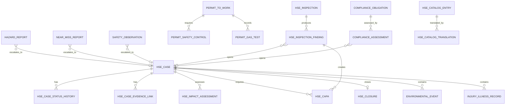

# Hidra HSE Management Module — Data Definition Document

```text
Document code : HIDRA-HSE-DATA-DEFINITION
Module        : hse
Package       : dz.sh.hidra.modules.hse
Product       : Hidra - Hydrocarbon Intelligence for Data, Risk, and Analytics
Author        : Abir MEDJERAB
CreatedOn     : 2026-06-11
Status        : Target DDD / Not yet repository-implemented
Evidence      : Architecture-aligned target design; no implemented HSE Java module found in repository search
```

---

## 1. Purpose

The **HSE Management** module manages Health, Safety, and Environment consequences, controls, compliance cases, permits, inspections, observations, corrective actions, and evidence.

It answers:

```text
What HSE event or condition was observed?
Where did it happen?
Who reported it?
What safety or environmental consequence exists?
What controls are required?
What corrective/preventive actions were assigned?
Was the case verified and closed?
What evidence supports compliance and closure?
```

HSE is not the owner of the operational pipeline incident lifecycle. Incident Management owns operational response from detection to resolution. HSE owns HSE classification, safety/environment consequences, regulatory/compliance evidence, corrective actions, permits, inspections, and HSE closure requirements.

---

## 2. Source-of-truth position

Repository searches did not reveal an implemented `hse` Java module or HSE persistence baseline. Therefore this document is a **target data definition**.

Design order:

```text
1. Existing Hidra module boundaries
2. Incident Management DDD boundary
3. Workflow DDD boundary
4. Audit/Platform evidence model
5. HSE target domain design
```

Important surrounding rules:

```text
Telemetry owns operational readings.
Monitoring owns deviation detection.
Alarm Management owns formal alarm lifecycle.
Leak Detection owns leak suspicion and localization.
Incident Management owns operational response lifecycle.
HSE Management owns health, safety, environmental, and compliance consequences.
Risk owns enterprise risk scoring.
Audit owns immutable evidence trail.
Workflow owns approval, routing, delegation, and escalation process.
```

---

## 3. Module ownership

### 3.1 HSE owns

```text
HSE cases
HSE observations
hazard reports
near-miss reports
safety events
environmental events
spills/releases/emissions event records
permit-to-work records
isolation/safety control requirements
HSE inspections
inspection findings
corrective and preventive actions (CAPA)
HSE impact assessments
injury/illness classification records
environmental consequence records
regulatory/compliance obligations
compliance assessments
emergency drills
HSE evidence links
HSE documents references
HSE catalogs and multilingual labels
```

### 3.2 HSE references but does not own

```text
incident reference
alarm reference
leak detection case reference
monitoring evaluation reference
telemetry reading reference
topology asset reference
asset/work-order reference
employee/person reference
organization unit reference
workflow instance reference
audit event reference
document reference
risk signal/reference
administrative locality reference
```

### 3.3 HSE does not own

```text
telemetry readings
monitoring rules
alarm lifecycle
leak localization algorithms
incident operational response lifecycle
physical topology
maintainable asset lifecycle
maintenance work orders
identity users, roles, permissions, or credentials
organization units or employee master records
risk scoring engine
audit storage
notification delivery
SCADA/OT actuation
regulatory-law master encyclopedia outside system scope
```

---

## 4. Bounded-context rule

The central rule:

```text
Incident Management says: what operational problem happened and how was it handled?
HSE Management says: what health, safety, environmental, and compliance consequences exist?
```

An operational incident can create one or more HSE cases.

Example:

```text
Incident = pipeline leak response lifecycle
HSE Case = environmental spill consequence + safety exposure + regulatory follow-up
Leak Detection Case = suspected leak detection and localization evidence
Alarm = formal alarm lifecycle from abnormal condition
```

Do not merge these records into one table.

---

## 5. Core aggregate model

```text
HseCase
  -> HseCaseStatusHistory
  -> HseCaseEvidenceLink
  -> HseImpactAssessment
  -> HseCorrectivePreventiveAction
  -> HseClosure

HazardReport
NearMissReport
SafetyObservation
EnvironmentalEvent
PermitToWork
HseInspection
EmergencyDrill
ComplianceObligation
ComplianceAssessment
HseCatalogEntry
HseCatalogTranslation
```

Recommended aggregate roots:

```text
HseCase
PermitToWork
HseInspection
ComplianceObligation
EmergencyDrill
```

---

## 6. Entity definitions

## 6.1 HseCase

**Table:** `hidra_hse_case`

**Purpose:** Main HSE case record for safety, health, environmental, or compliance follow-up.

| Field | Type | Required | Description |
|---|---:|---:|---|
| id | HseCaseId/String(80) | yes | Stable HSE case identifier. |
| caseNumber | String(80) | yes | Human/business case number. |
| title | String(240) | yes | Case title. |
| description | Text | no | Initial description. |
| caseTypeId | CatalogRef | yes | HSE case type: SAFETY, HEALTH, ENVIRONMENT, COMPLIANCE, MIXED. |
| classificationId | CatalogRef | yes | Controlled HSE classification. |
| severityId | CatalogRef | yes | HSE severity classification. |
| status | HseCaseStatus | yes | DRAFT, OPEN, UNDER_INVESTIGATION, ACTION_REQUIRED, VERIFIED, CLOSED, CANCELLED. |
| sourceType | String(80) | yes | INCIDENT, ALARM, LEAK_CASE, OBSERVATION, INSPECTION, PERMIT, MANUAL, COMPLIANCE. |
| sourceReferenceId | String(120) | no | Source record identifier. |
| incidentId | ExternalRef | no | Incident reference if created from incident. |
| alarmId | ExternalRef | no | Alarm reference if created from alarm. |
| leakDetectionCaseId | ExternalRef | no | Leak detection case reference if relevant. |
| topologyAssetTypeCode | String(80) | no | Referenced topology asset type. |
| topologyAssetId | String(120) | no | Referenced topology asset ID. |
| topologyAssetCodeSnapshot | String(120) | no | Snapshot for audit/readability. |
| topologyAssetNameSnapshot | String(240) | no | Snapshot for audit/readability. |
| administrativeLocalityId | ExternalRef | no | Location locality if not tied to topology asset. District and state are derived through locality. |
| locationDescriptionAr | String(500) | no | Free description in Arabic for practical site detail, not administrative hierarchy. |
| locationDescriptionLt | String(500) | no | Free description in Latin/French for practical site detail. |
| reportedByActorId | ExternalRef | yes | Actor/user reference. |
| reportedByDisplayNameSnapshot | String(160) | yes | Reporter display name snapshot. |
| reportedByOrganizationUnitId | ExternalRef | no | Reporting organization unit reference. |
| reportedAt | Instant | yes | Report timestamp. |
| occurredAt | Instant | no | Event occurrence timestamp if known. |
| detectedAt | Instant | no | Detection timestamp if different from occurredAt. |
| responsibleOrganizationUnitId | ExternalRef | no | Responsible organization unit. |
| ownerActorId | ExternalRef | no | Case owner actor. |
| workflowInstanceId | ExternalRef | no | Workflow process reference. |
| correlationId | String(120) | no | Cross-module correlation ID. |
| createdAt | Instant | yes | Creation timestamp. |
| updatedAt | Instant | yes | Last update timestamp. |

### Rules

```text
caseNumber must be unique.
A case must have either sourceReferenceId, topologyAssetId, administrativeLocalityId, or location description.
Closed cases require HseClosure.
Cancelled cases require a reason.
HSE case status changes must append HseCaseStatusHistory.
```

---

## 6.2 HseCaseStatusHistory

**Table:** `hidra_hse_case_status_history`

| Field | Type | Required | Description |
|---|---:|---:|---|
| id | String(80) | yes | Status history ID. |
| hseCaseId | FK | yes | Parent HSE case. |
| fromStatus | String(40) | no | Previous status. |
| toStatus | String(40) | yes | New status. |
| reasonId | CatalogRef | no | Reason catalog reference. |
| commentText | String(2000) | no | Explanation. |
| changedByActorId | ExternalRef | yes | Actor who changed status. |
| changedByDisplayNameSnapshot | String(160) | yes | Actor snapshot. |
| changedAt | Instant | yes | Change timestamp. |

### Rule

```text
Status history is append-only.
```

---

## 6.3 HseCaseEvidenceLink

**Table:** `hidra_hse_case_evidence_link`

| Field | Type | Required | Description |
|---|---:|---:|---|
| id | String(80) | yes | Evidence link ID. |
| hseCaseId | FK | yes | Parent HSE case. |
| evidenceTypeId | CatalogRef | yes | PHOTO, DOCUMENT, TELEMETRY_READING, ALARM, INCIDENT, LEAK_CASE, INSPECTION_FINDING, WORK_ORDER, AUDIT_EVENT. |
| referenceModule | String(80) | yes | Module owning evidence. |
| referenceType | String(80) | yes | Referenced object type. |
| referenceId | String(120) | yes | Referenced object ID. |
| referenceCodeSnapshot | String(120) | no | Snapshot. |
| referenceLabelSnapshot | String(240) | no | Snapshot. |
| addedByActorId | ExternalRef | yes | Actor who linked evidence. |
| addedAt | Instant | yes | Link timestamp. |
| commentText | String(1000) | no | Optional evidence comment. |

### Rule

```text
HSE links to evidence; it does not copy the evidence payload unless explicitly required for legal retention.
```

---

## 6.4 HazardReport

**Table:** `hidra_hse_hazard_report`

**Purpose:** Reported unsafe condition or hazard before harm occurs.

| Field | Type | Required | Description |
|---|---:|---:|---|
| id | String(80) | yes | Hazard report ID. |
| reportNumber | String(80) | yes | Human/business number. |
| hseCaseId | FK | no | Linked HSE case if escalated. |
| hazardTypeId | CatalogRef | yes | Hazard type. |
| hazardCategoryId | CatalogRef | no | Category/subtype. |
| description | Text | yes | Hazard description. |
| immediateRiskLevelId | CatalogRef | yes | Initial HSE risk level. |
| recommendedControl | Text | no | Suggested control. |
| topologyAssetTypeCode | String(80) | no | Optional topology context. |
| topologyAssetId | String(120) | no | Optional topology asset reference. |
| administrativeLocalityId | ExternalRef | no | Optional admin locality. |
| reportedByActorId | ExternalRef | yes | Reporter actor. |
| reportedAt | Instant | yes | Report timestamp. |
| status | String(40) | yes | REPORTED, TRIAGED, CASE_OPENED, DISMISSED, CLOSED. |

### Rules

```text
A high-severity hazard should create or link an HSE case.
Dismissal requires reason and actor snapshot.
```

---

## 6.5 NearMissReport

**Table:** `hidra_hse_near_miss_report`

**Purpose:** Event that could have caused injury, environmental harm, or asset damage but did not.

| Field | Type | Required | Description |
|---|---:|---:|---|
| id | String(80) | yes | Near-miss ID. |
| reportNumber | String(80) | yes | Business number. |
| hseCaseId | FK | no | Linked case if investigation required. |
| nearMissTypeId | CatalogRef | yes | Type. |
| potentialSeverityId | CatalogRef | yes | Potential severity. |
| actualConsequenceId | CatalogRef | no | Usually NONE/MINOR. |
| description | Text | yes | What almost happened. |
| immediateActionTaken | Text | no | Immediate action. |
| reportedByActorId | ExternalRef | yes | Reporter. |
| reportedAt | Instant | yes | Report timestamp. |
| occurredAt | Instant | no | Occurrence timestamp. |
| status | String(40) | yes | REPORTED, UNDER_REVIEW, CASE_OPENED, CLOSED. |

---

## 6.6 SafetyObservation

**Table:** `hidra_hse_safety_observation`

**Purpose:** Behavioral or site safety observation, positive or negative.

| Field | Type | Required | Description |
|---|---:|---:|---|
| id | String(80) | yes | Observation ID. |
| observationNumber | String(80) | yes | Business number. |
| observationTypeId | CatalogRef | yes | SAFE_ACT, UNSAFE_ACT, UNSAFE_CONDITION, GOOD_PRACTICE. |
| categoryId | CatalogRef | no | PPE, LIFTING, CONFINED_SPACE, HOT_WORK, DRIVING, HOUSEKEEPING, etc. |
| description | Text | yes | Observation description. |
| observedAt | Instant | yes | Observation timestamp. |
| observedByActorId | ExternalRef | yes | Observer. |
| observedOrganizationUnitId | ExternalRef | no | Unit/site context. |
| topologyAssetTypeCode | String(80) | no | Optional topology context. |
| topologyAssetId | String(120) | no | Optional topology asset. |
| hseCaseId | FK | no | Linked case if escalated. |
| actionRequired | Boolean | yes | Whether action is required. |
| status | String(40) | yes | RECORDED, ACTION_REQUIRED, CLOSED. |

---

## 6.7 EnvironmentalEvent

**Table:** `hidra_hse_environmental_event`

**Purpose:** Environmental consequence record such as spill, release, emission exceedance, contamination observation, or waste-related event.

| Field | Type | Required | Description |
|---|---:|---:|---|
| id | String(80) | yes | Environmental event ID. |
| eventNumber | String(80) | yes | Business number. |
| hseCaseId | FK | yes | Owning HSE case. |
| environmentalEventTypeId | CatalogRef | yes | SPILL, RELEASE, EMISSION, WASTE, SOIL, WATER, AIR, ODOR, OTHER. |
| substanceId | CatalogRef | no | Substance/product reference; may reference product catalog. |
| estimatedQuantity | Decimal(18,6) | no | Estimated amount. |
| quantityUnitId | ExternalRef | no | Unit reference. |
| affectedMediumId | CatalogRef | no | AIR, WATER, SOIL, GROUNDWATER, VEGETATION, WILDLIFE, COMMUNITY. |
| containmentStatusId | CatalogRef | no | CONTAINED, NOT_CONTAINED, PARTIALLY_CONTAINED, UNKNOWN. |
| cleanupRequired | Boolean | yes | Whether cleanup is required. |
| cleanupCompletedAt | Instant | no | Completion timestamp. |
| regulatoryNotificationRequired | Boolean | yes | Whether notification is required. |
| regulatoryNotificationStatusId | CatalogRef | no | NOT_REQUIRED, PENDING, SENT, ACCEPTED. |
| description | Text | no | Event details. |

### Rules

```text
If regulatoryNotificationRequired = true, notification status must be tracked.
If cleanupRequired = true, at least one CAPA or cleanup action should exist before closure.
```

---

## 6.8 HseImpactAssessment

**Table:** `hidra_hse_impact_assessment`

**Purpose:** Structured HSE consequence assessment for a case.

| Field | Type | Required | Description |
|---|---:|---:|---|
| id | String(80) | yes | Assessment ID. |
| hseCaseId | FK | yes | Parent HSE case. |
| assessmentTypeId | CatalogRef | yes | HEALTH, SAFETY, ENVIRONMENT, COMMUNITY, COMPLIANCE, ASSET_DAMAGE. |
| impactLevelId | CatalogRef | yes | NONE, MINOR, MODERATE, MAJOR, CRITICAL. |
| peopleAffectedCount | Integer | no | Count only; avoid unnecessary personal detail. |
| injuryCount | Integer | no | Number of injuries. |
| lostTimeInjuryCount | Integer | no | Count of LTI. |
| environmentalImpactDescription | Text | no | Environmental impact detail. |
| operationalImpactDescription | Text | no | Operational impact detail. |
| assessedByActorId | ExternalRef | yes | Assessor. |
| assessedAt | Instant | yes | Assessment timestamp. |
| confidenceLevelId | CatalogRef | no | LOW, MEDIUM, HIGH. |

### Privacy rule

```text
Do not store detailed medical records in HSE case tables.
Store classification/counts and references to restricted medical/HR systems if required.
```

---

## 6.9 InjuryIllnessRecord

**Table:** `hidra_hse_injury_illness_record`

**Purpose:** Restricted HSE classification record for work-related injury/illness. It is not a medical record.

| Field | Type | Required | Description |
|---|---:|---:|---|
| id | String(80) | yes | Injury/illness record ID. |
| hseCaseId | FK | yes | Parent HSE case. |
| personReferenceType | String(80) | yes | EMPLOYEE, CONTRACTOR, VISITOR, PUBLIC, UNKNOWN. |
| personReferenceId | String(120) | no | Reference to person master if permitted. |
| personNameSnapshot | String(160) | no | Optional restricted snapshot, subject to privacy rules. |
| organizationUnitId | ExternalRef | no | Internal organization context. |
| employerPartyId | ExternalRef | no | Contractor/employer party reference if available. |
| injuryClassificationId | CatalogRef | yes | FIRST_AID, MEDICAL_TREATMENT, RESTRICTED_WORK, LOST_TIME, FATALITY, ILLNESS. |
| bodyPartId | CatalogRef | no | Controlled body-part category if needed. |
| injuryMechanismId | CatalogRef | no | STRUCK_BY, FALL, BURN, EXPOSURE, etc. |
| workRelated | Boolean | yes | Work-related flag. |
| lostDays | Integer | no | Lost work days if applicable. |
| restrictedDays | Integer | no | Restricted work days if applicable. |
| description | Text | no | Non-medical incident summary. |
| restricted | Boolean | yes | Whether record visibility is restricted. |

### Rules

```text
Detailed diagnosis, treatment notes, and medical files do not belong in the normal HSE domain tables.
If person identity is sensitive, store only anonymized/person-reference data.
```

---

## 6.10 PermitToWork

**Table:** `hidra_hse_permit_to_work`

**Purpose:** HSE-controlled permit for high-risk work execution.

| Field | Type | Required | Description |
|---|---:|---:|---|
| id | String(80) | yes | Permit ID. |
| permitNumber | String(80) | yes | Permit number. |
| permitTypeId | CatalogRef | yes | HOT_WORK, COLD_WORK, CONFINED_SPACE, EXCAVATION, ELECTRICAL, LIFTING, WORK_AT_HEIGHT, SIMOPS, OTHER. |
| title | String(240) | yes | Permit title. |
| description | Text | no | Work description. |
| topologyAssetTypeCode | String(80) | no | Work location topology asset type. |
| topologyAssetId | String(120) | no | Work location topology asset. |
| administrativeLocalityId | ExternalRef | no | Administrative locality for off-network work. |
| requestedByActorId | ExternalRef | yes | Requesting actor. |
| requestedByOrganizationUnitId | ExternalRef | no | Requesting unit. |
| contractorPartyId | ExternalRef | no | Contractor party if applicable. |
| plannedStartAt | Instant | yes | Planned start. |
| plannedEndAt | Instant | yes | Planned end. |
| actualStartAt | Instant | no | Actual start. |
| actualEndAt | Instant | no | Actual end. |
| status | PermitStatus | yes | DRAFT, REQUESTED, APPROVED, ACTIVE, SUSPENDED, EXPIRED, CLOSED, CANCELLED. |
| workflowInstanceId | ExternalRef | no | Approval workflow. |
| createdAt | Instant | yes | Creation timestamp. |
| updatedAt | Instant | yes | Last update. |

### Rules

```text
A permit cannot become ACTIVE before approval.
plannedEndAt must be after plannedStartAt.
Expired permits cannot be used for new work.
Permit approval belongs to Workflow; HSE stores the permit state and references the workflow.
```

---

## 6.11 PermitSafetyControl

**Table:** `hidra_hse_permit_safety_control`

**Purpose:** Required safety controls attached to a permit.

| Field | Type | Required | Description |
|---|---:|---:|---|
| id | String(80) | yes | Control ID. |
| permitToWorkId | FK | yes | Parent permit. |
| controlTypeId | CatalogRef | yes | GAS_TEST, ISOLATION, VENTILATION, FIRE_WATCH, PPE, BARRIER, LOTO, STANDBY_PERSON, TOOLBOX_TALK. |
| description | String(1000) | yes | Control description. |
| required | Boolean | yes | Required flag. |
| verified | Boolean | yes | Whether verified. |
| verifiedByActorId | ExternalRef | no | Verifier. |
| verifiedAt | Instant | no | Verification timestamp. |
| evidenceReferenceId | ExternalRef | no | Evidence/document reference. |

### Rule

```text
Required controls must be verified before permit activation unless explicit override workflow exists.
```

---

## 6.12 PermitGasTest

**Table:** `hidra_hse_permit_gas_test`

**Purpose:** Gas test evidence attached to a permit.

| Field | Type | Required | Description |
|---|---:|---:|---|
| id | String(80) | yes | Gas test ID. |
| permitToWorkId | FK | yes | Parent permit. |
| testTypeId | CatalogRef | yes | O2, LEL, H2S, CO, VOC, OTHER. |
| measuredValue | Decimal(18,6) | yes | Test value. |
| unitId | ExternalRef | yes | Unit reference. |
| acceptable | Boolean | yes | Whether value is acceptable. |
| testedByActorId | ExternalRef | yes | Tester. |
| testedAt | Instant | yes | Test timestamp. |
| instrumentReference | String(120) | no | Instrument/calibration reference. |
| commentText | String(1000) | no | Comment. |

---

## 6.13 HseInspection

**Table:** `hidra_hse_inspection`

**Purpose:** HSE inspection, audit, walkdown, or compliance check.

| Field | Type | Required | Description |
|---|---:|---:|---|
| id | String(80) | yes | Inspection ID. |
| inspectionNumber | String(80) | yes | Business number. |
| inspectionTypeId | CatalogRef | yes | SITE_INSPECTION, SAFETY_AUDIT, ENVIRONMENTAL_INSPECTION, CONTRACTOR_INSPECTION, PERMIT_AUDIT. |
| title | String(240) | yes | Inspection title. |
| scopeDescription | Text | no | Scope. |
| topologyAssetTypeCode | String(80) | no | Asset/site context. |
| topologyAssetId | String(120) | no | Asset reference. |
| administrativeLocalityId | ExternalRef | no | Locality reference if relevant. |
| organizationUnitId | ExternalRef | no | Inspected unit. |
| leadInspectorActorId | ExternalRef | yes | Lead inspector. |
| plannedAt | Instant | no | Planned timestamp. |
| startedAt | Instant | no | Start timestamp. |
| completedAt | Instant | no | Completion timestamp. |
| status | String(40) | yes | PLANNED, IN_PROGRESS, COMPLETED, CANCELLED. |
| resultSummary | Text | no | Summary. |
| createdAt | Instant | yes | Creation timestamp. |
| updatedAt | Instant | yes | Last update. |

---

## 6.14 HseInspectionFinding

**Table:** `hidra_hse_inspection_finding`

| Field | Type | Required | Description |
|---|---:|---:|---|
| id | String(80) | yes | Finding ID. |
| inspectionId | FK | yes | Parent inspection. |
| findingNumber | String(80) | yes | Finding number. |
| findingTypeId | CatalogRef | yes | NON_CONFORMITY, OBSERVATION, GOOD_PRACTICE, IMPROVEMENT, CRITICAL_FINDING. |
| severityId | CatalogRef | yes | Severity. |
| description | Text | yes | Finding description. |
| requirementReference | String(240) | no | Procedure/regulatory/internal requirement reference. |
| hseCaseId | FK | no | Linked HSE case if escalated. |
| actionRequired | Boolean | yes | Whether CAPA required. |
| status | String(40) | yes | OPEN, ACTION_REQUIRED, VERIFIED, CLOSED, DISMISSED. |

---

## 6.15 HseCorrectivePreventiveAction

**Table:** `hidra_hse_capa`

**Purpose:** Corrective/preventive action generated by HSE case, finding, hazard, near-miss, inspection, or compliance gap.

| Field | Type | Required | Description |
|---|---:|---:|---|
| id | String(80) | yes | CAPA ID. |
| actionNumber | String(80) | yes | Business action number. |
| hseCaseId | FK | no | Parent HSE case. |
| inspectionFindingId | FK | no | Parent finding if relevant. |
| sourceType | String(80) | yes | HSE_CASE, FINDING, HAZARD, NEAR_MISS, PERMIT, COMPLIANCE. |
| sourceReferenceId | String(120) | yes | Source ID. |
| actionTypeId | CatalogRef | yes | CORRECTIVE, PREVENTIVE, MITIGATION, CLEANUP, TRAINING, ENGINEERING_CONTROL, ADMIN_CONTROL. |
| description | Text | yes | Action description. |
| assignedActorId | ExternalRef | no | Assigned actor. |
| assignedOrganizationUnitId | ExternalRef | no | Assigned unit. |
| linkedWorkOrderId | ExternalRef | no | Asset work order reference if maintenance execution is required. |
| priorityId | CatalogRef | yes | Priority. |
| dueAt | Instant | no | Due date. |
| status | String(40) | yes | OPEN, ASSIGNED, IN_PROGRESS, COMPLETED, VERIFIED, CLOSED, CANCELLED, OVERDUE. |
| completedAt | Instant | no | Completion timestamp. |
| verifiedByActorId | ExternalRef | no | Verification actor. |
| verifiedAt | Instant | no | Verification timestamp. |
| workflowInstanceId | ExternalRef | no | Workflow reference. |
| createdAt | Instant | yes | Creation timestamp. |
| updatedAt | Instant | yes | Last update. |

### Rules

```text
CAPA can reference a maintenance work order but does not own work-order execution.
Closed CAPA requires completion and verification evidence.
Overdue status may be computed or stored as projection.
```

---

## 6.16 ComplianceObligation

**Table:** `hidra_hse_compliance_obligation`

**Purpose:** Internal or external HSE requirement tracked by Hidra.

| Field | Type | Required | Description |
|---|---:|---:|---|
| id | String(80) | yes | Obligation ID. |
| code | String(120) | yes | Unique obligation code. |
| title | String(240) | yes | Obligation title. |
| obligationTypeId | CatalogRef | yes | REGULATORY, INTERNAL_STANDARD, PERMIT_CONDITION, CONTRACTUAL, OTHER. |
| domainId | CatalogRef | yes | HEALTH, SAFETY, ENVIRONMENT, EMERGENCY, CONTRACTOR. |
| issuingAuthorityReference | String(240) | no | Authority/source reference. |
| requirementText | Text | yes | Requirement summary. |
| effectiveFrom | LocalDate | yes | Start date. |
| effectiveTo | LocalDate | no | End date. |
| active | Boolean | yes | Active flag. |
| ownerOrganizationUnitId | ExternalRef | no | Owner unit. |
| reviewFrequencyId | CatalogRef | no | Review frequency. |
| createdAt | Instant | yes | Creation timestamp. |
| updatedAt | Instant | yes | Last update. |

---

## 6.17 ComplianceAssessment

**Table:** `hidra_hse_compliance_assessment`

| Field | Type | Required | Description |
|---|---:|---:|---|
| id | String(80) | yes | Assessment ID. |
| obligationId | FK | yes | Compliance obligation. |
| assessmentNumber | String(80) | yes | Business number. |
| assessmentPeriodStart | LocalDate | yes | Period start. |
| assessmentPeriodEnd | LocalDate | yes | Period end. |
| assessedScopeType | String(80) | yes | ORGANIZATION_UNIT, TOPOLOGY_ASSET, FACILITY, PROJECT, SYSTEM. |
| assessedScopeId | String(120) | yes | Scope reference. |
| complianceStatusId | CatalogRef | yes | COMPLIANT, PARTIALLY_COMPLIANT, NON_COMPLIANT, NOT_ASSESSED, NOT_APPLICABLE. |
| evidenceSummary | Text | no | Evidence summary. |
| assessorActorId | ExternalRef | yes | Assessor. |
| assessedAt | Instant | yes | Assessment timestamp. |
| hseCaseId | FK | no | Linked case if non-compliance is opened. |
| workflowInstanceId | ExternalRef | no | Approval workflow. |

### Rule

```text
Non-compliant assessments should create an HSE case or CAPA.
```

---

## 6.18 EmergencyDrill

**Table:** `hidra_hse_emergency_drill`

**Purpose:** Planned or actual emergency exercise record.

| Field | Type | Required | Description |
|---|---:|---:|---|
| id | String(80) | yes | Drill ID. |
| drillNumber | String(80) | yes | Drill number. |
| drillTypeId | CatalogRef | yes | FIRE, SPILL_RESPONSE, EVACUATION, GAS_RELEASE, MEDICAL, SECURITY, FULL_SCALE, TABLETOP. |
| title | String(240) | yes | Drill title. |
| scenarioDescription | Text | yes | Scenario. |
| topologyAssetTypeCode | String(80) | no | Optional topology context. |
| topologyAssetId | String(120) | no | Optional topology asset. |
| organizationUnitId | ExternalRef | no | Participating/owning unit. |
| plannedAt | Instant | yes | Planned timestamp. |
| conductedAt | Instant | no | Actual timestamp. |
| status | String(40) | yes | PLANNED, CONDUCTED, CANCELLED, REVIEWED, CLOSED. |
| outcomeSummary | Text | no | Outcome. |
| improvementRequired | Boolean | yes | Whether improvements were identified. |
| createdAt | Instant | yes | Creation timestamp. |
| updatedAt | Instant | yes | Last update. |

---

## 6.19 HseTrainingComplianceRecord

**Table:** `hidra_hse_training_compliance_record`

**Purpose:** Safety training compliance evidence for an employee, contractor, or role requirement. It is not the HR training master system.

| Field | Type | Required | Description |
|---|---:|---:|---|
| id | String(80) | yes | Training compliance record ID. |
| personReferenceType | String(80) | yes | EMPLOYEE, CONTRACTOR, VISITOR. |
| personReferenceId | String(120) | yes | Person reference. |
| organizationUnitId | ExternalRef | no | Unit context. |
| trainingTypeId | CatalogRef | yes | Training type. |
| certificateReference | String(240) | no | Certificate/document reference. |
| completedOn | LocalDate | yes | Completion date. |
| validUntil | LocalDate | no | Expiry date. |
| status | String(40) | yes | VALID, EXPIRED, REVOKED, PENDING_VERIFICATION. |
| evidenceDocumentId | ExternalRef | no | Document reference. |
| verifiedByActorId | ExternalRef | no | Verifier. |
| verifiedAt | Instant | no | Verification timestamp. |

### Rule

```text
HSE stores compliance evidence, not full HR learning management records.
```

---

## 6.20 HseClosure

**Table:** `hidra_hse_closure`

| Field | Type | Required | Description |
|---|---:|---:|---|
| id | String(80) | yes | Closure ID. |
| hseCaseId | FK | yes | Parent HSE case. |
| closureSummary | Text | yes | Closure explanation. |
| rootCauseSummary | Text | no | Root cause summary if applicable. |
| correctiveActionsCompleted | Boolean | yes | Whether CAPA completed. |
| environmentalCleanupCompleted | Boolean | no | Cleanup flag for environmental events. |
| regulatoryFollowUpCompleted | Boolean | no | Regulatory follow-up flag. |
| lessonsLearned | Text | no | Lessons learned. |
| closedByActorId | ExternalRef | yes | Closing actor. |
| closedByDisplayNameSnapshot | String(160) | yes | Actor snapshot. |
| closedAt | Instant | yes | Closure timestamp. |
| workflowInstanceId | ExternalRef | no | Workflow approval reference. |

### Rules

```text
Only one closure record per HSE case.
Closure requires all mandatory CAPA to be closed or explicitly waived by workflow.
Environmental case closure requires cleanup/regulatory follow-up flags when applicable.
```

---

## 6.21 HseDocumentReference

**Table:** `hidra_hse_document_reference`

| Field | Type | Required | Description |
|---|---:|---:|---|
| id | String(80) | yes | Document reference ID. |
| ownerType | String(80) | yes | HSE_CASE, PERMIT, INSPECTION, FINDING, CAPA, COMPLIANCE, DRILL. |
| ownerId | String(120) | yes | Owner ID. |
| documentId | ExternalRef | yes | Documents module reference. |
| documentTypeId | CatalogRef | yes | PHOTO, REPORT, PERMIT_FILE, CERTIFICATE, PROCEDURE, EVIDENCE, REGULATORY_NOTICE. |
| titleSnapshot | String(240) | no | Document title snapshot. |
| addedByActorId | ExternalRef | yes | Actor. |
| addedAt | Instant | yes | Added timestamp. |

---

## 6.22 HseCatalogEntry

**Table:** `hidra_hse_catalog_entry`

**Purpose:** Controlled HSE vocabulary.

| Field | Type | Required | Description |
|---|---:|---:|---|
| id | String(80) | yes | Catalog entry ID. |
| catalogName | String(80) | yes | Catalog name. |
| code | String(120) | yes | Entry code. |
| active | Boolean | yes | Active flag. |
| sortOrder | Integer | yes | Sort order. |
| systemDefined | Boolean | yes | Whether system-defined. |
| createdAt | Instant | yes | Creation timestamp. |
| updatedAt | Instant | yes | Last update. |

Recommended catalog names:

```text
HSE_CASE_TYPE
HSE_CLASSIFICATION
HSE_SEVERITY
HSE_STATUS_REASON
HAZARD_TYPE
NEAR_MISS_TYPE
SAFETY_OBSERVATION_TYPE
ENVIRONMENTAL_EVENT_TYPE
AFFECTED_MEDIUM
CONTAINMENT_STATUS
PERMIT_TYPE
PERMIT_STATUS
SAFETY_CONTROL_TYPE
GAS_TEST_TYPE
INSPECTION_TYPE
FINDING_TYPE
CAPA_ACTION_TYPE
COMPLIANCE_OBLIGATION_TYPE
COMPLIANCE_DOMAIN
COMPLIANCE_STATUS
DRILL_TYPE
TRAINING_TYPE
INJURY_CLASSIFICATION
INJURY_MECHANISM
BODY_PART_CATEGORY
PRIORITY
EVIDENCE_TYPE
DOCUMENT_TYPE
```

---

## 6.23 HseCatalogTranslation

**Table:** `hidra_hse_catalog_translation`

| Field | Type | Required | Description |
|---|---:|---:|---|
| id | String(80) | yes | Translation ID. |
| catalogEntryId | FK | yes | Catalog entry. |
| locale | String(10) | yes | `ar`, `fr`, `en`. |
| name | String(160) | yes | Localized name. |
| description | String(500) | no | Localized description. |
| createdAt | Instant | yes | Creation timestamp. |
| updatedAt | Instant | yes | Last update. |

### Rule

```text
User-facing HSE labels must be catalog-backed and multilingual.
Do not model HSE classifications, severity, permit type, or finding type as Java enums.
```

---

## 7. Relationship model

```text
HseCase
  1 -> many HseCaseStatusHistory
  1 -> many HseCaseEvidenceLink
  1 -> many HseImpactAssessment
  1 -> many HseCorrectivePreventiveAction
  1 -> one  HseClosure
  1 -> many EnvironmentalEvent
  1 -> many InjuryIllnessRecord

HseInspection
  1 -> many HseInspectionFinding

HseInspectionFinding
  0/1 -> one HseCase
  0/1 -> many HseCorrectivePreventiveAction

PermitToWork
  1 -> many PermitSafetyControl
  1 -> many PermitGasTest
  0/1 -> many HseDocumentReference

ComplianceObligation
  1 -> many ComplianceAssessment

ComplianceAssessment
  0/1 -> one HseCase

HseCatalogEntry
  1 -> many HseCatalogTranslation
```

---

## 8. State models

### 8.1 HSE case status

```text
DRAFT
  -> OPEN
      -> UNDER_INVESTIGATION
          -> ACTION_REQUIRED
              -> VERIFIED
                  -> CLOSED

OPEN / UNDER_INVESTIGATION / ACTION_REQUIRED
  -> CANCELLED
```

### 8.2 Permit status

```text
DRAFT
  -> REQUESTED
      -> APPROVED
          -> ACTIVE
              -> CLOSED
          -> SUSPENDED
          -> EXPIRED
      -> CANCELLED
```

### 8.3 CAPA status

```text
OPEN
  -> ASSIGNED
      -> IN_PROGRESS
          -> COMPLETED
              -> VERIFIED
                  -> CLOSED

OPEN / ASSIGNED / IN_PROGRESS
  -> CANCELLED

ASSIGNED / IN_PROGRESS
  -> OVERDUE
```

---

## 9. Integration boundaries

### 9.1 From Incident Management

HSE can be created from an incident:

```text
IncidentOpened / IncidentClassified / IncidentResolved
  -> CreateOrUpdateHseCase
```

HSE stores:

```text
incidentId
incidentNumberSnapshot
incidentSeveritySnapshot
```

HSE does not mutate incident status.

---

### 9.2 From Leak Detection

Leak detection can create HSE environmental/safety follow-up:

```text
LeakCandidateVerified
  -> HseCase(sourceType = LEAK_CASE)
```

HSE does not own localization estimates or leak detection runs.

---

### 9.3 From Asset Management

HSE CAPA can require maintenance execution:

```text
HseCorrectivePreventiveAction.linkedWorkOrderId
```

Asset Management owns work order execution and maintenance history.

---

### 9.4 From Workflow

Workflow approves or routes:

```text
permit approval
case closure
CAPA verification
compliance assessment approval
regulatory follow-up confirmation
```

HSE stores only `workflowInstanceId` references and process result snapshots.

---

### 9.5 From Audit

HSE emits audit-ready events but does not own audit storage.

---

## 10. Domain events

Recommended HSE events:

```text
HseCaseOpenedEvent
HseCaseClassifiedEvent
HseCaseStatusChangedEvent
HseCaseClosedEvent
HazardReportedEvent
NearMissReportedEvent
SafetyObservationRecordedEvent
EnvironmentalEventRecordedEvent
PermitRequestedEvent
PermitApprovedEvent
PermitActivatedEvent
PermitClosedEvent
HseInspectionCompletedEvent
HseFindingRaisedEvent
HseCapaAssignedEvent
HseCapaCompletedEvent
HseCapaVerifiedEvent
ComplianceGapDetectedEvent
EmergencyDrillCompletedEvent
```

Each event should include:

```text
eventId
occurredAt
correlationId
actorId
actorDisplayNameSnapshot
organizationUnitId
targetType
targetId
caseNumber or business reference
reason/comment where applicable
```

---

## 11. Recommended indexes and constraints

```text
UNIQUE hidra_hse_case(case_number)
INDEX  hidra_hse_case(status)
INDEX  hidra_hse_case(case_type_id, severity_id)
INDEX  hidra_hse_case(source_type, source_reference_id)
INDEX  hidra_hse_case(topology_asset_type_code, topology_asset_id)
INDEX  hidra_hse_case(reported_at)

UNIQUE hidra_hse_hazard_report(report_number)
UNIQUE hidra_hse_near_miss_report(report_number)
UNIQUE hidra_hse_permit_to_work(permit_number)
UNIQUE hidra_hse_inspection(inspection_number)
UNIQUE hidra_hse_capa(action_number)
UNIQUE hidra_hse_compliance_obligation(code)
UNIQUE hidra_hse_catalog_entry(catalog_name, code)
UNIQUE hidra_hse_catalog_translation(catalog_entry_id, locale)

CHECK planned_end_at > planned_start_at on permits
CHECK effective_to IS NULL OR effective_to >= effective_from where applicable
CHECK people_affected_count >= 0
CHECK injury_count >= 0
CHECK lost_days >= 0
CHECK restricted_days >= 0
```

---

## 12. Package ownership

Recommended package root:

```text
dz.sh.hidra.modules.hse
```

Recommended structure:

```text
dz.sh.hidra.modules.hse
  api.rest.controller
  api.rest.request
  api.rest.response
  api.rest.mapper
  application.command
  application.query
  application.dto
  application.port.in
  application.port.out
  application.service
  domain.model
  domain.value
  domain.event
  domain.policy
  domain.service
  domain.exception
  infrastructure.persistence.entity
  infrastructure.persistence.repository
  infrastructure.persistence.mapper
  infrastructure.persistence.adapter
  infrastructure.configuration
```

Allowed outbound ports:

```text
HseIncidentReferenceLookupPort
HseTopologyReferenceLookupPort
HseAssetWorkOrderReferencePort
HseWorkflowPort
HseAuditEventPort
HseDocumentReferencePort
HseNotificationRequestPort
HsePersonReferenceLookupPort
```

Forbidden imports:

```text
dz.sh.hidra.modules.incidents.domain.*
dz.sh.hidra.modules.telemetry.domain.*
dz.sh.hidra.modules.topology.domain.*
dz.sh.hidra.modules.assets.domain.*
dz.sh.hidra.modules.identity.domain.*
dz.sh.hidra.modules.organization.domain.*
dz.sh.hidra.modules.workflow.domain.*
dz.sh.hidra.modules.audit.domain.*
```

Use ports and references instead.

---

## 13. Mermaid ER diagram



---

## 14. Implementation priority

Recommended sequence:

```text
HSE-001 package skeleton
HSE-002 catalog tables and translations
HSE-003 HseCase + status history
HSE-004 HseEvidenceLink + document references
HSE-005 HazardReport / NearMissReport / SafetyObservation
HSE-006 EnvironmentalEvent + HseImpactAssessment
HSE-007 PermitToWork + permit controls + gas tests
HSE-008 HseInspection + findings
HSE-009 CAPA
HSE-010 ComplianceObligation + ComplianceAssessment
HSE-011 HseClosure
HSE-012 event emission and workflow integration
HSE-013 REST/API read/write surface
HSE-014 tests and boundary checks
```

---

## 15. Decision tests

Use these tests before adding any entity to HSE:

| Question | Owner |
|---|---|
| Is it a health/safety/environment consequence or compliance follow-up? | HSE |
| Is it operational response lifecycle from detection to resolution? | incidents |
| Is it a leak hypothesis/localization/verification signal? | leakdetection |
| Is it an alarm acknowledgement/shelving/suppression lifecycle? | alarms |
| Is it raw measured value? | telemetry |
| Is it a deviation or threshold evaluation? | monitoring |
| Is it physical network structure? | topology |
| Is it maintainable asset lifecycle or work order execution? | assets |
| Is it approval/routing/delegation? | workflow |
| Is it immutable evidence storage? | audit |
| Is it message delivery? | notification |

---

## 16. Final rule

```text
HSE Management owns safety, health, environmental, and compliance consequences.
It does not own the operational incident, the raw measurement, the alarm lifecycle, the maintenance work order, or the audit ledger.
```
