# HIDRA Identity Module — Data Definition Document

```text
Document code       : HIDRA-IDENTITY-DDD
Repository          : HidraAPI
Canonical namespace : dz.sh.hidra.modules.identity
Product             : Hidra — Hydrocarbon Intelligence for Data, Risk, and Analytics
Document type       : Module data definition document
Module              : identity
Version             : 1.2
Status              : Corrected RBAC + ABAC + External IDM baseline
Author              : Abir MEDJERAB
Owner               : Sonatrach / TRC Digitalization Initiative
CreatedOn           : 2026-06-11
Supersedes          : HIDRA-IDENTITY-DDD v1.1
```

---

## 1. Purpose

This document defines the logical data model for the **identity** module.

The identity module is responsible for application security identity, RBAC authorization, ABAC policy evaluation, and controlled integration with external identity providers such as LDAP, Active Directory, Keycloak, Azure AD / Entra ID, Okta, OIDC, OAuth2, and SAML2.

The identity module owns:

- users;
- security groups;
- roles;
- permissions;
- user-role grants;
- role-permission grants;
- user-permission grants;
- user-group memberships;
- group-role grants;
- scoped authorization grants;
- ABAC policy definitions and rules;
- subject security attributes;
- authorization delegation;
- authorization decisions;
- identity providers;
- external identity mappings;
- external group/role/permission mappings;
- identity synchronization trace;
- login session metadata;
- authentication events.

The identity module is **not** responsible for:

- employees;
- organization units;
- topology assets;
- workflow tasks;
- audit records;
- HTTP filters;
- JWT parsing internals;
- Spring Security context plumbing;
- secret storage;
- raw LDAP/OIDC/SAML protocol client implementation.

Those concepts belong to `organization`, `topology`, `workflow`, `audit`, and `platform`.

---

## 2. Corrections Applied in v1.2

| Correction | Decision |
|---|---|
| `UserAccount` naming | Use **`User`** as the canonical identity aggregate name. |
| Missing group concept | Add **`Group`** as an identity-owned security group. |
| Role-permission only is insufficient | Support `UserRoleGrant`, `RolePermissionGrant`, `UserPermissionGrant`, `UserGroupMembership`, and `GroupRoleGrant`. |
| External IDM not explicit | Add `IdentityProvider`, `ExternalIdentity`, `ExternalGroupMapping`, `ExternalRoleMapping`, `ExternalPermissionMapping`, `IdentitySynchronizationJob`, `IdentitySynchronizationRecord`, `LoginSession`, and `AuthenticationEvent`. |
| External provider data inside `User` | Forbidden. `User` must not contain `ldapDn`, `adObjectGuid`, `keycloakId`, `azureObjectId`, or `externalSubject`. These belong to `ExternalIdentity`. |
| Secrets inside identity tables | Forbidden. Bind passwords, client secrets, certificates, private keys, and tokens belong to vault/platform configuration. |
| LDAP/AD groups | Mapped through `ExternalGroupMapping` to internal `Group`. They are not organization units. |
| External role claims | Mapped through `ExternalRoleMapping` to internal `Role`, optionally requiring local approval. |
| External permission claims | Mapped through `ExternalPermissionMapping` only when the enterprise IDM provides trusted permission claims. Prefer role/group mapping. |

---

## 3. Identity Boundary Rules

### 3.1 Owned by identity

```text
User
Group
Role
Permission
UserRoleGrant
RolePermissionGrant
UserPermissionGrant
UserGroupMembership
GroupRoleGrant
AuthorizationPolicy
AuthorizationPolicyVersion
AuthorizationPolicyRule
AttributeDefinition
SubjectSecurityAttribute
AuthorizationDelegationGrant
AuthorizationDecision
IdentityProvider
ExternalIdentity
ExternalGroupMapping
ExternalRoleMapping
ExternalPermissionMapping
IdentitySynchronizationJob
IdentitySynchronizationRecord
LoginSession
AuthenticationEvent
```

### 3.2 Not owned by identity

| Concept | Correct owner | Identity representation |
|---|---|---|
| Employee | `organization` | `employeeReferenceId` only. |
| Organization unit | `organization` | `scopeType = ORGANIZATION_UNIT`, `scopeReferenceId` only. |
| Pipeline, station, terminal, facility, equipment | `topology` | `scopeType = TOPOLOGY_ASSET`, `scopeReferenceId` only. |
| Workflow approval | `workflow` | `approvedByWorkflowId` only. |
| Audit record | `audit` | identity publishes audit request/event only. |
| Current technical principal | `platform` | `actorId` resolved to `User`. |
| JWT/session filter/Spring Security context | `platform` | no identity ownership. |
| LDAP bind password/client secret/certificates | `platform` / vault | reference by secret key only if needed. |

### 3.3 Boundary principle

```text
identity decides who may do what, through which user/group/role/permission/policy/scope.
identity does not own the employee, organization unit, facility, pipeline, workflow task, or audit record.
```

---

## 4. Current Repository Baseline

The current Hidra identity implementation already contains a thin RBAC base:

| Current model | Meaning | Current status |
|---|---|---|
| `User` | Security identity with username, email, status, employee reference, and role assignments | Implemented |
| `Role` | Role aggregate with lifecycle and permission assignments | Implemented |
| `Permission` | Permission catalog entry | Implemented |
| `UserRoleAssignment` | Value object assigning a role to a user | Implemented |
| `RolePermissionAssignment` | Value object assigning a permission to a role | Implemented |
| `PermissionDecisionDto` | Application DTO for permission evaluation result | Implemented |

The redesigned model must preserve this base and extend it for:

```text
enterprise RBAC
+ security groups
+ direct user permissions
+ scoped grants
+ ABAC policies
+ external IDM mappings
+ synchronization traceability
+ authentication event evidence
```

---

## 5. Logical Field Type Dictionary

| Logical type | Description | Recommended physical type |
|---|---|---|
| `IDENTIFIER` | Stable UUID/string identifier | `uuid` or `varchar(80)` |
| `CODE` | Stable business code | `varchar(120)` |
| `TEXT` | Human-readable text | `varchar` or `text` |
| `EMAIL` | Normalized email address | `varchar(254)` |
| `BOOLEAN` | True/false | `boolean` |
| `INTEGER` | Whole number | `integer` |
| `DECIMAL` | Numeric decimal | `numeric` |
| `STATUS` | Controlled lifecycle status | `varchar(40)` |
| `ENUM_CODE` | Controlled finite code | `varchar(80)` |
| `REFERENCE` | External stable reference | `varchar(120)` |
| `TIMESTAMP` | Instant in UTC | `timestamp with time zone` |
| `DATE` | Calendar date | `date` |
| `JSON` | Structured condition or metadata | `jsonb` |
| `CIDR_OR_IP` | IP address or CIDR string | `varchar(80)` |

---

# 6. Entity Definitions

---

## 6.1 User

### Entity description

`User` represents an application security identity that can authenticate and receive authorization grants.

It does **not** represent the employee master record. The employee belongs to `organization`. Identity may only reference the employee through a stable reference.

### Ownership

| Property | Value |
|---|---|
| Module | `identity` |
| Aggregate root | Yes |
| Current implementation | `User`, `UserJpaEntity` |
| Suggested table | `hidra_identity_user` |

### Fields

| Field | Type | Required | Description |
|---|---:|---:|---|
| `id` | `IDENTIFIER` | Yes | Stable user identifier. |
| `username` | `CODE` | Yes | Unique local Hidra username. For external users this may be derived from the external provider at first provisioning. |
| `emailAddress` | `EMAIL` | No | Normalized email address. Required for human users unless the external provider does not provide one. |
| `displayName` | `TEXT` | No | Display label. Snapshot only, not employee master data. |
| `userType` | `ENUM_CODE` | Yes | `HUMAN`, `SERVICE`, `SYSTEM`, `INTEGRATION`, `BREAK_GLASS`. |
| `status` | `STATUS` | Yes | `REGISTERED`, `ACTIVE`, `SUSPENDED`, `DISABLED`, `LOCKED`. |
| `employeeReferenceId` | `REFERENCE` | No | Reference to `organization.Employee`. Identity does not own employee fields. |
| `lastAuthenticatedAt` | `TIMESTAMP` | No | Last successful authentication time, regardless of local/external provider. |
| `failedLoginCount` | `INTEGER` | No | Failed login counter for local authentication or locally enforced lockout. |
| `lockedUntil` | `TIMESTAMP` | No | Optional lockout expiration. |
| `createdAt` | `TIMESTAMP` | Yes | Creation timestamp. |
| `activatedAt` | `TIMESTAMP` | No | Activation timestamp. |
| `suspendedAt` | `TIMESTAMP` | No | Suspension timestamp. |
| `disabledAt` | `TIMESTAMP` | No | Disable timestamp. |
| `updatedAt` | `TIMESTAMP` | Yes | Last update timestamp. |

### Explicitly forbidden fields

| Forbidden field | Correct location |
|---|---|
| `ldapDn` | `ExternalIdentity.externalSubject` or `ExternalIdentity.externalDistinguishedName` |
| `adObjectGuid` | `ExternalIdentity.externalImmutableId` |
| `keycloakId` | `ExternalIdentity.externalImmutableId` or `externalSubject` |
| `azureObjectId` | `ExternalIdentity.externalImmutableId` |
| `externalSubject` | `ExternalIdentity.externalSubject` |
| `identityProviderId` | `ExternalIdentity.identityProviderId` |

### Constraints

| Constraint | Rule |
|---|---|
| Unique username | `username` must be unique. |
| Unique email | `emailAddress` should be unique if present. |
| Employee boundary | `employeeReferenceId` is a reference only. |
| Assignment rule | Only active users should receive new grants, except controlled emergency/break-glass flows. |
| External identity rule | External identity links are stored in `ExternalIdentity`, not in `User`. |

---

## 6.2 Group

### Entity description

`Group` represents an identity-owned security group used to assign roles to multiple users.

A group is **not** an organization unit. It is an authorization grouping concept. It may be locally maintained or mapped from external LDAP/AD/OIDC/SAML groups.

### Fields

| Field | Type | Required | Description |
|---|---:|---:|---|
| `id` | `IDENTIFIER` | Yes | Stable group identifier. |
| `code` | `CODE` | Yes | Unique group code, e.g. `TRC_DISPATCHERS`. |
| `nameAr` | `TEXT` | No | Arabic label. |
| `nameFr` | `TEXT` | No | French label. |
| `nameEn` | `TEXT` | No | English label. |
| `description` | `TEXT` | No | Group purpose. |
| `groupType` | `ENUM_CODE` | Yes | `LOCAL`, `EXTERNAL_MAPPED`, `SYSTEM`, `TEMPORARY`, `BREAK_GLASS`. |
| `sourceProviderId` | `REFERENCE` | No | Provider reference if the group is managed externally. |
| `status` | `STATUS` | Yes | `ACTIVE`, `INACTIVE`, `DEPRECATED`. |
| `createdAt` | `TIMESTAMP` | Yes | Creation timestamp. |
| `updatedAt` | `TIMESTAMP` | Yes | Last update timestamp. |

### Constraints

| Constraint | Rule |
|---|---|
| Unique group code | `code` must be unique. |
| External mapped group | If `groupType = EXTERNAL_MAPPED`, there should be at least one active `ExternalGroupMapping`. |
| Organization boundary | A group must not store organization-unit hierarchy. |

---

## 6.3 Role

### Entity description

`Role` groups permissions into a reusable authorization package.

### Fields

| Field | Type | Required | Description |
|---|---:|---:|---|
| `id` | `IDENTIFIER` | Yes | Stable role identifier. |
| `code` | `CODE` | Yes | Unique role code. |
| `nameAr` | `TEXT` | No | Arabic label. |
| `nameFr` | `TEXT` | No | French label. |
| `nameEn` | `TEXT` | No | English label. |
| `description` | `TEXT` | No | Role purpose. |
| `roleType` | `ENUM_CODE` | Yes | `BUSINESS`, `SYSTEM`, `ADMIN`, `EXTERNAL_MAPPED`, `BREAK_GLASS`. |
| `status` | `STATUS` | Yes | `ACTIVE`, `DISABLED`, `DEPRECATED`. |
| `createdAt` | `TIMESTAMP` | Yes | Creation timestamp. |
| `updatedAt` | `TIMESTAMP` | Yes | Last update timestamp. |

---

## 6.4 Permission

### Entity description

`Permission` represents one business access capability.

Permission codes should be stable and explicit.

Example:

```text
TOPOLOGY.FACILITY.CREATE
TOPOLOGY.FACILITY.UPDATE
TELEMETRY.READING.QUALIFY
ALARM.ACKNOWLEDGE
INCIDENT.OPEN
```

### Fields

| Field | Type | Required | Description |
|---|---:|---:|---|
| `id` | `IDENTIFIER` | Yes | Stable permission identifier. |
| `code` | `CODE` | Yes | Unique permission code. |
| `nameAr` | `TEXT` | No | Arabic label. |
| `nameFr` | `TEXT` | No | French label. |
| `nameEn` | `TEXT` | No | English label. |
| `description` | `TEXT` | No | Permission explanation. |
| `permissionDomain` | `CODE` | Yes | Domain/module area, e.g. `TOPOLOGY`, `TELEMETRY`. |
| `resourceType` | `CODE` | No | Target resource type, e.g. `FACILITY`, `PIPELINE`. |
| `action` | `CODE` | Yes | `CREATE`, `READ`, `UPDATE`, `DELETE`, `APPROVE`, `ACKNOWLEDGE`, etc. |
| `sensitive` | `BOOLEAN` | Yes | Whether grant requires stronger governance. |
| `status` | `STATUS` | Yes | `ACTIVE`, `DISABLED`, `DEPRECATED`. |
| `createdAt` | `TIMESTAMP` | Yes | Creation timestamp. |
| `updatedAt` | `TIMESTAMP` | Yes | Last update timestamp. |

---

## 6.5 UserRoleGrant

### Entity description

`UserRoleGrant` assigns a role directly to a user.

### Fields

| Field | Type | Required | Description |
|---|---:|---:|---|
| `id` | `IDENTIFIER` | Yes | Grant identifier. |
| `userId` | `IDENTIFIER` | Yes | User receiving the role. |
| `roleId` | `IDENTIFIER` | Yes | Granted role. |
| `scopeType` | `ENUM_CODE` | No | `GLOBAL`, `ORGANIZATION_UNIT`, `PIPELINE_SYSTEM`, `PIPELINE`, `FACILITY`, `EQUIPMENT`, `CUSTOM`. |
| `scopeReferenceId` | `REFERENCE` | No | External scoped target ID. |
| `scopeCodeSnapshot` | `CODE` | No | Optional code snapshot. |
| `grantReason` | `TEXT` | No | Reason for grant. |
| `approvedByWorkflowId` | `REFERENCE` | No | Workflow approval reference. |
| `validFrom` | `TIMESTAMP` | Yes | Grant start. |
| `validTo` | `TIMESTAMP` | No | Grant end. |
| `status` | `STATUS` | Yes | `ACTIVE`, `SUSPENDED`, `REVOKED`, `EXPIRED`. |
| `createdAt` | `TIMESTAMP` | Yes | Creation timestamp. |
| `revokedAt` | `TIMESTAMP` | No | Revocation time. |
| `revokedReason` | `TEXT` | No | Revocation reason. |

---

## 6.6 RolePermissionGrant

### Entity description

`RolePermissionGrant` assigns permissions to roles.

### Fields

| Field | Type | Required | Description |
|---|---:|---:|---|
| `id` | `IDENTIFIER` | Yes | Assignment ID. |
| `roleId` | `IDENTIFIER` | Yes | Role. |
| `permissionId` | `IDENTIFIER` | Yes | Permission. |
| `effect` | `ENUM_CODE` | Yes | `GRANT` or `DENY`. |
| `conditionExpression` | `JSON` | No | Optional ABAC condition applied to this grant. |
| `validFrom` | `TIMESTAMP` | Yes | Validity start. |
| `validTo` | `TIMESTAMP` | No | Validity end. |
| `status` | `STATUS` | Yes | `ACTIVE`, `REVOKED`, `EXPIRED`. |
| `createdAt` | `TIMESTAMP` | Yes | Creation timestamp. |

---

## 6.7 UserPermissionGrant

### Entity description

`UserPermissionGrant` assigns a permission directly to a user.

This should be used for controlled exceptions, temporary access, break-glass access, or explicit deny.

### Fields

| Field | Type | Required | Description |
|---|---:|---:|---|
| `id` | `IDENTIFIER` | Yes | Grant ID. |
| `userId` | `IDENTIFIER` | Yes | User. |
| `permissionId` | `IDENTIFIER` | Yes | Permission. |
| `effect` | `ENUM_CODE` | Yes | `GRANT` or `DENY`. |
| `scopeType` | `ENUM_CODE` | No | Scope type. |
| `scopeReferenceId` | `REFERENCE` | No | Scope target ID. |
| `grantReason` | `TEXT` | Yes | Required reason. |
| `approvedByWorkflowId` | `REFERENCE` | No | Workflow approval. |
| `emergencyAccess` | `BOOLEAN` | Yes | Whether this is break-glass access. |
| `validFrom` | `TIMESTAMP` | Yes | Start. |
| `validTo` | `TIMESTAMP` | No | End. Should be required for emergency/direct grants. |
| `status` | `STATUS` | Yes | `ACTIVE`, `REVOKED`, `EXPIRED`. |
| `createdAt` | `TIMESTAMP` | Yes | Creation timestamp. |
| `revokedAt` | `TIMESTAMP` | No | Revocation time. |

---

## 6.8 UserGroupMembership

### Entity description

`UserGroupMembership` links a user to an identity security group.

### Fields

| Field | Type | Required | Description |
|---|---:|---:|---|
| `id` | `IDENTIFIER` | Yes | Membership ID. |
| `userId` | `IDENTIFIER` | Yes | User. |
| `groupId` | `IDENTIFIER` | Yes | Security group. |
| `membershipType` | `ENUM_CODE` | Yes | `DIRECT`, `EXTERNAL_SYNC`, `EXTERNAL_ASSERTION`, `TEMPORARY`. |
| `sourceProviderId` | `REFERENCE` | No | Identity provider if externally sourced. |
| `sourceMappingId` | `REFERENCE` | No | External group mapping reference if applicable. |
| `validFrom` | `TIMESTAMP` | Yes | Start. |
| `validTo` | `TIMESTAMP` | No | End. |
| `status` | `STATUS` | Yes | `ACTIVE`, `SUSPENDED`, `REMOVED`, `EXPIRED`. |
| `createdAt` | `TIMESTAMP` | Yes | Creation timestamp. |
| `updatedAt` | `TIMESTAMP` | Yes | Last update timestamp. |

---

## 6.9 GroupRoleGrant

### Entity description

`GroupRoleGrant` assigns a role to a security group.

Users inherit role permissions through group membership.

### Fields

| Field | Type | Required | Description |
|---|---:|---:|---|
| `id` | `IDENTIFIER` | Yes | Grant ID. |
| `groupId` | `IDENTIFIER` | Yes | Group. |
| `roleId` | `IDENTIFIER` | Yes | Role. |
| `scopeType` | `ENUM_CODE` | No | Scope type. |
| `scopeReferenceId` | `REFERENCE` | No | Scope target reference. |
| `grantReason` | `TEXT` | No | Reason. |
| `approvedByWorkflowId` | `REFERENCE` | No | Workflow approval. |
| `validFrom` | `TIMESTAMP` | Yes | Start. |
| `validTo` | `TIMESTAMP` | No | End. |
| `status` | `STATUS` | Yes | `ACTIVE`, `SUSPENDED`, `REVOKED`, `EXPIRED`. |
| `createdAt` | `TIMESTAMP` | Yes | Creation timestamp. |

---

## 6.10 AuthorizationPolicy

### Entity description

`AuthorizationPolicy` is an ABAC policy container.

### Fields

| Field | Type | Required | Description |
|---|---:|---:|---|
| `id` | `IDENTIFIER` | Yes | Policy ID. |
| `code` | `CODE` | Yes | Unique policy code. |
| `name` | `TEXT` | Yes | Policy name. |
| `description` | `TEXT` | No | Description. |
| `policyDomain` | `CODE` | Yes | Domain/module area. |
| `status` | `STATUS` | Yes | `DRAFT`, `ACTIVE`, `DISABLED`, `RETIRED`. |
| `createdAt` | `TIMESTAMP` | Yes | Creation time. |
| `updatedAt` | `TIMESTAMP` | Yes | Update time. |

---

## 6.11 AuthorizationPolicyVersion

### Entity description

`AuthorizationPolicyVersion` versions ABAC policy definitions.

### Fields

| Field | Type | Required | Description |
|---|---:|---:|---|
| `id` | `IDENTIFIER` | Yes | Version ID. |
| `policyId` | `IDENTIFIER` | Yes | Parent policy. |
| `versionNumber` | `INTEGER` | Yes | Sequential version. |
| `status` | `STATUS` | Yes | `DRAFT`, `ACTIVE`, `RETIRED`. |
| `effectiveFrom` | `TIMESTAMP` | Yes | Start. |
| `effectiveTo` | `TIMESTAMP` | No | End. |
| `approvedByWorkflowId` | `REFERENCE` | No | Workflow approval. |
| `createdAt` | `TIMESTAMP` | Yes | Creation time. |
| `activatedAt` | `TIMESTAMP` | No | Activation time. |

---

## 6.12 AuthorizationPolicyRule

### Entity description

`AuthorizationPolicyRule` defines one ABAC rule inside a policy version.

### Fields

| Field | Type | Required | Description |
|---|---:|---:|---|
| `id` | `IDENTIFIER` | Yes | Rule ID. |
| `policyVersionId` | `IDENTIFIER` | Yes | Policy version. |
| `ruleCode` | `CODE` | Yes | Rule code. |
| `effect` | `ENUM_CODE` | Yes | `PERMIT`, `DENY`, `CONSTRAIN`. |
| `priority` | `INTEGER` | Yes | Evaluation priority. |
| `subjectExpression` | `JSON` | No | Subject/user/group attribute condition. |
| `resourceExpression` | `JSON` | No | Target resource condition. |
| `actionExpression` | `JSON` | No | Action/permission condition. |
| `contextExpression` | `JSON` | No | Time, source IP, shift, emergency mode, etc. |
| `obligationExpression` | `JSON` | No | Required obligations if permitted. |
| `status` | `STATUS` | Yes | `ACTIVE`, `DISABLED`. |
| `createdAt` | `TIMESTAMP` | Yes | Creation time. |

---

## 6.13 AttributeDefinition

### Entity description

`AttributeDefinition` defines ABAC attributes that can be attached to users, groups, or external identities.

### Fields

| Field | Type | Required | Description |
|---|---:|---:|---|
| `id` | `IDENTIFIER` | Yes | Attribute definition ID. |
| `code` | `CODE` | Yes | Unique attribute code. |
| `name` | `TEXT` | Yes | Display name. |
| `attributeTarget` | `ENUM_CODE` | Yes | `USER`, `GROUP`, `EXTERNAL_IDENTITY`, `CONTEXT`. |
| `dataType` | `ENUM_CODE` | Yes | `TEXT`, `NUMBER`, `BOOLEAN`, `DATE`, `DATETIME`, `CODE`, `REFERENCE`, `JSON`. |
| `multiValue` | `BOOLEAN` | Yes | Whether multiple values are allowed. |
| `controlledVocabularyCode` | `CODE` | No | Optional lookup catalog. |
| `status` | `STATUS` | Yes | `ACTIVE`, `INACTIVE`, `DEPRECATED`. |
| `createdAt` | `TIMESTAMP` | Yes | Creation time. |

---

## 6.14 SubjectSecurityAttribute

### Entity description

`SubjectSecurityAttribute` stores attribute values attached to users, groups, or external identities for ABAC evaluation.

### Fields

| Field | Type | Required | Description |
|---|---:|---:|---|
| `id` | `IDENTIFIER` | Yes | Value ID. |
| `subjectType` | `ENUM_CODE` | Yes | `USER`, `GROUP`, `EXTERNAL_IDENTITY`. |
| `subjectId` | `IDENTIFIER` | Yes | Subject reference. |
| `attributeDefinitionId` | `IDENTIFIER` | Yes | Attribute definition. |
| `valueText` | `TEXT` | No | Text value. |
| `valueNumber` | `DECIMAL` | No | Numeric value. |
| `valueBoolean` | `BOOLEAN` | No | Boolean value. |
| `valueDate` | `DATE` | No | Date value. |
| `valueTimestamp` | `TIMESTAMP` | No | Timestamp value. |
| `valueCode` | `CODE` | No | Controlled code value. |
| `valueReferenceId` | `REFERENCE` | No | External reference. |
| `valueJson` | `JSON` | No | Complex value. |
| `sourceProviderId` | `REFERENCE` | No | External provider if synchronized. |
| `validFrom` | `TIMESTAMP` | Yes | Start. |
| `validTo` | `TIMESTAMP` | No | End. |
| `status` | `STATUS` | Yes | `ACTIVE`, `REVOKED`, `EXPIRED`. |

---

## 6.15 AuthorizationDelegationGrant

### Entity description

`AuthorizationDelegationGrant` allows one user to delegate limited authority to another user.

### Fields

| Field | Type | Required | Description |
|---|---:|---:|---|
| `id` | `IDENTIFIER` | Yes | Delegation ID. |
| `delegatorUserId` | `IDENTIFIER` | Yes | User delegating authority. |
| `delegateUserId` | `IDENTIFIER` | Yes | User receiving authority. |
| `roleId` | `IDENTIFIER` | No | Delegated role. |
| `permissionId` | `IDENTIFIER` | No | Delegated permission. |
| `scopeType` | `ENUM_CODE` | No | Scope. |
| `scopeReferenceId` | `REFERENCE` | No | Scope target. |
| `reason` | `TEXT` | Yes | Delegation reason. |
| `approvedByWorkflowId` | `REFERENCE` | No | Workflow approval. |
| `validFrom` | `TIMESTAMP` | Yes | Start. |
| `validTo` | `TIMESTAMP` | Yes | End. |
| `status` | `STATUS` | Yes | `ACTIVE`, `REVOKED`, `EXPIRED`. |
| `createdAt` | `TIMESTAMP` | Yes | Creation time. |

---

## 6.16 AuthorizationDecision

### Entity description

`AuthorizationDecision` records the result of an authorization evaluation.

This entity is optional as a persisted table. For high-risk operations, identity may persist decisions or publish them to audit.

### Fields

| Field | Type | Required | Description |
|---|---:|---:|---|
| `id` | `IDENTIFIER` | Yes | Decision ID. |
| `userId` | `IDENTIFIER` | Yes | Evaluated user. |
| `permissionCode` | `CODE` | Yes | Requested permission code. |
| `resourceType` | `CODE` | No | Target resource type. |
| `resourceReferenceId` | `REFERENCE` | No | External target reference. |
| `scopeType` | `ENUM_CODE` | No | Scope type. |
| `scopeReferenceId` | `REFERENCE` | No | Scope reference. |
| `decision` | `ENUM_CODE` | Yes | `PERMIT`, `DENY`, `NOT_APPLICABLE`, `INDETERMINATE`. |
| `reasonCode` | `CODE` | No | Machine-readable reason. |
| `reasonMessage` | `TEXT` | No | Human-readable explanation. |
| `matchedGrantIds` | `JSON` | No | Grants involved in decision. |
| `matchedPolicyRuleIds` | `JSON` | No | Policy rules involved in decision. |
| `externalClaimsUsed` | `JSON` | No | External claims used during decision, without storing sensitive tokens. |
| `evaluatedAt` | `TIMESTAMP` | Yes | Evaluation timestamp. |
| `correlationId` | `REFERENCE` | No | Correlation ID. |
| `requestId` | `REFERENCE` | No | Request ID. |

---

## 6.17 IdentityProvider

### Entity description

`IdentityProvider` represents a configured authentication/identity source such as local authentication, LDAP, Active Directory, Keycloak, Azure AD / Entra ID, Okta, OIDC, OAuth2, or SAML2.

It stores non-secret provider metadata only. Connector secrets belong to vault/platform configuration.

### Fields

| Field | Type | Required | Description |
|---|---:|---:|---|
| `id` | `IDENTIFIER` | Yes | Provider ID. |
| `code` | `CODE` | Yes | Provider code, e.g. `SONATRACH_AD`, `KEYCLOAK_MAIN`. |
| `name` | `TEXT` | Yes | Display name. |
| `providerType` | `ENUM_CODE` | Yes | `LOCAL`, `LDAP`, `ACTIVE_DIRECTORY`, `OIDC`, `OAUTH2`, `SAML2`, `KEYCLOAK`, `AZURE_AD`, `OKTA`. |
| `issuerUri` | `TEXT` | No | OIDC/SAML issuer URI. |
| `authorizationEndpoint` | `TEXT` | No | OIDC/OAuth authorization endpoint. |
| `tokenEndpoint` | `TEXT` | No | OIDC/OAuth token endpoint. |
| `jwksUri` | `TEXT` | No | JWK set URI. |
| `directoryBaseDn` | `TEXT` | No | LDAP/AD base DN. |
| `userSearchBase` | `TEXT` | No | LDAP/AD user search base. |
| `groupSearchBase` | `TEXT` | No | LDAP/AD group search base. |
| `usernameAttribute` | `CODE` | No | `uid`, `sAMAccountName`, `userPrincipalName`, `preferred_username`, etc. |
| `emailAttribute` | `CODE` | No | `mail`, `email`, etc. |
| `displayNameAttribute` | `CODE` | No | `cn`, `displayName`, `name`, etc. |
| `externalIdAttribute` | `CODE` | No | `objectGUID`, `objectId`, `sub`, `NameID`, etc. |
| `groupMembershipAttribute` | `CODE` | No | `memberOf`, `groups`, `roles`, etc. |
| `syncEnabled` | `BOOLEAN` | Yes | Whether scheduled synchronization is enabled. |
| `justInTimeProvisioningEnabled` | `BOOLEAN` | Yes | Whether user creation/update may happen at login. |
| `status` | `STATUS` | Yes | `ACTIVE`, `INACTIVE`, `FAILED`, `DEPRECATED`. |
| `metadata` | `JSON` | No | Non-secret provider metadata and mapping hints. |
| `secretReference` | `REFERENCE` | No | Reference to vault/platform secret, not the secret value. |
| `createdAt` | `TIMESTAMP` | Yes | Creation timestamp. |
| `updatedAt` | `TIMESTAMP` | Yes | Last update timestamp. |

### Constraints

| Constraint | Rule |
|---|---|
| Unique provider code | `code` must be unique. |
| Secret safety | No client secret, bind password, token, private key, or certificate content in this table. |
| Provider status | External login/sync allowed only when provider is `ACTIVE`. |

---

## 6.18 ExternalIdentity

### Entity description

`ExternalIdentity` links a Hidra `User` to an external IDM subject.

A user may have multiple external identities if the organization uses several identity providers.

### Fields

| Field | Type | Required | Description |
|---|---:|---:|---|
| `id` | `IDENTIFIER` | Yes | External identity link ID. |
| `userId` | `IDENTIFIER` | Yes | Local Hidra user. |
| `identityProviderId` | `IDENTIFIER` | Yes | Provider. |
| `externalSubject` | `TEXT` | Yes | OIDC `sub`, SAML NameID, LDAP DN, AD object reference, etc. |
| `externalImmutableId` | `TEXT` | No | AD objectGUID, Entra objectId, Keycloak user ID, stable provider ID. |
| `externalUsername` | `TEXT` | No | External username snapshot. |
| `externalEmail` | `EMAIL` | No | External email snapshot. |
| `externalDisplayName` | `TEXT` | No | External display name snapshot. |
| `externalDistinguishedName` | `TEXT` | No | LDAP/AD DN when applicable. |
| `externalAttributesSnapshot` | `JSON` | No | Non-sensitive normalized external attributes used for mapping/debugging. |
| `lastLoginAt` | `TIMESTAMP` | No | Last successful login using this external identity. |
| `lastSyncedAt` | `TIMESTAMP` | No | Last synchronization time. |
| `status` | `STATUS` | Yes | `LINKED`, `DISABLED_EXTERNAL`, `ORPHANED`, `CONFLICT`, `UNLINKED`. |
| `createdAt` | `TIMESTAMP` | Yes | Creation timestamp. |
| `updatedAt` | `TIMESTAMP` | Yes | Last update timestamp. |

### Constraints

| Constraint | Rule |
|---|---|
| Unique provider subject | `(identityProviderId, externalSubject)` must be unique. |
| Unique immutable ID | `(identityProviderId, externalImmutableId)` should be unique when present. |
| User stability | Do not duplicate users when the same external subject logs in again. |

---

## 6.19 ExternalGroupMapping

### Entity description

`ExternalGroupMapping` maps an external LDAP/AD/OIDC/SAML group to a Hidra identity `Group`.

### Fields

| Field | Type | Required | Description |
|---|---:|---:|---|
| `id` | `IDENTIFIER` | Yes | Mapping ID. |
| `identityProviderId` | `IDENTIFIER` | Yes | Provider. |
| `groupId` | `IDENTIFIER` | Yes | Local Hidra group. |
| `externalGroupId` | `TEXT` | No | Stable external group ID. |
| `externalGroupName` | `TEXT` | Yes | External group name/claim value. |
| `externalGroupDn` | `TEXT` | No | LDAP/AD distinguished name. |
| `claimName` | `CODE` | No | OIDC/SAML claim name, e.g. `groups`, `memberOf`. |
| `mappingMode` | `ENUM_CODE` | Yes | `SYNC_MEMBERSHIP`, `ASSERTION_ONLY`, `MANUAL_APPROVAL`. |
| `autoCreateMembership` | `BOOLEAN` | Yes | Whether membership is created/updated automatically. |
| `status` | `STATUS` | Yes | `ACTIVE`, `INACTIVE`, `CONFLICT`. |
| `lastSyncedAt` | `TIMESTAMP` | No | Last sync time. |
| `createdAt` | `TIMESTAMP` | Yes | Creation timestamp. |
| `updatedAt` | `TIMESTAMP` | Yes | Last update timestamp. |

---

## 6.20 ExternalRoleMapping

### Entity description

`ExternalRoleMapping` maps an external role/claim to a Hidra `Role`.

Prefer external group mapping for most enterprise use cases. Use external role mapping when the IDM sends trusted role claims.

### Fields

| Field | Type | Required | Description |
|---|---:|---:|---|
| `id` | `IDENTIFIER` | Yes | Mapping ID. |
| `identityProviderId` | `IDENTIFIER` | Yes | Provider. |
| `roleId` | `IDENTIFIER` | Yes | Local Hidra role. |
| `externalRoleCode` | `CODE` | Yes | External role/claim value. |
| `claimName` | `CODE` | No | Claim name, e.g. `roles`, `realm_access.roles`, `groups`. |
| `mappingMode` | `ENUM_CODE` | Yes | `DIRECT_GRANT`, `REQUIRES_LOCAL_APPROVAL`, `DISABLED`. |
| `scopeType` | `ENUM_CODE` | No | Optional default scope. |
| `scopeReferenceId` | `REFERENCE` | No | Optional default scope reference. |
| `status` | `STATUS` | Yes | `ACTIVE`, `INACTIVE`, `CONFLICT`. |
| `createdAt` | `TIMESTAMP` | Yes | Creation timestamp. |
| `updatedAt` | `TIMESTAMP` | Yes | Last update timestamp. |

---

## 6.21 ExternalPermissionMapping

### Entity description

`ExternalPermissionMapping` maps an external claim directly to a Hidra `Permission`.

This should be rare. Prefer mapping external groups/roles to internal groups/roles, then use internal `RolePermissionGrant`.

### Fields

| Field | Type | Required | Description |
|---|---:|---:|---|
| `id` | `IDENTIFIER` | Yes | Mapping ID. |
| `identityProviderId` | `IDENTIFIER` | Yes | Provider. |
| `permissionId` | `IDENTIFIER` | Yes | Local Hidra permission. |
| `externalPermissionCode` | `CODE` | Yes | External permission/claim value. |
| `claimName` | `CODE` | No | Claim name. |
| `mappingMode` | `ENUM_CODE` | Yes | `DIRECT_GRANT`, `REQUIRES_LOCAL_APPROVAL`, `DISABLED`. |
| `effect` | `ENUM_CODE` | Yes | `GRANT` or `DENY`. |
| `status` | `STATUS` | Yes | `ACTIVE`, `INACTIVE`, `CONFLICT`. |
| `createdAt` | `TIMESTAMP` | Yes | Creation timestamp. |
| `updatedAt` | `TIMESTAMP` | Yes | Last update timestamp. |

---

## 6.22 IdentitySynchronizationJob

### Entity description

`IdentitySynchronizationJob` records one synchronization execution with an external identity provider.

### Fields

| Field | Type | Required | Description |
|---|---:|---:|---|
| `id` | `IDENTIFIER` | Yes | Sync job ID. |
| `identityProviderId` | `IDENTIFIER` | Yes | Provider. |
| `syncType` | `ENUM_CODE` | Yes | `USERS`, `GROUPS`, `MEMBERSHIPS`, `ROLES`, `FULL`. |
| `triggerType` | `ENUM_CODE` | Yes | `SCHEDULED`, `MANUAL`, `LOGIN_JIT`, `SYSTEM`. |
| `startedAt` | `TIMESTAMP` | Yes | Start time. |
| `completedAt` | `TIMESTAMP` | No | Completion time. |
| `status` | `STATUS` | Yes | `RUNNING`, `COMPLETED`, `FAILED`, `PARTIAL`, `CANCELLED`. |
| `usersCreated` | `INTEGER` | Yes | Created user count. |
| `usersUpdated` | `INTEGER` | Yes | Updated user count. |
| `usersDisabled` | `INTEGER` | Yes | Disabled user count. |
| `groupsCreated` | `INTEGER` | Yes | Created group count. |
| `groupsUpdated` | `INTEGER` | Yes | Updated group count. |
| `membershipsUpdated` | `INTEGER` | Yes | Membership updates. |
| `errorMessage` | `TEXT` | No | Failure summary. |
| `correlationId` | `REFERENCE` | No | Correlation ID. |

---

## 6.23 IdentitySynchronizationRecord

### Entity description

`IdentitySynchronizationRecord` records item-level synchronization outcomes.

### Fields

| Field | Type | Required | Description |
|---|---:|---:|---|
| `id` | `IDENTIFIER` | Yes | Sync record ID. |
| `jobId` | `IDENTIFIER` | Yes | Parent synchronization job. |
| `recordType` | `ENUM_CODE` | Yes | `USER`, `GROUP`, `MEMBERSHIP`, `ROLE`, `PERMISSION`. |
| `externalReference` | `TEXT` | Yes | External subject/group/claim reference. |
| `localReferenceId` | `REFERENCE` | No | Local user/group/role/permission ID if mapped. |
| `operation` | `ENUM_CODE` | Yes | `CREATED`, `UPDATED`, `DISABLED`, `LINKED`, `UNLINKED`, `SKIPPED`, `FAILED`. |
| `status` | `STATUS` | Yes | `SUCCESS`, `FAILED`, `WARNING`, `SKIPPED`. |
| `message` | `TEXT` | No | Explanation. |
| `occurredAt` | `TIMESTAMP` | Yes | Record time. |

---

## 6.24 LoginSession

### Entity description

`LoginSession` records logical login session metadata.

It does not store access tokens or refresh tokens. Token internals belong to platform/security infrastructure.

### Fields

| Field | Type | Required | Description |
|---|---:|---:|---|
| `id` | `IDENTIFIER` | Yes | Session ID. |
| `userId` | `IDENTIFIER` | Yes | Authenticated user. |
| `identityProviderId` | `IDENTIFIER` | No | Provider used. |
| `externalIdentityId` | `IDENTIFIER` | No | External identity used. |
| `sessionType` | `ENUM_CODE` | Yes | `LOCAL`, `LDAP`, `OIDC`, `SAML2`, `OAUTH2`, `API_TOKEN`, `SYSTEM`. |
| `startedAt` | `TIMESTAMP` | Yes | Session start. |
| `expiresAt` | `TIMESTAMP` | No | Expected expiry. |
| `endedAt` | `TIMESTAMP` | No | End time. |
| `clientIp` | `CIDR_OR_IP` | No | Source IP. |
| `userAgent` | `TEXT` | No | User agent snapshot. |
| `status` | `STATUS` | Yes | `ACTIVE`, `EXPIRED`, `REVOKED`, `LOGGED_OUT`. |
| `correlationId` | `REFERENCE` | No | Correlation ID. |

---

## 6.25 AuthenticationEvent

### Entity description

`AuthenticationEvent` records authentication outcomes for security traceability.

It may be persisted by identity and/or forwarded to audit/SIEM.

### Fields

| Field | Type | Required | Description |
|---|---:|---:|---|
| `id` | `IDENTIFIER` | Yes | Event ID. |
| `userId` | `IDENTIFIER` | No | Resolved user if known. |
| `identityProviderId` | `IDENTIFIER` | No | Provider used. |
| `externalIdentityId` | `IDENTIFIER` | No | External identity if resolved. |
| `externalSubject` | `TEXT` | No | External subject snapshot. |
| `eventType` | `ENUM_CODE` | Yes | `LOGIN_SUCCESS`, `LOGIN_FAILED`, `LOGOUT`, `TOKEN_REFRESH`, `ACCOUNT_LOCKED`, `MFA_REQUIRED`, `MFA_FAILED`. |
| `protocol` | `ENUM_CODE` | Yes | `LOCAL`, `LDAP`, `OIDC`, `SAML2`, `OAUTH2`, `API_TOKEN`, `SYSTEM`. |
| `clientIp` | `CIDR_OR_IP` | No | Source IP. |
| `userAgent` | `TEXT` | No | User agent. |
| `failureReason` | `TEXT` | No | Failure reason. |
| `riskScore` | `DECIMAL` | No | Optional login risk score. |
| `occurredAt` | `TIMESTAMP` | Yes | Event time. |
| `correlationId` | `REFERENCE` | No | Correlation ID. |

---

# 7. Authorization and Authentication Resolution Model

## 7.1 Grant paths

Identity authorization must evaluate the following paths:

```text
Path A — Direct user role
User
  -> UserRoleGrant
    -> Role
      -> RolePermissionGrant
        -> Permission

Path B — Direct user permission
User
  -> UserPermissionGrant
    -> Permission

Path C — Group role inheritance
User
  -> UserGroupMembership
    -> Group
      -> GroupRoleGrant
        -> Role
          -> RolePermissionGrant
            -> Permission

Path D — External group mapping
IdentityProvider claim / LDAP group
  -> ExternalGroupMapping
    -> Group
      -> GroupRoleGrant
        -> Role
          -> RolePermissionGrant
            -> Permission

Path E — External role mapping
IdentityProvider claim
  -> ExternalRoleMapping
    -> Role
      -> RolePermissionGrant
        -> Permission

Path F — External permission mapping, rare
IdentityProvider claim
  -> ExternalPermissionMapping
    -> Permission

Path G — ABAC policy constraints
User / Group / Role / Permission / Scope / Context
  -> AuthorizationPolicyRule
    -> PERMIT or DENY
```

## 7.2 Authentication resolution

```text
External login assertion / LDAP bind / local login
  -> IdentityProvider
  -> ExternalIdentity lookup or local User lookup
  -> User
  -> optional just-in-time provisioning
  -> external group/role/permission mappings
  -> UserGroupMembership / grants as configured
  -> LoginSession
  -> AuthenticationEvent
```

## 7.3 Recommended authorization evaluation order

| Order | Evaluation step | Meaning |
|---:|---|---|
| 1 | User status | Disabled/suspended/locked users are denied unless emergency system rule applies. |
| 2 | Authentication provider status | External provider must be active for external assertions. |
| 3 | Explicit direct user deny | `UserPermissionGrant(effect = DENY)` overrides inherited grants. |
| 4 | Direct user permission grant | `UserPermissionGrant(effect = GRANT)`. |
| 5 | Direct user role grant | `UserRoleGrant -> RolePermissionGrant`. |
| 6 | Group role inherited grant | `UserGroupMembership -> GroupRoleGrant -> RolePermissionGrant`. |
| 7 | External group/role/permission mapped grant | Only if mapping mode allows it. |
| 8 | Scope validity | Scope type/reference must match requested operation. |
| 9 | Time validity | `validFrom` / `validTo` must allow current time. |
| 10 | ABAC policy | Policy rules may permit, deny, or constrain. |
| 11 | Decision explanation | Return matched grants/rules/mappings and reason. |

## 7.4 Scope model

The same scope structure is used by user-role, group-role, and user-permission grants.

| Scope type | Owner | Example |
|---|---|---|
| `GLOBAL` | identity | System-wide role. |
| `ORGANIZATION_UNIT` | organization | TRC regional unit. |
| `PIPELINE_SYSTEM` | topology | Pipeline system. |
| `PIPELINE` | topology | Pipeline. |
| `FACILITY` | topology | Station, terminal, processing facility. |
| `EQUIPMENT` | topology | Pump, compressor, valve, meter. |
| `CUSTOM` | external owner | ADR-required custom scope. |

Identity stores only `scopeType`, `scopeReferenceId`, and optional snapshots. It never imports organization or topology entities.

---

# 8. Relationship Summary

| Relationship | Cardinality | Owning entity/table | Notes |
|---|---:|---|---|
| `User -> UserRoleGrant -> Role` | M:N | `UserRoleGrant` | Direct user role assignment. |
| `Role -> RolePermissionGrant -> Permission` | M:N | `RolePermissionGrant` | Standard RBAC role-permission assignment. |
| `User -> UserPermissionGrant -> Permission` | M:N | `UserPermissionGrant` | Direct exception/emergency permission. |
| `User -> UserGroupMembership -> Group` | M:N | `UserGroupMembership` | Security group membership. |
| `Group -> GroupRoleGrant -> Role` | M:N | `GroupRoleGrant` | Group inherits role. |
| `AuthorizationPolicy -> AuthorizationPolicyVersion` | 1:N | `AuthorizationPolicyVersion` | Policy versioning. |
| `AuthorizationPolicyVersion -> AuthorizationPolicyRule` | 1:N | `AuthorizationPolicyRule` | ABAC rules. |
| `User/Group/ExternalIdentity -> SubjectSecurityAttribute` | 1:N | `SubjectSecurityAttribute` | ABAC subject attributes. |
| `IdentityProvider -> ExternalIdentity -> User` | 1:N then N:1 | `ExternalIdentity` | External account link. |
| `IdentityProvider -> ExternalGroupMapping -> Group` | 1:N then N:1 | `ExternalGroupMapping` | External group to Hidra group mapping. |
| `IdentityProvider -> ExternalRoleMapping -> Role` | 1:N then N:1 | `ExternalRoleMapping` | External role/claim to Hidra role mapping. |
| `IdentityProvider -> ExternalPermissionMapping -> Permission` | 1:N then N:1 | `ExternalPermissionMapping` | Rare direct permission mapping. |
| `IdentityProvider -> IdentitySynchronizationJob` | 1:N | `IdentitySynchronizationJob` | Sync executions. |
| `IdentitySynchronizationJob -> IdentitySynchronizationRecord` | 1:N | `IdentitySynchronizationRecord` | Item-level sync outcomes. |
| `User -> LoginSession` | 1:N | `LoginSession` | Logical session metadata. |
| `User/IdentityProvider -> AuthenticationEvent` | 1:N | `AuthenticationEvent` | Authentication trace. |

---

# 9. Suggested Physical Table Names

| Logical entity | Suggested table |
|---|---|
| `User` | `hidra_identity_user` |
| `Group` | `hidra_identity_group` |
| `Role` | `hidra_identity_role` |
| `Permission` | `hidra_identity_permission` |
| `UserRoleGrant` | `hidra_identity_user_role_grant` |
| `RolePermissionGrant` | `hidra_identity_role_permission_grant` |
| `UserPermissionGrant` | `hidra_identity_user_permission_grant` |
| `UserGroupMembership` | `hidra_identity_user_group_membership` |
| `GroupRoleGrant` | `hidra_identity_group_role_grant` |
| `AuthorizationPolicy` | `hidra_identity_authorization_policy` |
| `AuthorizationPolicyVersion` | `hidra_identity_authorization_policy_version` |
| `AuthorizationPolicyRule` | `hidra_identity_authorization_policy_rule` |
| `AttributeDefinition` | `hidra_identity_attribute_definition` |
| `SubjectSecurityAttribute` | `hidra_identity_subject_security_attribute` |
| `AuthorizationDelegationGrant` | `hidra_identity_authorization_delegation_grant` |
| `AuthorizationDecision` | `hidra_identity_authorization_decision` |
| `IdentityProvider` | `hidra_identity_provider` |
| `ExternalIdentity` | `hidra_identity_external_identity` |
| `ExternalGroupMapping` | `hidra_identity_external_group_mapping` |
| `ExternalRoleMapping` | `hidra_identity_external_role_mapping` |
| `ExternalPermissionMapping` | `hidra_identity_external_permission_mapping` |
| `IdentitySynchronizationJob` | `hidra_identity_synchronization_job` |
| `IdentitySynchronizationRecord` | `hidra_identity_synchronization_record` |
| `LoginSession` | `hidra_identity_login_session` |
| `AuthenticationEvent` | `hidra_identity_authentication_event` |

---

# 10. Mermaid ER Diagram

```mermaid
erDiagram
    USER ||--o{ USER_ROLE_GRANT : receives
    ROLE ||--o{ USER_ROLE_GRANT : assigned_to_user

    ROLE ||--o{ ROLE_PERMISSION_GRANT : grants
    PERMISSION ||--o{ ROLE_PERMISSION_GRANT : assigned_to_role

    USER ||--o{ USER_PERMISSION_GRANT : receives_direct_permission
    PERMISSION ||--o{ USER_PERMISSION_GRANT : assigned_directly

    USER ||--o{ USER_GROUP_MEMBERSHIP : member_of
    GROUP ||--o{ USER_GROUP_MEMBERSHIP : contains_user

    GROUP ||--o{ GROUP_ROLE_GRANT : receives_role
    ROLE ||--o{ GROUP_ROLE_GRANT : assigned_to_group

    AUTHORIZATION_POLICY ||--o{ AUTHORIZATION_POLICY_VERSION : versioned_by
    AUTHORIZATION_POLICY_VERSION ||--o{ AUTHORIZATION_POLICY_RULE : contains

    ATTRIBUTE_DEFINITION ||--o{ SUBJECT_SECURITY_ATTRIBUTE : defines

    IDENTITY_PROVIDER ||--o{ EXTERNAL_IDENTITY : provides
    USER ||--o{ EXTERNAL_IDENTITY : linked_to

    IDENTITY_PROVIDER ||--o{ EXTERNAL_GROUP_MAPPING : maps_group
    GROUP ||--o{ EXTERNAL_GROUP_MAPPING : mapped_from_external

    IDENTITY_PROVIDER ||--o{ EXTERNAL_ROLE_MAPPING : maps_role
    ROLE ||--o{ EXTERNAL_ROLE_MAPPING : mapped_from_external

    IDENTITY_PROVIDER ||--o{ EXTERNAL_PERMISSION_MAPPING : maps_permission
    PERMISSION ||--o{ EXTERNAL_PERMISSION_MAPPING : mapped_from_external

    IDENTITY_PROVIDER ||--o{ IDENTITY_SYNCHRONIZATION_JOB : synchronized_by
    IDENTITY_SYNCHRONIZATION_JOB ||--o{ IDENTITY_SYNCHRONIZATION_RECORD : contains

    USER ||--o{ LOGIN_SESSION : opens
    IDENTITY_PROVIDER ||--o{ LOGIN_SESSION : authenticates_session

    USER ||--o{ AUTHENTICATION_EVENT : produces
    IDENTITY_PROVIDER ||--o{ AUTHENTICATION_EVENT : authenticates_event

    USER {
        string id PK
        string username
        string email_address
        string display_name
        string user_type
        string status
        string employee_reference_id
        datetime last_authenticated_at
        int failed_login_count
        datetime locked_until
    }

    GROUP {
        string id PK
        string code
        string name_fr
        string group_type
        string source_provider_id
        string status
    }

    ROLE {
        string id PK
        string code
        string name_fr
        string role_type
        string status
    }

    PERMISSION {
        string id PK
        string code
        string permission_domain
        string resource_type
        string action
        boolean sensitive
        string status
    }

    IDENTITY_PROVIDER {
        string id PK
        string code
        string provider_type
        string issuer_uri
        string directory_base_dn
        boolean sync_enabled
        boolean jit_enabled
        string status
    }

    EXTERNAL_IDENTITY {
        string id PK
        string user_id FK
        string identity_provider_id FK
        string external_subject
        string external_immutable_id
        string external_username
        string status
    }

    EXTERNAL_GROUP_MAPPING {
        string id PK
        string identity_provider_id FK
        string group_id FK
        string external_group_name
        string claim_name
        string mapping_mode
        string status
    }

    EXTERNAL_ROLE_MAPPING {
        string id PK
        string identity_provider_id FK
        string role_id FK
        string external_role_code
        string claim_name
        string mapping_mode
        string status
    }
```



---

# 11. Index and Constraint Recommendations

## 11.1 User

| Index / constraint | Columns | Rule |
|---|---|---|
| `uk_identity_user_username` | `username` | Unique. |
| `uk_identity_user_email` | `email_address` | Unique if not null. |
| `idx_identity_user_status` | `status` | Search/filter. |
| `idx_identity_user_employee_reference` | `employee_reference_id` | Organization reference lookup. |

## 11.2 Group

| Index / constraint | Columns | Rule |
|---|---|---|
| `uk_identity_group_code` | `code` | Unique. |
| `idx_identity_group_status` | `status` | Search/filter. |
| `idx_identity_group_type` | `group_type` | Search/filter. |
| `idx_identity_group_source_provider` | `source_provider_id` | External mapped group lookup. |

## 11.3 Role and Permission

| Index / constraint | Columns | Rule |
|---|---|---|
| `uk_identity_role_code` | `role.code` | Unique. |
| `uk_identity_permission_code` | `permission.code` | Unique. |
| `idx_identity_permission_domain_action` | `permission_domain`, `action` | Permission lookup. |

## 11.4 Grant tables

| Index / constraint | Columns | Rule |
|---|---|---|
| `uk_user_role_active_scope` | `user_id`, `role_id`, `scope_type`, `scope_reference_id`, `status` | Prevent duplicate active user-role grants. |
| `uk_role_permission_active` | `role_id`, `permission_id`, `effect`, `status` | Prevent duplicate active role-permission grants. |
| `uk_user_permission_active_scope` | `user_id`, `permission_id`, `effect`, `scope_type`, `scope_reference_id`, `status` | Prevent duplicate active direct user-permission grants. |
| `uk_user_group_active` | `user_id`, `group_id`, `status` | Prevent duplicate active group membership. |
| `uk_group_role_active_scope` | `group_id`, `role_id`, `scope_type`, `scope_reference_id`, `status` | Prevent duplicate active group-role grants. |

## 11.5 External IDM tables

| Index / constraint | Columns | Rule |
|---|---|---|
| `uk_identity_provider_code` | `code` | Unique provider code. |
| `uk_external_identity_subject` | `identity_provider_id`, `external_subject` | Prevent duplicate external user mapping. |
| `uk_external_identity_immutable_id` | `identity_provider_id`, `external_immutable_id` | Unique when immutable ID exists. |
| `uk_external_group_mapping` | `identity_provider_id`, `external_group_name`, `claim_name` | Prevent duplicate group mapping. |
| `uk_external_role_mapping` | `identity_provider_id`, `external_role_code`, `claim_name` | Prevent duplicate role mapping. |
| `uk_external_permission_mapping` | `identity_provider_id`, `external_permission_code`, `claim_name` | Prevent duplicate permission mapping. |
| `idx_auth_event_user_time` | `user_id`, `occurred_at` | Security investigation lookup. |
| `idx_login_session_user_status` | `user_id`, `status` | Active session lookup. |

---

# 12. Business Rules

## 12.1 Naming

Use:

```text
User
Group
Role
Permission
```

Do not use `UserAccount` unless there is a later explicit need to separate:

```text
HumanPerson
Employee
UserAccount
ServiceAccount
```

At the current Hidra level, `User` is enough and matches the repository model.

## 12.2 Direct permission rules

Direct user-permission grants are allowed but controlled:

- must have a reason;
- should have an expiry date;
- should require workflow approval for sensitive permissions;
- must be visible in authorization explanation;
- explicit deny should override inherited grants if deny is supported.

## 12.3 Group rules

- A group is a security grouping, not an organization unit.
- A group may receive roles.
- A user may belong to multiple groups.
- Group inheritance must be explainable in authorization decisions.
- Group nesting should be avoided unless an ADR approves it.
- External LDAP/AD groups must be mapped to identity groups through `ExternalGroupMapping`.

## 12.4 Scope rules

Scopes are references only:

```text
scopeType = FACILITY
scopeReferenceId = topology facility id
```

Identity must not import or own `Facility`, `Pipeline`, `OrganizationUnit`, or `Employee` entities.

## 12.5 External IDM rules

- `User` is the internal Hidra security identity.
- `ExternalIdentity` is the bridge between a user and an external provider.
- Provider configuration must not contain secret values.
- External group, role, and permission claims must be mapped through explicit mapping tables.
- Just-in-time provisioning may create a user only when the provider and mapping policy allow it.
- External permissions should not bypass internal RBAC/ABAC governance.
- External mappings used in authorization must be included in the authorization explanation.
- Synchronization jobs must be traceable and idempotent.

---

# 13. Forbidden Designs

| Forbidden design | Reason |
|---|---|
| `UserAccount` replacing current `User` without need | Adds naming noise and diverges from current code. |
| Putting `Employee` fields inside `User` | Violates organization boundary. |
| Treating `Group` as `OrganizationUnit` | Mixes security grouping with HR/organization hierarchy. |
| Only supporting `RolePermissionGrant` | Cannot support direct user exceptions or group-based access. |
| Storing topology assets inside identity grants | Violates topology boundary. |
| Giving groups direct business ownership | Groups are authorization subjects only. |
| Unscoped global admin grants by default | Unsafe for operational systems. |
| Direct permissions without reason/expiry | Creates ungoverned privilege creep. |
| `User.ldapDn`, `User.keycloakId`, `User.azureObjectId` | External identity data belongs to `ExternalIdentity`. |
| Storing LDAP bind passwords/client secrets in identity tables | Secrets belong to vault/platform secret management. |
| Trusting external role claims without mapping | Prevents local governance and auditability. |
| Treating external groups as organization units | They are security groups, not organizational hierarchy. |

---

# 14. Implementation Sequence

| Step | Implementation scope |
|---:|---|
| 1 | Preserve current `User`, `Role`, `Permission`, `UserRoleGrant`, `RolePermissionGrant`. |
| 2 | Add `Group`, `UserGroupMembership`, `GroupRoleGrant`, and `UserPermissionGrant`. |
| 3 | Add scoped grant fields and authorization explanation model. |
| 4 | Add `IdentityProvider` and `ExternalIdentity`. |
| 5 | Add external group/role mapping. |
| 6 | Add synchronization job/record and authentication event. |
| 7 | Add ABAC policy/version/rule and subject attributes. |
| 8 | Add optional persisted authorization decisions for sensitive operations. |

---

# 15. Final Identity Model Statement

The Hidra identity module must be a controlled RBAC + ABAC authorization model with explicit external IDM integration:

```text
External IDM / local login
  -> IdentityProvider
  -> ExternalIdentity or User
  -> User
      -> direct roles
      -> direct permissions
      -> group memberships
          -> group roles
              -> role permissions
      -> subject attributes
      -> authorization policies
      -> scoped, explainable authorization decisions
```

Identity owns authorization data, identity-provider mapping, and authentication traceability.

Identity does not own employees, organization hierarchy, topology assets, workflow tasks, audit records, platform filters, or secrets.
