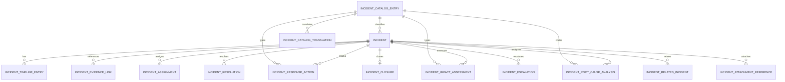

# HIDRA Incident Management Module — Data Definition Document

```text
Document        : HIDRA-INCIDENT-MANAGEMENT-DATA-DEFINITION-DOCUMENT
Module          : incidentmanagement / incidents
Product         : Hidra — Hydrocarbon Intelligence for Data, Risk, and Analytics
Namespace       : dz.sh.hidra.modules.incidents
Status          : Target DDD / not yet implemented as Java module
Source priority : HyFloAPI first; Hidra architecture/scope used when no HyFlo implementation evidence is found
Created for     : Hidra modular monolith data model alignment
```

---

## 1. Purpose

The Incident Management module manages operational incidents from detection to resolution and closure.

It answers:

```text
What happened?
Where did it happen?
When was it detected?
What caused it?
Who is responsible?
What response actions were taken?
Was the incident resolved?
What evidence supports closure?
```

Incident Management is not an alarm module, not a leak detection module, not HSE, not workflow, and not audit. It owns the operational response case once an abnormal condition becomes an incident.

---

## 2. Module Ownership

Incident Management owns:

```text
Incident
IncidentClassification
IncidentSeverity
IncidentStatus
IncidentTimelineEntry
IncidentEvidenceLink
IncidentAssignment
IncidentResponseAction
IncidentImpactAssessment
IncidentRootCauseAnalysis
IncidentResolution
IncidentClosure
IncidentEscalation
IncidentRelatedIncident
IncidentAttachmentReference
IncidentCatalogEntry
IncidentCatalogTranslation
```

Incident Management references but does not own:

```text
Monitoring alert candidates
Alarms
Leak detection cases
Telemetry readings
Topology assets
Organization units
Employees
Identity users
Workflow instances/tasks
Audit events
Documents/files
HSE events
Notifications
Risk scores
Analytics models
```

---

## 3. Boundary Rules

### 3.1 Non-negotiable ownership rule

```text
Incident Management owns response lifecycle.
Alarm Management owns alarm lifecycle.
Leak Detection owns leak suspicion and localization.
Monitoring owns deviation detection.
HSE owns safety/environment consequences and compliance cases.
Workflow owns approval/routing process.
Audit owns immutable evidence trail.
```

### 3.2 Incident must not mutate upstream facts

Incident Management must never directly update:

```text
telemetry readings
monitoring evaluations
alarms
leak candidates
pipeline/facility/equipment topology
workflow tasks
```

It stores references and snapshots only.

### 3.3 Incident is not an HSE case

An incident may produce HSE impact, but HSE-specific investigation, regulatory reporting, environmental damage assessment, injuries, emissions, spills, and compliance tracking must belong to HSE Management.

### 3.4 Incident is not workflow

Workflow may approve closure, escalation, reclassification, or major response decisions. Incident Management stores workflow references, not workflow tasks.

---

## 4. Core Lifecycle

Recommended lifecycle:

```text
DRAFT
  -> OPEN
      -> TRIAGED
          -> ASSIGNED
              -> IN_PROGRESS
                  -> CONTAINED
                      -> RESOLVED
                          -> CLOSED
```

Exceptional transitions:

```text
OPEN / TRIAGED / ASSIGNED / IN_PROGRESS -> CANCELLED
OPEN / TRIAGED / ASSIGNED / IN_PROGRESS -> MERGED
OPEN / TRIAGED / ASSIGNED / IN_PROGRESS -> ESCALATED
RESOLVED -> REOPENED
```

Lifecycle rules:

```text
Only OPEN or later incidents may receive response actions.
Only ASSIGNED or IN_PROGRESS incidents may be marked CONTAINED.
Only CONTAINED or IN_PROGRESS incidents may be RESOLVED.
Only RESOLVED incidents may be CLOSED.
Closure requires resolution summary and evidence.
A CLOSED incident is immutable except for audit/document references.
```

---

## 5. Entity List

| Entity | Type | Ownership |
|---|---|---|
| `Incident` | Aggregate Root | Main incident record and lifecycle owner |
| `IncidentTimelineEntry` | Entity | Append-only incident history entry |
| `IncidentEvidenceLink` | Entity | Link to upstream evidence or documents |
| `IncidentAssignment` | Entity | Responsible actor/unit assignment history |
| `IncidentResponseAction` | Entity | Action taken during incident response |
| `IncidentImpactAssessment` | Entity | Operational impact assessment |
| `IncidentRootCauseAnalysis` | Entity | Root cause analysis result |
| `IncidentResolution` | Entity | Resolution details |
| `IncidentClosure` | Entity | Closure evidence and close decision |
| `IncidentEscalation` | Entity | Escalation record |
| `IncidentRelatedIncident` | Entity | Relationship between incidents |
| `IncidentAttachmentReference` | Entity | Reference to document/file module |
| `IncidentCatalogEntry` | Catalog Entity | Controlled vocabulary |
| `IncidentCatalogTranslation` | Catalog Translation | Multilingual labels |

---

# 6. Entity Definitions

## 6.1 Incident

### Description

Main aggregate root representing an operational incident. It records what happened, where, severity, status, responsibility, source context, and closure state.

### Table

```text
hidra_incident
```

### Fields

| Field | Type | Required | Description |
|---|---:|---:|---|
| `id` | String/UUID | Yes | Stable incident identifier. |
| `incidentNumber` | String | Yes | Human-readable unique incident number, e.g. `INC-2026-000001`. |
| `title` | String | Yes | Short incident title. |
| `description` | Text | No | Detailed description of the incident. |
| `classificationId` | String FK | Yes | Reference to incident classification catalog. |
| `severityId` | String FK | Yes | Reference to severity catalog. |
| `priorityId` | String FK | No | Response priority catalog reference. |
| `status` | String/Enum | Yes | Lifecycle status. |
| `sourceType` | String | Yes | `MANUAL`, `MONITORING_ALERT`, `ALARM`, `LEAK_CASE`, `HSE_EVENT`, `INTEGRATION`, `OTHER`. |
| `sourceReferenceId` | String | No | Upstream source ID. |
| `sourceReferenceCode` | String | No | Upstream source code/snapshot. |
| `detectedAt` | Instant | Yes | Time when the incident was detected. |
| `reportedAt` | Instant | Yes | Time when incident was reported/created in Hidra. |
| `occurredAt` | Instant | No | Estimated real occurrence time. |
| `topologyAssetTypeCode` | String | No | Neutral topology asset type snapshot. |
| `topologyAssetId` | String | No | Neutral topology asset ID. |
| `topologyAssetCode` | String | No | Neutral topology asset business code. |
| `topologyAssetNameSnapshot` | String | No | Asset name at time of incident. |
| `locationDescriptionAr` | String | No | Arabic location description. |
| `locationDescriptionLt` | String | No | Latin/French location description. |
| `latitude` | Decimal | No | Optional latitude. |
| `longitude` | Decimal | No | Optional longitude. |
| `responsibleOrganizationUnitId` | String | No | Organization unit reference. |
| `responsibleOrganizationUnitCode` | String | No | Organization unit snapshot code. |
| `responsibleOrganizationUnitNameSnapshot` | String | No | Organization unit name snapshot. |
| `responsibleActorId` | String | No | Actor/user reference for current owner. |
| `responsibleActorNameSnapshot` | String | No | Actor display name snapshot. |
| `workflowInstanceId` | String | No | Workflow reference if incident is under approval/routing. |
| `currentEscalationLevel` | Integer | Yes | Current escalation level; default `0`. |
| `containedAt` | Instant | No | Time containment was declared. |
| `resolvedAt` | Instant | No | Time resolution was declared. |
| `closedAt` | Instant | No | Time closure was approved. |
| `cancelledAt` | Instant | No | Time cancellation occurred, if cancelled. |
| `createdByActorId` | String | Yes | Actor who created the incident. |
| `createdByActorNameSnapshot` | String | No | Actor snapshot. |
| `createdAt` | Instant | Yes | Creation timestamp. |
| `updatedAt` | Instant | Yes | Last update timestamp. |

### Constraints

```text
incidentNumber unique
status in allowed lifecycle states
detectedAt <= reportedAt unless explicitly marked estimated
closedAt requires status = CLOSED
resolvedAt requires status in RESOLVED/CLOSED
cancelledAt requires status = CANCELLED
```

---

## 6.2 IncidentTimelineEntry

### Description

Append-only timeline entry recording major incident events: creation, classification, assignment, response action, escalation, containment, resolution, closure, reopening, comments, and evidence changes.

### Table

```text
hidra_incident_timeline_entry
```

### Fields

| Field | Type | Required | Description |
|---|---:|---:|---|
| `id` | String/UUID | Yes | Timeline entry ID. |
| `incidentId` | String FK | Yes | Owning incident. |
| `entryTypeId` | String FK | Yes | Timeline entry type catalog reference. |
| `statusBefore` | String | No | Incident status before event. |
| `statusAfter` | String | No | Incident status after event. |
| `title` | String | Yes | Entry title. |
| `description` | Text | No | Detailed entry description. |
| `actorId` | String | No | Actor who performed/recorded the event. |
| `actorNameSnapshot` | String | No | Actor snapshot. |
| `organizationUnitId` | String | No | Actor organization unit reference. |
| `organizationUnitNameSnapshot` | String | No | Organization snapshot. |
| `occurredAt` | Instant | Yes | Event occurrence time. |
| `recordedAt` | Instant | Yes | Persistence time. |
| `correlationId` | String | No | Correlation/request reference. |

### Rules

```text
Timeline entries are append-only.
Timeline entries must not be physically updated except technical correction by migration/admin procedure.
Timeline must preserve actor and organization snapshots.
```

---

## 6.3 IncidentEvidenceLink

### Description

Links an incident to upstream evidence: alarm, monitoring evaluation, telemetry reading, leak candidate/case, topology asset snapshot, document, or external reference.

### Table

```text
hidra_incident_evidence_link
```

### Fields

| Field | Type | Required | Description |
|---|---:|---:|---|
| `id` | String/UUID | Yes | Evidence link ID. |
| `incidentId` | String FK | Yes | Incident. |
| `evidenceType` | String | Yes | `TELEMETRY_READING`, `MONITORING_EVALUATION`, `ALARM`, `LEAK_CASE`, `TOPOLOGY_ASSET`, `DOCUMENT`, `PHOTO`, `EXTERNAL_SYSTEM`, `OTHER`. |
| `evidenceReferenceId` | String | Yes | Referenced object ID. |
| `evidenceReferenceCode` | String | No | Referenced code/snapshot. |
| `evidenceTitle` | String | No | Evidence display title. |
| `evidenceSummary` | Text | No | Short description. |
| `evidenceTimestamp` | Instant | No | Evidence occurrence/capture time. |
| `attachedByActorId` | String | Yes | Actor who linked evidence. |
| `attachedAt` | Instant | Yes | Link creation time. |

### Rules

```text
Evidence link stores references, not copied full upstream records.
Telemetry/alarm/leak/topology ownership remains in source module.
```

---

## 6.4 IncidentAssignment

### Description

Tracks responsibility assignment history for an incident.

### Table

```text
hidra_incident_assignment
```

### Fields

| Field | Type | Required | Description |
|---|---:|---:|---|
| `id` | String/UUID | Yes | Assignment ID. |
| `incidentId` | String FK | Yes | Incident. |
| `assignmentTypeId` | String FK | Yes | `OWNER`, `RESPONDER`, `SUPERVISOR`, `TECHNICAL_SUPPORT`, `HSE_SUPPORT`, etc. |
| `assignedOrganizationUnitId` | String | No | Responsible org unit. |
| `assignedOrganizationUnitNameSnapshot` | String | No | Org unit snapshot. |
| `assignedActorId` | String | No | Assigned actor/user reference. |
| `assignedActorNameSnapshot` | String | No | Actor snapshot. |
| `assignedByActorId` | String | Yes | Actor who made assignment. |
| `assignedAt` | Instant | Yes | Assignment time. |
| `acceptedAt` | Instant | No | Time assignee accepted responsibility. |
| `releasedAt` | Instant | No | End of assignment. |
| `releaseReason` | Text | No | Reason assignment ended. |
| `primaryAssignment` | Boolean | Yes | Whether this is the primary owner assignment. |

### Rules

```text
At most one active primary assignment per incident.
An incident cannot be CLOSED without a responsible owner snapshot.
```

---

## 6.5 IncidentResponseAction

### Description

Records actions taken to respond to the incident. This is a record of operational response, not remote control of equipment.

### Table

```text
hidra_incident_response_action
```

### Fields

| Field | Type | Required | Description |
|---|---:|---:|---|
| `id` | String/UUID | Yes | Response action ID. |
| `incidentId` | String FK | Yes | Incident. |
| `actionTypeId` | String FK | Yes | Controlled action type catalog reference. |
| `actionStatus` | String/Enum | Yes | `PLANNED`, `IN_PROGRESS`, `COMPLETED`, `CANCELLED`, `FAILED`. |
| `description` | Text | Yes | What action was/will be done. |
| `targetType` | String | No | `TOPOLOGY_ASSET`, `ORGANIZATION_UNIT`, `EXTERNAL_PARTY`, `OTHER`. |
| `targetReferenceId` | String | No | Target reference. |
| `targetReferenceCode` | String | No | Target code/snapshot. |
| `plannedStartAt` | Instant | No | Planned start. |
| `plannedEndAt` | Instant | No | Planned end. |
| `startedAt` | Instant | No | Actual start. |
| `completedAt` | Instant | No | Actual completion. |
| `performedByActorId` | String | No | Actor who performed action. |
| `performedByActorNameSnapshot` | String | No | Actor snapshot. |
| `organizationUnitId` | String | No | Responsible org unit. |
| `resultSummary` | Text | No | Result of action. |
| `failureReason` | Text | No | Failure reason when failed. |
| `createdAt` | Instant | Yes | Creation timestamp. |
| `updatedAt` | Instant | Yes | Last update timestamp. |

### Safety rule

```text
ResponseAction records human/operational action.
It must never be interpreted as a direct command to valves, pumps, compressors, PLC, RTU, SCADA, ESD, or SIS.
```

---

## 6.6 IncidentImpactAssessment

### Description

Captures estimated and confirmed impacts of the incident on operations, production, transport, safety, environment, equipment, customers, and reputation.

### Table

```text
hidra_incident_impact_assessment
```

### Fields

| Field | Type | Required | Description |
|---|---:|---:|---|
| `id` | String/UUID | Yes | Impact assessment ID. |
| `incidentId` | String FK | Yes | Incident. |
| `impactTypeId` | String FK | Yes | Impact type catalog reference. |
| `impactLevelId` | String FK | Yes | Impact level catalog reference. |
| `estimated` | Boolean | Yes | Whether assessment is estimated or confirmed. |
| `description` | Text | No | Impact description. |
| `affectedTopologyAssetTypeCode` | String | No | Asset type snapshot. |
| `affectedTopologyAssetId` | String | No | Affected topology asset. |
| `affectedOrganizationUnitId` | String | No | Affected org unit. |
| `estimatedVolumeLoss` | Decimal | No | Estimated lost/deferred volume if relevant. |
| `estimatedVolumeUnitId` | String | No | Unit reference. |
| `estimatedDurationMinutes` | Integer | No | Estimated duration. |
| `assessedByActorId` | String | Yes | Assessor actor. |
| `assessedAt` | Instant | Yes | Assessment time. |

### Boundary rule

```text
HSE-specific legal/compliance assessment belongs to HSE.
Incident impact stores operational impact summary and references HSE when required.
```

---

## 6.7 IncidentRootCauseAnalysis

### Description

Records root cause analysis for the incident.

### Table

```text
hidra_incident_root_cause_analysis
```

### Fields

| Field | Type | Required | Description |
|---|---:|---:|---|
| `id` | String/UUID | Yes | RCA ID. |
| `incidentId` | String FK | Yes | Incident. |
| `rootCauseCategoryId` | String FK | Yes | Catalog reference. |
| `rootCauseCodeId` | String FK | No | Detailed root cause code. |
| `methodId` | String FK | No | RCA method: `5WHY`, `FISHBONE`, `FAULT_TREE`, `EXPERT_REVIEW`, etc. |
| `summary` | Text | Yes | Root cause summary. |
| `analysisDetails` | Text | No | Detailed analysis. |
| `contributingFactors` | Text | No | Contributing factors. |
| `confidenceLevelId` | String FK | No | Confidence level catalog reference. |
| `performedByActorId` | String | Yes | Analyst actor. |
| `performedAt` | Instant | Yes | Analysis time. |
| `approvedByActorId` | String | No | Approver actor. |
| `approvedAt` | Instant | No | Approval time. |

### Rules

```text
Root cause may be unknown at resolution but must be explicit: UNKNOWN / UNDER_INVESTIGATION.
Closure of major incidents may require approved RCA by policy.
```

---

## 6.8 IncidentResolution

### Description

Records how the incident was resolved.

### Table

```text
hidra_incident_resolution
```

### Fields

| Field | Type | Required | Description |
|---|---:|---:|---|
| `id` | String/UUID | Yes | Resolution ID. |
| `incidentId` | String FK | Yes | Incident. |
| `resolutionTypeId` | String FK | Yes | Resolution type catalog reference. |
| `resolutionSummary` | Text | Yes | Resolution summary. |
| `correctiveActionRequired` | Boolean | Yes | Whether follow-up action is needed. |
| `preventiveActionRequired` | Boolean | Yes | Whether prevention action is needed. |
| `residualRiskLevelId` | String FK | No | Residual risk catalog reference. |
| `resolvedByActorId` | String | Yes | Actor declaring resolution. |
| `resolvedAt` | Instant | Yes | Resolution time. |
| `workflowInstanceId` | String | No | Workflow reference if resolution requires approval. |

### Rules

```text
Incident must have a resolution before closure.
Resolution must not delete or rewrite timeline/evidence.
```

---

## 6.9 IncidentClosure

### Description

Formal closure record. Closure confirms evidence, resolution, RCA, and required actions have been reviewed according to policy.

### Table

```text
hidra_incident_closure
```

### Fields

| Field | Type | Required | Description |
|---|---:|---:|---|
| `id` | String/UUID | Yes | Closure ID. |
| `incidentId` | String FK | Yes | Incident. |
| `closureSummary` | Text | Yes | Closure rationale. |
| `resolutionVerified` | Boolean | Yes | Whether resolution was verified. |
| `evidenceReviewed` | Boolean | Yes | Whether evidence was reviewed. |
| `rootCauseReviewed` | Boolean | Yes | Whether RCA was reviewed or explicitly not required. |
| `followUpActionsCreated` | Boolean | Yes | Whether follow-up actions were created if required. |
| `closedByActorId` | String | Yes | Closing actor. |
| `closedByActorNameSnapshot` | String | No | Actor snapshot. |
| `closedAt` | Instant | Yes | Closure time. |
| `workflowInstanceId` | String | No | Approval workflow reference. |

### Rules

```text
Closure requires one IncidentResolution.
Closure requires at least one evidence link for non-minor incidents.
Closure may require workflow approval by classification/severity policy.
```

---

## 6.10 IncidentEscalation

### Description

Tracks escalation to higher organization levels or specialized teams.

### Table

```text
hidra_incident_escalation
```

### Fields

| Field | Type | Required | Description |
|---|---:|---:|---|
| `id` | String/UUID | Yes | Escalation ID. |
| `incidentId` | String FK | Yes | Incident. |
| `fromLevel` | Integer | Yes | Previous escalation level. |
| `toLevel` | Integer | Yes | New escalation level. |
| `reasonId` | String FK | Yes | Escalation reason catalog reference. |
| `reasonComment` | Text | No | Detailed reason. |
| `escalatedToOrganizationUnitId` | String | No | Target org unit. |
| `escalatedToActorId` | String | No | Target actor. |
| `escalatedByActorId` | String | Yes | Actor who escalated. |
| `escalatedAt` | Instant | Yes | Escalation time. |
| `acknowledgedAt` | Instant | No | Time escalation was acknowledged. |

---

## 6.11 IncidentRelatedIncident

### Description

Links incidents together, for duplicates, parent-child incidents, same root cause, recurrence, or merged incidents.

### Table

```text
hidra_incident_related_incident
```

### Fields

| Field | Type | Required | Description |
|---|---:|---:|---|
| `id` | String/UUID | Yes | Relationship ID. |
| `incidentId` | String FK | Yes | Source incident. |
| `relatedIncidentId` | String FK | Yes | Related incident. |
| `relationshipTypeId` | String FK | Yes | `DUPLICATE`, `PARENT`, `CHILD`, `RECURRENCE`, `SAME_ROOT_CAUSE`, `MERGED_INTO`. |
| `comment` | Text | No | Relationship explanation. |
| `createdByActorId` | String | Yes | Actor creating relationship. |
| `createdAt` | Instant | Yes | Creation time. |

### Rules

```text
incidentId must not equal relatedIncidentId.
Relationship must avoid duplicate inverse records unless policy requires bidirectional materialization.
```

---

## 6.12 IncidentAttachmentReference

### Description

Reference to documents/photos/files stored in the Documents module or external systems.

### Table

```text
hidra_incident_attachment_reference
```

### Fields

| Field | Type | Required | Description |
|---|---:|---:|---|
| `id` | String/UUID | Yes | Attachment reference ID. |
| `incidentId` | String FK | Yes | Incident. |
| `documentReferenceId` | String | Yes | Document/file reference. |
| `documentTypeId` | String FK | No | Attachment type catalog. |
| `filenameSnapshot` | String | No | Filename snapshot. |
| `contentType` | String | No | MIME type snapshot. |
| `description` | Text | No | Attachment description. |
| `uploadedByActorId` | String | Yes | Actor linking/uploading. |
| `uploadedAt` | Instant | Yes | Timestamp. |

---

## 6.13 IncidentCatalogEntry

### Description

Controlled vocabulary entry used for classifications, severities, priorities, response action types, root cause categories, impact types, closure types, escalation reasons, etc.

### Table

```text
hidra_incident_catalog_entry
```

### Fields

| Field | Type | Required | Description |
|---|---:|---:|---|
| `id` | String/UUID | Yes | Catalog entry ID. |
| `catalogName` | String | Yes | Catalog name: `INCIDENT_CLASSIFICATION`, `INCIDENT_SEVERITY`, `RESPONSE_ACTION_TYPE`, etc. |
| `code` | String | Yes | Stable code. |
| `active` | Boolean | Yes | Whether entry is active. |
| `sortOrder` | Integer | Yes | Display order. |
| `systemDefined` | Boolean | Yes | True for protected seed data. |
| `createdAt` | Instant | Yes | Creation time. |
| `updatedAt` | Instant | Yes | Update time. |

### Recommended catalogs

```text
INCIDENT_CLASSIFICATION
INCIDENT_SEVERITY
INCIDENT_PRIORITY
INCIDENT_SOURCE_TYPE
INCIDENT_TIMELINE_ENTRY_TYPE
INCIDENT_ASSIGNMENT_TYPE
RESPONSE_ACTION_TYPE
IMPACT_TYPE
IMPACT_LEVEL
ROOT_CAUSE_CATEGORY
ROOT_CAUSE_CODE
RCA_METHOD
RESOLUTION_TYPE
CLOSURE_TYPE
ESCALATION_REASON
RELATED_INCIDENT_RELATIONSHIP_TYPE
ATTACHMENT_TYPE
```

---

## 6.14 IncidentCatalogTranslation

### Description

Multilingual labels and descriptions for incident catalog entries.

### Table

```text
hidra_incident_catalog_translation
```

### Fields

| Field | Type | Required | Description |
|---|---:|---:|---|
| `id` | String/UUID | Yes | Translation ID. |
| `catalogEntryId` | String FK | Yes | Catalog entry. |
| `locale` | String | Yes | `ar`, `fr`, `en`. |
| `name` | String | Yes | Localized name. |
| `description` | Text | No | Localized description. |
| `createdAt` | Instant | Yes | Creation time. |
| `updatedAt` | Instant | Yes | Update time. |

### Constraints

```text
unique(catalogEntryId, locale)
```

---

# 7. Relationship Model

```text
Incident
  -> IncidentTimelineEntry
  -> IncidentEvidenceLink
  -> IncidentAssignment
  -> IncidentResponseAction
  -> IncidentImpactAssessment
  -> IncidentRootCauseAnalysis
  -> IncidentResolution
  -> IncidentClosure
  -> IncidentEscalation
  -> IncidentRelatedIncident
  -> IncidentAttachmentReference

IncidentCatalogEntry
  -> IncidentCatalogTranslation
```

External reference model:

```text
MonitoringAlertCandidate / Alarm / LeakDetectionCase / TelemetryReading / TopologyAsset
  -> IncidentEvidenceLink
      -> Incident
```

---

# 8. Mermaid ER Diagram



---

# 9. Status and Type Rules

## 9.1 Java enum allowed for lifecycle statuses

Stable lifecycle status can be a Java enum:

```text
IncidentStatus
ResponseActionStatus
```

Recommended `IncidentStatus` values:

```text
DRAFT
OPEN
TRIAGED
ASSIGNED
IN_PROGRESS
CONTAINED
RESOLVED
CLOSED
REOPENED
ESCALATED
MERGED
CANCELLED
```

## 9.2 Catalog required for user-facing taxonomies

Do not hard-code these as Java enums:

```text
IncidentClassification
IncidentSeverity
IncidentPriority
ResponseActionType
ImpactType
RootCauseCategory
RootCauseCode
ResolutionType
EscalationReason
```

They require multilingual labels and operator-managed configuration.

---

# 10. Validation Rules

```text
Incident incidentNumber must be unique.
Incident detectedAt is required.
Incident classification and severity are required after TRIAGED.
At most one active primary IncidentAssignment is allowed.
Timeline entries are append-only.
Response actions cannot be added after CLOSED except through reopening.
Resolution is required before closure.
Closure requires resolution verification and evidence review.
Root cause is required for major/critical incidents unless explicitly marked UNKNOWN/UNDER_INVESTIGATION.
Incident cannot be linked to itself as related incident.
Closed incidents are immutable except document/audit references.
```

---

# 11. Recommended Indexes

```text
idx_incident_status(status)
idx_incident_detected_at(detected_at)
idx_incident_severity(severity_id)
idx_incident_classification(classification_id)
idx_incident_topology_asset(topology_asset_type_code, topology_asset_id)
idx_incident_responsible_org(responsible_organization_unit_id)
idx_incident_source(source_type, source_reference_id)
idx_incident_timeline_incident_time(incident_id, occurred_at)
idx_incident_assignment_active(incident_id, released_at)
idx_incident_evidence_source(evidence_type, evidence_reference_id)
idx_incident_response_action_status(incident_id, action_status)
idx_incident_catalog_name_code(catalog_name, code)
```

Uniqueness:

```text
unique(incidentNumber)
unique(catalogName, code) on IncidentCatalogEntry
unique(catalogEntryId, locale) on IncidentCatalogTranslation
```

---

# 12. Integration with Other Modules

## 12.1 From Monitoring

Monitoring can produce alert candidates/deviation events. Incident Management can create an incident from a monitoring reference.

```text
MonitoringAlertCandidate
  -> IncidentEvidenceLink
      -> Incident
```

Monitoring remains owner of monitoring rules, thresholds, and evaluations.

## 12.2 From Alarm Management

A formal alarm may trigger an incident.

```text
Alarm
  -> IncidentEvidenceLink
      -> Incident
```

Alarm Management remains owner of alarm acknowledgement, shelving, suppression, and alarm closure.

## 12.3 From Leak Detection

A verified leak case may trigger or attach to an incident.

```text
LeakDetectionCase
  -> IncidentEvidenceLink
      -> Incident
```

Leak Detection remains owner of leak hypothesis, localization, and verification.

## 12.4 With Workflow

Workflow can approve:

```text
incident closure
major reclassification
critical escalation
RCA approval
```

Incident stores only:

```text
workflowInstanceId
workflowReferenceCode
workflow decision snapshot if needed
```

## 12.5 With Audit

Incident emits audit-ready domain events:

```text
IncidentOpenedEvent
IncidentTriagedEvent
IncidentAssignedEvent
IncidentEscalatedEvent
IncidentResponseActionRecordedEvent
IncidentContainedEvent
IncidentResolvedEvent
IncidentClosedEvent
IncidentReopenedEvent
IncidentCancelledEvent
```

Audit owns immutable audit records.

---

# 13. Safety Rules

Incident Management must not control operational equipment.

Forbidden:

```text
IncidentResponseAction directly opens/closes valve
IncidentResponseAction directly starts/stops pump
IncidentResponseAction directly changes compressor setpoint
Incident module writes to SCADA/PLC/RTU/ESD/SIS
```

Allowed:

```text
Record that an operator performed an action
Record planned/manual response action
Reference external work order or permit
Reference SCADA event as evidence
```

---

# 14. Package Boundary Recommendation

```text
dz.sh.hidra.modules.incidents
  api.rest.request
  api.rest.response
  api.rest.mapper
  api.rest.controller
  application.command
  application.query
  application.dto
  application.port.in
  application.port.out
  application.service
  domain.model
  domain.value
  domain.event
  domain.policy
  domain.service
  domain.exception
  infrastructure.persistence.entity
  infrastructure.persistence.repository
  infrastructure.persistence.mapper
  infrastructure.persistence.adapter
  infrastructure.configuration
```

Forbidden packages:

```text
shared
sharedkernel
common
core
utils
helper
helpers
misc
```

---

# 15. Implementation Notes

Start with these minimal tables first:

```text
hidra_incident
hidra_incident_timeline_entry
hidra_incident_evidence_link
hidra_incident_assignment
hidra_incident_response_action
hidra_incident_resolution
hidra_incident_closure
hidra_incident_catalog_entry
hidra_incident_catalog_translation
```

Then add:

```text
hidra_incident_impact_assessment
hidra_incident_root_cause_analysis
hidra_incident_escalation
hidra_incident_related_incident
hidra_incident_attachment_reference
```

---

# 16. Final Design Rule

```text
Incident Management is the operational response record.
It starts when an abnormal situation must be managed as a case.
It ends when the case is resolved, evidenced, and closed.
It never replaces monitoring, alarm management, leak detection, HSE, workflow, audit, or SCADA.
```
