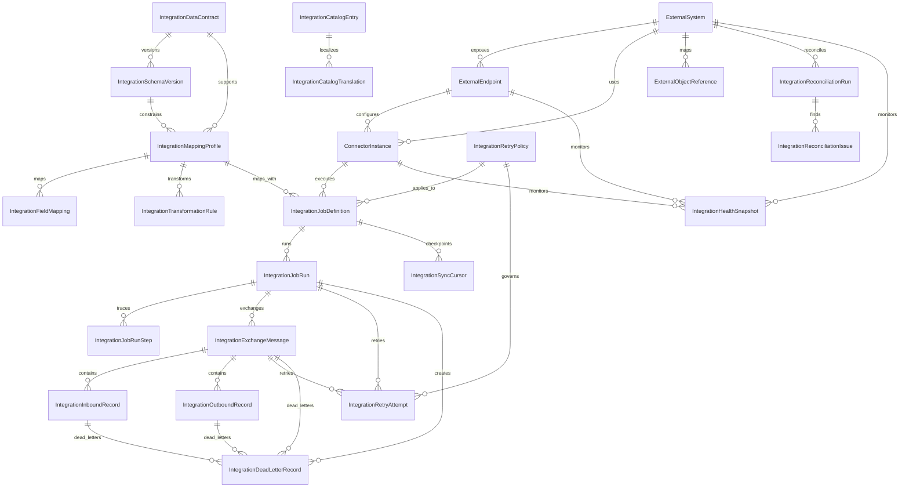

# HIDRA Integration Data Definition Document

```text
Document code : HIDRA-INTEGRATION-DDD
Module        : integration
Namespace     : dz.sh.hidra.modules.integration
Product       : Hidra - Hydrocarbon Intelligence for Data, Risk, and Analytics
Owner         : Sonatrach / TRC Digitalization Initiative
Author        : Abir MEDJERAB
Status        : Target DDD, repository-aligned to macro-architecture
CreatedOn     : 2026-06-11
Version       : 1.0
```

---

## 1. Purpose

The **integration** module is the controlled boundary between Hidra and external systems.

It answers:

```text
Which external system is connected?
Which endpoint or channel is used?
Which data contract is expected?
How is external data mapped to Hidra references?
Which job imported or exported data?
What succeeded, failed, retried, or went to dead letter?
Can every exchanged record be traced back to source, target, payload hash, and correlation id?
```

The module is not a shortcut around business modules.

The correct rule is:

```text
External system
  -> integration connector
      -> integration mapping / staging / validation envelope
          -> target module public import/export port
              -> target module domain validation
                  -> target module owns the accepted business fact
```

---

## 2. Source-of-truth positioning

No implemented `integration` Java module was found during repository inspection. The design is therefore a **target data definition** grounded in the Hidra macro architecture.

The macro architecture explicitly defines Integration as a supporting context for external systems, connectors, ingestion jobs, mapping rules, retries, synchronization state, and dead-letter records. It also states that business modules must not talk directly to external systems; they must call outbound ports implemented by adapters in the integration context.

---

## 3. Scope

### 3.1 Integration owns

```text
External system registry
External endpoint/channel definitions
Connector instances
Connection configuration metadata
Credential references, never secrets
Data contracts and schema versions
Mapping profiles
Field mapping rules
Transformation rules
External object reference mapping
Inbound exchange messages
Outbound exchange messages
Import jobs
Export jobs
Synchronization jobs
Job runs and run steps
Sync cursors/checkpoints
Retry policies
Retry attempts
Dead-letter records
Integration reconciliation runs
Integration reconciliation issues
Integration health snapshots
Integration catalog entries and translations
```

### 3.2 Integration does not own

```text
Telemetry readings
Telemetry devices or points
Topology assets
Pipeline systems, pipelines, facilities, equipment
Planning periods, plans, nominations, targets
Monitoring rules, deviations, operational states
Alarm lifecycle
Leak detection cases
Incident lifecycle
Asset maintenance work orders
Custody transfer tickets
HSE cases
Users, roles, groups, permissions
Organization units, employees, positions
Audit ledger storage
Notification templates and delivery lifecycle
Analytics models and KPIs
SCADA/PLC/RTU command execution
```

### 3.3 Non-negotiable industrial safety rule

```text
Hidra Integration is read/import/export orchestration.
It must not directly actuate valves, pumps, compressors, PLCs, RTUs, SIS, ESD, or SCADA control commands.
```

Any future write-back to OT systems requires a separate safety-governed architecture decision, explicit operational procedure, human approval, and hard technical interlocks. It is outside this DDD.

---

## 4. Module boundary rules

### 4.1 Allowed references

Integration may store neutral references to other modules:

```text
targetModule
targetTypeCode
targetId
targetCodeSnapshot
targetLabelSnapshot
sourceModule
sourceTypeCode
sourceId
sourceCodeSnapshot
correlationId
requestId
actorId
organizationUnitId
workflowInstanceId
auditEventId
```

### 4.2 Forbidden dependencies

The integration domain must not import:

```text
dz.sh.hidra.modules.telemetry.domain.*
dz.sh.hidra.modules.topology.domain.*
dz.sh.hidra.modules.planning.domain.*
dz.sh.hidra.modules.monitoring.domain.*
dz.sh.hidra.modules.alarms.domain.*
dz.sh.hidra.modules.incidents.domain.*
dz.sh.hidra.modules.identity.domain.*
dz.sh.hidra.modules.organization.domain.*
dz.sh.hidra.modules.audit.domain.*
dz.sh.hidra.modules.notification.domain.*
```

Cross-module interaction must be through public application ports, stable DTOs, published events, or the platform outbox.

### 4.3 No direct table writes

Integration must never write directly to another module table.

Forbidden:

```text
integration adapter -> hidra_telemetry_reading table
integration adapter -> hidra_topology_facility table
integration adapter -> hidra_planning_plan table
integration adapter -> hidra_incident table
```

Allowed:

```text
integration adapter
  -> target module import port
      -> target module application service
          -> target module domain validation
              -> target module repository
```

---

## 5. Core data model

```text
ExternalSystem
  -> ExternalEndpoint
  -> ConnectorInstance
      -> IntegrationJobDefinition
          -> IntegrationJobRun
              -> IntegrationJobRunStep

ExternalSystem
  -> ExternalObjectReference

IntegrationDataContract
  -> IntegrationSchemaVersion

IntegrationMappingProfile
  -> IntegrationFieldMapping
  -> IntegrationTransformationRule

IntegrationExchangeMessage
  -> IntegrationInboundRecord
  -> IntegrationOutboundRecord
  -> IntegrationRetryAttempt
  -> IntegrationDeadLetterRecord

IntegrationReconciliationRun
  -> IntegrationReconciliationIssue

IntegrationCatalogEntry
  -> IntegrationCatalogTranslation
```

---

## 6. Entity definitions

## 6.1 ExternalSystem

### Ownership

Owned by `integration`.

### Purpose

Represents an external system known to Hidra.

Examples:

```text
SCADA
Historian / PI
Telemetry gateway
OPC UA server
MQTT broker
ERP / SAP
CMMS
Enterprise IAM
BI platform
File exchange directory
Laboratory information system
Metering system
Email/SMS gateway reference
```

### Table

```text
hidra_integration_external_system
```

### Fields

| Field | Logical type | Required | Description |
|---|---:|---:|---|
| id | ExternalSystemId | yes | Stable internal identifier. |
| code | String(120) | yes | Unique system code, for example `SCADA_ORAN`, `PI_MAIN`, `SAP_PM`. |
| nameAr | String(160) | no | Arabic display name. |
| nameFr | String(160) | yes | French display name. |
| nameEn | String(160) | no | English display name. |
| systemTypeId | CatalogEntryId | yes | Reference to catalog entry: SCADA, HISTORIAN, ERP, CMMS, IAM, BI, FILE_EXCHANGE, LAB, METERING, OTHER. |
| ownerOrganizationUnitId | String(80) | no | Organization unit responsible for this integration. Reference only. |
| environment | String(40) | yes | DEV, TEST, STAGING, PRODUCTION, DR, SANDBOX. |
| criticality | String(40) | yes | LOW, MEDIUM, HIGH, CRITICAL. |
| status | String(40) | yes | DRAFT, ACTIVE, SUSPENDED, RETIRED. |
| description | String(1000) | no | Human-readable description. |
| createdAt | Instant | yes | Creation time. |
| updatedAt | Instant | yes | Last update time. |

### Rules

```text
ExternalSystem.code must be unique.
Only ACTIVE systems can run production integration jobs.
A RETIRED system cannot receive new active endpoints or connector instances.
```

---

## 6.2 ExternalEndpoint

### Ownership

Owned by `integration`.

### Purpose

Defines a concrete external access point, topic, API, file location, or channel for an external system.

### Table

```text
hidra_integration_external_endpoint
```

### Fields

| Field | Logical type | Required | Description |
|---|---:|---:|---|
| id | ExternalEndpointId | yes | Stable endpoint identifier. |
| externalSystemId | ExternalSystemId | yes | Parent external system. |
| code | String(120) | yes | Endpoint code unique inside the system. |
| endpointTypeId | CatalogEntryId | yes | REST_API, SOAP_API, OPC_UA, MQTT_TOPIC, JDBC, SFTP, FILE_DIRECTORY, EMAIL_BOX, WEBHOOK, OTHER. |
| direction | String(30) | yes | INBOUND, OUTBOUND, BIDIRECTIONAL. |
| endpointUri | String(1000) | no | Sanitized endpoint URI. No secrets. |
| host | String(255) | no | Hostname or IP where appropriate. |
| port | Integer | no | Port where appropriate. |
| pathOrTopic | String(500) | no | API path, MQTT topic, OPC node prefix, file path, queue name. |
| protocolId | CatalogEntryId | yes | Protocol catalog reference. |
| pollingIntervalSeconds | Integer | no | Polling interval for pull-based connectors. |
| timeoutSeconds | Integer | no | Timeout for calls. |
| credentialReference | String(255) | no | Reference to secret store entry. Never stores secret value. |
| tlsRequired | Boolean | yes | Whether TLS is required. |
| active | Boolean | yes | Whether endpoint can be used. |
| validFrom | Instant | no | Start validity. |
| validTo | Instant | no | End validity. |
| createdAt | Instant | yes | Creation time. |
| updatedAt | Instant | yes | Last update time. |

### Rules

```text
Secrets, tokens, passwords, certificates, private keys, and bind credentials must not be stored here.
If active = true, parent ExternalSystem must be ACTIVE.
For production endpoints, credentialReference is required when authentication is required.
```

---

## 6.3 ConnectorInstance

### Ownership

Owned by `integration`.

### Purpose

Represents a configured Hidra connector implementation attached to an external endpoint.

### Table

```text
hidra_integration_connector_instance
```

### Fields

| Field | Logical type | Required | Description |
|---|---:|---:|---|
| id | ConnectorInstanceId | yes | Stable connector instance id. |
| externalSystemId | ExternalSystemId | yes | Parent external system. |
| endpointId | ExternalEndpointId | yes | Endpoint used by connector. |
| code | String(120) | yes | Connector instance code. |
| connectorTypeId | CatalogEntryId | yes | SCADA_READER, HISTORIAN_READER, OPCUA_READER, MQTT_SUBSCRIBER, CSV_IMPORTER, EXCEL_IMPORTER, REST_EXPORTER, ERP_ADAPTER, CMMS_ADAPTER. |
| connectorImplementation | String(255) | yes | Technical connector implementation key. |
| direction | String(30) | yes | INBOUND, OUTBOUND, BIDIRECTIONAL. |
| configurationJson | Json | no | Sanitized connector options. No secrets. |
| maxConcurrency | Integer | no | Maximum concurrent processing workers. |
| active | Boolean | yes | Whether connector is active. |
| healthStatus | String(40) | no | UNKNOWN, HEALTHY, DEGRADED, DOWN. |
| lastHealthCheckAt | Instant | no | Last health check timestamp. |
| createdAt | Instant | yes | Creation time. |
| updatedAt | Instant | yes | Last update time. |

### Rules

```text
ConnectorInstance may execute exchange logic.
ConnectorInstance must not contain target module business rules.
ConnectorInstance must not write directly to target module tables.
```

---

## 6.4 IntegrationDataContract

### Ownership

Owned by `integration`.

### Purpose

Defines the expected shape of data exchanged with an external system.

### Table

```text
hidra_integration_data_contract
```

### Fields

| Field | Logical type | Required | Description |
|---|---:|---:|---|
| id | IntegrationDataContractId | yes | Stable data contract id. |
| code | String(120) | yes | Unique contract code. |
| nameFr | String(160) | yes | French name. |
| nameAr | String(160) | no | Arabic name. |
| nameEn | String(160) | no | English name. |
| contractTypeId | CatalogEntryId | yes | TELEMETRY_IMPORT, TOPOLOGY_IMPORT, PLANNING_IMPORT, CUSTODY_EXPORT, INCIDENT_EXPORT, REPORT_EXPORT, IAM_SYNC, OTHER. |
| payloadFormatId | CatalogEntryId | yes | JSON, XML, CSV, EXCEL, PARQUET, OPCUA_NODESET, MQTT_MESSAGE, BINARY, OTHER. |
| owningTargetModule | String(80) | no | Module expected to accept mapped records. |
| description | String(1000) | no | Contract description. |
| status | String(40) | yes | DRAFT, ACTIVE, DEPRECATED, RETIRED. |
| createdAt | Instant | yes | Creation time. |
| updatedAt | Instant | yes | Last update time. |

### Rules

```text
ACTIVE mapping profiles must reference an ACTIVE data contract.
A deprecated contract may still be read for historical replay but should not be used for new jobs.
```

---

## 6.5 IntegrationSchemaVersion

### Ownership

Owned by `integration`.

### Purpose

Versioned schema definition for a data contract.

### Table

```text
hidra_integration_schema_version
```

### Fields

| Field | Logical type | Required | Description |
|---|---:|---:|---|
| id | IntegrationSchemaVersionId | yes | Stable schema version id. |
| dataContractId | IntegrationDataContractId | yes | Parent data contract. |
| versionNumber | Integer | yes | Version number. |
| schemaDefinition | Json/Text | yes | Sanitized schema or schema reference. |
| checksum | String(128) | yes | Schema checksum. |
| status | String(40) | yes | DRAFT, ACTIVE, DEPRECATED, RETIRED. |
| effectiveFrom | Instant | no | Effective start. |
| effectiveTo | Instant | no | Effective end. |
| createdAt | Instant | yes | Creation time. |
| updatedAt | Instant | yes | Last update time. |

### Rules

```text
Only one ACTIVE schema version per data contract should be used as default.
Old schema versions remain available for replay, audit, and troubleshooting.
```

---

## 6.6 IntegrationMappingProfile

### Ownership

Owned by `integration`.

### Purpose

Maps external payload shape to a target module import/export DTO shape.

### Table

```text
hidra_integration_mapping_profile
```

### Fields

| Field | Logical type | Required | Description |
|---|---:|---:|---|
| id | IntegrationMappingProfileId | yes | Stable mapping profile id. |
| code | String(120) | yes | Unique mapping profile code. |
| externalSystemId | ExternalSystemId | yes | External system using the mapping. |
| dataContractId | IntegrationDataContractId | yes | Data contract. |
| schemaVersionId | IntegrationSchemaVersionId | no | Schema version. |
| targetModule | String(80) | yes | Target module, for example telemetry, topology, planning, custody. |
| targetTypeCode | String(120) | yes | Target object type. |
| direction | String(30) | yes | INBOUND, OUTBOUND. |
| status | String(40) | yes | DRAFT, ACTIVE, SUSPENDED, RETIRED. |
| validationMode | String(40) | yes | STRICT, LENIENT, STAGING_ONLY. |
| createdAt | Instant | yes | Creation time. |
| updatedAt | Instant | yes | Last update time. |

### Rules

```text
Only ACTIVE mapping profiles can run in automated jobs.
Mapping transforms format and references; it does not decide business acceptance.
Target module domain validation decides acceptance.
```

---

## 6.7 IntegrationFieldMapping

### Ownership

Owned by `integration`.

### Purpose

Defines one source-field to target-field mapping.

### Table

```text
hidra_integration_field_mapping
```

### Fields

| Field | Logical type | Required | Description |
|---|---:|---:|---|
| id | IntegrationFieldMappingId | yes | Stable field mapping id. |
| mappingProfileId | IntegrationMappingProfileId | yes | Parent mapping profile. |
| sourcePath | String(500) | yes | JSON path, XML path, CSV column, Excel cell/column, OPC node path. |
| targetPath | String(500) | yes | Target DTO path expected by target module import port. |
| dataType | String(50) | yes | STRING, NUMBER, BOOLEAN, DATE, TIMESTAMP, JSON, REFERENCE, CATALOG_CODE. |
| required | Boolean | yes | Whether source field is required. |
| defaultValue | String(1000) | no | Optional default. |
| unitCode | String(80) | no | Unit if numeric. |
| transformationRuleId | IntegrationTransformationRuleId | no | Optional transformation rule. |
| displayOrder | Integer | yes | UI/order support. |
| active | Boolean | yes | Whether mapping is active. |

### Rules

```text
Required source fields missing from payload produce validation errors or dead-letter records depending on job policy.
TargetPath must match target module public import contract, not internal entity fields.
```

---

## 6.8 IntegrationTransformationRule

### Ownership

Owned by `integration`.

### Purpose

Represents controlled transformations such as unit conversion, code normalization, date parsing, and reference resolution.

### Table

```text
hidra_integration_transformation_rule
```

### Fields

| Field | Logical type | Required | Description |
|---|---:|---:|---|
| id | IntegrationTransformationRuleId | yes | Stable transformation rule id. |
| mappingProfileId | IntegrationMappingProfileId | yes | Parent profile. |
| code | String(120) | yes | Rule code. |
| ruleTypeId | CatalogEntryId | yes | TRIM, NORMALIZE_CODE, UNIT_CONVERSION, DATE_PARSE, LOOKUP_EXTERNAL_REFERENCE, LOOKUP_CATALOG, EXPRESSION, CUSTOM_ADAPTER. |
| expression | String(2000) | no | Safe expression or adapter key. |
| configurationJson | Json | no | Sanitized configuration. |
| active | Boolean | yes | Whether rule is active. |
| createdAt | Instant | yes | Creation time. |
| updatedAt | Instant | yes | Last update time. |

### Rules

```text
Transformation rules must be deterministic and replayable.
Custom adapter rules must be explicitly whitelisted.
No transformation rule may execute arbitrary code from user input.
```

---

## 6.9 ExternalObjectReference

### Ownership

Owned by `integration`.

### Purpose

Maps an external object identifier to a Hidra module reference.

Examples:

```text
External SCADA tag -> TelemetryPoint reference
External historian tag -> TelemetryPoint reference
External SAP equipment id -> MaintainableAsset reference
External CMMS work order id -> MaintenanceWorkOrder reference
External laboratory sample id -> CustodyQualitySample reference
External user subject -> Identity external mapping reference, if identity delegates connector plumbing
```

### Table

```text
hidra_integration_external_object_reference
```

### Fields

| Field | Logical type | Required | Description |
|---|---:|---:|---|
| id | ExternalObjectReferenceId | yes | Stable mapping id. |
| externalSystemId | ExternalSystemId | yes | External system. |
| externalObjectType | String(120) | yes | External object type. |
| externalObjectId | String(255) | yes | External identifier. |
| externalObjectCode | String(255) | no | External business code. |
| targetModule | String(80) | yes | Hidra module name. |
| targetTypeCode | String(120) | yes | Hidra target type. |
| targetId | String(120) | yes | Hidra target id. |
| targetCodeSnapshot | String(120) | no | Hidra target business code snapshot. |
| targetLabelSnapshot | String(240) | no | Hidra target display label snapshot. |
| confidenceLevel | String(40) | yes | EXACT, HIGH, MEDIUM, LOW, MANUAL_REVIEW. |
| status | String(40) | yes | ACTIVE, SUSPENDED, RETIRED, CONFLICT. |
| validFrom | Instant | no | Start validity. |
| validTo | Instant | no | End validity. |
| createdAt | Instant | yes | Creation time. |
| updatedAt | Instant | yes | Last update time. |

### Rules

```text
One active external object mapping per externalSystemId + externalObjectType + externalObjectId.
Conflicting active mappings must go to manual resolution.
ExternalObjectReference is a mapping, not ownership of the Hidra target object.
```

---

## 6.10 IntegrationJobDefinition

### Ownership

Owned by `integration`.

### Purpose

Defines a repeatable import/export/synchronization job.

### Table

```text
hidra_integration_job_definition
```

### Fields

| Field | Logical type | Required | Description |
|---|---:|---:|---|
| id | IntegrationJobDefinitionId | yes | Stable job definition id. |
| code | String(120) | yes | Unique job code. |
| nameFr | String(160) | yes | French name. |
| nameAr | String(160) | no | Arabic name. |
| nameEn | String(160) | no | English name. |
| connectorInstanceId | ConnectorInstanceId | yes | Connector used by the job. |
| mappingProfileId | IntegrationMappingProfileId | no | Mapping profile used by the job. |
| jobTypeId | CatalogEntryId | yes | IMPORT, EXPORT, SYNC, REPLAY, RECONCILIATION, HEALTH_CHECK. |
| direction | String(30) | yes | INBOUND, OUTBOUND, BIDIRECTIONAL. |
| targetModule | String(80) | no | Target module. |
| scheduleExpression | String(255) | no | Cron/interval expression. |
| manualRunAllowed | Boolean | yes | Whether manual run is allowed. |
| retryPolicyId | IntegrationRetryPolicyId | no | Retry policy. |
| active | Boolean | yes | Whether job can run. |
| createdAt | Instant | yes | Creation time. |
| updatedAt | Instant | yes | Last update time. |

### Rules

```text
Automated job requires active connector instance.
Import/sync jobs require either mappingProfileId or a connector-specific public target adapter.
```

---

## 6.11 IntegrationJobRun

### Ownership

Owned by `integration`.

### Purpose

Represents one execution of a job.

### Table

```text
hidra_integration_job_run
```

### Fields

| Field | Logical type | Required | Description |
|---|---:|---:|---|
| id | IntegrationJobRunId | yes | Stable job run id. |
| jobDefinitionId | IntegrationJobDefinitionId | yes | Parent job definition. |
| runNumber | Long | yes | Monotonic run number per job. |
| triggerType | String(40) | yes | SCHEDULED, MANUAL, EVENT, RETRY, REPLAY. |
| triggeredByActorId | String(80) | no | Actor id for manual trigger. |
| status | String(40) | yes | PENDING, RUNNING, COMPLETED, COMPLETED_WITH_ERRORS, FAILED, CANCELLED. |
| correlationId | String(120) | no | Correlation id. |
| startedAt | Instant | yes | Start time. |
| completedAt | Instant | no | Completion time. |
| receivedCount | Long | yes | Records/messages received. |
| mappedCount | Long | yes | Records/messages mapped. |
| acceptedCount | Long | yes | Records accepted by target module or external system. |
| rejectedCount | Long | yes | Records rejected. |
| deadLetterCount | Long | yes | Records sent to dead letter. |
| retryCount | Long | yes | Retry attempts. |
| failureReason | String(2000) | no | Failure reason. |
| createdAt | Instant | yes | Creation time. |
| updatedAt | Instant | yes | Last update time. |

### Rules

```text
Counts must be non-negative.
completedAt must be greater than or equal to startedAt.
Terminal runs cannot move back to RUNNING.
```

---

## 6.12 IntegrationJobRunStep

### Ownership

Owned by `integration`.

### Purpose

Records execution stages inside a job run.

### Table

```text
hidra_integration_job_run_step
```

### Fields

| Field | Logical type | Required | Description |
|---|---:|---:|---|
| id | IntegrationJobRunStepId | yes | Stable step id. |
| jobRunId | IntegrationJobRunId | yes | Parent job run. |
| stepName | String(120) | yes | CONNECT, FETCH, PARSE, VALIDATE_SCHEMA, MAP, SUBMIT_TO_TARGET, EXPORT, ACKNOWLEDGE, FINALIZE. |
| status | String(40) | yes | PENDING, RUNNING, COMPLETED, FAILED, SKIPPED. |
| startedAt | Instant | yes | Start time. |
| completedAt | Instant | no | Completion time. |
| processedCount | Long | yes | Processed items. |
| errorCount | Long | yes | Error count. |
| detailsJson | Json | no | Sanitized details. |

### Rules

```text
Steps are operational trace records.
They do not contain business facts.
```

---

## 6.13 IntegrationExchangeMessage

### Ownership

Owned by `integration`.

### Purpose

Represents a raw or normalized inbound/outbound exchange envelope.

### Table

```text
hidra_integration_exchange_message
```

### Fields

| Field | Logical type | Required | Description |
|---|---:|---:|---|
| id | IntegrationExchangeMessageId | yes | Stable message id. |
| jobRunId | IntegrationJobRunId | no | Related job run. |
| externalSystemId | ExternalSystemId | yes | External system. |
| endpointId | ExternalEndpointId | no | External endpoint. |
| direction | String(30) | yes | INBOUND, OUTBOUND. |
| messageTypeId | CatalogEntryId | yes | Message type. |
| externalMessageId | String(255) | no | External message id. |
| payloadFormatId | CatalogEntryId | yes | Payload format. |
| payloadStorageMode | String(40) | yes | INLINE_SANITIZED, OBJECT_STORAGE_REFERENCE, HASH_ONLY. |
| payloadSanitized | Text/Json | no | Sanitized payload, if allowed. |
| payloadReference | String(1000) | no | Object storage/document reference. |
| payloadHash | String(128) | yes | Hash for deduplication and traceability. |
| contentLengthBytes | Long | no | Payload size. |
| receivedOrSentAt | Instant | yes | Exchange timestamp. |
| correlationId | String(120) | no | Correlation id. |
| status | String(40) | yes | RECEIVED, MAPPED, SUBMITTED, ACCEPTED, REJECTED, SENT, ACKNOWLEDGED, DEAD_LETTERED. |
| createdAt | Instant | yes | Creation time. |

### Rules

```text
Payload storage must avoid secrets and sensitive operational credentials.
Payload hash is required even if payload is stored externally.
Duplicate detection may use externalSystemId + payloadHash + receivedOrSentAt bucket + externalMessageId.
```

---

## 6.14 IntegrationInboundRecord

### Ownership

Owned by `integration`.

### Purpose

Represents one mapped inbound record extracted from an exchange message.

### Table

```text
hidra_integration_inbound_record
```

### Fields

| Field | Logical type | Required | Description |
|---|---:|---:|---|
| id | IntegrationInboundRecordId | yes | Stable inbound record id. |
| exchangeMessageId | IntegrationExchangeMessageId | yes | Parent exchange message. |
| jobRunId | IntegrationJobRunId | no | Related run. |
| recordSequence | Long | yes | Sequence inside message/run. |
| mappingProfileId | IntegrationMappingProfileId | no | Mapping used. |
| targetModule | String(80) | yes | Target module. |
| targetTypeCode | String(120) | yes | Target type. |
| targetId | String(120) | no | Target id after accepted/resolved. |
| targetCodeSnapshot | String(120) | no | Target code snapshot. |
| mappedPayload | Json | no | Sanitized mapped DTO payload. |
| validationStatus | String(40) | yes | NOT_VALIDATED, VALID, INVALID, NEEDS_REVIEW. |
| submissionStatus | String(40) | yes | NOT_SUBMITTED, SUBMITTED, ACCEPTED, REJECTED, DEAD_LETTERED. |
| targetResponseCode | String(120) | no | Target module response code. |
| targetResponseMessage | String(2000) | no | Target module response message. |
| errorCode | String(120) | no | Error code. |
| errorMessage | String(2000) | no | Error detail. |
| createdAt | Instant | yes | Creation time. |
| submittedAt | Instant | no | Submission time. |
| completedAt | Instant | no | Completion time. |

### Rules

```text
InboundRecord may store mapped payload only for traceability and replay.
Accepted business truth belongs to the target module, not integration.
```

---

## 6.15 IntegrationOutboundRecord

### Ownership

Owned by `integration`.

### Purpose

Represents one outbound record prepared for an external system.

### Table

```text
hidra_integration_outbound_record
```

### Fields

| Field | Logical type | Required | Description |
|---|---:|---:|---|
| id | IntegrationOutboundRecordId | yes | Stable outbound record id. |
| exchangeMessageId | IntegrationExchangeMessageId | no | Parent outbound message. |
| jobRunId | IntegrationJobRunId | no | Related job run. |
| sourceModule | String(80) | yes | Source Hidra module. |
| sourceTypeCode | String(120) | yes | Source object type. |
| sourceId | String(120) | yes | Source object id. |
| sourceCodeSnapshot | String(120) | no | Source code snapshot. |
| sourceLabelSnapshot | String(240) | no | Source label snapshot. |
| mappingProfileId | IntegrationMappingProfileId | no | Mapping profile. |
| outboundPayload | Json/Text | no | Sanitized outbound payload. |
| externalSystemId | ExternalSystemId | yes | Target external system. |
| externalObjectId | String(255) | no | External object id after export. |
| status | String(40) | yes | PENDING, MAPPED, SENT, ACKNOWLEDGED, REJECTED, FAILED, DEAD_LETTERED. |
| errorCode | String(120) | no | Error code. |
| errorMessage | String(2000) | no | Error message. |
| createdAt | Instant | yes | Creation time. |
| sentAt | Instant | no | Sent time. |
| acknowledgedAt | Instant | no | Acknowledged time. |

### Rules

```text
Outbound records export source-module facts; they do not become new source of truth.
If an external system rejects an outbound record, integration stores the failure and optionally notifies the source module through a public port/event.
```

---

## 6.16 IntegrationRetryPolicy

### Ownership

Owned by `integration`.

### Purpose

Defines retry behavior for connector failures, target submission failures, or outbound delivery failures.

### Table

```text
hidra_integration_retry_policy
```

### Fields

| Field | Logical type | Required | Description |
|---|---:|---:|---|
| id | IntegrationRetryPolicyId | yes | Stable retry policy id. |
| code | String(120) | yes | Unique policy code. |
| maxAttempts | Integer | yes | Maximum retry attempts. |
| initialDelaySeconds | Integer | yes | Initial retry delay. |
| maxDelaySeconds | Integer | yes | Maximum delay. |
| backoffStrategy | String(40) | yes | FIXED, LINEAR, EXPONENTIAL. |
| retryableErrorCodes | Json | no | Allowed retry error codes. |
| active | Boolean | yes | Whether policy is active. |
| createdAt | Instant | yes | Creation time. |
| updatedAt | Instant | yes | Last update time. |

### Rules

```text
maxAttempts must be >= 0.
Non-retryable business validation errors should go to rejected/dead-letter, not repeated retry.
```

---

## 6.17 IntegrationRetryAttempt

### Ownership

Owned by `integration`.

### Purpose

Records retry attempts for a message, inbound record, outbound record, or job run step.

### Table

```text
hidra_integration_retry_attempt
```

### Fields

| Field | Logical type | Required | Description |
|---|---:|---:|---|
| id | IntegrationRetryAttemptId | yes | Stable retry attempt id. |
| retryPolicyId | IntegrationRetryPolicyId | no | Policy used. |
| targetRecordType | String(80) | yes | JOB_RUN, JOB_STEP, EXCHANGE_MESSAGE, INBOUND_RECORD, OUTBOUND_RECORD. |
| targetRecordId | String(120) | yes | Target record id. |
| attemptNumber | Integer | yes | Attempt number. |
| status | String(40) | yes | SCHEDULED, RUNNING, SUCCEEDED, FAILED, ABANDONED. |
| scheduledAt | Instant | yes | Scheduled time. |
| startedAt | Instant | no | Started time. |
| completedAt | Instant | no | Completed time. |
| errorCode | String(120) | no | Error code. |
| errorMessage | String(2000) | no | Error message. |
| createdAt | Instant | yes | Creation time. |

### Rules

```text
attemptNumber must be >= 1.
Retry attempts are append-only operational evidence.
```

---

## 6.18 IntegrationDeadLetterRecord

### Ownership

Owned by `integration`.

### Purpose

Stores records that could not be processed after validation, mapping, submission, or delivery failure.

### Table

```text
hidra_integration_dead_letter_record
```

### Fields

| Field | Logical type | Required | Description |
|---|---:|---:|---|
| id | IntegrationDeadLetterRecordId | yes | Stable dead-letter id. |
| externalSystemId | ExternalSystemId | yes | External system. |
| jobRunId | IntegrationJobRunId | no | Related job run. |
| exchangeMessageId | IntegrationExchangeMessageId | no | Related message. |
| inboundRecordId | IntegrationInboundRecordId | no | Related inbound record. |
| outboundRecordId | IntegrationOutboundRecordId | no | Related outbound record. |
| targetModule | String(80) | no | Target module. |
| failureStage | String(80) | yes | CONNECT, FETCH, PARSE, VALIDATE_SCHEMA, MAP, TARGET_SUBMIT, EXPORT, ACKNOWLEDGE. |
| reasonCode | String(120) | yes | Failure reason code. |
| reasonMessage | String(2000) | yes | Failure reason. |
| payloadHash | String(128) | no | Hash of failed payload. |
| sanitizedPayload | Json/Text | no | Sanitized payload if allowed. |
| status | String(40) | yes | OPEN, UNDER_REVIEW, REPLAYED, IGNORED, RESOLVED. |
| resolvedByActorId | String(80) | no | Actor resolving record. |
| resolvedAt | Instant | no | Resolution time. |
| resolutionComment | String(2000) | no | Resolution comment. |
| createdAt | Instant | yes | Creation time. |
| updatedAt | Instant | yes | Last update time. |

### Rules

```text
Dead-letter records must be reviewable and replayable when safe.
Replay must create a new job run or retry attempt, not mutate historical evidence.
```

---

## 6.19 IntegrationSyncCursor

### Ownership

Owned by `integration`.

### Purpose

Stores checkpoint state for incremental synchronization.

### Table

```text
hidra_integration_sync_cursor
```

### Fields

| Field | Logical type | Required | Description |
|---|---:|---:|---|
| id | IntegrationSyncCursorId | yes | Stable cursor id. |
| jobDefinitionId | IntegrationJobDefinitionId | yes | Job definition. |
| externalSystemId | ExternalSystemId | yes | External system. |
| cursorName | String(120) | yes | Cursor name. |
| cursorValue | String(1000) | no | Cursor value, timestamp, offset, token reference. |
| cursorPayload | Json | no | Structured checkpoint state. |
| lastSuccessfulRunId | IntegrationJobRunId | no | Last successful run. |
| lastSuccessfulAt | Instant | no | Last successful sync time. |
| status | String(40) | yes | ACTIVE, SUSPENDED, RESET_REQUIRED, RETIRED. |
| updatedAt | Instant | yes | Last update time. |

### Rules

```text
Cursor updates must happen only after successful committed processing.
Manual cursor reset must be audited.
```

---

## 6.20 IntegrationReconciliationRun

### Ownership

Owned by `integration`.

### Purpose

Compares Hidra records with external-system records to detect synchronization gaps.

### Table

```text
hidra_integration_reconciliation_run
```

### Fields

| Field | Logical type | Required | Description |
|---|---:|---:|---|
| id | IntegrationReconciliationRunId | yes | Stable reconciliation run id. |
| externalSystemId | ExternalSystemId | yes | External system. |
| jobDefinitionId | IntegrationJobDefinitionId | no | Job definition. |
| targetModule | String(80) | yes | Hidra module compared. |
| targetTypeCode | String(120) | yes | Hidra object type compared. |
| reconciliationPeriodStart | Instant | no | Period start. |
| reconciliationPeriodEnd | Instant | no | Period end. |
| status | String(40) | yes | RUNNING, COMPLETED, COMPLETED_WITH_ISSUES, FAILED. |
| hidraCount | Long | yes | Hidra count. |
| externalCount | Long | yes | External count. |
| matchedCount | Long | yes | Matched records. |
| missingInHidraCount | Long | yes | External records absent from Hidra. |
| missingExternallyCount | Long | yes | Hidra records absent externally. |
| mismatchCount | Long | yes | Records with mismatched values. |
| startedAt | Instant | yes | Start time. |
| completedAt | Instant | no | Completion time. |
| createdAt | Instant | yes | Creation time. |

### Rules

```text
Reconciliation detects differences; it does not silently correct target modules.
Corrections must go through explicit import/export or target-module workflows.
```

---

## 6.21 IntegrationReconciliationIssue

### Ownership

Owned by `integration`.

### Purpose

Represents one reconciliation discrepancy.

### Table

```text
hidra_integration_reconciliation_issue
```

### Fields

| Field | Logical type | Required | Description |
|---|---:|---:|---|
| id | IntegrationReconciliationIssueId | yes | Stable issue id. |
| reconciliationRunId | IntegrationReconciliationRunId | yes | Parent reconciliation run. |
| issueType | String(80) | yes | MISSING_IN_HIDRA, MISSING_EXTERNALLY, VALUE_MISMATCH, DUPLICATE_MAPPING, CONFLICTING_REFERENCE. |
| externalObjectType | String(120) | no | External object type. |
| externalObjectId | String(255) | no | External object id. |
| targetModule | String(80) | no | Hidra target module. |
| targetTypeCode | String(120) | no | Hidra target type. |
| targetId | String(120) | no | Hidra target id. |
| fieldPath | String(500) | no | Field with mismatch. |
| hidraValueSnapshot | String(1000) | no | Hidra value snapshot. |
| externalValueSnapshot | String(1000) | no | External value snapshot. |
| severity | String(40) | yes | INFO, WARNING, ERROR, CRITICAL. |
| status | String(40) | yes | OPEN, ACKNOWLEDGED, RESOLVED, IGNORED. |
| resolutionComment | String(2000) | no | Resolution note. |
| createdAt | Instant | yes | Creation time. |
| resolvedAt | Instant | no | Resolution time. |

### Rules

```text
ReconciliationIssue is evidence of inconsistency.
It is not proof that Hidra is wrong; the target module or external system may be wrong.
```

---

## 6.22 IntegrationHealthSnapshot

### Ownership

Owned by `integration`.

### Purpose

Stores periodic health status of external systems, endpoints, connectors, and jobs.

### Table

```text
hidra_integration_health_snapshot
```

### Fields

| Field | Logical type | Required | Description |
|---|---:|---:|---|
| id | IntegrationHealthSnapshotId | yes | Stable health snapshot id. |
| externalSystemId | ExternalSystemId | yes | External system. |
| endpointId | ExternalEndpointId | no | Endpoint. |
| connectorInstanceId | ConnectorInstanceId | no | Connector instance. |
| jobDefinitionId | IntegrationJobDefinitionId | no | Job definition. |
| healthStatus | String(40) | yes | UNKNOWN, HEALTHY, DEGRADED, DOWN. |
| latencyMs | Long | no | Measured latency. |
| lastSuccessAt | Instant | no | Last success time. |
| lastFailureAt | Instant | no | Last failure time. |
| errorCode | String(120) | no | Error code. |
| errorMessage | String(2000) | no | Error message. |
| capturedAt | Instant | yes | Snapshot timestamp. |

### Rules

```text
HealthSnapshot supports operations and observability.
It must not be treated as a business incident unless Incident Management opens an incident.
```

---

## 6.23 IntegrationCatalogEntry

### Ownership

Owned by `integration`.

### Purpose

Controlled vocabulary for integration business and technical taxonomy values.

### Table

```text
hidra_integration_catalog_entry
```

### Fields

| Field | Logical type | Required | Description |
|---|---:|---:|---|
| id | CatalogEntryId | yes | Stable catalog id. |
| catalogName | String(80) | yes | Catalog family name. |
| code | String(120) | yes | Unique code within catalog. |
| active | Boolean | yes | Whether entry can be used. |
| sortOrder | Integer | yes | Display order. |
| systemDefined | Boolean | yes | Whether entry is protected. |
| createdAt | Instant | yes | Creation time. |
| updatedAt | Instant | yes | Last update time. |

### Recommended catalog names

```text
EXTERNAL_SYSTEM_TYPE
ENDPOINT_TYPE
PROTOCOL
CONNECTOR_TYPE
JOB_TYPE
MESSAGE_TYPE
PAYLOAD_FORMAT
MAPPING_RULE_TYPE
VALIDATION_STATUS
SUBMISSION_STATUS
RETRY_BACKOFF_STRATEGY
DEAD_LETTER_REASON
RECONCILIATION_ISSUE_TYPE
HEALTH_STATUS
INTEGRATION_SEVERITY
```

---

## 6.24 IntegrationCatalogTranslation

### Ownership

Owned by `integration`.

### Purpose

Multilingual labels for integration catalog entries.

### Table

```text
hidra_integration_catalog_translation
```

### Fields

| Field | Logical type | Required | Description |
|---|---:|---:|---|
| id | CatalogTranslationId | yes | Stable translation id. |
| catalogEntryId | CatalogEntryId | yes | Parent catalog entry. |
| locale | String(10) | yes | `ar`, `fr`, `en`. |
| name | String(160) | yes | Display label. |
| description | String(500) | no | Description. |
| createdAt | Instant | yes | Creation time. |
| updatedAt | Instant | yes | Last update time. |

### Rules

```text
Unique (catalogEntryId, locale).
French is mandatory for user-facing catalog entries.
Arabic and English should be added for operational UI readiness.
```

---

## 7. Main lifecycle flows

## 7.1 Inbound import flow

```text
Create ExternalSystem
  -> create ExternalEndpoint
      -> configure ConnectorInstance
          -> define IntegrationDataContract
              -> define IntegrationSchemaVersion
                  -> define IntegrationMappingProfile
                      -> define IntegrationFieldMapping / TransformationRule
                          -> create IntegrationJobDefinition
                              -> run IntegrationJobRun
                                  -> create IntegrationExchangeMessage
                                      -> create IntegrationInboundRecord
                                          -> submit to target module import port
                                              -> target module accepts/rejects
                                                  -> update IntegrationInboundRecord
                                                      -> update JobRun counters
```

### Target examples

```text
SCADA / historian import -> telemetry public import port
ERP equipment import -> asset public import port
CMMS work-order export/import -> asset public import/export port
Laboratory quality file -> custody public import port
External planning file -> planning public import port
External incident export -> incident public export port
```

---

## 7.2 Outbound export flow

```text
Source module emits export request or domain event
  -> integration selects ConnectorInstance and MappingProfile
      -> creates IntegrationOutboundRecord
          -> maps source DTO into external contract
              -> sends IntegrationExchangeMessage
                  -> records acknowledgement or rejection
                      -> retries or dead-letters if needed
```

---

## 7.3 Replay flow

```text
DeadLetterRecord OPEN
  -> operator reviews reason
      -> fixes mapping/reference/configuration outside historical record
          -> launches replay job
              -> new JobRun created
                  -> original DeadLetterRecord remains immutable
                      -> status becomes REPLAYED or RESOLVED
```

---

## 7.4 Reconciliation flow

```text
Select ExternalSystem + target module + period
  -> run IntegrationReconciliationRun
      -> compare external references and target module snapshots
          -> create IntegrationReconciliationIssue records
              -> resolve manually or through controlled import/export job
```

---

## 8. Validation and consistency rules

### 8.1 Connectivity rules

```text
ConnectorInstance requires ACTIVE ExternalSystem and active ExternalEndpoint.
Production connector must use credentialReference when authentication is required.
endpointUri and configurationJson must be sanitized.
```

### 8.2 Mapping rules

```text
MappingProfile targetModule must be a known Hidra module.
FieldMapping targetPath must reference public import/export DTO fields, not JPA entity fields.
TransformationRule must be deterministic and replayable.
ExternalObjectReference must prevent ambiguous active mappings.
```

### 8.3 Job rules

```text
JobRun status is monotonic.
A terminal JobRun cannot return to RUNNING.
Counts must be non-negative.
acceptedCount + rejectedCount + deadLetterCount must not exceed receivedCount unless explicitly modeled as multi-record expansion.
```

### 8.4 Dead-letter rules

```text
Dead-letter records are not deleted after replay.
A replay creates a new run and links back to the original evidence.
Manual resolution requires actor, timestamp, and comment.
```

### 8.5 OT safety rules

```text
No Integration entity may represent direct control actuation.
No connector may execute commands that change PLC/RTU/SCADA state.
No valve/pump/compressor command payload is allowed in normal Integration jobs.
```

---

## 9. Recommended indexes and constraints

```sql
-- external systems
CREATE UNIQUE INDEX uk_hidra_integration_external_system_code
    ON hidra_integration_external_system (code);

CREATE INDEX idx_hidra_integration_external_system_type_status
    ON hidra_integration_external_system (system_type_id, status);

-- endpoints
CREATE UNIQUE INDEX uk_hidra_integration_external_endpoint_system_code
    ON hidra_integration_external_endpoint (external_system_id, code);

CREATE INDEX idx_hidra_integration_external_endpoint_active
    ON hidra_integration_external_endpoint (external_system_id, active);

-- connectors
CREATE UNIQUE INDEX uk_hidra_integration_connector_instance_code
    ON hidra_integration_connector_instance (code);

CREATE INDEX idx_hidra_integration_connector_health
    ON hidra_integration_connector_instance (health_status, last_health_check_at);

-- contracts and mappings
CREATE UNIQUE INDEX uk_hidra_integration_data_contract_code
    ON hidra_integration_data_contract (code);

CREATE UNIQUE INDEX uk_hidra_integration_schema_contract_version
    ON hidra_integration_schema_version (data_contract_id, version_number);

CREATE UNIQUE INDEX uk_hidra_integration_mapping_profile_code
    ON hidra_integration_mapping_profile (code);

CREATE INDEX idx_hidra_integration_mapping_target
    ON hidra_integration_mapping_profile (target_module, target_type_code, status);

-- external references
CREATE UNIQUE INDEX uk_hidra_integration_external_object_active
    ON hidra_integration_external_object_reference
       (external_system_id, external_object_type, external_object_id)
    WHERE status = 'ACTIVE';

CREATE INDEX idx_hidra_integration_external_object_target
    ON hidra_integration_external_object_reference
       (target_module, target_type_code, target_id);

-- jobs
CREATE UNIQUE INDEX uk_hidra_integration_job_definition_code
    ON hidra_integration_job_definition (code);

CREATE INDEX idx_hidra_integration_job_run_job_status
    ON hidra_integration_job_run (job_definition_id, status, started_at);

-- messages and records
CREATE INDEX idx_hidra_integration_message_system_time
    ON hidra_integration_exchange_message (external_system_id, received_or_sent_at);

CREATE INDEX idx_hidra_integration_message_hash
    ON hidra_integration_exchange_message (payload_hash);

CREATE INDEX idx_hidra_integration_inbound_target
    ON hidra_integration_inbound_record (target_module, target_type_code, target_id);

CREATE INDEX idx_hidra_integration_outbound_source
    ON hidra_integration_outbound_record (source_module, source_type_code, source_id);

-- dead letter
CREATE INDEX idx_hidra_integration_dead_letter_status
    ON hidra_integration_dead_letter_record (status, created_at);

-- reconciliation
CREATE INDEX idx_hidra_integration_reconciliation_issue_status
    ON hidra_integration_reconciliation_issue (status, severity, created_at);
```

---

## 10. Module ownership examples

### 10.1 Telemetry import from historian

```text
Integration owns:
- external system = PI historian
- endpoint = REST/PI Web API endpoint
- connector instance
- mapping profile
- job run
- exchange message
- inbound record
- external tag reference mapping

Telemetry owns:
- telemetry source
- telemetry device
- telemetry point
- telemetry reading
- ingestion batch
- quality/trust state
```

### 10.2 Asset sync with CMMS

```text
Integration owns:
- CMMS external system registry
- CMMS endpoint
- mapping between external equipment ids and Hidra maintainable asset references
- sync job run
- retry/dead-letter evidence

Asset Management owns:
- maintainable asset lifecycle
- maintenance plan
- work order
- execution record
- spare part compatibility
```

### 10.3 Custody export to ERP

```text
Integration owns:
- ERP external system registry
- outbound mapping profile
- export record
- acknowledgement/rejection
- retry/dead-letter

Custody Transfer owns:
- custody transfer point
- measurement period
- custody batch
- official quantity calculation
- custody transfer ticket
- reconciliation result
```

---

## 11. Events

### Domain events produced by integration

```text
ExternalSystemRegisteredEvent
ConnectorInstanceActivatedEvent
IntegrationJobStartedEvent
IntegrationJobCompletedEvent
IntegrationJobFailedEvent
IntegrationMessageReceivedEvent
IntegrationMessageSentEvent
IntegrationRecordAcceptedEvent
IntegrationRecordRejectedEvent
IntegrationDeadLetterCreatedEvent
IntegrationDeadLetterResolvedEvent
IntegrationReconciliationCompletedEvent
IntegrationHealthChangedEvent
```

### Events consumed by integration

```text
TelemetryReadingTrustedEvent
PlanApprovedEvent
IncidentClosedEvent
CustodyTicketApprovedEvent
MaintenanceWorkOrderCompletedEvent
ReportExportRequestedEvent
NotificationGatewayRequestedEvent
```

Integration must consume published events or explicit export commands. It must not query foreign tables directly for business truth except through approved read ports/projections.

---

## 12. API surface recommendation

```text
/api/v1/integration/external-systems
/api/v1/integration/external-systems/{id}/endpoints
/api/v1/integration/connectors
/api/v1/integration/data-contracts
/api/v1/integration/mapping-profiles
/api/v1/integration/external-references
/api/v1/integration/jobs
/api/v1/integration/jobs/{id}/runs
/api/v1/integration/job-runs/{runId}
/api/v1/integration/messages
/api/v1/integration/inbound-records
/api/v1/integration/outbound-records
/api/v1/integration/dead-letters
/api/v1/integration/dead-letters/{id}/replay
/api/v1/integration/reconciliation-runs
/api/v1/integration/health
/api/v1/integration/catalogs
```

---

## 13. Mermaid ER diagram



---

## 14. Final boundary sentence

```text
Integration moves data across boundaries.
It does not own the meaning of that data.
```

The owning business module always remains the source of truth for accepted Hidra business facts.

