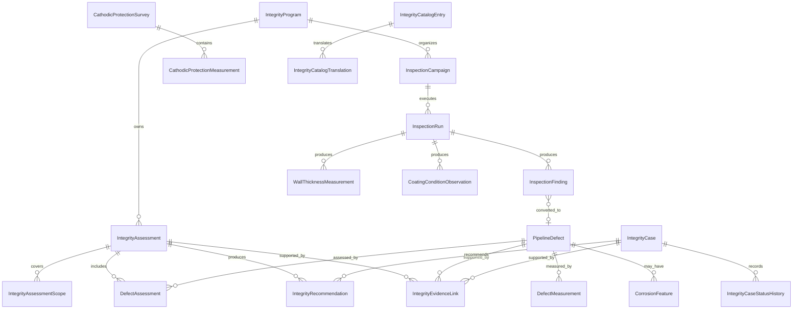

# HIDRA — Network Integrity Module Data Definition Document

```text
Document code : HIDRA-NETWORK-INTEGRITY-DDD
Module        : integrity
Package       : dz.sh.hidra.modules.integrity
Product       : Hidra - Hydrocarbon Intelligence for Data, Risk, and Analytics
Owner         : Sonatrach / TRC : Digitalization Initiative
Author        : Abir MEDJERAB
CreatedOn     : 2026-06-11
Status        : Target data definition document
Evidence      : Target architecture; no implemented integrity Java module found in connected repository searches
```

---

## 1. Purpose

The **Network Integrity** module manages the technical condition of hydrocarbon pipeline network assets.

It answers:

```text
Which pipeline asset is being assessed?
What integrity threats exist?
What inspections, surveys, measurements, or findings support the assessment?
Where is the defect located?
How severe is the defect from an integrity perspective?
What is the remaining-life estimate?
What mitigation, repair, monitoring, or reinspection action is recommended?
What evidence supports the integrity decision?
```

Network Integrity comes after incidents because incidents may reveal integrity degradation, but integrity is broader than incidents. It also consumes inspection and survey evidence that may exist without any incident.

---

## 2. Module ownership

### 2.1 Integrity owns

```text
Integrity programs
Integrity assessment scopes
Inspection campaigns and inspection runs
Inspection findings
Pipeline defects and anomaly records
Corrosion features
Wall-thickness measurements
Coating condition observations
Cathodic protection survey evidence
Threat classification
Defect assessment
Remaining-life estimates
Integrity recommendations
Integrity case lifecycle
Integrity evidence links
Integrity catalogs and translations
```

### 2.2 Integrity references

```text
Topology asset reference
Telemetry reading reference
Monitoring deviation reference
Alarm reference
Incident reference
Organization actor/unit snapshot
Workflow approval reference
Document attachment reference
Audit reference
Asset maintenance/work-order reference
Risk signal/reference
```

### 2.3 Integrity does not own

```text
Topology assets
Telemetry readings
Monitoring rules or operational state
Alarm lifecycle
Incident response lifecycle
Maintenance work orders
Spare parts or asset inventory
HSE compliance cases
Enterprise risk scoring
Workflow routing
Audit event storage
Document binaries
SCADA or OT actuation
```

---

## 3. Boundary rules

### Rule INT-BND-001 — topology reference only

Integrity must reference pipeline systems, pipelines, segments, facilities, equipment, and measurement locations using neutral references only.

Forbidden:

```text
dz.sh.hidra.modules.integrity.* -> dz.sh.hidra.modules.topology.domain.*
dz.sh.hidra.modules.integrity.* -> dz.sh.hidra.modules.topology.infrastructure.*
```

Allowed model:

```text
TopologyAssetReference(
  assetTypeCode,
  assetId,
  assetCode,
  assetNameSnapshot,
  pipelineSystemId optional,
  pipelineId optional,
  segmentId optional,
  kmPoint optional
)
```

### Rule INT-BND-002 — no maintenance execution ownership

Integrity may recommend repair, replacement, monitoring, or reinspection. It must not execute maintenance work orders.

```text
IntegrityRecommendation -> Asset Management / Maintenance reference
```

### Rule INT-BND-003 — no incident lifecycle ownership

An integrity case may be opened from an incident, alarm, leak case, inspection result, or manual engineering concern. Incident lifecycle remains owned by Incident Management.

### Rule INT-BND-004 — no enterprise risk scoring ownership

Integrity may classify technical condition and local severity. Enterprise risk score, exposure, financial risk, and portfolio risk belong to the Risk module.

### Rule INT-BND-005 — evidence-first

Every high-severity integrity decision must be supported by at least one evidence link:

```text
Inspection finding
Wall thickness measurement
CP survey measurement
Coating observation
Telemetry evidence
Incident evidence
Document evidence
```

---

## 4. Naming and persistence convention

Recommended schema/table prefix:

```text
hidra_integrity_*
```

Recommended package:

```text
dz.sh.hidra.modules.integrity
```

Recommended Maven/Gradle module:

```text
hidra-integrity
```

---

## 5. Entity overview

| Entity | Type | Implemented? | Owner | Purpose |
|---|---|---:|---|---|
| `IntegrityProgram` | Aggregate | Target | integrity | Long-running integrity management program for an asset scope. |
| `IntegrityAssessment` | Aggregate | Target | integrity | Formal condition assessment for one scope and period. |
| `IntegrityAssessmentScope` | Entity | Target | integrity | Topology asset scope included in an assessment. |
| `InspectionCampaign` | Aggregate | Target | integrity | Planned/managed inspection campaign. |
| `InspectionRun` | Entity | Target | integrity | Actual inspection execution run. |
| `InspectionFinding` | Entity | Target | integrity | Finding produced by inspection/survey/manual engineering review. |
| `PipelineDefect` | Aggregate | Target | integrity | Canonical defect/anomaly record on a pipeline asset. |
| `DefectMeasurement` | Entity | Target | integrity | Measured dimensions/values of a defect over time. |
| `WallThicknessMeasurement` | Entity | Target | integrity | Wall-thickness evidence from UT/ILI/manual inspection. |
| `CorrosionFeature` | Entity | Target | integrity | Corrosion-specific feature linked to a defect or asset. |
| `CoatingConditionObservation` | Entity | Target | integrity | Coating damage/condition observation. |
| `CathodicProtectionSurvey` | Aggregate | Target | integrity | CP survey campaign/run summary. |
| `CathodicProtectionMeasurement` | Entity | Target | integrity | CP potential/current measurement at location. |
| `IntegrityThreat` | Entity | Target | integrity | Threat classification assigned to asset/defect. |
| `DefectAssessment` | Entity | Target | integrity | Engineering assessment of defect acceptability/severity. |
| `RemainingLifeEstimate` | Entity | Target | integrity | Estimated remaining life from assessment model. |
| `IntegrityRecommendation` | Entity | Target | integrity | Recommended mitigation/repair/monitor/reinspect action. |
| `IntegrityCase` | Aggregate | Target | integrity | Lifecycle container for a technical integrity issue. |
| `IntegrityCaseStatusHistory` | Entity | Target | integrity | Append-only status change history. |
| `IntegrityEvidenceLink` | Entity | Target | integrity | Evidence references supporting integrity decisions. |
| `IntegrityCatalogEntry` | Catalog | Target | integrity | Controlled vocabulary for integrity taxonomy. |
| `IntegrityCatalogTranslation` | Catalog translation | Target | integrity | Multilingual labels/descriptions. |

---

## 6. Shared reference value objects

### 6.1 TopologyAssetReference

| Field | Logical type | Required | Description |
|---|---|---:|---|
| `assetTypeCode` | String | Yes | Referenced topology asset type: `PIPELINE_SYSTEM`, `PIPELINE`, `PIPELINE_SEGMENT`, `FACILITY`, `EQUIPMENT`, `MEASUREMENT_LOCATION`. |
| `assetId` | String | Yes | Stable topology asset identifier. |
| `assetCode` | String | Yes | Asset business code snapshot. |
| `assetNameSnapshot` | String | No | Asset display name snapshot. |
| `pipelineSystemId` | String | No | Parent pipeline system reference if known. |
| `pipelineId` | String | No | Parent pipeline reference if known. |
| `segmentId` | String | No | Segment reference if the evidence is segment-level. |
| `kmPoint` | Decimal | No | Kilometric position where finding/defect is located. |
| `coordinateLatitude` | Decimal | No | Optional geospatial latitude snapshot. |
| `coordinateLongitude` | Decimal | No | Optional geospatial longitude snapshot. |

### 6.2 ActorSnapshot

| Field | Logical type | Required | Description |
|---|---|---:|---|
| `actorId` | String | Yes | Identity actor reference. |
| `actorNameSnapshot` | String | No | Actor display name snapshot. |
| `organizationUnitId` | String | No | Organization unit reference. |
| `organizationUnitCodeSnapshot` | String | No | Organization unit code snapshot. |
| `organizationUnitNameSnapshot` | String | No | Organization unit display name snapshot. |

---

# 7. Core entities

## 7.1 IntegrityProgram

### Description

Long-running integrity management program covering one or more pipeline assets, systems, regions, or threat families.

### Table

```text
hidra_integrity_program
```

### Fields

| Field | Logical type | Required | Description |
|---|---|---:|---|
| `id` | String/UUID | Yes | Stable integrity program identifier. |
| `code` | String | Yes | Unique program business code. |
| `nameAr` | String | No | Arabic program name. |
| `nameFr` | String | Yes | French program name. |
| `nameEn` | String | No | English program name. |
| `programTypeId` | FK/Catalog | Yes | Program type: corrosion, ILI, CP, coating, geohazard, defect reassessment, etc. |
| `description` | Text | No | Program description. |
| `startDate` | Date | Yes | Program start date. |
| `endDate` | Date | No | Planned/completed end date. |
| `ownerOrganizationUnitId` | String | No | Responsible organization unit reference. |
| `status` | Enum | Yes | `DRAFT`, `ACTIVE`, `SUSPENDED`, `COMPLETED`, `CANCELLED`. |
| `createdAt` | Timestamp | Yes | Creation timestamp. |
| `updatedAt` | Timestamp | Yes | Last update timestamp. |

### Rules

```text
Program code must be unique.
Completed programs cannot receive new assessments unless reopened by policy.
Program does not own the topology asset; it owns the integrity work context.
```

---

## 7.2 IntegrityAssessment

### Description

Formal integrity assessment for an asset scope and assessment period.

### Table

```text
hidra_integrity_assessment
```

### Fields

| Field | Logical type | Required | Description |
|---|---|---:|---|
| `id` | String/UUID | Yes | Stable assessment identifier. |
| `programId` | FK | No | Optional parent integrity program. |
| `code` | String | Yes | Unique assessment code. |
| `assessmentTypeId` | FK/Catalog | Yes | Type: baseline, periodic, post-incident, post-repair, anomaly reassessment, etc. |
| `assessmentMethodId` | FK/Catalog | Yes | Method: engineering review, ILI analysis, corrosion growth, FFS, MAOP review, etc. |
| `assessmentPeriodStart` | Date | Yes | Period start. |
| `assessmentPeriodEnd` | Date | No | Period end. |
| `assessmentDate` | Date | Yes | Date assessment was performed. |
| `technicalConditionStatus` | Enum | Yes | `UNKNOWN`, `ACCEPTABLE`, `WATCH`, `DEGRADED`, `CRITICAL`, `OUT_OF_SERVICE_RECOMMENDED`. |
| `summary` | Text | No | Engineering summary. |
| `assessedByActorId` | String | No | Engineer/actor reference. |
| `reviewedByActorId` | String | No | Reviewer reference. |
| `workflowReferenceId` | String | No | Workflow approval reference. |
| `status` | Enum | Yes | `DRAFT`, `UNDER_REVIEW`, `APPROVED`, `REJECTED`, `SUPERSEDED`. |
| `createdAt` | Timestamp | Yes | Creation timestamp. |
| `updatedAt` | Timestamp | Yes | Last update timestamp. |

### Rules

```text
Approved assessments are immutable.
Revision creates a new assessment or new approved version.
An approved assessment must include at least one scope row.
Critical assessments must include evidence and recommendation.
```

---

## 7.3 IntegrityAssessmentScope

### Description

Asset scope included in an integrity assessment.

### Table

```text
hidra_integrity_assessment_scope
```

### Fields

| Field | Logical type | Required | Description |
|---|---|---:|---|
| `id` | String/UUID | Yes | Scope row identifier. |
| `assessmentId` | FK | Yes | Parent assessment. |
| `assetTypeCode` | String | Yes | Topology asset type. |
| `assetId` | String | Yes | Topology asset ID. |
| `assetCode` | String | Yes | Topology asset code snapshot. |
| `assetNameSnapshot` | String | No | Asset name snapshot. |
| `fromKm` | Decimal | No | Start KP/KM of scope. |
| `toKm` | Decimal | No | End KP/KM of scope. |
| `scopeRole` | Enum/Catalog | Yes | `PRIMARY`, `AFFECTED`, `REFERENCE`, `DOWNSTREAM`, `UPSTREAM`. |
| `createdAt` | Timestamp | Yes | Creation timestamp. |

### Rules

```text
If fromKm and toKm are present, fromKm <= toKm.
A scope row references topology, but does not duplicate topology ownership.
```

---

## 7.4 InspectionCampaign

### Description

Planned inspection campaign covering assets, methods, dates, contractors, and expected evidence.

### Table

```text
hidra_integrity_inspection_campaign
```

### Fields

| Field | Logical type | Required | Description |
|---|---|---:|---|
| `id` | String/UUID | Yes | Campaign identifier. |
| `programId` | FK | No | Optional parent integrity program. |
| `code` | String | Yes | Unique campaign code. |
| `inspectionTypeId` | FK/Catalog | Yes | ILI, UT, visual, coating survey, CP survey, hydrotest, drone, geohazard survey, etc. |
| `name` | String | Yes | Campaign name. |
| `plannedStartDate` | Date | Yes | Planned start date. |
| `plannedEndDate` | Date | No | Planned end date. |
| `actualStartDate` | Date | No | Actual start date. |
| `actualEndDate` | Date | No | Actual end date. |
| `contractorPartyId` | String | No | External party reference if contractor performs inspection. |
| `ownerOrganizationUnitId` | String | No | Responsible org unit reference. |
| `status` | Enum | Yes | `PLANNED`, `IN_PROGRESS`, `COMPLETED`, `CANCELLED`, `FAILED`. |
| `createdAt` | Timestamp | Yes | Creation timestamp. |
| `updatedAt` | Timestamp | Yes | Last update timestamp. |

### Boundary note

`contractorPartyId` references a future Party/master-data module if available. It must not be free text.

---

## 7.5 InspectionRun

### Description

Actual inspection execution run. A campaign may have several runs.

### Table

```text
hidra_integrity_inspection_run
```

### Fields

| Field | Logical type | Required | Description |
|---|---|---:|---|
| `id` | String/UUID | Yes | Run identifier. |
| `campaignId` | FK | Yes | Parent inspection campaign. |
| `runCode` | String | Yes | Run code within campaign. |
| `assetTypeCode` | String | Yes | Inspected topology asset type. |
| `assetId` | String | Yes | Inspected topology asset ID. |
| `assetCode` | String | Yes | Asset code snapshot. |
| `toolTypeId` | FK/Catalog | No | Inspection tool type. |
| `toolReference` | String | No | Tool/vehicle/device reference. |
| `startedAt` | Timestamp | Yes | Run start. |
| `completedAt` | Timestamp | No | Run completion. |
| `dataReceivedAt` | Timestamp | No | When data/report was received. |
| `dataQualityStatus` | Enum | Yes | `UNKNOWN`, `ACCEPTABLE`, `PARTIAL`, `POOR`, `REJECTED`. |
| `status` | Enum | Yes | `STARTED`, `COMPLETED`, `DATA_RECEIVED`, `ANALYZED`, `REJECTED`. |
| `summary` | Text | No | Execution summary. |

### Rules

```text
InspectionRun belongs to exactly one campaign.
Finding records must reference run when produced by an inspection.
```

---

## 7.6 InspectionFinding

### Description

Raw or reviewed finding produced by inspection, survey, telemetry review, manual engineering review, or incident follow-up.

### Table

```text
hidra_integrity_inspection_finding
```

### Fields

| Field | Logical type | Required | Description |
|---|---|---:|---|
| `id` | String/UUID | Yes | Finding identifier. |
| `inspectionRunId` | FK | No | Inspection run that produced the finding. |
| `findingTypeId` | FK/Catalog | Yes | Metal loss, dent, crack, coating damage, CP anomaly, weld anomaly, support issue, geohazard, etc. |
| `assetTypeCode` | String | Yes | Referenced topology asset type. |
| `assetId` | String | Yes | Referenced topology asset ID. |
| `assetCode` | String | Yes | Asset code snapshot. |
| `kmPoint` | Decimal | No | Finding location on pipeline. |
| `clockPosition` | String | No | Clock position for pipe finding, e.g. `12:00`, `06:00`. |
| `findingDescription` | Text | No | Finding description. |
| `rawSeverityId` | FK/Catalog | No | Severity given by inspection provider/tool. |
| `reviewedSeverityId` | FK/Catalog | No | Internal reviewed severity. |
| `confidencePercent` | Decimal | No | Confidence in finding. |
| `sourceReferenceType` | String | No | Evidence source: inspection, telemetry, incident, alarm, manual. |
| `sourceReferenceId` | String | No | External/source reference ID. |
| `status` | Enum | Yes | `NEW`, `UNDER_REVIEW`, `ACCEPTED`, `REJECTED`, `CONVERTED_TO_DEFECT`. |
| `detectedAt` | Timestamp | No | Detection time. |
| `createdAt` | Timestamp | Yes | Creation timestamp. |
| `updatedAt` | Timestamp | Yes | Last update timestamp. |

### Rules

```text
Rejected findings must include rejection reason through evidence/history/comment.
Accepted significant findings should be linked to PipelineDefect.
```

---

## 7.7 PipelineDefect

### Description

Canonical integrity defect/anomaly record attached to a topology asset.

### Table

```text
hidra_integrity_pipeline_defect
```

### Fields

| Field | Logical type | Required | Description |
|---|---|---:|---|
| `id` | String/UUID | Yes | Defect identifier. |
| `defectCode` | String | Yes | Unique defect code. |
| `assetTypeCode` | String | Yes | Referenced topology asset type. |
| `assetId` | String | Yes | Referenced topology asset ID. |
| `assetCode` | String | Yes | Asset code snapshot. |
| `pipelineSystemId` | String | No | Pipeline system reference. |
| `pipelineId` | String | No | Pipeline reference. |
| `segmentId` | String | No | Segment reference. |
| `kmPoint` | Decimal | No | Defect KP/KM location. |
| `defectTypeId` | FK/Catalog | Yes | Defect type: corrosion, dent, crack, gouge, weld anomaly, coating failure, support issue, geohazard. |
| `defectOrientation` | String | No | Longitudinal/circumferential/clock position context. |
| `externalInternalSide` | Enum | No | `INTERNAL`, `EXTERNAL`, `UNKNOWN`, `BOTH`. |
| `firstDetectedAt` | Timestamp | No | First detection time. |
| `latestObservedAt` | Timestamp | No | Latest observation time. |
| `currentSeverityId` | FK/Catalog | Yes | Current integrity severity. |
| `currentConditionStatus` | Enum | Yes | `OPEN`, `MONITOR`, `REPAIR_REQUIRED`, `REPAIRED`, `CLOSED`, `FALSE_POSITIVE`. |
| `description` | Text | No | Defect description. |
| `createdAt` | Timestamp | Yes | Creation timestamp. |
| `updatedAt` | Timestamp | Yes | Last update timestamp. |

### Rules

```text
DefectCode must be unique.
Defect must reference a topology asset snapshot.
Closed defects must have closure evidence or repair/assessment reference.
```

---

## 7.8 DefectMeasurement

### Description

Measured dimensions and values for a defect at a point in time.

### Table

```text
hidra_integrity_defect_measurement
```

### Fields

| Field | Logical type | Required | Description |
|---|---|---:|---|
| `id` | String/UUID | Yes | Measurement identifier. |
| `defectId` | FK | Yes | Parent defect. |
| `measurementSourceId` | String | No | Inspection finding/run/source reference. |
| `measuredAt` | Timestamp | Yes | Measurement timestamp. |
| `lengthMm` | Decimal | No | Defect length in millimeters. |
| `widthMm` | Decimal | No | Defect width in millimeters. |
| `depthMm` | Decimal | No | Defect depth in millimeters. |
| `depthPercentWallThickness` | Decimal | No | Depth as percentage of nominal wall thickness. |
| `nominalWallThicknessMm` | Decimal | No | Nominal wall thickness. |
| `remainingWallThicknessMm` | Decimal | No | Remaining wall thickness. |
| `measurementAccuracyId` | FK/Catalog | No | Accuracy/confidence classification. |
| `remarks` | Text | No | Measurement notes. |
| `createdAt` | Timestamp | Yes | Creation timestamp. |

### Rules

```text
At least one dimensional value must be present.
depthPercentWallThickness must be between 0 and 100 if provided.
```

---

## 7.9 WallThicknessMeasurement

### Description

Wall-thickness measurement attached to an asset/location, independent from a specific defect if needed.

### Table

```text
hidra_integrity_wall_thickness_measurement
```

### Fields

| Field | Logical type | Required | Description |
|---|---|---:|---|
| `id` | String/UUID | Yes | Measurement identifier. |
| `assetTypeCode` | String | Yes | Topology asset type. |
| `assetId` | String | Yes | Topology asset ID. |
| `assetCode` | String | Yes | Asset code snapshot. |
| `defectId` | FK | No | Related defect if applicable. |
| `kmPoint` | Decimal | No | Location KP/KM. |
| `measurementMethodId` | FK/Catalog | Yes | UT, ILI, manual gauge, etc. |
| `nominalThicknessMm` | Decimal | No | Nominal wall thickness. |
| `measuredThicknessMm` | Decimal | Yes | Measured wall thickness. |
| `minimumRequiredThicknessMm` | Decimal | No | Minimum required wall thickness. |
| `temperatureC` | Decimal | No | Temperature if relevant. |
| `measuredAt` | Timestamp | Yes | Measurement time. |
| `measuredByActorId` | String | No | Actor/technician reference. |
| `inspectionRunId` | FK | No | Inspection run reference. |
| `createdAt` | Timestamp | Yes | Creation timestamp. |

---

## 7.10 CorrosionFeature

### Description

Corrosion-specific feature linked to a defect or directly to an asset.

### Table

```text
hidra_integrity_corrosion_feature
```

### Fields

| Field | Logical type | Required | Description |
|---|---|---:|---|
| `id` | String/UUID | Yes | Corrosion feature ID. |
| `defectId` | FK | No | Related defect. |
| `assetTypeCode` | String | Yes | Topology asset type. |
| `assetId` | String | Yes | Topology asset ID. |
| `corrosionTypeId` | FK/Catalog | Yes | Internal corrosion, external corrosion, MIC, pitting, general corrosion, under-deposit, etc. |
| `corrosionMechanismId` | FK/Catalog | No | Suspected mechanism. |
| `environmentSide` | Enum | No | `INTERNAL`, `EXTERNAL`, `UNKNOWN`. |
| `estimatedCorrosionRateMmPerYear` | Decimal | No | Estimated rate. |
| `confidencePercent` | Decimal | No | Confidence. |
| `status` | Enum | Yes | `SUSPECTED`, `CONFIRMED`, `MONITORING`, `MITIGATED`, `CLOSED`. |
| `createdAt` | Timestamp | Yes | Creation timestamp. |
| `updatedAt` | Timestamp | Yes | Last update timestamp. |

---

## 7.11 CoatingConditionObservation

### Description

Observation of coating condition, defect, disbondment, holiday, or external protection degradation.

### Table

```text
hidra_integrity_coating_condition_observation
```

### Fields

| Field | Logical type | Required | Description |
|---|---|---:|---|
| `id` | String/UUID | Yes | Observation ID. |
| `assetTypeCode` | String | Yes | Topology asset type. |
| `assetId` | String | Yes | Topology asset ID. |
| `assetCode` | String | Yes | Asset code snapshot. |
| `kmPoint` | Decimal | No | Location. |
| `coatingTypeId` | FK/Catalog | No | Coating type if known. |
| `conditionId` | FK/Catalog | Yes | Good, damaged, disbonded, holiday detected, missing, unknown. |
| `defectAreaM2` | Decimal | No | Estimated affected area. |
| `observationMethodId` | FK/Catalog | No | Visual, DCVG, ACVG, CIPS, excavation, etc. |
| `observedAt` | Timestamp | Yes | Observation time. |
| `inspectionRunId` | FK | No | Inspection run reference. |
| `remarks` | Text | No | Notes. |

---

## 7.12 CathodicProtectionSurvey

### Description

Cathodic protection survey/campaign summary.

### Table

```text
hidra_integrity_cp_survey
```

### Fields

| Field | Logical type | Required | Description |
|---|---|---:|---|
| `id` | String/UUID | Yes | CP survey ID. |
| `campaignId` | FK | No | Optional inspection campaign. |
| `code` | String | Yes | Unique CP survey code. |
| `surveyTypeId` | FK/Catalog | Yes | CIPS, DCVG, ACVG, potential survey, rectifier survey, test-post survey, etc. |
| `assetTypeCode` | String | Yes | Surveyed asset type. |
| `assetId` | String | Yes | Surveyed asset ID. |
| `assetCode` | String | Yes | Asset code snapshot. |
| `startedAt` | Timestamp | Yes | Survey start. |
| `completedAt` | Timestamp | No | Survey completion. |
| `status` | Enum | Yes | `PLANNED`, `IN_PROGRESS`, `COMPLETED`, `REVIEWED`, `REJECTED`. |
| `summary` | Text | No | Survey summary. |
| `createdAt` | Timestamp | Yes | Creation timestamp. |
| `updatedAt` | Timestamp | Yes | Last update timestamp. |

---

## 7.13 CathodicProtectionMeasurement

### Description

Individual CP measurement point/value from a CP survey.

### Table

```text
hidra_integrity_cp_measurement
```

### Fields

| Field | Logical type | Required | Description |
|---|---|---:|---|
| `id` | String/UUID | Yes | CP measurement ID. |
| `surveyId` | FK | Yes | Parent CP survey. |
| `assetTypeCode` | String | Yes | Asset type. |
| `assetId` | String | Yes | Asset ID. |
| `kmPoint` | Decimal | No | KP/KM. |
| `testPostReference` | String | No | Test post or measurement location reference. |
| `potentialMv` | Decimal | No | Pipe-to-soil potential in mV. |
| `instantOffPotentialMv` | Decimal | No | Instant-off potential in mV. |
| `currentAmpere` | Decimal | No | Current value where applicable. |
| `measurementConditionId` | FK/Catalog | No | On/off/native/other condition. |
| `measuredAt` | Timestamp | Yes | Measurement timestamp. |
| `qualityId` | FK/Catalog | No | Measurement quality. |
| `remarks` | Text | No | Notes. |

### Rules

```text
At least one numeric CP value must be present.
Measurement values are integrity evidence; they do not replace telemetry readings.
```

---

## 7.14 IntegrityThreat

### Description

Threat classification assigned to an asset, assessment, defect, or case.

### Table

```text
hidra_integrity_threat
```

### Fields

| Field | Logical type | Required | Description |
|---|---|---:|---|
| `id` | String/UUID | Yes | Threat row ID. |
| `targetType` | Enum | Yes | `ASSET`, `DEFECT`, `ASSESSMENT`, `CASE`. |
| `targetId` | String | Yes | Referenced target ID. |
| `threatTypeId` | FK/Catalog | Yes | Corrosion, third-party damage, ground movement, fatigue, incorrect operation, material defect, equipment failure, etc. |
| `likelihoodClassId` | FK/Catalog | No | Technical likelihood class, not enterprise risk score. |
| `severityClassId` | FK/Catalog | No | Technical severity class. |
| `confidencePercent` | Decimal | No | Confidence. |
| `basis` | Text | No | Basis for classification. |
| `assignedAt` | Timestamp | Yes | Assignment timestamp. |
| `assignedByActorId` | String | No | Actor reference. |

---

## 7.15 DefectAssessment

### Description

Engineering assessment of a defect’s acceptability and severity.

### Table

```text
hidra_integrity_defect_assessment
```

### Fields

| Field | Logical type | Required | Description |
|---|---|---:|---|
| `id` | String/UUID | Yes | Defect assessment ID. |
| `defectId` | FK | Yes | Assessed defect. |
| `assessmentId` | FK | No | Parent integrity assessment. |
| `assessmentMethodId` | FK/Catalog | Yes | Method/standard/model reference. |
| `assessmentDate` | Date | Yes | Assessment date. |
| `operatingPressureBar` | Decimal | No | Operating pressure considered. |
| `maopBar` | Decimal | No | MAOP considered. |
| `safetyFactor` | Decimal | No | Safety factor if applicable. |
| `acceptable` | Boolean | Yes | Whether defect is acceptable under assessment criteria. |
| `severityId` | FK/Catalog | Yes | Technical severity. |
| `assessmentResult` | Text | No | Engineering result. |
| `assessedByActorId` | String | No | Actor reference. |
| `reviewedByActorId` | String | No | Reviewer reference. |
| `status` | Enum | Yes | `DRAFT`, `REVIEWED`, `APPROVED`, `SUPERSEDED`. |
| `createdAt` | Timestamp | Yes | Creation timestamp. |
| `updatedAt` | Timestamp | Yes | Last update timestamp. |

---

## 7.16 RemainingLifeEstimate

### Description

Estimated remaining life for a defect or asset based on measurements and assumptions.

### Table

```text
hidra_integrity_remaining_life_estimate
```

### Fields

| Field | Logical type | Required | Description |
|---|---|---:|---|
| `id` | String/UUID | Yes | Estimate ID. |
| `targetType` | Enum | Yes | `DEFECT`, `ASSET`, `SEGMENT`, `ASSESSMENT`. |
| `targetId` | String | Yes | Target reference. |
| `estimateMethodId` | FK/Catalog | Yes | Corrosion growth, statistical model, engineering method, conservative estimate, etc. |
| `basisMeasurementId` | String | No | Measurement/assessment reference. |
| `corrosionRateMmPerYear` | Decimal | No | Corrosion rate assumption. |
| `remainingLifeYears` | Decimal | Yes | Estimated remaining life. |
| `nextInspectionDueDate` | Date | No | Recommended next inspection due date. |
| `confidencePercent` | Decimal | No | Confidence. |
| `assumptionSummary` | Text | No | Assumptions. |
| `estimatedAt` | Timestamp | Yes | Estimate timestamp. |
| `estimatedByActorId` | String | No | Actor reference. |

### Rules

```text
Remaining life estimate must state method and assumptions.
If remainingLifeYears is below threshold, recommendation is required.
```

---

## 7.17 IntegrityRecommendation

### Description

Recommended action from an integrity assessment, defect assessment, remaining-life estimate, case, or inspection finding.

### Table

```text
hidra_integrity_recommendation
```

### Fields

| Field | Logical type | Required | Description |
|---|---|---:|---|
| `id` | String/UUID | Yes | Recommendation ID. |
| `sourceType` | Enum | Yes | `ASSESSMENT`, `DEFECT`, `FINDING`, `CASE`, `REMAINING_LIFE_ESTIMATE`. |
| `sourceId` | String | Yes | Source reference. |
| `recommendationTypeId` | FK/Catalog | Yes | Repair, replace, recoat, reduce pressure, monitor, reinspect, excavate, CP adjustment, engineering review. |
| `priorityId` | FK/Catalog | Yes | Priority. |
| `description` | Text | Yes | Recommended action description. |
| `dueDate` | Date | No | Recommended due date. |
| `targetAssetTypeCode` | String | No | Asset type. |
| `targetAssetId` | String | No | Asset ID. |
| `maintenanceReferenceId` | String | No | Future asset/work-order reference if action is transferred. |
| `status` | Enum | Yes | `PROPOSED`, `APPROVED`, `TRANSFERRED`, `IN_PROGRESS_EXTERNAL`, `COMPLETED`, `CANCELLED`, `SUPERSEDED`. |
| `createdByActorId` | String | No | Creator reference. |
| `createdAt` | Timestamp | Yes | Creation timestamp. |
| `updatedAt` | Timestamp | Yes | Last update timestamp. |

### Boundary note

`IntegrityRecommendation` is not a work order. Execution belongs to Asset Management / Maintenance.

---

## 7.18 IntegrityCase

### Description

Lifecycle container for one technical integrity issue, from detection or concern to closure.

### Table

```text
hidra_integrity_case
```

### Fields

| Field | Logical type | Required | Description |
|---|---|---:|---|
| `id` | String/UUID | Yes | Integrity case ID. |
| `caseNumber` | String | Yes | Unique case number. |
| `caseTypeId` | FK/Catalog | Yes | Corrosion case, defect case, CP case, coating case, post-incident integrity case, leak follow-up, etc. |
| `title` | String | Yes | Case title. |
| `description` | Text | No | Case description. |
| `assetTypeCode` | String | Yes | Primary topology asset type. |
| `assetId` | String | Yes | Primary topology asset ID. |
| `assetCode` | String | Yes | Asset code snapshot. |
| `sourceType` | Enum | No | `INSPECTION`, `INCIDENT`, `ALARM`, `LEAK_CASE`, `MONITORING`, `MANUAL`, `AUDIT`, `RISK_REVIEW`. |
| `sourceReferenceId` | String | No | Source module reference. |
| `severityId` | FK/Catalog | Yes | Integrity severity. |
| `ownerOrganizationUnitId` | String | No | Responsible organization unit reference. |
| `assignedActorId` | String | No | Assigned engineer/actor. |
| `openedAt` | Timestamp | Yes | Opening timestamp. |
| `closedAt` | Timestamp | No | Closure timestamp. |
| `status` | Enum | Yes | `OPEN`, `UNDER_ASSESSMENT`, `ACTION_REQUIRED`, `MONITORING`, `WAITING_EXTERNAL_ACTION`, `RESOLVED`, `CLOSED`, `CANCELLED`. |
| `createdAt` | Timestamp | Yes | Creation timestamp. |
| `updatedAt` | Timestamp | Yes | Last update timestamp. |

### Rules

```text
Closure requires at least one resolution/assessment/recommendation outcome.
Case must preserve source reference when created from alarm, incident, or leak case.
Case status history is append-only.
```

---

## 7.19 IntegrityCaseStatusHistory

### Description

Append-only history of integrity case status changes.

### Table

```text
hidra_integrity_case_status_history
```

### Fields

| Field | Logical type | Required | Description |
|---|---|---:|---|
| `id` | String/UUID | Yes | Status history ID. |
| `caseId` | FK | Yes | Parent integrity case. |
| `fromStatus` | Enum | No | Previous status. |
| `toStatus` | Enum | Yes | New status. |
| `reason` | Text | No | Reason for status change. |
| `changedByActorId` | String | No | Actor reference. |
| `changedAt` | Timestamp | Yes | Change timestamp. |

---

## 7.20 IntegrityEvidenceLink

### Description

Evidence references supporting integrity findings, assessments, cases, and recommendations.

### Table

```text
hidra_integrity_evidence_link
```

### Fields

| Field | Logical type | Required | Description |
|---|---|---:|---|
| `id` | String/UUID | Yes | Evidence link ID. |
| `targetType` | Enum | Yes | `ASSESSMENT`, `DEFECT`, `FINDING`, `CASE`, `RECOMMENDATION`, `REMAINING_LIFE_ESTIMATE`. |
| `targetId` | String | Yes | Target reference. |
| `evidenceType` | Enum | Yes | `TELEMETRY_READING`, `MONITORING_DEVIATION`, `ALARM`, `INCIDENT`, `LEAK_CASE`, `INSPECTION_RUN`, `INSPECTION_REPORT`, `DOCUMENT`, `PHOTO`, `MEASUREMENT`, `WORK_ORDER`, `AUDIT_EVENT`. |
| `evidenceReferenceId` | String | Yes | Evidence source reference. |
| `evidenceLabel` | String | No | Human-readable label. |
| `description` | Text | No | Evidence description. |
| `linkedByActorId` | String | No | Actor reference. |
| `linkedAt` | Timestamp | Yes | Link timestamp. |

---

## 7.21 IntegrityCatalogEntry

### Description

Controlled vocabulary entry for integrity taxonomies.

### Table

```text
hidra_integrity_catalog_entry
```

### Fields

| Field | Logical type | Required | Description |
|---|---|---:|---|
| `id` | String/UUID | Yes | Catalog entry ID. |
| `catalogName` | String | Yes | Catalog name. Examples: `DEFECT_TYPE`, `THREAT_TYPE`, `INSPECTION_TYPE`, `SEVERITY`, `ASSESSMENT_METHOD`, `RECOMMENDATION_TYPE`. |
| `code` | String | Yes | Stable code. |
| `active` | Boolean | Yes | Whether active. |
| `sortOrder` | Integer | Yes | Display order. |
| `systemDefined` | Boolean | Yes | Whether system-defined. |
| `createdAt` | Timestamp | Yes | Creation timestamp. |
| `updatedAt` | Timestamp | Yes | Last update timestamp. |

### Rules

```text
Unique(catalogName, code).
User-facing catalogs must have translations.
Do not model business taxonomy as Java enums.
```

---

## 7.22 IntegrityCatalogTranslation

### Description

Multilingual label and description for integrity catalog entries.

### Table

```text
hidra_integrity_catalog_translation
```

### Fields

| Field | Logical type | Required | Description |
|---|---|---:|---|
| `id` | String/UUID | Yes | Translation ID. |
| `catalogEntryId` | FK | Yes | Catalog entry reference. |
| `locale` | String | Yes | `ar`, `fr`, `en`. |
| `name` | String | Yes | Localized label. |
| `description` | Text | No | Localized description. |
| `createdAt` | Timestamp | Yes | Creation timestamp. |
| `updatedAt` | Timestamp | Yes | Last update timestamp. |

### Rules

```text
Unique(catalogEntryId, locale).
At minimum, French should exist for operational screens.
```

---

# 8. Status and technical enums

Technical lifecycle enums are allowed when they are stable and not user-facing taxonomy.

## 8.1 IntegrityProgramStatus

```text
DRAFT
ACTIVE
SUSPENDED
COMPLETED
CANCELLED
```

## 8.2 IntegrityAssessmentStatus

```text
DRAFT
UNDER_REVIEW
APPROVED
REJECTED
SUPERSEDED
```

## 8.3 TechnicalConditionStatus

```text
UNKNOWN
ACCEPTABLE
WATCH
DEGRADED
CRITICAL
OUT_OF_SERVICE_RECOMMENDED
```

## 8.4 DefectConditionStatus

```text
OPEN
MONITOR
REPAIR_REQUIRED
REPAIRED
CLOSED
FALSE_POSITIVE
```

## 8.5 IntegrityCaseStatus

```text
OPEN
UNDER_ASSESSMENT
ACTION_REQUIRED
MONITORING
WAITING_EXTERNAL_ACTION
RESOLVED
CLOSED
CANCELLED
```

---

# 9. Catalogs

Business taxonomies must use catalog entries and translations.

Recommended catalog names:

```text
PROGRAM_TYPE
ASSESSMENT_TYPE
ASSESSMENT_METHOD
INSPECTION_TYPE
INSPECTION_TOOL_TYPE
FINDING_TYPE
DEFECT_TYPE
DEFECT_SEVERITY
THREAT_TYPE
LIKELIHOOD_CLASS
SEVERITY_CLASS
CORROSION_TYPE
CORROSION_MECHANISM
COATING_TYPE
COATING_CONDITION
CP_SURVEY_TYPE
CP_MEASUREMENT_CONDITION
MEASUREMENT_ACCURACY
RECOMMENDATION_TYPE
RECOMMENDATION_PRIORITY
CASE_TYPE
EVIDENCE_TYPE
```

Example defect types:

```text
INTERNAL_CORROSION
EXTERNAL_CORROSION
DENT
GOUGE
CRACK
WELD_ANOMALY
COATING_DAMAGE
CP_ANOMALY
SUPPORT_DEFECT
GEOHAZARD
THIRD_PARTY_DAMAGE
MATERIAL_DEFECT
UNKNOWN_ANOMALY
```

Example inspection types:

```text
ILI
ULTRASONIC_THICKNESS
VISUAL_INSPECTION
COATING_SURVEY
CIPS
DCVG
ACVG
HYDROSTATIC_TEST
EXCAVATION_INSPECTION
DRONE_SURVEY
GEOTECHNICAL_SURVEY
```

---

# 10. Relationships

```text
IntegrityProgram 1 -> N IntegrityAssessment
IntegrityProgram 1 -> N InspectionCampaign

IntegrityAssessment 1 -> N IntegrityAssessmentScope
IntegrityAssessment 1 -> N DefectAssessment
IntegrityAssessment 1 -> N IntegrityRecommendation
IntegrityAssessment 1 -> N IntegrityEvidenceLink

InspectionCampaign 1 -> N InspectionRun
InspectionRun 1 -> N InspectionFinding
InspectionRun 1 -> N WallThicknessMeasurement
InspectionRun 1 -> N CoatingConditionObservation

InspectionFinding 0..1 -> 1 PipelineDefect
PipelineDefect 1 -> N DefectMeasurement
PipelineDefect 1 -> N DefectAssessment
PipelineDefect 0..1 -> N CorrosionFeature
PipelineDefect 1 -> N IntegrityEvidenceLink

CathodicProtectionSurvey 1 -> N CathodicProtectionMeasurement

IntegrityCase 1 -> N IntegrityCaseStatusHistory
IntegrityCase 1 -> N IntegrityEvidenceLink
IntegrityCase 1 -> N IntegrityRecommendation
IntegrityCase 0..N -> N PipelineDefect

IntegrityCatalogEntry 1 -> N IntegrityCatalogTranslation
```

---

# 11. Validation rules

| Rule code | Rule |
|---|---|
| `INT-VAL-001` | Approved integrity assessments are immutable. |
| `INT-VAL-002` | Critical assessment requires evidence and recommendation. |
| `INT-VAL-003` | Defect code must be unique. |
| `INT-VAL-004` | Defect measurement must include at least one dimensional value. |
| `INT-VAL-005` | `depthPercentWallThickness` must be between 0 and 100. |
| `INT-VAL-006` | Remaining-life estimate requires method and assumptions. |
| `INT-VAL-007` | Integrity case closure requires assessment, recommendation outcome, or dismissal reason. |
| `INT-VAL-008` | Case status history is append-only. |
| `INT-VAL-009` | Catalog names and codes are unique. |
| `INT-VAL-010` | Business taxonomies require multilingual translations. |
| `INT-VAL-011` | High-severity defects must not be closed as false positive without evidence. |
| `INT-VAL-012` | Integrity recommendations transferred to Asset Management must preserve maintenance/work-order reference. |

---

# 12. Recommended indexes and constraints

```sql
-- Program
CREATE UNIQUE INDEX uk_hidra_integrity_program_code
    ON hidra_integrity_program (code);

-- Assessment
CREATE UNIQUE INDEX uk_hidra_integrity_assessment_code
    ON hidra_integrity_assessment (code);
CREATE INDEX idx_hidra_integrity_assessment_program
    ON hidra_integrity_assessment (program_id);
CREATE INDEX idx_hidra_integrity_assessment_status
    ON hidra_integrity_assessment (status);

-- Assessment scope
CREATE INDEX idx_hidra_integrity_assessment_scope_assessment
    ON hidra_integrity_assessment_scope (assessment_id);
CREATE INDEX idx_hidra_integrity_assessment_scope_asset
    ON hidra_integrity_assessment_scope (asset_type_code, asset_id);

-- Campaign/run/finding
CREATE UNIQUE INDEX uk_hidra_integrity_campaign_code
    ON hidra_integrity_inspection_campaign (code);
CREATE INDEX idx_hidra_integrity_run_campaign
    ON hidra_integrity_inspection_run (campaign_id);
CREATE INDEX idx_hidra_integrity_finding_run
    ON hidra_integrity_inspection_finding (inspection_run_id);
CREATE INDEX idx_hidra_integrity_finding_asset_location
    ON hidra_integrity_inspection_finding (asset_type_code, asset_id, km_point);

-- Defect
CREATE UNIQUE INDEX uk_hidra_integrity_defect_code
    ON hidra_integrity_pipeline_defect (defect_code);
CREATE INDEX idx_hidra_integrity_defect_asset_location
    ON hidra_integrity_pipeline_defect (asset_type_code, asset_id, km_point);
CREATE INDEX idx_hidra_integrity_defect_type_status
    ON hidra_integrity_pipeline_defect (defect_type_id, current_condition_status);

-- Measurements
CREATE INDEX idx_hidra_integrity_defect_measurement_defect
    ON hidra_integrity_defect_measurement (defect_id, measured_at);
CREATE INDEX idx_hidra_integrity_wall_thickness_asset
    ON hidra_integrity_wall_thickness_measurement (asset_type_code, asset_id, km_point, measured_at);

-- CP
CREATE UNIQUE INDEX uk_hidra_integrity_cp_survey_code
    ON hidra_integrity_cp_survey (code);
CREATE INDEX idx_hidra_integrity_cp_measurement_survey
    ON hidra_integrity_cp_measurement (survey_id);
CREATE INDEX idx_hidra_integrity_cp_measurement_asset
    ON hidra_integrity_cp_measurement (asset_type_code, asset_id, km_point, measured_at);

-- Case
CREATE UNIQUE INDEX uk_hidra_integrity_case_number
    ON hidra_integrity_case (case_number);
CREATE INDEX idx_hidra_integrity_case_asset
    ON hidra_integrity_case (asset_type_code, asset_id);
CREATE INDEX idx_hidra_integrity_case_status
    ON hidra_integrity_case (status);

-- Evidence
CREATE INDEX idx_hidra_integrity_evidence_target
    ON hidra_integrity_evidence_link (target_type, target_id);
CREATE INDEX idx_hidra_integrity_evidence_reference
    ON hidra_integrity_evidence_link (evidence_type, evidence_reference_id);

-- Catalog
CREATE UNIQUE INDEX uk_hidra_integrity_catalog_name_code
    ON hidra_integrity_catalog_entry (catalog_name, code);
CREATE UNIQUE INDEX uk_hidra_integrity_catalog_translation_locale
    ON hidra_integrity_catalog_translation (catalog_entry_id, locale);
```

---

# 13. Mermaid ER diagram



---

# 14. Integration with other modules

## 14.1 From Incident Management

```text
Incident
  -> IntegrityCase(sourceType = INCIDENT, sourceReferenceId = incidentId)
```

Incident owns operational response. Integrity owns technical condition investigation.

## 14.2 From Leak Detection

```text
LeakDetectionCase
  -> IntegrityCase(sourceType = LEAK_CASE, sourceReferenceId = leakCaseId)
```

Leak Detection owns leak suspicion/localization. Integrity owns structural/condition follow-up.

## 14.3 From Alarm Management

```text
Alarm
  -> IntegrityCase(sourceType = ALARM, sourceReferenceId = alarmId)
```

Alarm lifecycle remains outside integrity.

## 14.4 From Telemetry and Monitoring

```text
TrustedTelemetryReading -> IntegrityEvidenceLink
MonitoringDeviation -> IntegrityEvidenceLink
```

Integrity can use telemetry and deviation evidence but must not mutate telemetry or monitoring state.

## 14.5 To Asset Management

```text
IntegrityRecommendation
  -> MaintenanceWorkOrder / AssetAction reference
```

Integrity recommends. Asset Management executes.

## 14.6 To Risk

```text
IntegrityThreat
DefectAssessment
RemainingLifeEstimate
IntegrityCase
  -> RiskSignal / RiskAssessment input
```

Integrity provides technical condition evidence. Risk owns portfolio and enterprise risk scoring.

---

# 15. Explicit non-goals

Network Integrity must not become:

```text
A full asset maintenance system
A work-order execution module
A spare-parts system
A GIS topology editor
A telemetry historian
A risk scoring engine
An HSE compliance case system
A SCADA control module
```

---

# 16. Final module rule

```text
Network Integrity owns pipeline condition evidence, defect assessment, and integrity recommendations.
Topology owns the physical network.
Telemetry owns measurements.
Monitoring owns deviations.
Alarms own formal alarm lifecycle.
Incidents own response lifecycle.
Asset Management owns maintenance execution.
Risk owns enterprise risk scoring.
```
