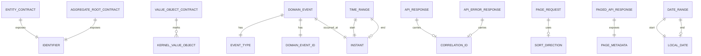

# HIDRA — Kernel Module Data Definition Document

```text
Document code       : HIDRA-KERNEL-DDD
Repository          : HidraAPI
Canonical namespace : dz.sh.hidra.kernel
Product             : Hidra — Hydrocarbon Intelligence for Data, Risk, and Analytics
Module              : kernel
Document type       : Data / Value Definition Document
Version             : 1.0
Status              : Architecture baseline candidate
Owner               : Sonatrach TRC Digitalization Initiative
Author              : Abir MEDJERAB
GeneratedOn         : 2026-06-11
```

---

## 1. Purpose

This document defines the **Kernel Module data/value model** for Hidra.

The kernel module is not a business module. It does **not** own physical database tables, hydrocarbon process entities, users, employees, topology assets, telemetry readings, workflows, audit records, reports, or integrations.

The kernel module owns only the minimum reusable primitives and contracts that are safe to share across bounded contexts.

Its role is to provide:

1. domain modeling contracts;
2. immutable value-object foundations;
3. generic identifiers;
4. temporal range primitives;
5. generic event contracts;
6. generic application result contracts;
7. pagination and sorting contracts;
8. API response and error contracts;
9. domain exception base types.

---

## 2. Kernel Ownership Rules

### 2.1 Kernel owns

The kernel module owns:

| Category | Examples |
|---|---|
| Domain modeling contracts | `Entity`, `AggregateRoot`, `ValueObject` |
| Domain events foundation | `DomainEvent`, `DomainEventId` |
| Generic identifiers | `CorrelationId`, `RequestId`, `ActorId` |
| Time/date primitives | `DateRange`, `TimeRange` |
| Application contracts | `Command`, `Query`, `Result`, `Page`, `PageRequest` |
| API contracts | `ApiResponse`, `PagedApiResponse`, `ApiErrorResponse`, `ValidationErrorDetail` |
| Generic exceptions | `DomainException`, `BusinessRuleViolationException`, `InvalidValueObjectException` |

### 2.2 Kernel must not own

The kernel module must not own:

| Forbidden ownership | Correct owner |
|---|---|
| `User`, `Role`, `Permission`, ABAC policy | `identity` |
| `Employee`, `OrganizationUnit`, `Position` | `organization` |
| `Pipeline`, `Facility`, `Equipment`, `TopologyNode` | `topology` |
| `TelemetryPoint`, `TelemetryReading`, `TelemetryDevice` | `telemetry` |
| `WorkflowTask`, `WorkflowInstance`, `WorkflowDecision` | `workflow` |
| `AuditRecord`, `BeforeAfterSnapshot` | `audit` |
| `Party`, `Supplier`, `Vendor`, `Contractor` | `party` |
| `Alarm`, `Incident`, `SimulationRun`, `KpiValue` | respective business module |

### 2.3 Boundary rule

Kernel objects must be:

```text
small
immutable where possible
domain-neutral
framework-independent
business-agnostic
safe to import by every module
```

Kernel objects must not depend on:

```text
Spring
JPA / Hibernate
Jackson annotations
database schemas
REST controllers
module-specific domain packages
module-specific repositories
external system clients
```

---

## 3. Kernel Logical Type System

The following logical field types are used in this document.

| Logical type | Java representation | Description |
|---|---|---|
| `IdentifierText` | `String` | Stable identifier text, usually UUID or business-neutral ID string. |
| `CodeText` | `String` | Stable uppercase or normalized code. |
| `MessageText` | `String` | Human-readable message. |
| `InstantValue` | `java.time.Instant` | Absolute timestamp. |
| `DateValue` | `java.time.LocalDate` | Calendar date without time. |
| `IntegerValue` | `int` / `Integer` | Integer number. |
| `BooleanValue` | `boolean` / `Boolean` | True/false value. |
| `GenericPayload<T>` | `T` | Generic response or result payload. |
| `EnumValue` | Java enum | Closed set owned by kernel only when generic. |
| `ObjectList<T>` | `List<T>` | Ordered collection. |
| `OptionalText` | `String`, nullable | Optional normalized text. |

---

## 4. Domain Modeling Contracts

These are not database entities. They are Java contracts that every module may implement or use.

---

### 4.1 Entity

**Package:** `dz.sh.hidra.kernel.domain.model`  
**Kind:** Interface  
**Persistence:** None  
**Purpose:** Minimal domain entity contract exposing a stable identifier.

| Field / Method | Type | Required | Description |
|---|---:|---:|---|
| `id()` | Generic `ID` | Yes | Returns the stable identifier of the entity. |

#### Rules

- `Entity<ID>` must not define persistence behavior.
- Equality strategy remains module-specific unless standardized later.
- No JPA annotations are allowed in kernel contracts.

---

### 4.2 AggregateRoot

**Package:** `dz.sh.hidra.kernel.domain.model`  
**Kind:** Interface  
**Persistence:** None  
**Purpose:** Minimal aggregate-root contract exposing a stable identifier.

| Field / Method | Type | Required | Description |
|---|---:|---:|---|
| `id()` | Generic `ID` | Yes | Returns the stable identifier of the aggregate root. |

#### Rules

- Aggregate invariants are owned by the business module, not kernel.
- Kernel does not know aggregate names such as `Pipeline`, `Facility`, `User`, or `TelemetryPoint`.
- Kernel may later provide a domain-event recording pattern, but only if it remains generic.

---

### 4.3 ValueObject

**Package:** `dz.sh.hidra.kernel.domain.model`  
**Kind:** Marker interface  
**Persistence:** None  
**Purpose:** Marker for immutable value objects.

| Field / Method | Type | Required | Description |
|---|---:|---:|---|
| None | N/A | N/A | Marker only. |

#### Rules

- Value objects should be immutable.
- Value objects must validate their own internal consistency.
- Business-specific value objects belong in their module, not in kernel.

Examples of module-owned value objects that must **not** move to kernel:

```text
TopologyCode
FacilityTypeReference
TelemetryUnitReference
RoleCode
WorkflowTargetReference
```

---

## 5. Domain Event Foundation

---

### 5.1 DomainEvent

**Package:** `dz.sh.hidra.kernel.domain.event`  
**Kind:** Interface  
**Persistence:** None  
**Purpose:** Generic contract for domain events emitted by business modules.

| Field / Method | Type | Required | Description |
|---|---:|---:|---|
| `eventId()` | `DomainEventId` | Yes | Unique event identifier. |
| `occurredAt()` | `InstantValue` | Yes | Timestamp when the domain event occurred. |
| `eventType()` | `CodeText` | Yes | Stable event type name, for example `TopologySnapshotApproved`. |

#### Rules

- Event payload is owned by the emitting module.
- Kernel defines the minimum event contract only.
- Outbox persistence belongs to `platform`, not kernel.
- Business event names are owned by the module that emits them.

#### Relationship

```text
BusinessAggregate
  emits DomainEvent

DomainEvent
  has DomainEventId
  has occurredAt
  has eventType
```

---

### 5.2 DomainEventId

**Package:** `dz.sh.hidra.kernel.domain.event`  
**Kind:** Value object / record  
**Persistence:** None  
**Purpose:** Immutable identifier for domain events.

| Field | Type | Required | Description |
|---|---:|---:|---|
| `value` | `IdentifierText` | Yes | Non-blank unique event identifier. Usually UUID text. |

#### Factory methods

| Method | Description |
|---|---|
| `of(String value)` | Restores an event ID from text. |
| `newId()` | Generates a new UUID-based event ID. |

#### Validation

- `value` must not be null.
- `value` must not be blank.
- Stored value is trimmed.

---

## 6. Generic Identifier Value Objects

These identifiers are intentionally generic and must not carry business meaning.

---

### 6.1 CorrelationId

**Package:** `dz.sh.hidra.kernel.domain.value`  
**Kind:** Value object / record  
**Persistence:** None  
**Purpose:** Groups related operations across commands, events, logs, audit, outbox, and API responses.

| Field | Type | Required | Description |
|---|---:|---:|---|
| `value` | `IdentifierText` | Yes | Non-blank correlation identifier. Usually UUID text. |

#### Factory methods

| Method | Description |
|---|---|
| `of(String value)` | Restores an existing correlation ID. |
| `newId()` | Generates a new UUID-based correlation ID. |

#### Used by

| Consumer | Usage |
|---|---|
| API layer | Include correlation ID in response. |
| Application layer | Carry correlation across command handling. |
| Audit module | Link audit evidence to request/use case. |
| Platform outbox | Link outgoing events to original command. |
| Observability | Link logs/traces/metrics. |

---

### 6.2 RequestId

**Package:** `dz.sh.hidra.kernel.domain.value`  
**Kind:** Value object / record  
**Persistence:** None  
**Purpose:** Identifies one incoming request or operation attempt.

| Field | Type | Required | Description |
|---|---:|---:|---|
| `value` | `IdentifierText` | Yes | Non-blank request identifier. |

#### Rules

- A `RequestId` identifies one request.
- A `CorrelationId` may span multiple requests, retries, events, or side effects.
- Do not use `RequestId` as a business entity ID.

---

### 6.3 ActorId

**Package:** `dz.sh.hidra.kernel.domain.value`  
**Kind:** Value object / record  
**Persistence:** None  
**Purpose:** Generic actor reference without user, employee, service, or party business meaning.

| Field | Type | Required | Description |
|---|---:|---:|---|
| `value` | `IdentifierText` | Yes | Non-blank actor identifier. |

#### Boundary rule

`ActorId` is only a generic reference.

It must not become:

```text
UserId
EmployeeId
PartyId
ServiceAccountId
```

Those business-specific identifiers belong to their respective modules.

---

## 7. Temporal Value Objects

---

### 7.1 DateRange

**Package:** `dz.sh.hidra.kernel.domain.value`  
**Kind:** Value object / class  
**Persistence:** None  
**Purpose:** Immutable date-only range using `LocalDate` boundaries.

| Field | Type | Required | Description |
|---|---:|---:|---|
| `start` | `DateValue` | Yes | Start date, inclusive. |
| `end` | `DateValue`, nullable | No | End date, inclusive. Null means open-ended. |

#### Factory methods

| Method | Description |
|---|---|
| `closed(LocalDate start, LocalDate end)` | Creates a finite date range. `end` required. |
| `openEnded(LocalDate start)` | Creates a range with no end date. |

#### Behavior

| Method | Description |
|---|---|
| `contains(LocalDate date)` | Returns true if date is within the range. |

#### Validation

- `start` must not be null.
- `end`, when present, must not be before `start`.

---

### 7.2 TimeRange

**Package:** `dz.sh.hidra.kernel.domain.value`  
**Kind:** Value object / class  
**Persistence:** None  
**Purpose:** Immutable timestamp range using `Instant` boundaries.

| Field | Type | Required | Description |
|---|---:|---:|---|
| `start` | `InstantValue` | Yes | Start instant, inclusive. |
| `end` | `InstantValue`, nullable | No | End instant, inclusive. Null means open-ended. |

#### Factory methods

| Method | Description |
|---|---|
| `closed(Instant start, Instant end)` | Creates a finite instant range. `end` required. |
| `openEnded(Instant start)` | Creates an open-ended instant range. |

#### Behavior

| Method | Description |
|---|---|
| `contains(Instant instant)` | Returns true if instant is within the range. |

#### Validation

- `start` must not be null.
- `end`, when present, must not be before `start`.

---

## 8. Application Layer Contracts

Kernel application contracts are framework-neutral. They must not depend on Spring MVC, Spring Data, JPA, Hibernate, messaging frameworks, or database APIs.

---

### 8.1 Command

**Package:** `dz.sh.hidra.kernel.application.command`  
**Kind:** Marker interface  
**Persistence:** None  
**Purpose:** Marks an application request that intends to change state.

| Field / Method | Type | Required | Description |
|---|---:|---:|---|
| None | N/A | N/A | Marker only. |

#### Rules

- Business command fields belong in module-specific command records.
- Kernel does not define generic CRUD commands.
- Commands that modify state must be handled by module application services/use cases.

---

### 8.2 Query

**Package:** `dz.sh.hidra.kernel.application.query`  
**Kind:** Marker interface  
**Persistence:** None  
**Purpose:** Marks an application request that reads state without mutation.

| Field / Method | Type | Required | Description |
|---|---:|---:|---|
| None | N/A | N/A | Marker only. |

#### Rules

- Query payload fields belong in module-specific query records.
- Queries must not mutate domain state.
- Read models/projections belong to owning modules or analytics/reporting modules.

---

### 8.3 Result

**Package:** `dz.sh.hidra.kernel.application.result`  
**Kind:** Generic result contract / value object  
**Persistence:** None  
**Purpose:** Standard application result wrapper independent from HTTP.

| Field | Type | Required | Description |
|---|---:|---:|---|
| `status` | `ResultStatus` | Yes | Result status. |
| `value` | `GenericPayload<T>` | Conditional | Successful result payload. |
| `message` | `MessageText` | No | Optional message. |
| `errorCode` | `CodeText` | Conditional | Machine-readable error code for failures. |

#### ResultStatus

| Value | Meaning |
|---|---|
| `SUCCESS` | Operation succeeded. |
| `NOT_FOUND` | Requested aggregate/resource was not found. |
| `VALIDATION_ERROR` | Input or business validation failed. |
| `CONFLICT` | State conflict or idempotency conflict. |
| `FORBIDDEN` | Actor lacks permission. |
| `FAILURE` | Generic failure. |

#### Rules

- HTTP mapping belongs to API/platform exception handling, not the domain.
- Domain exceptions are preferred for invariant violations.
- Application results may be used for query/use-case outcomes.

---

## 9. Pagination and Sorting Contracts

---

### 9.1 PageRequest

**Package:** `dz.sh.hidra.kernel.application.pagination`  
**Kind:** Value object / record  
**Persistence:** None  
**Purpose:** Immutable, framework-independent pagination request.

| Field | Type | Required | Description |
|---|---:|---:|---|
| `page` | `IntegerValue` | Yes | Zero-based page index. Must be `>= 0`. |
| `size` | `IntegerValue` | Yes | Page size. Must be between `1` and `MAX_PAGE_SIZE`. |
| `sortField` | `OptionalText` | No | Optional logical sort field. Blank becomes null. |
| `sortDirection` | `SortDirection`, nullable | No | Sort direction. Defaults to `ASC` when `sortField` is present and direction is absent. |

#### Constants

| Constant | Value | Description |
|---|---:|---|
| `MAX_PAGE_SIZE` | `200` | Maximum allowed page size. |

#### Factory methods

| Method | Description |
|---|---|
| `of(int page, int size)` | Creates an unsorted page request. |
| `sorted(int page, int size, String sortField, SortDirection sortDirection)` | Creates a sorted page request. |

---

### 9.2 SortDirection

**Package:** `dz.sh.hidra.kernel.application.pagination`  
**Kind:** Enum  
**Persistence:** None  
**Purpose:** Generic sort direction.

| Value | Description |
|---|---|
| `ASC` | Ascending order. |
| `DESC` | Descending order. |

---

### 9.3 Page

**Package:** `dz.sh.hidra.kernel.application.pagination`  
**Kind:** Generic value object / record  
**Persistence:** None  
**Purpose:** Framework-independent page result.

| Field | Type | Required | Description |
|---|---:|---:|---|
| `content` | `ObjectList<T>` | Yes | Page items. Empty list allowed. |
| `page` | `IntegerValue` | Yes | Current page index. |
| `size` | `IntegerValue` | Yes | Requested or actual page size. |
| `totalElements` | `long` | Yes | Total matching items. |
| `totalPages` | `int` | Yes | Total number of pages. |

#### Rules

- Do not expose Spring Data `Page` outside infrastructure adapters.
- Convert persistence pages to kernel `Page<T>` before returning from application ports.

---

## 10. API Contracts

Kernel API contracts are generic response/error shapes. They do not own business REST endpoints.

---

### 10.1 ApiResponse

**Package:** `dz.sh.hidra.kernel.api.response`  
**Kind:** Generic record  
**Persistence:** None  
**Purpose:** Generic API response wrapper for successful operations.

| Field | Type | Required | Description |
|---|---:|---:|---|
| `data` | `GenericPayload<T>` | No | Response payload. |
| `message` | `OptionalText` | No | Optional human-readable message. |
| `correlationId` | `OptionalText` | No | Correlation identifier for support/tracing. |
| `timestamp` | `InstantValue` | Yes | Response creation timestamp. |

#### Validation

- `timestamp` must not be null.
- `message` is trimmed; blank becomes null.
- `correlationId` is trimmed; blank becomes null.

---

### 10.2 PagedApiResponse

**Package:** `dz.sh.hidra.kernel.api.response`  
**Kind:** Generic record  
**Persistence:** None  
**Purpose:** Generic API response wrapper for paged operations.

| Field | Type | Required | Description |
|---|---:|---:|---|
| `content` | `ObjectList<T>` | Yes | Returned items. |
| `page` | `IntegerValue` | Yes | Current page index. |
| `size` | `IntegerValue` | Yes | Page size. |
| `totalElements` | `long` | Yes | Total number of matching rows/items. |
| `totalPages` | `int` | Yes | Number of pages. |
| `correlationId` | `OptionalText` | No | Correlation identifier. |
| `timestamp` | `InstantValue` | Yes | Response timestamp. |

---

### 10.3 ApiErrorResponse

**Package:** `dz.sh.hidra.kernel.api.error`  
**Kind:** Record  
**Persistence:** None  
**Purpose:** Generic API error response shape.

| Field | Type | Required | Description |
|---|---:|---:|---|
| `code` | `ApiErrorCode` | Yes | Machine-readable error code. |
| `message` | `MessageText` | Yes | Human-readable error message. |
| `path` | `OptionalText` | No | Request path. |
| `correlationId` | `OptionalText` | No | Correlation identifier. |
| `timestamp` | `InstantValue` | Yes | Error timestamp. |
| `validationErrors` | `ObjectList<ValidationErrorDetail>` | No | Field-level validation errors. |

---

### 10.4 ValidationErrorDetail

**Package:** `dz.sh.hidra.kernel.api.error`  
**Kind:** Record  
**Persistence:** None  
**Purpose:** Describes one validation error.

| Field | Type | Required | Description |
|---|---:|---:|---|
| `field` | `OptionalText` | No | Field name or JSON path. |
| `message` | `MessageText` | Yes | Human-readable validation message. |
| `rejectedValue` | `OptionalText` | No | Sanitized rejected value when safe. |

---

### 10.5 ApiErrorCode

**Package:** `dz.sh.hidra.kernel.api.error`  
**Kind:** Enum  
**Persistence:** None  
**Purpose:** Generic machine-readable API error categories.

| Value | HTTP tendency | Description |
|---|---:|---|
| `VALIDATION_ERROR` | `400/422` | Invalid request or validation failure. |
| `BUSINESS_RULE_VIOLATION` | `422` | Domain rule violation. |
| `NOT_FOUND` | `404` | Requested resource not found. |
| `CONFLICT` | `409` | State conflict. |
| `FORBIDDEN` | `403` | Authorization failure. |
| `UNAUTHORIZED` | `401` | Authentication required or invalid. |
| `INTERNAL_ERROR` | `500` | Unexpected server failure. |

---

## 11. Exception Model

Kernel may define generic exception base classes. Business-specific exception names belong to business modules.

---

### 11.1 DomainException

**Package:** `dz.sh.hidra.kernel.domain.exception`  
**Kind:** Abstract/base exception  
**Persistence:** None  
**Purpose:** Base exception for domain-level failures.

| Field | Type | Required | Description |
|---|---:|---:|---|
| `message` | `MessageText` | Yes | Error message. |
| `cause` | `Throwable` | No | Optional cause. |

---

### 11.2 BusinessRuleViolationException

**Package:** `dz.sh.hidra.kernel.domain.exception`  
**Kind:** Exception  
**Persistence:** None  
**Purpose:** Generic exception for violated domain rules.

| Field | Type | Required | Description |
|---|---:|---:|---|
| `message` | `MessageText` | Yes | Description of rule violation. |

#### Rule

Use this only for generic invariant violations. Prefer module-specific exceptions when the rule is important enough to name.

Examples:

```text
TopologySnapshotNotApprovedException
TelemetryQualityRejectedException
WorkflowDecisionRequiredException
```

---

### 11.3 InvalidValueObjectException

**Package:** `dz.sh.hidra.kernel.domain.exception`  
**Kind:** Exception  
**Persistence:** None  
**Purpose:** Raised when a value object is created with invalid internal state.

| Field | Type | Required | Description |
|---|---:|---:|---|
| `message` | `MessageText` | Yes | Description of invalid value. |

---

## 12. Relationships Between Kernel Concepts



---

## 13. Kernel Relationship Rules with Business Modules

| Kernel concept | Used by | Relationship type |
|---|---|---|
| `AggregateRoot<ID>` | Business aggregate roots | Implemented by module domain aggregates. |
| `Entity<ID>` | Business child entities | Implemented by module domain entities. |
| `ValueObject` | Business value objects | Implemented by immutable module-owned values. |
| `DomainEvent` | Business module events | Implemented by module domain events. |
| `DomainEventId` | Events and outbox payloads | Used as event identity. |
| `CorrelationId` | API, application, audit, outbox, observability | Passed across boundaries. |
| `ActorId` | Audit, workflow, identity references | Generic actor reference only. |
| `DateRange` | Planning, contracts, validity windows | Generic date-validity primitive. |
| `TimeRange` | Telemetry, monitoring, events, audit | Generic time-validity primitive. |
| `PageRequest` | Query use cases | Input contract for paged reads. |
| `ApiResponse` | API layer | Output wrapper. |

---

## 14. Kernel Data Persistence Decision

The kernel module must not have its own database schema.

```text
No hidrakernel schema.
No kernel migration files.
No kernel JPA entities.
No kernel repositories.
```

Persistence decisions belong to:

| Concern | Owner |
|---|---|
| Outbox table | `platform` |
| Audit table | `audit` |
| Identity tables | `identity` |
| Organization tables | `organization` |
| Topology tables | `topology` |
| Telemetry tables | `telemetry` |

Kernel value objects may be embedded or mapped by infrastructure adapters in business modules, but kernel itself does not persist them.

---

## 15. Allowed and Forbidden Dependencies

### 15.1 Allowed kernel dependencies

```text
java.base
java.time
java.util
```

### 15.2 Forbidden kernel dependencies

```text
org.springframework.*
jakarta.persistence.*
org.hibernate.*
com.fasterxml.jackson.*
javax.sql.*
module-specific packages such as dz.sh.hidra.modules.topology.*
```

---

## 16. Current Implementation Alignment

| Kernel object | Current implementation status | Decision |
|---|---|---|
| `Entity` | Implemented | Keep minimal. |
| `AggregateRoot` | Implemented | Keep minimal. |
| `ValueObject` | Implemented | Keep marker-only. |
| `DomainEvent` | Implemented | Keep minimal; enrich via metadata wrapper outside domain if needed. |
| `DomainEventId` | Implemented | Keep. |
| `CorrelationId` | Implemented | Keep. |
| `ActorId` | Implemented | Keep generic; do not turn into `UserId`. |
| `RequestId` | Implemented | Keep separate from `CorrelationId`. |
| `DateRange` | Implemented | Keep. |
| `TimeRange` | Implemented | Keep. |
| `PageRequest` | Implemented | Keep max size policy. |
| `ApiResponse` | Implemented | Keep. |

---

## 17. Recommended Kernel Enhancements

The following additions are safe if kept business-neutral.

### 17.1 Generic strongly typed identifier base

Optional abstract/pattern only, not required immediately.

```text
TypedId
```

Purpose: reduce repeated ID validation in modules while avoiding business-specific IDs in kernel.

### 17.2 Quantity primitive

```text
Quantity
```

Fields:

| Field | Type | Required | Description |
|---|---:|---:|---|
| `value` | decimal | Yes | Numeric value. |
| `unitCode` | text | Yes | Unit code, but not module-specific unit catalog. |

Caution: if units become business-rich and configurable, unit catalog belongs to `configuration` or a dedicated `measurement` module, not kernel.

### 17.3 Percentage primitive

```text
Percentage
```

Fields:

| Field | Type | Required | Description |
|---|---:|---:|---|
| `value` | decimal | Yes | Percentage value. Usually 0–100 unless a use case explicitly allows larger values. |

### 17.4 GeoPoint primitive

```text
GeoPoint
```

Fields:

| Field | Type | Required | Description |
|---|---:|---:|---|
| `latitude` | decimal | Yes | Latitude in decimal degrees. |
| `longitude` | decimal | Yes | Longitude in decimal degrees. |
| `elevationMeters` | decimal | No | Optional elevation. |

Caution: GIS topology, map layers, and spatial reference systems belong to `topology`, not kernel.

### 17.5 Version primitive

```text
Version
```

Fields:

| Field | Type | Required | Description |
|---|---:|---:|---|
| `number` | integer | Yes | Positive version number. |

Useful for topology snapshots, configuration revisions, workflow definitions, and document versions.

---

## 18. Final Kernel Statement

The kernel module is Hidra's **small shared language of neutral primitives**, not a shared business model.

Correct kernel philosophy:

```text
share primitives, not business concepts
share contracts, not repositories
share value objects, not entities
share event shape, not event ownership
```

The kernel must remain small enough that every business module can depend on it without creating coupling, ambiguity, or hidden ownership violations.
