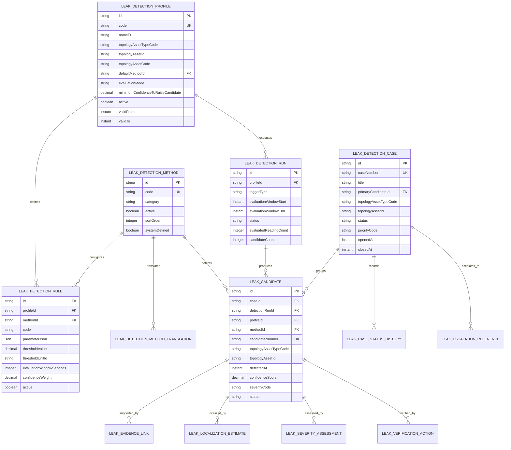

# HIDRA — Leak Detection Module Data Definition Document

```text
Document code : HIDRA-LEAK-DETECTION-DDD
Module        : leakdetection
Package root  : dz.sh.hidra.modules.leakdetection
Product       : Hidra - Hydrocarbon Intelligence for Data, Risk, and Analytics
Author        : Abir MEDJERAB
Owner         : Sonatrach / TRC : Digitalization Initiative
CreatedOn     : 2026-06-11
Status        : Target data definition document
Evidence      : HyFlo-first search performed; no explicit implemented leak-detection module found. Hidra scope/architecture used for boundaries.
```

---

## 1. Purpose

The **Leak Detection** module detects, evaluates, localizes, and explains suspected hydrocarbon leaks using trusted operational evidence.

It answers:

```text
Is there evidence of a possible leak?
Which pipeline, segment, facility, or topology area is affected?
Which method detected the suspicion?
What telemetry, monitoring, alarm, or operational evidence supports it?
How severe is the suspicion?
Where is the estimated leak location?
How confident is the detection?
Has the suspicion been verified, dismissed, confirmed, or escalated?
```

Leak Detection is an **operational intelligence module**, not a control system and not a SCADA actuation system.

---

## 2. Position in the Hidra chain

```text
Topology
  -> Telemetry
      -> Planning
          -> Monitoring
              -> Alarm Management
                  -> Leak Detection
                      -> Incident Management
```

Leak Detection comes after Monitoring and Alarm Management because it needs:

```text
trusted topology
trusted telemetry
planned/expected operating state
monitoring deviations
alarm context
```

It comes before Incident Management because a confirmed or high-confidence leak suspicion may trigger an operational incident.

---

## 3. Ownership boundaries

## 3.1 Leak Detection owns

```text
LeakDetectionProfile
LeakDetectionMethodCatalog
LeakDetectionMethodTranslation
LeakDetectionRule
LeakDetectionRun
LeakCandidate
LeakEvidenceLink
LeakLocalizationEstimate
LeakSeverityAssessment
LeakVerificationAction
LeakDetectionCase
LeakCaseStatusHistory
LeakEscalationReference
LeakDismissalReason
```

## 3.2 Leak Detection references

```text
Topology asset reference
Telemetry reading reference
Monitoring evaluation reference
Monitoring alert candidate reference
Alarm reference
Planning target reference
Incident reference after escalation
Actor snapshot
Organization unit snapshot
Workflow reference if confirmation requires approval
Audit reference
```

## 3.3 Leak Detection does not own

```text
pipeline, facility, segment, node, equipment, or topology graph
telemetry readings
trusted telemetry readings
monitoring thresholds
monitoring evaluations
alarm lifecycle
incident lifecycle
notification delivery
maintenance work orders
SCADA commands
valve/pump/compressor actuation
hydraulic simulation engine
full digital twin engine
```

---

## 4. Non-negotiable safety rule

Leak Detection in Hidra is **decision support only**.

Forbidden behavior:

```text
automatic valve closure
automatic pump shutdown
automatic compressor shutdown
automatic PLC/RTU/SCADA command
automatic ESD/SIS interaction
direct write to OT control systems
```

Allowed behavior:

```text
create leak candidate
raise leak suspicion
calculate confidence
estimate location
link evidence
request operator verification
escalate to Alarm Management or Incident Management
emit audit-ready events
```

---

## 5. Evidence level

| Area | Evidence level | Note |
|---|---:|---|
| Existing Java implementation | Not found | No implemented leak-detection module found through repository searches. |
| Module placement | Target architecture | Based on Hidra operational chain and module boundaries. |
| Telemetry dependency | Repository-backed | Telemetry owns operational measurement facts. |
| Monitoring dependency | Repository-backed | Monitoring interprets telemetry into operational states, deviations, alerts, and risk signals. |
| Leak data model | Target DDD | Defined here as the implementation target. |

---

## 6. Canonical package structure

```text
dz.sh.hidra.modules.leakdetection
  api
    rest
      controller
      request
      response
      mapper
  application
    command
    query
    dto
    port
      in
      out
    service
    mapper
  domain
    model
    value
    event
    policy
    service
    exception
  infrastructure
    configuration
    persistence
      entity
      repository
      mapper
      adapter
    adapter
    messaging
    projection
```

Forbidden packages:

```text
dz.sh.hidra.modules.leakdetection.shared
dz.sh.hidra.modules.leakdetection.common
dz.sh.hidra.modules.leakdetection.core
dz.sh.hidra.modules.leakdetection.utils
dz.sh.hidra.modules.leakdetection.helper
dz.sh.hidra.modules.leakdetection.helpers
dz.sh.hidra.modules.leakdetection.misc
```

---

# 7. Entity summary

| Entity | Type | Persistence | Description |
|---|---|---:|---|
| `LeakDetectionProfile` | Aggregate | Yes | Detection configuration for a pipeline/system/topology scope. |
| `LeakDetectionMethodCatalog` | Catalog entity | Yes | Controlled vocabulary for detection methods. |
| `LeakDetectionMethodTranslation` | Catalog translation | Yes | Multilingual labels for detection methods. |
| `LeakDetectionRule` | Entity | Yes | Rule attached to a profile and method. |
| `LeakDetectionRun` | Entity | Yes | Execution/evaluation run of a detection profile. |
| `LeakCandidate` | Aggregate | Yes | Suspected leak event produced by detection. |
| `LeakEvidenceLink` | Entity | Yes | Evidence supporting or contradicting a candidate. |
| `LeakLocalizationEstimate` | Entity | Yes | Estimated leak location and uncertainty. |
| `LeakSeverityAssessment` | Entity | Yes | Severity/confidence classification for a candidate. |
| `LeakVerificationAction` | Entity | Yes | Operator or technical verification action. |
| `LeakDetectionCase` | Aggregate | Yes | Controlled lifecycle record grouping one or more candidates. |
| `LeakCaseStatusHistory` | Entity | Yes | Append-only case state transition history. |
| `LeakEscalationReference` | Entity | Yes | Reference to created alarm, incident, workflow, or notification. |
| `LeakDismissalReason` | Catalog entity | Yes | Controlled reasons for dismissing a leak suspicion. |

---

# 8. Entity definitions

---

## 8.1 LeakDetectionProfile

## Purpose

Defines where and how leak detection is configured.

A profile is usually attached to:

```text
pipeline system
pipeline
pipeline segment
station/facility operational scope
```

It does not own the topology asset; it stores a neutral topology reference.

## Table

```text
hidra_leak_detection_profile
```

## Fields

| Field | Logical type | Required | Description |
|---|---:|---:|---|
| `id` | LeakDetectionProfileId | Yes | Stable profile identifier. |
| `code` | String | Yes | Unique business code. Example: `LDP_GZ1_MAINLINE`. |
| `nameAr` | String | No | Arabic display name. |
| `nameFr` | String | Yes | French display name. |
| `nameEn` | String | No | English display name. |
| `topologyAssetTypeCode` | String | Yes | Referenced asset type: `PIPELINE_SYSTEM`, `PIPELINE`, `PIPELINE_SEGMENT`, `FACILITY`. |
| `topologyAssetId` | String | Yes | Referenced topology asset ID. |
| `topologyAssetCode` | String | Yes | Snapshot of referenced asset code. |
| `topologyAssetNameSnapshot` | String | No | Snapshot of asset name for historical display. |
| `defaultMethodId` | FK -> LeakDetectionMethodCatalog | No | Default method for this profile. |
| `evaluationMode` | Enum | Yes | `REAL_TIME`, `PERIODIC`, `MANUAL`, `BATCH_REPLAY`. |
| `evaluationIntervalSeconds` | Integer | No | Periodic evaluation interval. |
| `minimumConfidenceToRaiseCandidate` | Decimal | Yes | Confidence threshold from 0 to 1. |
| `minimumSeverityToEscalate` | Enum | No | Minimum severity required for automatic escalation proposal. |
| `active` | Boolean | Yes | Whether profile is active. |
| `validFrom` | Instant | Yes | Profile effective start. |
| `validTo` | Instant | No | Profile effective end. |
| `createdAt` | Instant | Yes | Creation timestamp. |
| `updatedAt` | Instant | Yes | Last update timestamp. |

## Rules

```text
Profile code must be unique.
Profile must reference one topology scope.
Only active profiles can generate leak candidates.
Profile validity periods must not overlap for the same topology scope and method unless explicitly allowed.
```

---

## 8.2 LeakDetectionMethodCatalog

## Purpose

Controlled vocabulary of leak detection methods.

Examples:

```text
MASS_BALANCE
COMPENSATED_MASS_BALANCE
PRESSURE_DROP
FLOW_IMBALANCE
RATE_OF_CHANGE
NEGATIVE_PRESSURE_WAVE
MODEL_BASED_RTTM
OPERATOR_OBSERVATION
ALARM_CORRELATION
```

These are catalog entries, not Java enums, because labels and descriptions are user-facing and multilingual.

## Table

```text
hidra_leak_detection_method
```

## Fields

| Field | Logical type | Required | Description |
|---|---:|---:|---|
| `id` | LeakDetectionMethodId | Yes | Stable method identifier. |
| `code` | String | Yes | Unique method code. |
| `category` | String | Yes | `BALANCE`, `PRESSURE`, `FLOW`, `MODEL`, `OPERATOR`, `CORRELATION`. |
| `active` | Boolean | Yes | Whether method can be used. |
| `sortOrder` | Integer | Yes | Display order. |
| `systemDefined` | Boolean | Yes | Whether the method is system-defined. |
| `createdAt` | Instant | Yes | Creation timestamp. |
| `updatedAt` | Instant | Yes | Last update timestamp. |

---

## 8.3 LeakDetectionMethodTranslation

## Table

```text
hidra_leak_detection_method_translation
```

| Field | Logical type | Required | Description |
|---|---:|---:|---|
| `id` | String | Yes | Stable translation identifier. |
| `methodId` | FK -> LeakDetectionMethodCatalog | Yes | Translated method. |
| `locale` | String | Yes | `ar`, `fr`, `en`. |
| `name` | String | Yes | Localized name. |
| `description` | String | No | Localized description. |
| `createdAt` | Instant | Yes | Creation timestamp. |
| `updatedAt` | Instant | Yes | Last update timestamp. |

---

## 8.4 LeakDetectionRule

## Purpose

Defines threshold, correlation, or algorithm parameters used by a profile.

## Table

```text
hidra_leak_detection_rule
```

| Field | Logical type | Required | Description |
|---|---:|---:|---|
| `id` | LeakDetectionRuleId | Yes | Stable rule identifier. |
| `profileId` | FK -> LeakDetectionProfile | Yes | Profile owning the rule. |
| `methodId` | FK -> LeakDetectionMethodCatalog | Yes | Detection method used by this rule. |
| `code` | String | Yes | Rule code unique per profile. |
| `nameAr` | String | No | Arabic name. |
| `nameFr` | String | Yes | French name. |
| `nameEn` | String | No | English name. |
| `parameterJson` | JSON | Yes | Method-specific parameters. |
| `thresholdValue` | Decimal | No | Numeric threshold when applicable. |
| `thresholdUnitId` | String | No | Unit reference when threshold is numeric. |
| `evaluationWindowSeconds` | Integer | No | Time window for evaluation. |
| `minimumSamples` | Integer | No | Minimum evidence samples required. |
| `confidenceWeight` | Decimal | Yes | Weight of this rule in confidence calculation. |
| `severityWeight` | Decimal | Yes | Weight of this rule in severity assessment. |
| `active` | Boolean | Yes | Whether rule is active. |
| `validFrom` | Instant | Yes | Effective start. |
| `validTo` | Instant | No | Effective end. |
| `createdAt` | Instant | Yes | Creation timestamp. |
| `updatedAt` | Instant | Yes | Last update timestamp. |

## Examples of `parameterJson`

```json
{
  "inletFlowPointCode": "FT_INLET_001",
  "outletFlowPointCode": "FT_OUTLET_001",
  "imbalanceTolerancePercent": 2.5,
  "minimumDurationSeconds": 300
}
```

```json
{
  "pressurePointCode": "PT_SEG_004",
  "dropThresholdBar": 1.2,
  "windowSeconds": 120
}
```

## Rule

Use typed columns for common searchable values and JSON only for method-specific parameters.

---

## 8.5 LeakDetectionRun

## Purpose

Represents one execution of detection logic for a profile.

Runs are useful for auditability and explainability.

## Table

```text
hidra_leak_detection_run
```

| Field | Logical type | Required | Description |
|---|---:|---:|---|
| `id` | LeakDetectionRunId | Yes | Stable run identifier. |
| `profileId` | FK -> LeakDetectionProfile | Yes | Evaluated profile. |
| `triggerType` | Enum | Yes | `SCHEDULED`, `TELEMETRY_EVENT`, `ALARM_EVENT`, `MANUAL`, `BATCH_REPLAY`. |
| `triggerReferenceType` | String | No | Referenced trigger type. |
| `triggerReferenceId` | String | No | Referenced trigger id. |
| `evaluationWindowStart` | Instant | Yes | Start of evaluated window. |
| `evaluationWindowEnd` | Instant | Yes | End of evaluated window. |
| `status` | Enum | Yes | `STARTED`, `COMPLETED`, `FAILED`, `PARTIAL`. |
| `evaluatedReadingCount` | Integer | Yes | Number of telemetry readings considered. |
| `candidateCount` | Integer | Yes | Number of candidates produced. |
| `startedAt` | Instant | Yes | Run start timestamp. |
| `completedAt` | Instant | No | Run completion timestamp. |
| `failureReason` | String | No | Failure reason if failed. |
| `correlationId` | String | No | Correlation id. |

---

## 8.6 LeakCandidate

## Purpose

Represents a suspected leak produced by detection logic or manually created by an authorized operator.

A candidate is not automatically an incident.

## Table

```text
hidra_leak_candidate
```

## Fields

| Field | Logical type | Required | Description |
|---|---:|---:|---|
| `id` | LeakCandidateId | Yes | Stable candidate identifier. |
| `caseId` | FK -> LeakDetectionCase | No | Case grouping this candidate. |
| `detectionRunId` | FK -> LeakDetectionRun | No | Run that produced the candidate. |
| `profileId` | FK -> LeakDetectionProfile | Yes | Profile that detected or accepted the candidate. |
| `methodId` | FK -> LeakDetectionMethodCatalog | Yes | Primary detection method. |
| `candidateNumber` | String | Yes | Human-readable candidate number. |
| `topologyAssetTypeCode` | String | Yes | Suspected topology asset type. |
| `topologyAssetId` | String | Yes | Suspected topology asset id. |
| `topologyAssetCode` | String | Yes | Suspected topology asset code snapshot. |
| `topologyAssetNameSnapshot` | String | No | Suspected asset name snapshot. |
| `detectedAt` | Instant | Yes | Time candidate was detected by Hidra. |
| `suspectedStartAt` | Instant | No | Estimated start of leak behavior. |
| `suspectedEndAt` | Instant | No | Optional end of suspicious behavior. |
| `confidenceScore` | Decimal | Yes | 0 to 1 score. |
| `severityCode` | String | Yes | `INFO`, `LOW`, `MEDIUM`, `HIGH`, `CRITICAL`. |
| `status` | Enum | Yes | `OPEN`, `UNDER_VERIFICATION`, `CONFIRMED`, `DISMISSED`, `ESCALATED`, `CLOSED`. |
| `primaryEvidenceSummary` | Text | No | Human-readable explanation. |
| `createdByActorId` | String | No | Actor snapshot if manual/operator-created. |
| `createdByActorNameSnapshot` | String | No | Actor name snapshot. |
| `createdAt` | Instant | Yes | Creation timestamp. |
| `updatedAt` | Instant | Yes | Last update timestamp. |

## Status lifecycle

```text
OPEN
  -> UNDER_VERIFICATION
      -> CONFIRMED
          -> ESCALATED
              -> CLOSED
      -> DISMISSED
          -> CLOSED
```

Allowed shortcut:

```text
OPEN -> DISMISSED
OPEN -> ESCALATED  only when severity/confidence policy allows it
```

---

## 8.7 LeakEvidenceLink

## Purpose

Links telemetry, monitoring, alarm, planning, topology, or operator evidence to a leak candidate.

## Table

```text
hidra_leak_evidence_link
```

| Field | Logical type | Required | Description |
|---|---:|---:|---|
| `id` | LeakEvidenceLinkId | Yes | Stable evidence link identifier. |
| `candidateId` | FK -> LeakCandidate | Yes | Candidate being supported/contradicted. |
| `evidenceType` | Enum | Yes | `TELEMETRY_READING`, `TRUSTED_READING`, `MONITORING_EVALUATION`, `ALARM`, `PLANNING_TARGET`, `TOPOLOGY_ASSET`, `OPERATOR_NOTE`, `DOCUMENT`, `PHOTO`, `FIELD_REPORT`. |
| `evidenceReferenceId` | String | Yes | Referenced entity id. |
| `evidenceReferenceCode` | String | No | Business code or display reference. |
| `evidenceTimestamp` | Instant | No | Timestamp of the evidence. |
| `evidenceRole` | Enum | Yes | `SUPPORTING`, `CONTRADICTING`, `CONTEXT`, `ROOT_TRIGGER`. |
| `weight` | Decimal | No | Evidence weight in confidence calculation. |
| `summary` | Text | No | Evidence explanation. |
| `createdAt` | Instant | Yes | Creation timestamp. |

## Rule

Do not copy telemetry values into leak evidence except small snapshots needed for explainability. The source module remains owner.

---

## 8.8 LeakLocalizationEstimate

## Purpose

Stores estimated leak location, uncertainty, and method.

## Table

```text
hidra_leak_localization_estimate
```

| Field | Logical type | Required | Description |
|---|---:|---:|---|
| `id` | LeakLocalizationEstimateId | Yes | Stable localization identifier. |
| `candidateId` | FK -> LeakCandidate | Yes | Candidate being localized. |
| `methodId` | FK -> LeakDetectionMethodCatalog | Yes | Localization method. |
| `pipelineId` | String | No | Topology pipeline reference. |
| `pipelineCodeSnapshot` | String | No | Pipeline code snapshot. |
| `segmentId` | String | No | Segment reference if known. |
| `segmentCodeSnapshot` | String | No | Segment code snapshot. |
| `estimatedKilometerPoint` | Decimal | No | Estimated KP/PK along the pipeline. |
| `fromNodeId` | String | No | Upstream node reference snapshot. |
| `toNodeId` | String | No | Downstream node reference snapshot. |
| `latitude` | Decimal | No | Estimated latitude. |
| `longitude` | Decimal | No | Estimated longitude. |
| `uncertaintyMeters` | Decimal | No | Uncertainty radius/distance. |
| `confidenceScore` | Decimal | Yes | 0 to 1 confidence for this estimate. |
| `calculatedAt` | Instant | Yes | Calculation timestamp. |
| `calculationDetailsJson` | JSON | No | Method-specific calculation details. |

## Rule

`estimatedKilometerPoint`, coordinates, and node references are estimates. They must never mutate topology.

---

## 8.9 LeakSeverityAssessment

## Purpose

Stores severity evaluation for a candidate.

## Table

```text
hidra_leak_severity_assessment
```

| Field | Logical type | Required | Description |
|---|---:|---:|---|
| `id` | LeakSeverityAssessmentId | Yes | Stable severity assessment identifier. |
| `candidateId` | FK -> LeakCandidate | Yes | Candidate being assessed. |
| `severityCode` | String | Yes | Severity catalog/code. |
| `confidenceScore` | Decimal | Yes | Confidence score used for assessment. |
| `estimatedLeakRate` | Decimal | No | Estimated leak rate. |
| `leakRateUnitId` | String | No | Unit reference. |
| `estimatedLostVolume` | Decimal | No | Estimated lost volume. |
| `lostVolumeUnitId` | String | No | Unit reference. |
| `estimatedDurationSeconds` | Integer | No | Estimated duration. |
| `environmentSensitivityCode` | String | No | Optional environmental sensitivity snapshot/reference. |
| `populationExposureCode` | String | No | Optional exposure code. |
| `operationalImpactCode` | String | No | Optional operational impact code. |
| `assessmentReason` | Text | No | Explanation of severity. |
| `assessedAt` | Instant | Yes | Assessment timestamp. |
| `assessedBy` | Enum | Yes | `SYSTEM`, `OPERATOR`, `WORKFLOW`. |
| `actorId` | String | No | Actor snapshot when human-assessed. |

## Rule

Estimated lost volume is an operational estimate, not custody-transfer measurement.

---

## 8.10 LeakVerificationAction

## Purpose

Tracks operator, field, or technical actions used to verify or dismiss a leak candidate.

## Table

```text
hidra_leak_verification_action
```

| Field | Logical type | Required | Description |
|---|---:|---:|---|
| `id` | LeakVerificationActionId | Yes | Stable action identifier. |
| `candidateId` | FK -> LeakCandidate | Yes | Candidate being verified. |
| `actionType` | Enum/catalog | Yes | `OPERATOR_REVIEW`, `CALL_STATION`, `FIELD_PATROL`, `CHECK_PRESSURE`, `CHECK_FLOW_METER`, `CHECK_VALVE_STATE`, `COMPARE_HISTORIAN`, `SITE_INSPECTION`, `OTHER`. |
| `actionStatus` | Enum | Yes | `REQUESTED`, `IN_PROGRESS`, `COMPLETED`, `CANCELLED`. |
| `requestedAt` | Instant | Yes | Request timestamp. |
| `requestedByActorId` | String | No | Actor snapshot. |
| `assignedOrganizationUnitId` | String | No | Responsible organization snapshot/reference. |
| `assignedEmployeeId` | String | No | Assigned employee snapshot/reference. |
| `completedAt` | Instant | No | Completion timestamp. |
| `completedByActorId` | String | No | Completing actor snapshot. |
| `resultCode` | Enum | No | `SUPPORTS_LEAK`, `CONTRADICTS_LEAK`, `INCONCLUSIVE`, `FALSE_POSITIVE`, `CONFIRMED_BY_FIELD`. |
| `comment` | Text | No | Verification comment. |
| `attachmentReferenceId` | String | No | Optional document/photo reference. |

---

## 8.11 LeakDetectionCase

## Purpose

Groups one or more candidates into a controlled leak investigation record.

A case is still not the incident response lifecycle.

## Table

```text
hidra_leak_detection_case
```

| Field | Logical type | Required | Description |
|---|---:|---:|---|
| `id` | LeakDetectionCaseId | Yes | Stable case identifier. |
| `caseNumber` | String | Yes | Human-readable unique case number. |
| `title` | String | Yes | Case title. |
| `description` | Text | No | Description. |
| `primaryCandidateId` | FK -> LeakCandidate | No | Main candidate. |
| `topologyAssetTypeCode` | String | Yes | Main suspected asset type. |
| `topologyAssetId` | String | Yes | Main suspected asset id. |
| `topologyAssetCode` | String | Yes | Asset code snapshot. |
| `status` | Enum | Yes | `OPEN`, `INVESTIGATING`, `CONFIRMED`, `DISMISSED`, `ESCALATED_TO_INCIDENT`, `CLOSED`. |
| `priorityCode` | String | Yes | `LOW`, `MEDIUM`, `HIGH`, `URGENT`. |
| `openedAt` | Instant | Yes | Case open timestamp. |
| `openedByActorId` | String | No | Actor snapshot. |
| `responsibleOrganizationUnitId` | String | No | Responsible organization snapshot/reference. |
| `closedAt` | Instant | No | Case close timestamp. |
| `closureReason` | Text | No | Closure reason. |
| `createdAt` | Instant | Yes | Creation timestamp. |
| `updatedAt` | Instant | Yes | Last update timestamp. |

---

## 8.12 LeakCaseStatusHistory

## Purpose

Append-only state transition history for leak detection cases.

## Table

```text
hidra_leak_case_status_history
```

| Field | Logical type | Required | Description |
|---|---:|---:|---|
| `id` | String | Yes | Stable history row identifier. |
| `caseId` | FK -> LeakDetectionCase | Yes | Case whose status changed. |
| `fromStatus` | String | No | Previous status. |
| `toStatus` | String | Yes | New status. |
| `reasonCode` | String | No | Controlled reason code. |
| `comment` | Text | No | Transition comment. |
| `actorId` | String | No | Actor snapshot. |
| `actorNameSnapshot` | String | No | Actor display snapshot. |
| `organizationUnitId` | String | No | Organization unit snapshot. |
| `changedAt` | Instant | Yes | Transition timestamp. |
| `correlationId` | String | No | Correlation id. |

---

## 8.13 LeakEscalationReference

## Purpose

Tracks escalation of leak suspicion to another module.

## Table

```text
hidra_leak_escalation_reference
```

| Field | Logical type | Required | Description |
|---|---:|---:|---|
| `id` | String | Yes | Stable escalation identifier. |
| `caseId` | FK -> LeakDetectionCase | Yes | Case being escalated. |
| `candidateId` | FK -> LeakCandidate | No | Candidate being escalated. |
| `targetModule` | String | Yes | `ALARMS`, `INCIDENTS`, `WORKFLOW`, `NOTIFICATION`, `AUDIT`. |
| `targetType` | String | Yes | Target entity type. |
| `targetId` | String | Yes | Target entity id. |
| `targetCodeSnapshot` | String | No | Target business code snapshot. |
| `escalationReason` | Text | No | Why escalation happened. |
| `escalatedAt` | Instant | Yes | Escalation timestamp. |
| `escalatedByActorId` | String | No | Actor snapshot. |
| `correlationId` | String | No | Correlation id. |

---

## 8.14 LeakDismissalReason

## Purpose

Controlled catalog of dismissal reasons.

Examples:

```text
SENSOR_FAILURE
MAINTENANCE_OPERATION
KNOWN_OPERATIONAL_TRANSIENT
METER_CALIBRATION
FALSE_POSITIVE
DUPLICATE_CANDIDATE
INSUFFICIENT_EVIDENCE
FIELD_CHECK_NEGATIVE
```

## Table

```text
hidra_leak_dismissal_reason
```

| Field | Logical type | Required | Description |
|---|---:|---:|---|
| `id` | String | Yes | Stable reason identifier. |
| `code` | String | Yes | Unique reason code. |
| `nameAr` | String | No | Arabic label. |
| `nameFr` | String | Yes | French label. |
| `nameEn` | String | No | English label. |
| `descriptionAr` | String | No | Arabic description. |
| `descriptionFr` | String | No | French description. |
| `descriptionEn` | String | No | English description. |
| `active` | Boolean | Yes | Whether reason can be used. |
| `sortOrder` | Integer | Yes | Display order. |
| `createdAt` | Instant | Yes | Creation timestamp. |
| `updatedAt` | Instant | Yes | Last update timestamp. |

---

# 9. Relationship model

```text
TopologyAssetReference
  -> LeakDetectionProfile
      -> LeakDetectionRule
      -> LeakDetectionRun
          -> LeakCandidate
              -> LeakEvidenceLink
              -> LeakLocalizationEstimate
              -> LeakSeverityAssessment
              -> LeakVerificationAction
              -> LeakDetectionCase
                  -> LeakCaseStatusHistory
                  -> LeakEscalationReference
```

Detection methods:

```text
LeakDetectionMethodCatalog
  -> LeakDetectionMethodTranslation
  -> LeakDetectionProfile.defaultMethodId
  -> LeakDetectionRule.methodId
  -> LeakCandidate.methodId
  -> LeakLocalizationEstimate.methodId
```

Escalation:

```text
LeakDetectionCase
  -> LeakEscalationReference(targetModule = ALARMS)
  -> LeakEscalationReference(targetModule = INCIDENTS)
  -> LeakEscalationReference(targetModule = WORKFLOW)
```

---

# 10. Cardinalities

| Relationship | Cardinality | Rule |
|---|---:|---|
| Topology asset -> LeakDetectionProfile | 1 -> many | One asset may have many profiles. |
| LeakDetectionProfile -> LeakDetectionRule | 1 -> many | A profile may combine multiple rules/methods. |
| LeakDetectionProfile -> LeakDetectionRun | 1 -> many | Runs are audit trail of evaluations. |
| LeakDetectionRun -> LeakCandidate | 1 -> many | A run may produce zero or more candidates. |
| LeakCandidate -> LeakEvidenceLink | 1 -> many | Evidence must be traceable. |
| LeakCandidate -> LeakLocalizationEstimate | 1 -> many | Multiple methods may estimate location. |
| LeakCandidate -> LeakSeverityAssessment | 1 -> many | Severity may be reassessed over time. |
| LeakCandidate -> LeakVerificationAction | 1 -> many | Verification is stepwise. |
| LeakDetectionCase -> LeakCandidate | 1 -> many | A case may group related candidates. |
| LeakDetectionCase -> LeakCaseStatusHistory | 1 -> many | History is append-only. |
| LeakDetectionCase -> LeakEscalationReference | 1 -> many | Case may escalate to alarms/incidents/workflow. |

---

# 11. Boundary references

## 11.1 Topology reference

Leak Detection stores only neutral snapshots:

```text
topologyAssetTypeCode
topologyAssetId
topologyAssetCode
topologyAssetNameSnapshot
```

It must not import topology JPA/domain classes.

## 11.2 Telemetry reference

Leak Evidence may reference telemetry readings:

```text
evidenceType = TELEMETRY_READING or TRUSTED_READING
evidenceReferenceId = telemetry reading id
```

It must not duplicate or mutate telemetry values.

## 11.3 Monitoring reference

Leak Detection may reference:

```text
MonitoringEvaluation
PlanActualDeviation
MonitoringAlertCandidate
RiskSignal
```

Monitoring remains owner of deviation detection and operational state.

## 11.4 Alarm reference

Alarm Management owns the formal alarm lifecycle.

Leak Detection may:

```text
reference alarm evidence
propose alarm creation
record alarm escalation reference
```

It must not own acknowledgement/shelving/suppression/closure of formal alarms.

## 11.5 Incident reference

Incident Management owns operational response lifecycle.

Leak Detection may:

```text
escalate confirmed case to incident
store Incident reference after escalation
```

It must not own response actions, root-cause closure, or incident resolution.

---

# 12. Detection method design

## 12.1 Supported method families

| Method family | Meaning | Data dependency |
|---|---|---|
| `BALANCE` | Compare inlet/outlet/stock variation or compensated balance. | Telemetry flow/volume/pressure/temperature. |
| `PRESSURE` | Detect abnormal pressure drop or pressure-rate change. | Telemetry pressure readings. |
| `FLOW` | Detect abnormal flow imbalance or sudden flow change. | Telemetry flow readings. |
| `MODEL` | Use model-based estimated state. | Simulation/expected state references when available. |
| `CORRELATION` | Correlate monitoring deviations, alarms, telemetry behavior. | Monitoring + alarm evidence. |
| `OPERATOR` | Manual suspicion from operators/field reports. | Human observation/evidence. |

## 12.2 Method output

All methods must normalize output to:

```text
confidenceScore
severityCode
evidence links
localization estimate
explanation
```

This keeps downstream modules independent of algorithm details.

---

# 13. Validation rules

## 13.1 Profile rules

```text
Profile must reference one valid topology scope snapshot.
Active profile must have at least one active rule.
Minimum confidence must be between 0 and 1.
Evaluation interval must be positive when evaluationMode = PERIODIC.
```

## 13.2 Run rules

```text
Evaluation window start must be before end.
Run cannot be completed before it is started.
Failed run must include failureReason.
Candidate count cannot be negative.
```

## 13.3 Candidate rules

```text
Candidate confidenceScore must be between 0 and 1.
Confirmed candidate requires supporting evidence.
Dismissed candidate requires dismissal reason or verification action result.
Escalated candidate requires escalation reference.
Closed candidate cannot be changed except by append-only history.
```

## 13.4 Evidence rules

```text
Evidence reference type and id are mandatory.
Evidence role must be explicit: supporting, contradicting, context, or root trigger.
Evidence must not be deleted after confirmation/escalation; use invalidated flag if needed in future.
```

## 13.5 Localization rules

```text
Localization estimate must reference the candidate.
At least one location indicator must be present: kilometer point, segment reference, node interval, or coordinate.
Uncertainty must be non-negative.
```

---

# 14. Indexes and uniqueness constraints

## 14.1 Unique constraints

```sql
ALTER TABLE hidra_leak_detection_profile
  ADD CONSTRAINT uk_leak_profile_code UNIQUE (code);

ALTER TABLE hidra_leak_detection_method
  ADD CONSTRAINT uk_leak_method_code UNIQUE (code);

ALTER TABLE hidra_leak_detection_rule
  ADD CONSTRAINT uk_leak_rule_profile_code UNIQUE (profile_id, code);

ALTER TABLE hidra_leak_candidate
  ADD CONSTRAINT uk_leak_candidate_number UNIQUE (candidate_number);

ALTER TABLE hidra_leak_detection_case
  ADD CONSTRAINT uk_leak_case_number UNIQUE (case_number);
```

## 14.2 Recommended indexes

```sql
CREATE INDEX idx_leak_profile_topology_scope
  ON hidra_leak_detection_profile (topology_asset_type_code, topology_asset_id);

CREATE INDEX idx_leak_candidate_status_detected
  ON hidra_leak_candidate (status, detected_at);

CREATE INDEX idx_leak_candidate_topology_scope
  ON hidra_leak_candidate (topology_asset_type_code, topology_asset_id);

CREATE INDEX idx_leak_candidate_confidence
  ON hidra_leak_candidate (confidence_score);

CREATE INDEX idx_leak_evidence_candidate
  ON hidra_leak_evidence_link (candidate_id);

CREATE INDEX idx_leak_evidence_reference
  ON hidra_leak_evidence_link (evidence_type, evidence_reference_id);

CREATE INDEX idx_leak_case_status
  ON hidra_leak_detection_case (status);

CREATE INDEX idx_leak_case_topology_scope
  ON hidra_leak_detection_case (topology_asset_type_code, topology_asset_id);
```

---

# 15. Domain events

Leak Detection should emit:

```text
LeakCandidateDetectedEvent
LeakCandidateConfidenceUpdatedEvent
LeakLocalizationEstimatedEvent
LeakSeverityAssessedEvent
LeakVerificationRequestedEvent
LeakCandidateConfirmedEvent
LeakCandidateDismissedEvent
LeakDetectionCaseOpenedEvent
LeakDetectionCaseEscalatedEvent
LeakDetectionCaseClosedEvent
```

Events must include:

```text
eventId
occurredAt
candidateId or caseId
topology asset reference
severity/confidence snapshot
actor snapshot when human action
correlationId
```

---

# 16. Application ports

## 16.1 Inbound ports

```text
ConfigureLeakDetectionProfileUseCase
RunLeakDetectionUseCase
EvaluateLeakCandidateUseCase
OpenLeakDetectionCaseUseCase
AddLeakEvidenceUseCase
RequestLeakVerificationUseCase
ConfirmLeakCandidateUseCase
DismissLeakCandidateUseCase
EscalateLeakCaseUseCase
CloseLeakCaseUseCase
SearchLeakCandidatesUseCase
SearchLeakDetectionCasesUseCase
```

## 16.2 Outbound ports

```text
LeakDetectionProfileRepository
LeakCandidateRepository
LeakDetectionCaseRepository
LeakDetectionMethodCatalogRepository
TelemetryEvidenceLookupPort
MonitoringEvidenceLookupPort
AlarmReferencePort
IncidentEscalationPort
WorkflowApprovalPort
AuditEventPort
```

---

# 17. Mermaid ER diagram



---

# 18. Implementation notes

## 18.1 Start simple

Phase 1 should implement:

```text
LeakDetectionProfile
LeakDetectionMethodCatalog
LeakDetectionRule
LeakDetectionRun
LeakCandidate
LeakEvidenceLink
LeakDetectionCase
LeakCaseStatusHistory
```

## 18.2 Add localization after candidate lifecycle

Phase 2 should implement:

```text
LeakLocalizationEstimate
LeakSeverityAssessment
LeakVerificationAction
LeakEscalationReference
```

## 18.3 Avoid premature heavy algorithms

Do not start with a full hydraulic model or digital twin.

Start with explainable rules:

```text
flow imbalance
pressure drop
pressure rate of change
alarm correlation
operator suspicion
```

Then add advanced/model-based methods behind the same normalized output contract.

---

# 19. Final rule

```text
Leak Detection must explain why a leak is suspected.
It must not silently create incidents.
It must not control field equipment.
It must preserve evidence, confidence, severity, location estimate, and operator verification history.
```
