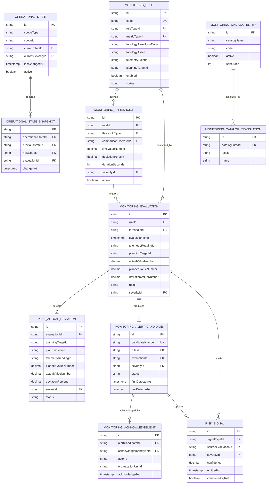

# HIDRA — Monitoring Module Data Definition Document

```text
Document code : HIDRA-MONITORING-DATA-DEFINITION
Module        : monitoring
Namespace     : dz.sh.hidra.modules.monitoring
Product       : Hidra - Hydrocarbon Intelligence for Data, Risk, and Analytics
Author        : Abir MEDJERAB
CreatedOn     : 2026-06-11
Status        : Target DDD, not yet repository-implemented
Evidence      : Hidra V1.1 scope and operational module sequence
```

---

## 1. Purpose

The **Monitoring** module evaluates the operational state of the hydrocarbon transportation network using:

```text
validated telemetry
approved planning targets
configured thresholds
monitoring rules
operational asset references
```

Monitoring answers:

```text
Is the actual flow normal?
Is pressure outside the allowed range?
Is there a planned-vs-actual deviation?
Is the deviation informational, warning, critical, or emergency?
Should an alert candidate be produced?
Has the monitoring condition been acknowledged?
```

Monitoring is the first supervision module after Planning.

```text
Topology
  -> Telemetry
      -> Planning
          -> Monitoring
              -> Alarm Management
                  -> Leak Detection
                      -> Incident Management
```

---

## 2. Ownership Boundary

### 2.1 Monitoring owns

```text
MonitoringRule
MonitoringThreshold
MonitoringEvaluation
OperationalState
OperationalStateSnapshot
PlanActualDeviation
MonitoringAlertCandidate
MonitoringAcknowledgement
RiskSignal
MonitoringCatalogEntry
MonitoringCatalogTranslation
```

### 2.2 Monitoring references but does not own

| Referenced data | Owning module | Monitoring usage |
|---|---|---|
| Validated telemetry reading | telemetry | Actual measured value used for evaluation. |
| Telemetry point | telemetry | Measurement source reference. |
| Planning target | planning | Expected value / planned operating condition. |
| Plan revision | planning | Approved plan version used for comparison. |
| Topology asset | topology | Asset under monitoring scope. |
| User / actor | identity/platform | Actor snapshot for acknowledgement. |
| Organization unit | organization | Responsibility snapshot. |
| Workflow approval | workflow | Reference to approved monitoring configuration if required. |
| Audit event | audit | Durable audit evidence later. |

### 2.3 Monitoring must not own

```text
telemetry readings
telemetry ingestion
flow plans
plan approval workflow
topology assets
formal alarm lifecycle
incident lifecycle
notification delivery
risk scoring engine
analytics models
SCADA/PLC/RTU control commands
```

Important rule:

```text
Monitoring detects and explains operational deviations.
Alarm Management owns formal alarm lifecycle.
Incident Management owns operational incident lifecycle.
Telemetry owns measured facts.
Planning owns expected values.
```

---

## 3. Implementation Status

Direct repository searches did not find an implemented Java monitoring module. Therefore this document is a **target DDD**.

The Hidra scope defines Monitoring as the module that evaluates operational state using validated telemetry, planning targets, thresholds, and monitoring rules. It owns `MonitoringRule`, `Threshold`, `OperationalState`, `MonitoringEvaluation`, `AlertCandidate`, `AlertRule`, `AlertAcknowledgement`, and `RiskSignal`.

---

## 4. Entity Overview

| Entity | Type | Purpose |
|---|---|---|
| `MonitoringRule` | Aggregate Root | Defines how an asset, telemetry point, or planning target is evaluated. |
| `MonitoringThreshold` | Entity | Defines numeric/text/boolean/time-window thresholds for a rule. |
| `MonitoringEvaluation` | Append-only Evaluation Record | Stores one rule evaluation result against actual/planned data. |
| `OperationalState` | Entity | Current state of a monitored asset or point. |
| `OperationalStateSnapshot` | Append-only Snapshot | Historical state snapshot for audit and trend review. |
| `PlanActualDeviation` | Entity | Difference between approved plan target and actual validated telemetry. |
| `MonitoringAlertCandidate` | Entity | Candidate alert produced by monitoring before formal alarm/incident ownership. |
| `MonitoringAcknowledgement` | Entity | Actor acknowledgement of a monitoring condition/candidate. |
| `RiskSignal` | Entity | Early risk signal emitted by monitoring, not full risk scoring. |
| `MonitoringCatalogEntry` | Catalog Entity | Controlled vocabulary for monitoring taxonomy. |
| `MonitoringCatalogTranslation` | Catalog Translation | Multilingual label/description for catalog entries. |

---

## 5. Catalog Strategy

Monitoring user-facing types must be catalog-backed, not Java enums.

Use one generic controlled vocabulary table:

```text
hidra_monitoring_catalog_entry
hidra_monitoring_catalog_translation
```

### 5.1 Catalog names

| Catalog name | Examples | Java enum allowed? |
|---|---|---:|
| `MONITORING_RULE_TYPE` | `THRESHOLD`, `PLAN_ACTUAL`, `STATE_CHANGE`, `QUALITY_DEGRADATION`, `NO_DATA`, `RATE_OF_CHANGE` | No |
| `MONITORING_METRIC_TYPE` | `FLOW`, `PRESSURE`, `TEMPERATURE`, `DENSITY`, `VOLUME`, `QUALITY`, `STATE` | No |
| `MONITORING_SEVERITY` | `INFO`, `WARNING`, `CRITICAL`, `EMERGENCY` | No |
| `MONITORING_STATE` | `NORMAL`, `WARNING`, `CRITICAL`, `UNKNOWN`, `NO_DATA`, `MAINTENANCE` | No |
| `THRESHOLD_TYPE` | `LOW_LOW`, `LOW`, `HIGH`, `HIGH_HIGH`, `RATE_LIMIT`, `DEADBAND` | No |
| `COMPARISON_OPERATOR` | `GT`, `GTE`, `LT`, `LTE`, `EQ`, `NEQ`, `BETWEEN`, `OUTSIDE` | No |
| `EVALUATION_RESULT` | `PASS`, `FAIL`, `SKIPPED`, `INSUFFICIENT_DATA`, `ERROR` | Technical enum acceptable, catalog preferred if user-facing |
| `ALERT_CANDIDATE_STATUS` | `OPEN`, `ACKNOWLEDGED`, `SUPPRESSED`, `PROMOTED_TO_ALARM`, `CLOSED` | Technical enum acceptable |
| `ACKNOWLEDGEMENT_TYPE` | `OBSERVED`, `ACKNOWLEDGED`, `SUPPRESSED`, `FALSE_POSITIVE`, `ESCALATED` | No |
| `RISK_SIGNAL_TYPE` | `HYDRAULIC`, `INTEGRITY`, `HSE`, `SUPPLY`, `QUALITY`, `OPERATIONAL` | No |

---

## 6. Entity Definitions

## 6.1 MonitoringRule

### Description

A `MonitoringRule` defines a supervision rule that evaluates actual operational data against thresholds, expected planning targets, telemetry quality, or operating state.

A rule may target:

```text
a topology asset
a telemetry point
a planning target
a pipeline system
a facility
a pipeline segment
```

### Table

```text
hidra_monitoring_rule
```

### Fields

| Field | Logical type | Required | Description |
|---|---|---:|---|
| `id` | UUID/String | Yes | Stable rule identifier. |
| `code` | String | Yes | Unique business rule code. Example: `FLOW_DEVIATION_GZ1`. |
| `nameAr` | String | No | Arabic display name. |
| `nameFr` | String | Yes | French display name. |
| `nameEn` | String | No | English display name. |
| `descriptionAr` | Text | No | Arabic rule description. |
| `descriptionFr` | Text | No | French rule description. |
| `descriptionEn` | Text | No | English rule description. |
| `ruleTypeId` | Catalog FK | Yes | Reference to `MONITORING_RULE_TYPE`. |
| `metricTypeId` | Catalog FK | Yes | Reference to monitored metric type. |
| `topologyAssetTypeCode` | String | No | Neutral topology asset type. Example: `PIPELINE`, `FACILITY`, `SEGMENT`, `EQUIPMENT`. |
| `topologyAssetId` | String | No | Referenced topology asset ID. |
| `topologyAssetCode` | String | No | Topology asset code snapshot. |
| `topologyAssetNameSnapshot` | String | No | Display name snapshot. |
| `telemetryPointId` | String | No | Referenced telemetry point when rule is point-specific. |
| `telemetryPointCode` | String | No | Telemetry point code snapshot. |
| `planningTargetId` | String | No | Referenced planning target when rule compares planned vs actual. |
| `evaluationWindowSeconds` | Integer | No | Time window used for aggregation/evaluation. |
| `minimumSamples` | Integer | No | Minimum number of valid samples required. |
| `aggregationMethodId` | Catalog FK | No | Average, min, max, last, sum, etc. |
| `defaultSeverityId` | Catalog FK | Yes | Default severity if threshold does not override it. |
| `enabled` | Boolean | Yes | Whether the rule is active for evaluation. |
| `requiresAcknowledgement` | Boolean | Yes | Whether generated candidates must be acknowledged. |
| `suppressionWindowSeconds` | Integer | No | Period used to avoid repeated candidates for same condition. |
| `effectiveFrom` | Timestamp | Yes | Rule validity start. |
| `effectiveTo` | Timestamp | No | Rule validity end. |
| `approvalReferenceId` | String | No | Workflow approval reference for governed rule changes. |
| `status` | String/Catalog | Yes | `DRAFT`, `ACTIVE`, `SUSPENDED`, `RETIRED`. |
| `createdAt` | Timestamp | Yes | Creation timestamp. |
| `updatedAt` | Timestamp | Yes | Last update timestamp. |

### Rules

```text
A rule must have at least one monitoring target.
A rule cannot directly import topology or telemetry domain classes.
A rule must not execute actuation commands.
A rule may produce alert candidates, not formal alarms.
Approved active rules should be immutable; changes create a new version/revision if governance requires it.
```

---

## 6.2 MonitoringThreshold

### Description

A `MonitoringThreshold` defines one threshold condition under a monitoring rule.

Examples:

```text
pressure > 65 bar for 120 seconds
flow deviation > 10 percent from plan
no telemetry value received for 300 seconds
quality code not trusted
```

### Table

```text
hidra_monitoring_threshold
```

### Fields

| Field | Logical type | Required | Description |
|---|---|---:|---|
| `id` | UUID/String | Yes | Stable threshold identifier. |
| `ruleId` | FK | Yes | Parent monitoring rule. |
| `thresholdTypeId` | Catalog FK | Yes | High, high-high, low, low-low, rate-limit, no-data, etc. |
| `comparisonOperatorId` | Catalog FK | Yes | Operator used for evaluation. |
| `limitValueNumber` | Decimal | No | Numeric threshold value. |
| `lowerLimitValueNumber` | Decimal | No | Lower bound for range comparisons. |
| `upperLimitValueNumber` | Decimal | No | Upper bound for range comparisons. |
| `limitValueText` | String | No | Text threshold value when evaluating states/codes. |
| `limitValueBoolean` | Boolean | No | Boolean threshold value. |
| `unitId` | String | No | Unit reference, usually from telemetry unit catalog. |
| `deviationPercent` | Decimal | No | Allowed percentage deviation from plan. |
| `deviationAbsolute` | Decimal | No | Allowed absolute deviation from plan. |
| `durationSeconds` | Integer | No | Required persistence duration before violation is confirmed. |
| `deadbandValue` | Decimal | No | Deadband to avoid flapping. |
| `hysteresisValue` | Decimal | No | Hysteresis for returning to normal. |
| `severityId` | Catalog FK | Yes | Severity when threshold is violated. |
| `sortOrder` | Integer | Yes | Evaluation order. |
| `active` | Boolean | Yes | Whether threshold is active. |
| `createdAt` | Timestamp | Yes | Creation timestamp. |
| `updatedAt` | Timestamp | Yes | Last update timestamp. |

### Rules

```text
Numeric thresholds require numeric limit fields.
Range comparisons require lower and upper values.
Plan-vs-actual thresholds require deviationPercent or deviationAbsolute.
No-data thresholds require durationSeconds.
Threshold unit must be compatible with the telemetry point or planning target unit.
```

---

## 6.3 MonitoringEvaluation

### Description

A `MonitoringEvaluation` is an append-only record of one evaluation run for a monitoring rule.

It records what was evaluated, which input references were used, what result was calculated, and whether a deviation/alert candidate was produced.

### Table

```text
hidra_monitoring_evaluation
```

### Fields

| Field | Logical type | Required | Description |
|---|---|---:|---|
| `id` | UUID/String | Yes | Stable evaluation identifier. |
| `ruleId` | FK | Yes | Evaluated monitoring rule. |
| `thresholdId` | FK | No | Threshold that produced the result. |
| `evaluationTime` | Timestamp | Yes | Time evaluation was executed. |
| `windowStart` | Timestamp | No | Evaluation data window start. |
| `windowEnd` | Timestamp | No | Evaluation data window end. |
| `telemetryReadingId` | String | No | Validated telemetry reading reference. |
| `telemetryPointId` | String | No | Telemetry point reference. |
| `planningTargetId` | String | No | Planning target reference. |
| `planRevisionId` | String | No | Approved plan revision reference. |
| `topologyAssetTypeCode` | String | No | Topology asset type snapshot. |
| `topologyAssetId` | String | No | Topology asset reference. |
| `topologyAssetCode` | String | No | Topology asset code snapshot. |
| `actualValueNumber` | Decimal | No | Actual numeric value used. |
| `plannedValueNumber` | Decimal | No | Planned numeric value used. |
| `deviationValueNumber` | Decimal | No | Actual minus planned. |
| `deviationPercent` | Decimal | No | Percentage deviation. |
| `actualValueText` | String | No | Actual text/state value. |
| `actualValueBoolean` | Boolean | No | Actual boolean value. |
| `unitId` | String | No | Unit for numeric values. |
| `qualityCodeId` | String | No | Telemetry quality used during evaluation. |
| `result` | String/Catalog | Yes | `PASS`, `FAIL`, `SKIPPED`, `INSUFFICIENT_DATA`, `ERROR`. |
| `severityId` | Catalog FK | No | Severity assigned to failed evaluation. |
| `message` | Text | No | Explanation readable by operators. |
| `alertCandidateId` | FK | No | Generated alert candidate if applicable. |
| `correlationId` | String | No | Request/correlation ID. |
| `createdAt` | Timestamp | Yes | Persistence timestamp. |

### Rules

```text
MonitoringEvaluation is append-only.
It must reference validated telemetry only.
It must not change telemetry readings or planning targets.
It must preserve enough snapshots to explain the result later.
```

---

## 6.4 OperationalState

### Description

`OperationalState` stores the current monitoring state of an asset, telemetry point, or operational scope.

It is the current state projection used by monitoring dashboards and downstream modules.

### Table

```text
hidra_monitoring_operational_state
```

### Fields

| Field | Logical type | Required | Description |
|---|---|---:|---|
| `id` | UUID/String | Yes | Stable state identifier. |
| `scopeType` | String | Yes | `TOPOLOGY_ASSET`, `TELEMETRY_POINT`, `PIPELINE_SYSTEM`, `FACILITY`, `PIPELINE_SEGMENT`. |
| `scopeId` | String | Yes | Referenced scope ID. |
| `scopeCode` | String | No | Scope code snapshot. |
| `scopeNameSnapshot` | String | No | Scope display name snapshot. |
| `currentStateId` | Catalog FK | Yes | Current operational state. |
| `currentSeverityId` | Catalog FK | No | Current severity. |
| `lastEvaluationId` | FK | No | Last evaluation that changed the state. |
| `lastAlertCandidateId` | FK | No | Last open candidate if any. |
| `lastTelemetryReadingId` | String | No | Last reading used. |
| `lastChangedAt` | Timestamp | Yes | Last state change timestamp. |
| `lastNormalAt` | Timestamp | No | Last known normal state timestamp. |
| `active` | Boolean | Yes | Whether state is active. |
| `updatedAt` | Timestamp | Yes | Last update timestamp. |

### Rules

```text
There must be only one active OperationalState per monitoring scope.
State changes must create OperationalStateSnapshot.
Unknown/no-data is a valid monitoring state and must not be hidden.
```

---

## 6.5 OperationalStateSnapshot

### Description

Append-only history of operational state changes.

### Table

```text
hidra_monitoring_operational_state_snapshot
```

### Fields

| Field | Logical type | Required | Description |
|---|---|---:|---|
| `id` | UUID/String | Yes | Stable snapshot identifier. |
| `operationalStateId` | FK | Yes | Current state record. |
| `previousStateId` | Catalog FK | No | Previous state. |
| `newStateId` | Catalog FK | Yes | New state. |
| `previousSeverityId` | Catalog FK | No | Previous severity. |
| `newSeverityId` | Catalog FK | No | New severity. |
| `evaluationId` | FK | No | Evaluation that caused the transition. |
| `alertCandidateId` | FK | No | Alert candidate involved. |
| `changedAt` | Timestamp | Yes | Transition timestamp. |
| `changeReason` | Text | No | Explanation. |
| `correlationId` | String | No | Correlation ID. |

### Rules

```text
Snapshots are append-only.
Do not update or delete snapshots except through controlled retention policy.
```

---

## 6.6 PlanActualDeviation

### Description

A `PlanActualDeviation` stores the difference between a planning target and validated actual telemetry.

Planning owns expected values; telemetry owns actual values; monitoring owns the deviation record.

### Table

```text
hidra_monitoring_plan_actual_deviation
```

### Fields

| Field | Logical type | Required | Description |
|---|---|---:|---|
| `id` | UUID/String | Yes | Stable deviation identifier. |
| `evaluationId` | FK | Yes | Evaluation that detected the deviation. |
| `planningTargetId` | String | Yes | Planning target reference. |
| `planRevisionId` | String | Yes | Approved plan revision reference. |
| `telemetryReadingId` | String | No | Actual reading reference. |
| `telemetryPointId` | String | No | Actual telemetry point reference. |
| `topologyAssetTypeCode` | String | No | Topology asset type. |
| `topologyAssetId` | String | No | Topology asset reference. |
| `metricTypeId` | Catalog FK | Yes | Metric type. |
| `plannedValueNumber` | Decimal | No | Planned numeric value. |
| `actualValueNumber` | Decimal | No | Actual numeric value. |
| `deviationValueNumber` | Decimal | No | Actual minus planned. |
| `deviationPercent` | Decimal | No | Percentage deviation. |
| `unitId` | String | No | Unit reference. |
| `severityId` | Catalog FK | Yes | Deviation severity. |
| `detectedAt` | Timestamp | Yes | Detection timestamp. |
| `status` | String/Catalog | Yes | `OPEN`, `ACKNOWLEDGED`, `CLOSED`, `SUPPRESSED`. |
| `closedAt` | Timestamp | No | Closure timestamp. |

### Rules

```text
Only approved planning targets may be used.
Only validated/trusted telemetry readings may be used.
A deviation does not mutate the plan or reading.
```

---

## 6.7 MonitoringAlertCandidate

### Description

A `MonitoringAlertCandidate` is a monitoring-produced candidate condition that may later become a formal alarm or incident.

This exists because Monitoring should not own the full alarm lifecycle if a separate Alarm Management module is introduced.

### Table

```text
hidra_monitoring_alert_candidate
```

### Fields

| Field | Logical type | Required | Description |
|---|---|---:|---|
| `id` | UUID/String | Yes | Stable candidate identifier. |
| `candidateNumber` | String | Yes | Human-readable candidate number. |
| `ruleId` | FK | Yes | Rule that produced candidate. |
| `evaluationId` | FK | Yes | Evaluation that created candidate. |
| `deviationId` | FK | No | Related plan-actual deviation if any. |
| `severityId` | Catalog FK | Yes | Candidate severity. |
| `titleAr` | String | No | Arabic title. |
| `titleFr` | String | Yes | French title. |
| `titleEn` | String | No | English title. |
| `descriptionAr` | Text | No | Arabic description. |
| `descriptionFr` | Text | No | French description. |
| `descriptionEn` | Text | No | English description. |
| `topologyAssetTypeCode` | String | No | Asset type snapshot. |
| `topologyAssetId` | String | No | Asset reference. |
| `topologyAssetCode` | String | No | Asset code snapshot. |
| `telemetryPointId` | String | No | Telemetry point reference. |
| `firstDetectedAt` | Timestamp | Yes | First detection timestamp. |
| `lastDetectedAt` | Timestamp | Yes | Last detection timestamp. |
| `occurrenceCount` | Integer | Yes | Number of repeated detections. |
| `status` | String/Catalog | Yes | `OPEN`, `ACKNOWLEDGED`, `SUPPRESSED`, `PROMOTED_TO_ALARM`, `CLOSED`. |
| `promotedAlarmReferenceId` | String | No | Formal alarm reference if promoted. |
| `incidentReferenceId` | String | No | Incident reference if created directly. |
| `createdAt` | Timestamp | Yes | Creation timestamp. |
| `updatedAt` | Timestamp | Yes | Last update timestamp. |

### Rules

```text
MonitoringAlertCandidate is not a formal Alarm.
Formal alarm lifecycle belongs to Alarm Management.
Candidate may be promoted to Alarm or Incident by a downstream module/application service.
Duplicate candidates should be suppressed or merged using rule + scope + condition fingerprint.
```

---

## 6.8 MonitoringAcknowledgement

### Description

Records actor acknowledgement, suppression, observation, or escalation of a monitoring condition or candidate.

### Table

```text
hidra_monitoring_acknowledgement
```

### Fields

| Field | Logical type | Required | Description |
|---|---|---:|---|
| `id` | UUID/String | Yes | Stable acknowledgement identifier. |
| `alertCandidateId` | FK | Yes | Acknowledged candidate. |
| `acknowledgementTypeId` | Catalog FK | Yes | Observed, acknowledged, suppressed, false-positive, escalated. |
| `actorId` | String | Yes | Actor ID snapshot. |
| `actorNameSnapshot` | String | No | Actor display name snapshot. |
| `organizationUnitId` | String | No | Organization unit snapshot. |
| `organizationUnitCode` | String | No | Organization unit code snapshot. |
| `organizationUnitNameSnapshot` | String | No | Organization unit display snapshot. |
| `comment` | Text | No | Operator comment. |
| `acknowledgedAt` | Timestamp | Yes | Timestamp. |
| `correlationId` | String | No | Request/correlation ID. |

### Rules

```text
Acknowledgement must preserve actor and time.
Acknowledgement does not close incidents.
Suppression requires a reason/comment.
```

---

## 6.9 RiskSignal

### Description

A `RiskSignal` is an early monitoring signal that may be consumed by a future Risk module.

It is not a risk score, not a risk register, and not a full risk assessment.

### Table

```text
hidra_monitoring_risk_signal
```

### Fields

| Field | Logical type | Required | Description |
|---|---|---:|---|
| `id` | UUID/String | Yes | Stable risk signal identifier. |
| `signalTypeId` | Catalog FK | Yes | Hydraulic, integrity, HSE, operational, quality, supply, etc. |
| `sourceEvaluationId` | FK | No | Monitoring evaluation that produced signal. |
| `alertCandidateId` | FK | No | Related alert candidate. |
| `deviationId` | FK | No | Related deviation. |
| `topologyAssetTypeCode` | String | No | Asset type snapshot. |
| `topologyAssetId` | String | No | Asset reference. |
| `telemetryPointId` | String | No | Telemetry point reference. |
| `severityId` | Catalog FK | Yes | Signal severity. |
| `confidence` | Decimal | No | 0..1 confidence, if computed. |
| `summary` | Text | Yes | Human-readable summary. |
| `evidenceJson` | JSON/Text | No | Compact explainability evidence, not raw telemetry dump. |
| `emittedAt` | Timestamp | Yes | Emission timestamp. |
| `consumedByRisk` | Boolean | Yes | Whether a future Risk module has consumed it. |
| `riskReferenceId` | String | No | Future risk reference. |

### Rules

```text
Monitoring may emit risk signals.
Risk module owns risk scoring and risk lifecycle.
RiskSignal evidence must reference facts, not duplicate raw telemetry history.
```

---

## 6.10 MonitoringCatalogEntry

### Description

Controlled vocabulary entry for monitoring taxonomies.

### Table

```text
hidra_monitoring_catalog_entry
```

### Fields

| Field | Logical type | Required | Description |
|---|---|---:|---|
| `id` | UUID/String | Yes | Catalog entry ID. |
| `catalogName` | String | Yes | Catalog namespace. |
| `code` | String | Yes | Stable code. |
| `active` | Boolean | Yes | Whether selectable. |
| `sortOrder` | Integer | Yes | Display order. |
| `systemDefined` | Boolean | Yes | Whether managed by system seed. |
| `createdAt` | Timestamp | Yes | Creation timestamp. |
| `updatedAt` | Timestamp | Yes | Last update timestamp. |

### Constraints

```text
unique(catalogName, code)
```

---

## 6.11 MonitoringCatalogTranslation

### Description

Localized name and description for a monitoring catalog entry.

### Table

```text
hidra_monitoring_catalog_translation
```

### Fields

| Field | Logical type | Required | Description |
|---|---|---:|---|
| `id` | UUID/String | Yes | Translation ID. |
| `catalogEntryId` | FK | Yes | Parent catalog entry. |
| `locale` | String | Yes | `ar`, `fr`, `en`. |
| `name` | String | Yes | Localized name. |
| `description` | Text | No | Localized description. |
| `createdAt` | Timestamp | Yes | Creation timestamp. |
| `updatedAt` | Timestamp | Yes | Last update timestamp. |

### Constraints

```text
unique(catalogEntryId, locale)
```

---

## 7. Logical Relationships

```text
MonitoringRule
  -> MonitoringThreshold
  -> MonitoringEvaluation
      -> PlanActualDeviation
      -> MonitoringAlertCandidate
          -> MonitoringAcknowledgement
      -> RiskSignal

OperationalState
  -> OperationalStateSnapshot

MonitoringCatalogEntry
  -> MonitoringCatalogTranslation
```

External references:

```text
MonitoringRule.topologyAssetId         -> topology asset reference only
MonitoringRule.telemetryPointId        -> telemetry point reference only
MonitoringRule.planningTargetId        -> planning target reference only
MonitoringEvaluation.telemetryReadingId -> validated telemetry reading reference only
MonitoringEvaluation.planRevisionId     -> planning revision reference only
MonitoringAcknowledgement.actorId       -> identity/platform actor snapshot only
```

---

## 8. Mermaid ER Diagram



---

## 9. Validation Rules

### 9.1 Rule target validation

```text
MonitoringRule must target at least one of:
- topology asset reference
- telemetry point reference
- planning target reference
```

### 9.2 Data trust validation

```text
MonitoringEvaluation must use validated/trusted telemetry readings only.
Raw, rejected, quarantined, or unvalidated readings must not drive monitoring state.
```

### 9.3 Plan comparison validation

```text
PlanActualDeviation requires:
- approved plan revision reference
- planning target reference
- actual telemetry reference or aggregated actual value
- compatible unit
```

### 9.4 Acknowledgement validation

```text
Acknowledgement requires:
- actor snapshot
- acknowledgement timestamp
- acknowledgement type
- comment when suppressing or marking false positive
```

### 9.5 State transition validation

```text
OperationalState transition must create OperationalStateSnapshot.
Only one active state may exist per scope.
State cannot return to NORMAL until configured hysteresis/deadband rules are satisfied.
```

---

## 10. Recommended Database Constraints

```sql
ALTER TABLE hidra_monitoring_rule
    ADD CONSTRAINT uk_hidra_monitoring_rule_code UNIQUE (code);

CREATE INDEX idx_hidra_monitoring_rule_target
    ON hidra_monitoring_rule (topology_asset_type_code, topology_asset_id);

CREATE INDEX idx_hidra_monitoring_rule_telemetry_point
    ON hidra_monitoring_rule (telemetry_point_id);

CREATE INDEX idx_hidra_monitoring_rule_planning_target
    ON hidra_monitoring_rule (planning_target_id);

CREATE INDEX idx_hidra_monitoring_threshold_rule
    ON hidra_monitoring_threshold (rule_id);

CREATE INDEX idx_hidra_monitoring_evaluation_rule_time
    ON hidra_monitoring_evaluation (rule_id, evaluation_time DESC);

CREATE INDEX idx_hidra_monitoring_evaluation_reading
    ON hidra_monitoring_evaluation (telemetry_reading_id);

CREATE INDEX idx_hidra_monitoring_deviation_plan_target
    ON hidra_monitoring_plan_actual_deviation (planning_target_id, detected_at DESC);

ALTER TABLE hidra_monitoring_alert_candidate
    ADD CONSTRAINT uk_hidra_monitoring_candidate_number UNIQUE (candidate_number);

CREATE INDEX idx_hidra_monitoring_alert_candidate_status
    ON hidra_monitoring_alert_candidate (status, severity_id, first_detected_at DESC);

CREATE UNIQUE INDEX uk_hidra_monitoring_operational_state_active_scope
    ON hidra_monitoring_operational_state (scope_type, scope_id)
    WHERE active = TRUE;

ALTER TABLE hidra_monitoring_catalog_entry
    ADD CONSTRAINT uk_hidra_monitoring_catalog_entry_code UNIQUE (catalog_name, code);

ALTER TABLE hidra_monitoring_catalog_translation
    ADD CONSTRAINT uk_hidra_monitoring_catalog_translation_locale UNIQUE (catalog_entry_id, locale);
```

---

## 11. Module Boundary Rules

### 11.1 Allowed references

Monitoring may store neutral references:

```text
topologyAssetTypeCode
topologyAssetId
topologyAssetCode
topologyAssetNameSnapshot
telemetryPointId
telemetryPointCode
telemetryReadingId
planningTargetId
planRevisionId
actorId
organizationUnitId
```

### 11.2 Forbidden imports

```text
dz.sh.hidra.modules.monitoring.domain.* -> dz.sh.hidra.modules.telemetry.domain.*
dz.sh.hidra.modules.monitoring.domain.* -> dz.sh.hidra.modules.planning.domain.*
dz.sh.hidra.modules.monitoring.domain.* -> dz.sh.hidra.modules.topology.domain.*
dz.sh.hidra.modules.monitoring.* -> dz.sh.hidra.modules.alarms.infrastructure.*
dz.sh.hidra.modules.monitoring.* -> dz.sh.hidra.modules.incidents.infrastructure.*
```

### 11.3 Forbidden behavior

```text
Monitoring must not modify telemetry readings.
Monitoring must not approve planning revisions.
Monitoring must not create topology assets.
Monitoring must not send notifications directly.
Monitoring must not execute control commands.
Monitoring must not own incident lifecycle.
Monitoring must not perform leak detection calculations.
```

---

## 12. Operational Flow

```text
1. Telemetry validates/trusts readings.
2. Planning publishes approved plan targets.
3. Monitoring evaluates rules against validated telemetry and approved plan targets.
4. Monitoring stores evaluation records.
5. Monitoring updates operational state.
6. Monitoring creates deviation records when plan-vs-actual is outside tolerance.
7. Monitoring creates alert candidates when conditions require attention.
8. Operators acknowledge or suppress candidates.
9. Alarm Management may promote candidates into formal alarms.
10. Incident Management may create incidents from alarms or candidates.
```

---

## 13. Package Recommendation

```text
dz.sh.hidra.modules.monitoring
  api
    rest
      controller
      mapper
      request
      response
  application
    command
    query
    dto
    port
      in
      out
    service
  domain
    model
    value
    policy
    service
    event
    exception
  infrastructure
    configuration
    persistence
      entity
      repository
      mapper
      adapter
    scheduler
```

Forbidden packages:

```text
shared
sharedkernel
common
core
utils
helper
helpers
misc
```

---

## 14. Events

Monitoring should publish domain/application events such as:

```text
MonitoringRuleActivatedEvent
MonitoringEvaluationCompletedEvent
OperationalStateChangedEvent
PlanActualDeviationDetectedEvent
MonitoringAlertCandidateCreatedEvent
MonitoringAlertCandidateAcknowledgedEvent
RiskSignalEmittedEvent
```

Events must carry references and snapshots, not full foreign aggregates.

---

## 15. Open Questions

| Question | Recommendation |
|---|---|
| Should Monitoring own `AlertRule`? | Only candidate-generation rules. Formal alarm rules should move to Alarm Management. |
| Should Monitoring store current state as projection or aggregate? | Use `OperationalState` as current projection plus append-only snapshots. |
| Should deviations be calculated from raw telemetry? | No. Use validated/trusted telemetry only. |
| Should Monitoring include risk? | Only `RiskSignal`; full scoring belongs to Risk module. |
| Should Monitoring detect leak? | No. Leak Detection consumes monitoring/telemetry but owns leak algorithms. |

---

## 16. Final Boundary Statement

```text
Monitoring is the operational supervision layer.
It evaluates trusted actual data against approved expected data.
It detects deviations, updates state, and produces alert candidates.
It does not own telemetry facts, planning facts, formal alarms, incidents, risk scoring, or control actions.
```
