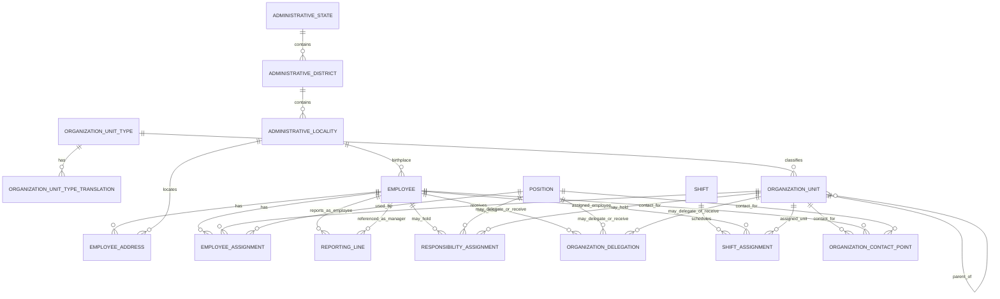

# HIDRA Organization Module — Data Definition Document

```text
Document code       : HIDRA-ORGANIZATION-DDD
Repository          : HidraAPI
Canonical namespace : dz.sh.hidra
Module              : organization
Product             : Hidra — Hydrocarbon Intelligence for Data, Risk, and Analytics
Document type       : Data Definition Document
Version             : 1.2
Status              : Corrected architecture baseline candidate — employee civil identity and normalized Algerian administrative address hierarchy
Author              : Abir MEDJERAB
Generated on        : 2026-06-11
Updated on          : 2026-06-11
```

---

## 1. Purpose

This document defines the logical data model of the `organization` module.

The `organization` module owns Sonatrach/TRC internal organizational structure, employees, positions, assignments, reporting lines, responsibility scopes, and internal delegation of responsibility.

It does **not** own authentication, users, roles, permissions, security groups, topology assets, workflow tasks, audit records, telemetry readings, or external vendor/legal-party master data.

---

## 2. Sources and alignment

This document is aligned with the current Hidra repository baseline and the corrected module-boundary strategy used in previous DDD documents.

Repository-backed organization baseline includes:

- `hidra_org_employee`
- `hidra_org_unit`
- `hidra_org_position`
- `hidra_org_employee_assignment`
- `hidra_org_reporting_line`
- `hidra_org_unit_type`
- `hidra_org_unit_type_translation`

The current repository already separates employee data from identity user data. `Employee` stores a neutral `identity_user_reference`, but it is explicitly not an identity user, role, permission, or topology asset.

Version 1.1 corrected the employee model because the repository baseline is too thin for real enterprise HR/operations use. `fullName` was replaced by Arabic and Latin first/last-name fields, civil birth data was added, and employee addresses were modeled with Algeria-style controlled administrative hierarchy: `State -> District -> Locality`, plus bilingual address text.

Version 1.2 corrects the administrative-location normalization. `EmployeeAddress` stores only `localityId`; `district` and `state` are derived through `AdministrativeLocality -> AdministrativeDistrict -> AdministrativeState`. `AdministrativeLocality` stores only `districtId`; state is derived from the district. This removes redundant `stateId` and `districtId` fields from the employee address.

---

## 3. Ownership rules

### 3.1 Organization owns

```text
OrganizationUnit
OrganizationUnitType
OrganizationUnitTypeTranslation
Position
Employee
EmployeeAddress
AdministrativeState
AdministrativeDistrict
AdministrativeLocality
EmployeeAssignment
ReportingLine
ResponsibilityAssignment
OrganizationDelegation
Shift
ShiftAssignment
OrganizationContactPoint
OrganizationHierarchySnapshot
```

### 3.2 Organization must not own

| Concept | Owning module | Rule |
|---|---|---|
| `User` | `identity` | Organization may reference identity user by stable ID only. |
| `Group` | `identity` | Identity groups are security groups, not organization units. |
| `Role` / `Permission` | `identity` | Positions are operational functions, not security roles. |
| `Facility`, `Pipeline`, `Equipment` | `topology` | Organization may store neutral operational-scope references only. |
| `WorkflowTask`, `WorkflowInstance` | `workflow` | Organization may be used for routing, but workflow owns tasks. |
| `AuditRecord` | `audit` | Organization emits events; audit owns immutable records. |
| `Party`, `Vendor`, `Contractor`, `Manufacturer`, `JointVenturePartner` | future `party` module | Organization is for internal structure; external legal entities belong to party/master-data. |
| `TelemetryPoint`, `TelemetryReading` | `telemetry` | Organization does not own operational signal data. |

---

## 4. Naming and schema conventions

Preferred physical table prefix for current repository alignment:

```text
hidra_org_*
```

Preferred future module schema if schemas are separated:

```text
hidraorganization
```

No table in this module may use `hidra_identity_*`, `hidra_topology_*`, `hidra_workflow_*`, or `hidra_audit_*` prefixes.

---

## 5. Implemented baseline entities

## 5.1 Entity: OrganizationUnit

### Description

Represents an internal organizational unit such as company, division, direction, department, region, area, district, station-as-organization-unit, team, or project team.

Important distinction:

```text
OrganizationUnit(type = STATION)
```

means a people/responsibility organization unit for a station. It is not the physical station facility. The physical station is owned by `topology.Facility`.

### Ownership

Owned by `organization`.

### Logical table

```text
hidra_org_unit
```

### Fields

| Field | Logical type | Required | Description |
|---|---:|---:|---|
| `id` | Identifier | Yes | Stable organization unit ID. |
| `code` | BusinessCode | Yes | Unique organization unit business code. |
| `nameAr` | LocalizedText | Yes | Arabic display name. |
| `nameFr` | LocalizedText | Yes | French display name. |
| `nameEn` | LocalizedText | Yes | English display name. |
| `status` | StatusCode | Yes | Lifecycle status such as `ACTIVE`, `INACTIVE`, `RETIRED`, `SUSPENDED`. |
| `unitTypeId` | ReferenceId | Yes | Reference to `OrganizationUnitType`. |
| `parentId` | ReferenceId | No | Parent organization unit ID. Null for root company/unit. |
| `operationalScopeType` | ScopeTypeCode | No | Neutral external scope type such as `REGION`, `PIPELINE_SYSTEM`, `FACILITY`, `STATION`, `AREA`. |
| `operationalScopeId` | ExternalReferenceId | No | Stable ID of the operational scope owned by another module. |
| `operationalScopeCode` | SnapshotCode | No | Snapshot code of the external operational scope. |
| `operationalScopeName` | SnapshotText | No | Snapshot display name of the external operational scope. |
| `createdAt` | Timestamp | Yes | Creation timestamp. |
| `updatedAt` | Timestamp | Yes | Last update timestamp. |

### Rules

- `code` must be unique.
- `parentId` must not create cycles.
- An inactive organization unit cannot receive new active assignments.
- `operationalScope*` fields are references/snapshots only; they do not create topology ownership.
- A station organization unit is not a topology station facility.

---

## 5.2 Entity: OrganizationUnitType

### Description

Configurable catalog defining internal organization unit types.

Examples:

```text
COMPANY
DIVISION
DIRECTION
DEPARTMENT
REGION
AREA
DISTRICT
STATION
TEAM
PROJECT_TEAM
OTHER
```

### Ownership

Owned by `organization`.

### Logical table

```text
hidra_org_unit_type
```

### Fields

| Field | Logical type | Required | Description |
|---|---:|---:|---|
| `id` | Identifier | Yes | Stable unit type ID. |
| `code` | BusinessCode | Yes | Unique type code. |
| `status` | StatusCode | Yes | `ACTIVE`, `INACTIVE`, `DEPRECATED`. |
| `sortOrder` | Integer | Yes | Display order in UI/catalog lists. |
| `systemDefined` | Boolean | Yes | Whether this type is system-defined. |
| `createdAt` | Timestamp | Yes | Creation timestamp. |
| `updatedAt` | Timestamp | Yes | Last update timestamp. |

### Rules

- Java enum should not be used for user-facing organization unit types.
- Types used by historical units must not be physically deleted.
- System-defined types should require elevated permission or workflow approval before modification.

---

## 5.3 Entity: OrganizationUnitTypeTranslation

### Description

Localized labels and descriptions for organization unit types.

### Ownership

Owned by `organization`.

### Logical table

```text
hidra_org_unit_type_translation
```

### Fields

| Field | Logical type | Required | Description |
|---|---:|---:|---|
| `id` | Identifier | Yes | Translation ID. |
| `unitTypeId` | ReferenceId | Yes | Parent `OrganizationUnitType` ID. |
| `locale` | LocaleCode | Yes | Locale code, for example `ar`, `fr`, `en`. |
| `name` | LocalizedText | Yes | Localized display name. |
| `description` | LocalizedText | No | Localized description. |
| `createdAt` | Timestamp | Yes | Creation timestamp. |
| `updatedAt` | Timestamp | Yes | Last update timestamp. |

### Rules

- Unique key: `(unitTypeId, locale)`.
- Required supported locales: `ar`, `fr`, `en`.

---

## 5.4 Entity: Position

### Description

Represents an operational position/function such as Station Team Leader, Station Boss, Region Director, Gas Flux Director, Department Chief, Maintenance Supervisor, or HSE Coordinator.

A position is **not** an identity security role.

### Ownership

Owned by `organization`.

### Logical table

```text
hidra_org_position
```

### Fields

| Field | Logical type | Required | Description |
|---|---:|---:|---|
| `id` | Identifier | Yes | Stable position ID. |
| `code` | BusinessCode | Yes | Unique position code. |
| `titleAr` | LocalizedText | Yes | Arabic title. |
| `titleFr` | LocalizedText | Yes | French title. |
| `titleEn` | LocalizedText | Yes | English title. |
| `descriptionAr` | LocalizedText | No | Arabic description. |
| `descriptionFr` | LocalizedText | No | French description. |
| `descriptionEn` | LocalizedText | No | English description. |
| `active` | Boolean | Yes | Whether this position can be assigned. |
| `createdAt` | Timestamp | Yes | Creation timestamp. |
| `updatedAt` | Timestamp | Yes | Last update timestamp. |

### Rules

- `code` must be unique.
- Inactive positions cannot be assigned to employees.
- Position does not grant permissions by itself. Authorization remains identity-owned.
- Position may be used by workflow/identity as an external attribute/reference for policy evaluation.

---

## 5.5 Entity: Employee

### Description

Represents a real operational employee/person in the organization structure.

Employee is not a security user. The identity module owns `User`; organization owns `Employee`.

Version 1.1 rule: `fullName` is not sufficient and must not be the canonical persisted identity of an employee. Employee names must be separated into Arabic and Latin-script fields so that official Arabic records, Latin transliteration, search, sorting, reporting, and badge/API display can be handled consistently.

### Ownership

Owned by `organization`.

### Logical table

```text
hidra_org_employee
```

### Fields

| Field | Logical type | Required | Description |
|---|---:|---:|---|
| `id` | Identifier | Yes | Stable employee ID. |
| `employeeNumber` | BusinessCode | Yes | Unique employee number/matricule. |
| `firstNameAr` | PersonNameAr | Yes | Employee official Arabic first/given name. |
| `lastNameAr` | PersonNameAr | Yes | Employee official Arabic last/family name. |
| `firstNameLt` | PersonNameLt | Yes | Employee Latin-script first/given name. `Lt` means Latin transcription/transliteration. |
| `lastNameLt` | PersonNameLt | Yes | Employee Latin-script last/family name. |
| `displayNameAr` | PersonNameAr | No | Denormalized Arabic display name, normally generated from first/last names. |
| `displayNameLt` | PersonNameLt | No | Denormalized Latin display name, normally generated from first/last names. |
| `birthDate` | Date | No | Employee date of birth. Required if HR compliance rules require full civil identity. |
| `birthplaceAr` | LocalizedTextAr | No | Birthplace written in Arabic as it appears on official documents. |
| `birthplaceLt` | LocalizedTextLt | No | Birthplace written in Latin script. |
| `birthLocalityId` | ReferenceId | No | Controlled reference to `AdministrativeLocality` when birthplace can be mapped to the Algerian administrative hierarchy. |
| `email` | EmailAddress | No | Professional email address. |
| `phoneNumber` | PhoneNumber | No | Professional phone number, if used operationally. |
| `status` | StatusCode | Yes | `REGISTERED`, `ACTIVE`, `SUSPENDED`, `DISABLED`, `RETIRED`, etc. |
| `identityUserReference` | ExternalReferenceId | No | Neutral reference to `identity.User`. Organization does not own user login/security. |
| `primaryAddressId` | ReferenceId | No | Optional current primary `EmployeeAddress` reference for fast access. Source of truth remains `EmployeeAddress`. |
| `createdAt` | Timestamp | Yes | Creation timestamp. |
| `activatedAt` | Timestamp | No | Activation timestamp. |
| `suspendedAt` | Timestamp | No | Suspension timestamp. |
| `disabledAt` | Timestamp | No | Disabled timestamp. |
| `updatedAt` | Timestamp | Yes | Last update timestamp. |

### Rules

- `employeeNumber` must be unique.
- `fullName` must not remain the canonical persisted person-name field. It may exist only as a computed projection.
- Arabic and Latin names must be stored separately: `firstNameAr`, `lastNameAr`, `firstNameLt`, `lastNameLt`.
- `displayNameAr` and `displayNameLt` should be generated or normalized by policy, not manually trusted as the sole identity name.
- Birthplace free text is allowed for historical/official-document fidelity, but controlled locality reference should be used whenever possible.
- An employee may exist without an identity user.
- A user may reference an employee, but neither module imports the other's aggregate.
- Disabled employees cannot receive new active assignments.
- Identity lifecycle and employee lifecycle must remain separate but reconcilable.

---

## 5.6 Entity: EmployeeAddress

### Description

Represents an employee address with Arabic and Latin address text and controlled administrative location references.

The address model must not rely only on free text. For Algeria-oriented data entry, the location is identified by a controlled hierarchy:

```text
State -> District -> Locality -> Address
```

To avoid redundancy, `EmployeeAddress` stores only the selected `localityId`. District and state are derived through the administrative hierarchy. The detailed street/address text is then stored in Arabic and Latin forms.

### Ownership

Owned by `organization` as employee civil/HR information.

### Logical table

```text
hidra_org_employee_address
```

### Fields

| Field | Logical type | Required | Description |
|---|---:|---:|---|
| `id` | Identifier | Yes | Stable address ID. |
| `employeeId` | ReferenceId | Yes | Employee owning the address. |
| `addressType` | CatalogCode | Yes | `PRIMARY`, `RESIDENCE`, `MAILING`, `EMERGENCY`, `TEMPORARY`, etc. |
| `localityId` | ReferenceId | Yes | Controlled locality/commune/locality-level reference. |
| `addressAr` | LocalizedTextAr | Yes | Detailed Arabic address line after administrative location. |
| `addressLt` | LocalizedTextLt | Yes | Detailed Latin-script address line after administrative location. |
| `postalCode` | Text | No | Postal code, if available. |
| `primaryAddress` | Boolean | Yes | Whether this is the current primary address. |
| `validFrom` | Date | Yes | Address validity start date. |
| `validTo` | Date | No | Address validity end date. Null means still active. |
| `createdAt` | Timestamp | Yes | Creation timestamp. |
| `updatedAt` | Timestamp | Yes | Last update timestamp. |

### Rules

- `localityId` must reference an active `AdministrativeLocality`.
- `districtId` and `stateId` must not be stored on `EmployeeAddress`; they are derived from `localityId`.
- The full administrative chain must be resolved as `localityId -> districtId -> stateId`.
- UI/API requests may include state and district for validation/search convenience, but the persisted address stores only the selected locality.
- Only one active primary address should exist per employee unless explicitly approved.
- `addressAr` and `addressLt` are detailed address text, not replacements for state/district/locality.
- `validTo` must not be before `validFrom`.

---

## 5.7 Entity: AdministrativeState

### Description

Represents the highest administrative place level used by the organization address model. In the Algerian context this corresponds to the state/wilaya-level administrative area, but the neutral Hidra name is `AdministrativeState` to match the business terminology used in this document.

### Ownership

Owned by `organization` for employee and organization-unit address/reference needs unless a future dedicated `geography` or `reference-data` module is introduced. If such a module is later created, these entities should migrate there and organization should keep references only.

### Logical table

```text
hidra_org_administrative_state
```

### Fields

| Field | Logical type | Required | Description |
|---|---:|---:|---|
| `id` | Identifier | Yes | Stable state ID. |
| `code` | BusinessCode | Yes | State/wilaya code. |
| `nameAr` | LocalizedTextAr | Yes | Arabic state name. |
| `nameLt` | LocalizedTextLt | Yes | Latin-script state name. |
| `countryCode` | CountryCode | Yes | Country code, default `DZ` for Algeria. |
| `status` | StatusCode | Yes | `ACTIVE`, `INACTIVE`, `DEPRECATED`. |
| `sortOrder` | Integer | No | Display ordering. |
| `createdAt` | Timestamp | Yes | Creation timestamp. |
| `updatedAt` | Timestamp | Yes | Last update timestamp. |

### Rules

- `code` must be unique within `countryCode`.
- Names must not be free-typed in employee addresses; users select a state entry.
- Used administrative entries should be deprecated/inactivated, not deleted.

---

## 5.8 Entity: AdministrativeDistrict

### Description

Represents the second administrative place level under state. In the Algerian context this corresponds to district/daïra-level location.

### Ownership

Owned by `organization` until a future dedicated `geography` or `reference-data` module exists.

### Logical table

```text
hidra_org_administrative_district
```

### Fields

| Field | Logical type | Required | Description |
|---|---:|---:|---|
| `id` | Identifier | Yes | Stable district ID. |
| `stateId` | ReferenceId | Yes | Parent administrative state. |
| `code` | BusinessCode | Yes | District code. |
| `nameAr` | LocalizedTextAr | Yes | Arabic district name. |
| `nameLt` | LocalizedTextLt | Yes | Latin-script district name. |
| `status` | StatusCode | Yes | `ACTIVE`, `INACTIVE`, `DEPRECATED`. |
| `sortOrder` | Integer | No | Display ordering. |
| `createdAt` | Timestamp | Yes | Creation timestamp. |
| `updatedAt` | Timestamp | Yes | Last update timestamp. |

### Rules

- Unique key: `(stateId, code)`.
- District must belong to exactly one state.
- District cannot be selected if parent state is inactive.

---

## 5.9 Entity: AdministrativeLocality

### Description

Represents the third administrative place level used for employee address and birthplace normalization. In the Algerian context this corresponds to locality/commune/locality-level location.

### Ownership

Owned by `organization` until a future dedicated `geography` or `reference-data` module exists.

### Logical table

```text
hidra_org_administrative_locality
```

### Fields

| Field | Logical type | Required | Description |
|---|---:|---:|---|
| `id` | Identifier | Yes | Stable locality ID. |
| `districtId` | ReferenceId | Yes | Parent district reference. |
| `code` | BusinessCode | Yes | Locality code. |
| `nameAr` | LocalizedTextAr | Yes | Arabic locality name. |
| `nameLt` | LocalizedTextLt | Yes | Latin-script locality name. |
| `postalCode` | Text | No | Postal code if one canonical code exists. |
| `status` | StatusCode | Yes | `ACTIVE`, `INACTIVE`, `DEPRECATED`. |
| `sortOrder` | Integer | No | Display ordering. |
| `createdAt` | Timestamp | Yes | Creation timestamp. |
| `updatedAt` | Timestamp | Yes | Last update timestamp. |

### Rules

- Unique key: `(districtId, code)`.
- Locality must belong to exactly one district.
- Employee address selection stores `localityId` only; state and district are resolved through the locality's parent district.

---

## 5.10 Entity: EmployeeAssignment

### Description

Represents assignment of an employee to an organization unit and a position, optionally constrained by an operational scope.

Example:

```text
Employee A
  assigned to OrganizationUnit = REGION_OUEST
  as Position = REGION_DIRECTOR
  effectiveFrom = 2026-01-01
```

Or:

```text
Employee B
  assigned to OrganizationUnit = STATION_TEAM_SKIKDA
  as Position = STATION_TEAM_LEADER
  operationalScopeType = FACILITY
  operationalScopeId = topology facility ID
```

### Ownership

Owned by `organization` as part of employee organizational state.

### Logical table

```text
hidra_org_employee_assignment
```

### Fields

| Field | Logical type | Required | Description |
|---|---:|---:|---|
| `id` | Identifier | Yes | Assignment ID. |
| `employeeId` | ReferenceId | Yes | Employee being assigned. |
| `organizationUnitId` | ReferenceId | Yes | Target organization unit. |
| `positionId` | ReferenceId | Yes | Position held by the employee. |
| `operationalScopeType` | ScopeTypeCode | No | Optional neutral operational scope type. |
| `operationalScopeId` | ExternalReferenceId | No | External operational scope ID. |
| `operationalScopeCode` | SnapshotCode | No | External operational scope code snapshot. |
| `operationalScopeName` | SnapshotText | No | External operational scope name snapshot. |
| `effectiveFrom` | Date | Yes | Assignment start date. |
| `effectiveTo` | Date | No | Assignment end date. Null means still active. |

### Rules

- `effectiveTo` must not be before `effectiveFrom`.
- An employee should not have overlapping primary assignments for the same scope unless explicitly allowed.
- `operationalScope*` does not create topology ownership.
- Assignment should be auditable and versioned through events/audit.

---

## 5.11 Entity: ReportingLine

### Description

Represents an employee-to-manager relationship, including matrix reporting.

Examples:

```text
LINE
OPERATIONAL
FUNCTIONAL
ADMINISTRATIVE
TECHNICAL
DOTTED_LINE
```

### Ownership

Owned by `organization`.

### Logical table

```text
hidra_org_reporting_line
```

### Fields

| Field | Logical type | Required | Description |
|---|---:|---:|---|
| `id` | Identifier | Yes | Reporting line ID. |
| `employeeId` | ReferenceId | Yes | Employee who reports to a manager. |
| `managerEmployeeId` | ReferenceId | Yes | Manager employee ID. |
| `reportingLineType` | Code | Yes | Reporting relationship type. |
| `primaryLine` | Boolean | Yes | Whether this is the primary reporting line. |
| `effectiveFrom` | Date | Yes | Start date. |
| `effectiveTo` | Date | No | End date. Null means active. |
| `description` | Text | No | Optional description or justification. |

### Rules

- `employeeId` must not equal `managerEmployeeId`.
- A reporting line cannot create managerial cycles unless explicitly allowed for temporary structures.
- Only one active primary line should exist per employee unless matrix-policy exception exists.
- `effectiveTo` must not be before `effectiveFrom`.

---

# 6. Target additions

The following entities are recommended to complete the organization module for industrial operations, workflow routing, responsibility management, and ABAC support.

They are not replacements for identity permissions or workflow tasks.

---

## 6.1 Entity: ResponsibilityAssignment

### Description

Represents a formal operational/business responsibility assigned to an employee, organization unit, or position for a specific scope.

This is different from a security permission. Identity may use it as an authorization attribute, but organization owns the responsibility fact.

### Ownership

Owned by `organization`.

### Logical table

```text
hidra_org_responsibility_assignment
```

### Fields

| Field | Logical type | Required | Description |
|---|---:|---:|---|
| `id` | Identifier | Yes | Responsibility assignment ID. |
| `assigneeType` | Code | Yes | `EMPLOYEE`, `POSITION`, `ORGANIZATION_UNIT`. |
| `assigneeId` | ReferenceId | Yes | ID of employee, position, or organization unit. |
| `responsibilityType` | Code/CatalogRef | Yes | `OPERATIONS_MANAGER`, `MAINTENANCE_RESPONSIBLE`, `HSE_RESPONSIBLE`, `CUSTODY_APPROVER`, `INCIDENT_COMMANDER`, etc. |
| `scopeType` | ScopeTypeCode | No | Operational scope type. |
| `scopeId` | ExternalReferenceId | No | Scope ID, such as facility/pipeline/station/system. |
| `scopeCodeSnapshot` | SnapshotCode | No | Scope code snapshot. |
| `scopeNameSnapshot` | SnapshotText | No | Scope name snapshot. |
| `primaryResponsible` | Boolean | Yes | Whether this is the primary responsibility holder. |
| `validFrom` | Date | Yes | Start date. |
| `validTo` | Date | No | End date. |
| `status` | StatusCode | Yes | `ACTIVE`, `SUSPENDED`, `ENDED`. |
| `createdAt` | Timestamp | Yes | Creation timestamp. |
| `updatedAt` | Timestamp | Yes | Last update timestamp. |

### Rules

- Responsibility does not grant permissions directly.
- Identity ABAC may ask: “Is this employee responsible for this pipeline/facility/region?”
- Workflow may use responsibility to route approvals.
- Organization must not import topology domain objects; use scope references only.

---

## 6.2 Entity: OrganizationDelegation

### Description

Represents temporary delegation of organizational responsibility from one employee/position/unit to another.

Security permission delegation remains identity-owned. This entity models operational responsibility delegation.

### Ownership

Owned by `organization`.

### Logical table

```text
hidra_org_delegation
```

### Fields

| Field | Logical type | Required | Description |
|---|---:|---:|---|
| `id` | Identifier | Yes | Delegation ID. |
| `delegatorType` | Code | Yes | `EMPLOYEE`, `POSITION`, `ORGANIZATION_UNIT`. |
| `delegatorId` | ReferenceId | Yes | Delegating party. |
| `delegateType` | Code | Yes | `EMPLOYEE`, `POSITION`, `ORGANIZATION_UNIT`. |
| `delegateId` | ReferenceId | Yes | Recipient of delegation. |
| `responsibilityType` | Code/CatalogRef | Yes | Responsibility being delegated. |
| `scopeType` | ScopeTypeCode | No | Optional operational scope type. |
| `scopeId` | ExternalReferenceId | No | Optional operational scope ID. |
| `validFrom` | Timestamp | Yes | Delegation start instant. |
| `validTo` | Timestamp | Yes | Delegation end instant. |
| `reason` | Text | No | Business reason. |
| `approvedByWorkflowId` | ExternalReferenceId | No | Workflow approval reference. |
| `status` | StatusCode | Yes | `DRAFT`, `ACTIVE`, `EXPIRED`, `CANCELLED`. |
| `createdAt` | Timestamp | Yes | Creation timestamp. |
| `updatedAt` | Timestamp | Yes | Last update timestamp. |

### Rules

- `validTo` must be after `validFrom`.
- Delegation must be time-bounded.
- Delegation does not create identity permissions automatically.
- Identity may consume active delegation as ABAC context only through public contracts.

---

## 6.3 Entity: Shift

### Description

Defines a shift template or operational shift period used by organization for staffing and responsibility scheduling.

### Ownership

Owned by `organization`.

### Logical table

```text
hidra_org_shift
```

### Fields

| Field | Logical type | Required | Description |
|---|---:|---:|---|
| `id` | Identifier | Yes | Shift ID. |
| `code` | BusinessCode | Yes | Unique shift code. |
| `name` | Text | Yes | Shift display name. |
| `shiftType` | Code/CatalogRef | Yes | `DAY`, `NIGHT`, `ROTATION`, `ON_CALL`, `CUSTOM`. |
| `startTime` | LocalTime | No | Template start time. |
| `endTime` | LocalTime | No | Template end time. |
| `timezone` | TimeZoneCode | No | Timezone when relevant. |
| `active` | Boolean | Yes | Whether the shift can be assigned. |
| `createdAt` | Timestamp | Yes | Creation timestamp. |
| `updatedAt` | Timestamp | Yes | Last update timestamp. |

---

## 6.4 Entity: ShiftAssignment

### Description

Assigns an employee or team to a shift and optional operational scope.

### Ownership

Owned by `organization`.

### Logical table

```text
hidra_org_shift_assignment
```

### Fields

| Field | Logical type | Required | Description |
|---|---:|---:|---|
| `id` | Identifier | Yes | Shift assignment ID. |
| `shiftId` | ReferenceId | Yes | Shift reference. |
| `employeeId` | ReferenceId | No | Assigned employee. |
| `organizationUnitId` | ReferenceId | No | Assigned team/unit. |
| `positionId` | ReferenceId | No | Position used for the shift. |
| `scopeType` | ScopeTypeCode | No | Optional operational scope type. |
| `scopeId` | ExternalReferenceId | No | Optional scope ID. |
| `startsAt` | Timestamp | Yes | Actual shift start. |
| `endsAt` | Timestamp | Yes | Actual shift end. |
| `status` | StatusCode | Yes | `PLANNED`, `ACTIVE`, `COMPLETED`, `CANCELLED`. |
| `createdAt` | Timestamp | Yes | Creation timestamp. |
| `updatedAt` | Timestamp | Yes | Last update timestamp. |

### Rules

- At least one of `employeeId` or `organizationUnitId` must be present.
- `endsAt` must be after `startsAt`.
- Shift assignment can feed workflow routing, incident duty lookup, and identity ABAC context.

---

## 6.5 Entity: OrganizationContactPoint

### Description

Stores official contact points for organization units, positions, or operational responsibilities.

### Ownership

Owned by `organization`.

### Logical table

```text
hidra_org_contact_point
```

### Fields

| Field | Logical type | Required | Description |
|---|---:|---:|---|
| `id` | Identifier | Yes | Contact point ID. |
| `ownerType` | Code | Yes | `ORGANIZATION_UNIT`, `POSITION`, `EMPLOYEE`, `RESPONSIBILITY`. |
| `ownerId` | ReferenceId | Yes | Owning object ID. |
| `contactType` | Code | Yes | `EMAIL`, `PHONE`, `MOBILE`, `RADIO`, `CONTROL_ROOM`, `EMERGENCY`. |
| `contactValue` | Text | Yes | Contact value. |
| `label` | Text | No | Human-readable label. |
| `primaryContact` | Boolean | Yes | Whether this is the primary contact. |
| `validFrom` | Date | No | Valid from date. |
| `validTo` | Date | No | Valid to date. |
| `status` | StatusCode | Yes | `ACTIVE`, `INACTIVE`. |
| `createdAt` | Timestamp | Yes | Creation timestamp. |
| `updatedAt` | Timestamp | Yes | Last update timestamp. |

---

## 6.6 Entity: OrganizationHierarchySnapshot

### Description

Stores a snapshot of the organization hierarchy for historical reporting, workflow traceability, authorization evidence, and audit reconstruction.

### Ownership

Owned by `organization`.

### Logical table

```text
hidra_org_hierarchy_snapshot
```

### Fields

| Field | Logical type | Required | Description |
|---|---:|---:|---|
| `id` | Identifier | Yes | Snapshot ID. |
| `snapshotCode` | BusinessCode | Yes | Snapshot code/version. |
| `rootOrganizationUnitId` | ReferenceId | Yes | Root unit at snapshot time. |
| `effectiveAt` | Timestamp | Yes | Point in time represented by snapshot. |
| `status` | StatusCode | Yes | `DRAFT`, `APPROVED`, `RETIRED`. |
| `approvedByWorkflowId` | ExternalReferenceId | No | Workflow approval reference. |
| `snapshotPayload` | Json | Yes | Serialized hierarchy structure or materialized graph. |
| `createdAt` | Timestamp | Yes | Creation timestamp. |

### Rules

- Snapshot is immutable after approval.
- Workflow/audit may reference snapshot ID for decision reconstruction.

---

# 7. Relationships

## 7.1 Relationship summary

| Relationship | Cardinality | Notes |
|---|---:|---|
| `OrganizationUnitType -> OrganizationUnit` | 1:N | Each unit has one type. |
| `OrganizationUnitType -> OrganizationUnitTypeTranslation` | 1:N | One translation per locale. |
| `OrganizationUnit -> OrganizationUnit` | 1:N self-reference | Parent-child hierarchy. |
| `Employee -> EmployeeAddress` | 1:N | Employee owns address history. |
| `AdministrativeState -> AdministrativeDistrict` | 1:N | State contains districts. |
| `AdministrativeDistrict -> AdministrativeLocality` | 1:N | District contains localities. |
| `AdministrativeLocality -> EmployeeAddress` | 1:N | Locality is selected in employee address. |
| `AdministrativeLocality -> Employee.birthLocalityId` | 1:N | Optional controlled birthplace reference. |
| `Employee -> EmployeeAssignment` | 1:N | Employee owns assignment history. |
| `OrganizationUnit -> EmployeeAssignment` | 1:N | Assignment targets a unit. |
| `Position -> EmployeeAssignment` | 1:N | Assignment uses a position. |
| `Employee -> ReportingLine` | 1:N | Employee owns outgoing reporting lines. |
| `Employee(manager) -> ReportingLine` | 1:N | Manager referenced by employee ID. |
| `Employee/Position/OrganizationUnit -> ResponsibilityAssignment` | 1:N | Polymorphic assignee. |
| `Employee/Position/OrganizationUnit -> OrganizationDelegation` | 1:N | Polymorphic delegation participants. |
| `Shift -> ShiftAssignment` | 1:N | Shift scheduling. |
| `Employee/OrganizationUnit -> ShiftAssignment` | 1:N | Shift assignee. |

## 7.2 External references

| Source field | Target module | Target concept | Rule |
|---|---|---|---|
| `Employee.identityUserReference` | `identity` | `User.id` | Neutral reference only; no FK required across module. |
| `OrganizationUnit.operationalScopeId` | `topology` or another operational module | Facility, pipeline system, region, station, area | Snapshot/reference only. |
| `EmployeeAssignment.operationalScopeId` | `topology` or another operational module | Facility, pipeline, station, system | Snapshot/reference only. |
| `ResponsibilityAssignment.scopeId` | topology / operational module | Operational asset/scope | Snapshot/reference only. |
| `approvedByWorkflowId` | `workflow` | Workflow instance | Reference only. |

---

# 8. Mermaid ER diagram



---

# 9. Validation rules

## 9.1 Organization hierarchy rules

- Organization unit `code` must be unique.
- Parent unit must exist and be active unless importing historical data.
- Parent-child hierarchy must be acyclic.
- Organization unit type must be active when creating or updating a unit.
- Retiring a parent unit requires policy for children and active assignments.

## 9.2 Employee lifecycle and civil-data rules

- Employee number must be unique.
- `fullName` must not be the canonical persisted employee name. It may be a computed projection only.
- Arabic and Latin names must be separately persisted and validated.
- `firstNameAr`, `lastNameAr`, `firstNameLt`, and `lastNameLt` are mandatory for active employees unless importing incomplete historical data.
- `birthDate` must not be in the future.
- `birthplaceAr` and `birthplaceLt` should be captured for official-document fidelity.
- `birthLocalityId` should be populated when the birthplace maps to a controlled administrative locality.
- Disabled employees cannot receive new active assignments.
- Employee identity linkage is optional and must be neutral.
- Employee lifecycle must not automatically change identity `User` status; synchronization belongs to application orchestration.

## 9.2.1 Employee address and administrative-location rules

- Employee address must use the controlled hierarchy `State -> District -> Locality -> Address`.
- Persist only `EmployeeAddress.localityId`; derive district and state through `AdministrativeLocality.districtId` and `AdministrativeDistrict.stateId`.
- Do not persist `EmployeeAddress.stateId` or `EmployeeAddress.districtId`; this creates inconsistent administrative chains.
- Detailed address text must be stored separately as `addressAr` and `addressLt`.
- Only one active primary address should exist per employee unless an explicit exception is approved.
- Used administrative-location entries must be inactivated or deprecated, not deleted.

## 9.3 Assignment rules

- Assignment must reference active employee, active unit, and active position.
- `effectiveTo` cannot be before `effectiveFrom`.
- Overlap rules must be enforced by policy:
  - one primary assignment per employee by default;
  - multiple secondary assignments allowed only if explicitly marked/approved;
  - operational scope can narrow an assignment.

## 9.4 Reporting-line rules

- Employee cannot report to self.
- Cycles should be rejected by default.
- Only one active primary reporting line per employee unless matrix exception is approved.

## 9.5 Responsibility and delegation rules

- Responsibility and delegation do not grant security permissions directly.
- Delegations must be time-bounded.
- Responsibility scopes must be neutral references.
- Identity may consume responsibility/delegation as ABAC attributes through public ports only.

---

# 10. Recommended indexes and constraints

| Table | Constraint / index | Purpose |
|---|---|---|
| `hidra_org_unit` | unique `(code)` | Prevent duplicate units. |
| `hidra_org_unit` | index `(parent_id)` | Fast hierarchy traversal. |
| `hidra_org_unit` | index `(unit_type_id)` | Type filtering. |
| `hidra_org_unit` | index `(operational_scope_type, operational_scope_id)` | Scope-based lookup. |
| `hidra_org_unit_type` | unique `(code)` | Controlled catalog uniqueness. |
| `hidra_org_unit_type_translation` | unique `(unit_type_id, locale)` | One translation per locale. |
| `hidra_org_position` | unique `(code)` | Prevent duplicate positions. |
| `hidra_org_employee` | unique `(employee_number)` | Prevent duplicate employees. |
| `hidra_org_employee` | index `(identity_user_reference)` | Link lookup from identity. |
| `hidra_org_employee` | index `(last_name_lt, first_name_lt)` | Latin-name employee search. |
| `hidra_org_employee` | index `(last_name_ar, first_name_ar)` | Arabic-name employee search. |
| `hidra_org_employee` | index `(birth_locality_id)` | Birthplace locality lookup. |
| `hidra_org_employee_address` | index `(employee_id, valid_from, valid_to)` | Address history lookup. |
| `hidra_org_employee_address` | unique partial `(employee_id)` where primary and active | One active primary address. |
| `hidra_org_employee_address` | index `(locality_id)` | Address lookup by selected locality; state and district are derived. |
| `hidra_org_administrative_state` | unique `(country_code, code)` | Prevent duplicate states. |
| `hidra_org_administrative_district` | unique `(state_id, code)` | Prevent duplicate districts per state. |
| `hidra_org_administrative_locality` | unique `(district_id, code)` | Prevent duplicate localities per district. |
| `hidra_org_employee_assignment` | index `(employee_id, effective_from, effective_to)` | Assignment history lookup. |
| `hidra_org_employee_assignment` | index `(organization_unit_id)` | Unit staffing lookup. |
| `hidra_org_employee_assignment` | index `(position_id)` | Position staffing lookup. |
| `hidra_org_reporting_line` | index `(employee_id, effective_from, effective_to)` | Employee manager lookup. |
| `hidra_org_reporting_line` | index `(manager_employee_id)` | Direct reports lookup. |
| `hidra_org_responsibility_assignment` | index `(assignee_type, assignee_id)` | Responsibility lookup. |
| `hidra_org_responsibility_assignment` | index `(scope_type, scope_id)` | Scope responsibility lookup. |
| `hidra_org_shift_assignment` | index `(starts_at, ends_at)` | Duty/time lookup. |

---

# 11. Public contracts

The organization module may expose stable application contracts such as:

```text
ResolveEmployeeByIdentityUserReferenceUseCase
ResolveEmployeeAssignmentUseCase
FindActiveResponsibilitiesUseCase
FindResponsibleEmployeesForScopeUseCase
FindActiveReportingLineUseCase
FindActiveShiftAssignmentsUseCase
```

Returned DTOs must not expose JPA entities.

Recommended public DTOs:

```text
EmployeeReferenceDto
EmployeeAddressDto
AdministrativeStateDto
AdministrativeDistrictDto
AdministrativeLocalityDto
OrganizationUnitReferenceDto
PositionReferenceDto
ResponsibilityAssignmentDto
ReportingLineDto
ShiftAssignmentDto
```

---

# 12. Forbidden imports and modeling mistakes

## 12.1 Forbidden imports

```text
dz.sh.hidra.modules.organization.* -> dz.sh.hidra.modules.identity.domain.model.User
dz.sh.hidra.modules.organization.* -> dz.sh.hidra.modules.identity.domain.model.Role
dz.sh.hidra.modules.organization.* -> dz.sh.hidra.modules.topology.domain.model.Facility
dz.sh.hidra.modules.organization.* -> dz.sh.hidra.modules.workflow.domain.model.WorkflowTask
dz.sh.hidra.modules.organization.* -> dz.sh.hidra.modules.audit.infrastructure.*
```

## 12.2 Common mistakes

| Mistake | Correct model |
|---|---|
| Treat `Position` as security role | Use identity `Role` for permissions; organization `Position` for job/function. |
| Store username/password in `Employee` | Store authentication in identity `User`; `Employee.identityUserReference` is enough. |
| Store `Facility` inside organization | Store `operationalScopeId` reference to topology. |
| Model external vendors as organization units | Use future `party` module. |
| Let workflow own responsibility | Workflow owns task routing; organization owns responsibility facts. |
| Let identity own employee assignment | Identity may evaluate attributes; organization owns assignments. |

---

# 13. Implementation phases

## Phase 1 baseline

- `OrganizationUnitType`
- `OrganizationUnitTypeTranslation`
- `OrganizationUnit`
- `Position`
- `Employee`
- `EmployeeAssignment`
- `ReportingLine`

## Phase 1.1 recommended hardening

- enforce hierarchy cycle validation;
- enforce assignment overlap policy;
- expose reference DTOs to identity/workflow;
- add responsibility assignment.

## Phase 2 operational expansion

- `OrganizationDelegation`
- `Shift`
- `ShiftAssignment`
- `OrganizationContactPoint`

## Phase 3 governance expansion

- `OrganizationHierarchySnapshot`
- workflow-approved reorganization;
- audit-ready responsibility snapshots.

---

# 14. Final decision rule

Any proposed organization entity must pass this test:

```text
Does this entity describe internal organizational structure, people, positions,
reporting, staffing, responsibility, or operational accountability?
```

If yes, it belongs in `organization`.

If it describes authentication, permissions, security groups, or external identity providers, it belongs in `identity`.

If it describes physical facilities, pipelines, stations, equipment, or network topology, it belongs in `topology`.

If it describes vendors, manufacturers, joint ventures, customers, or contractors as legal/business parties, it belongs in a future `party` module.
