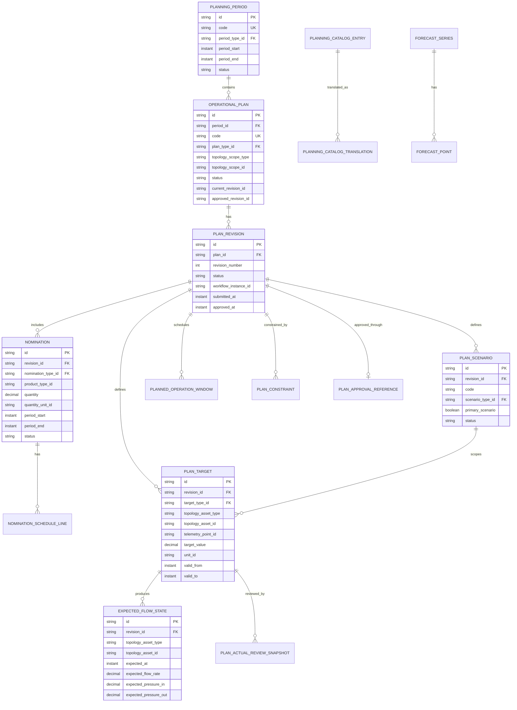

# HIDRA / HYFLO Planning Module — Data Definition Document

```text
Document code       : HIDRA-PLANNING-DDD
Document name       : Planning Module Data Definition Document
Repository lineage  : HyFloAPI first, HidraAPI modular redesign target
Canonical namespace : dz.sh.hidra.modules.planning
Product             : Hidra — Hydrocarbon Intelligence for Data, Risk, and Analytics
Module              : planning
Document type       : Logical data definition document
Version             : 1.0
Status              : Target architecture baseline candidate
Author              : Abir MEDJERAB
CreatedOn           : 2026-06-11
Primary rule        : Planning owns expected operational state; telemetry owns actual facts.
```

---

## 1. Purpose

This document defines the logical data model for the **Planning** module.

Planning is the operational planning bounded context for hydrocarbon transportation networks. It answers:

```text
What should be transported?
When should it be transported?
From where to where?
On which pipeline system / facility / delivery point?
At what planned volume, flow rate, pressure, and operating window?
Which plan version is active and approved?
Which constraints or nominations justify the plan?
What expected state should monitoring compare actual telemetry against?
```

Planning sits after trusted topology and telemetry:

```text
Topology
  -> Telemetry
      -> Planning
          -> Monitoring
```

Planning does **not** own live measurements. It produces the expected/approved operational baseline used by monitoring, simulation, risk, reporting, and workflow-governed operational decisions.

---

## 2. Source-of-truth rule

Planning is modeled using the following precedence:

| Priority | Source | Use |
|---:|---|---|
| 1 | HyFlo operational transportation process | Business meaning: transport program, nominations, planned flow/pressure/volume, plan revisions |
| 2 | Existing Hidra architecture documents | Module sequence, dependency rules, ownership boundaries |
| 3 | Current HidraAPI repository status | Implementation state and naming alignment |
| 4 | Target redesign | Versioned planning model, constraints, nominations, expected state, approval references |

Current repository inspection did not show an implemented planning Java module. Therefore this document is a **target DDD**. It must be treated as the first implementation contract for the future `planning` module.

---

## 3. Module ownership and boundaries

### 3.1 Planning owns

| Area | Owned by planning? | Notes |
|---|---:|---|
| Planning periods | Yes | Daily, weekly, monthly, operational-window periods |
| Operational plans / transport programs | Yes | Planned transportation baseline for a topology/product scope |
| Plan revisions | Yes | Versioned editable/approved/superseded plan states |
| Plan scenarios | Yes | Alternative plan cases before approval |
| Nominations | Yes | Requested injection, delivery, receipt, transfer, or export quantities |
| Nomination schedule lines | Yes | Time-sliced nomination quantities/rates |
| Planned targets | Yes | Planned volume, flow, pressure, temperature, state, and other setpoints |
| Expected flow state | Yes | Expected state on pipelines/segments/nodes/facilities for monitoring comparison |
| Planned operation windows | Yes | Planned shutdown, startup, bypass, pigging, maintenance impact, mode changes |
| Plan constraints | Yes | Capacity, contractual, maintenance, safety, product, topology, or operating constraints |
| Plan approval references | Yes | Stores workflow reference only; workflow owns tasks and decisions |
| Planning catalogs | Yes | Plan type, period type, nomination type, target type, constraint type, operation-window type |

### 3.2 Planning references only

| External concept | Reference rule |
|---|---|
| Pipeline system | Store `topologyScopeType`, `topologyScopeId`, `topologyScopeCode`, `topologyScopeNameSnapshot` |
| Pipeline, segment, facility, node, equipment | Store neutral topology asset reference fields; do not import topology aggregates |
| Telemetry point | Store `telemetryPointId` and optional `telemetryPointCodeSnapshot` only |
| Trusted telemetry reading | Store references only for plan review/forecast calibration; planning must not own actual readings |
| Product type | Store `productTypeId` or product catalog reference; do not hard-code product enum |
| Organization unit | Store `organizationUnitId` snapshot only for responsible planning unit |
| Identity actor | Store `createdByActorId`, `submittedByActorId`, `approvedByActorId` as ID values only |
| Workflow | Store `workflowInstanceId`/`workflowStatusSnapshot`; do not own workflow task state |
| Party/customer/shipper | Store `partyId`/`partyCodeSnapshot` when party module exists; avoid free-text party names |

### 3.3 Forbidden ownership

Planning must not own or create tables for:

```text
telemetry_reading
telemetry_point
trusted_telemetry_reading
pipeline
pipeline_segment
facility
equipment
monitoring_deviation
alarm
incident
workflow_task
workflow_instance_details
audit_record
custody_transfer_actual
invoice
contract_master
maintenance_work_order
simulation_run
```

---

## 4. Logical type conventions

| Logical type | Description |
|---|---|
| `ID` | Stable string/UUID identifier. Recommended physical length: 80. |
| `CODE` | Stable business code. Recommended physical length: 80. |
| `TEXT_SHORT` | Short label, usually 160 characters. |
| `TEXT_MEDIUM` | Medium text, usually 500 characters. |
| `TEXT_LONG` | Long explanation / CLOB. |
| `BOOLEAN` | True/false. |
| `INTEGER` | Whole number. |
| `DECIMAL` | BigDecimal measurement/planning quantity. |
| `INSTANT` | UTC timestamp. |
| `DATE` | Local date. |
| `TIME_ZONE` | IANA time zone code. |
| `JSON` | Structured technical payload. |
| `REFERENCE` | Stable ID to another aggregate/table/module. |
| `SNAPSHOT_TEXT` | Denormalized snapshot for historical readability. |
| `CATALOG_REF` | Reference to controlled catalog entry. |

---

## 5. Entity catalogue

| Entity | Ownership | Status | Purpose |
|---|---|---|---|
| `PlanningPeriod` | Planning | Target baseline | Defines a planning horizon such as day, week, month, campaign, or operational window |
| `OperationalPlan` | Planning | Target baseline | Main plan/program header for a topology/product scope |
| `PlanRevision` | Planning | Target baseline | Version of an operational plan |
| `PlanScenario` | Planning | Target baseline | Alternative case within a plan revision |
| `Nomination` | Planning | Target baseline | Requested receipt/injection/delivery/transfer/export quantity |
| `NominationScheduleLine` | Planning | Target baseline | Time-sliced detail of a nomination |
| `PlanTarget` | Planning | Target baseline | Generic planned value for flow, pressure, volume, temperature, linepack, etc. |
| `ExpectedFlowState` | Planning | Target baseline | Expected operating state at a topology asset/time interval |
| `PlannedOperationWindow` | Planning | Target baseline | Planned operational event affecting available capacity or operating mode |
| `PlanConstraint` | Planning | Target baseline | Constraint applied to a plan, scenario, nomination, or target |
| `PlanApprovalReference` | Planning | Target baseline | Planning-side reference to workflow approval state |
| `PlanningCatalogEntry` | Planning | Target baseline | Controlled vocabulary entry for planning taxonomies |
| `PlanningCatalogTranslation` | Planning | Target baseline | Multilingual labels/descriptions for planning catalog entries |
| `ForecastSeries` | Planning | Target addition | Forecast input series used to prepare plans |
| `ForecastPoint` | Planning | Target addition | Time-sliced forecast value |
| `PlanActualReviewSnapshot` | Planning/Monitoring boundary | Optional projection | Historical review of planned vs actual after monitoring computes actual/deviation data |

---

# 6. Entity definitions

---

## 6.1 PlanningPeriod

### Description

Defines a planning horizon. A period may be daily, weekly, monthly, campaign-based, seasonal, or tied to a specific operational window.

### Table

```text
hidra_planning_period
```

### Fields

| Field | Type | Required | Description |
|---|---|---:|---|
| `id` | ID | Yes | Stable planning period identifier. |
| `code` | CODE | Yes | Unique business code, for example `PLAN-2026-06-DAILY-11`. |
| `nameAr` | TEXT_SHORT | No | Arabic period label. |
| `nameFr` | TEXT_SHORT | Yes | French period label. |
| `nameEn` | TEXT_SHORT | No | English period label. |
| `periodTypeId` | CATALOG_REF | Yes | Catalog reference: `DAILY`, `WEEKLY`, `MONTHLY`, `CAMPAIGN`, `OPERATION_WINDOW`. |
| `periodStart` | INSTANT | Yes | Inclusive start timestamp. |
| `periodEnd` | INSTANT | Yes | Exclusive end timestamp. |
| `timeZone` | TIME_ZONE | Yes | Planning time zone. Default: `Africa/Algiers`. |
| `status` | TEXT_SHORT | Yes | Lifecycle: `OPEN`, `LOCKED`, `CLOSED`, `CANCELLED`. |
| `createdByActorId` | REFERENCE | Yes | Actor who created the period. |
| `createdAt` | INSTANT | Yes | Creation timestamp. |
| `updatedAt` | INSTANT | Yes | Last update timestamp. |

### Rules

```text
periodStart < periodEnd
code is unique
closed periods cannot receive new plan revisions unless reopened by workflow-approved action
```

---

## 6.2 OperationalPlan

### Description

Represents the planned transportation program for a given planning period and operational scope. It is the main planning aggregate root.

### Table

```text
hidra_planning_operational_plan
```

### Fields

| Field | Type | Required | Description |
|---|---|---:|---|
| `id` | ID | Yes | Stable plan identifier. |
| `periodId` | REFERENCE | Yes | Planning period that contains the plan. |
| `code` | CODE | Yes | Unique plan code. |
| `nameAr` | TEXT_SHORT | No | Arabic plan name. |
| `nameFr` | TEXT_SHORT | Yes | French plan name. |
| `nameEn` | TEXT_SHORT | No | English plan name. |
| `planTypeId` | CATALOG_REF | Yes | Catalog reference: daily transport plan, monthly program, shutdown plan, startup plan, contingency plan. |
| `productTypeId` | REFERENCE | No | Planned product reference, if the plan is product-specific. |
| `topologyScopeType` | TEXT_SHORT | Yes | `PIPELINE_SYSTEM`, `PIPELINE`, `FACILITY`, `REGION`, or `NETWORK`. |
| `topologyScopeId` | REFERENCE | Yes | Referenced topology scope ID. |
| `topologyScopeCode` | SNAPSHOT_TEXT | Yes | Topology code snapshot. |
| `topologyScopeNameSnapshot` | SNAPSHOT_TEXT | No | Topology name snapshot. |
| `responsibleOrganizationUnitId` | REFERENCE | No | Organization unit responsible for planning. |
| `status` | TEXT_SHORT | Yes | Plan lifecycle: `DRAFT`, `SUBMITTED`, `APPROVED`, `ACTIVE`, `SUPERSEDED`, `CANCELLED`, `CLOSED`. |
| `currentRevisionId` | REFERENCE | No | Current editable/latest revision. |
| `approvedRevisionId` | REFERENCE | No | Approved revision used downstream. |
| `createdByActorId` | REFERENCE | Yes | Creator actor ID. |
| `createdAt` | INSTANT | Yes | Creation timestamp. |
| `updatedAt` | INSTANT | Yes | Last update timestamp. |

### Rules

```text
A plan belongs to exactly one planning period.
A plan may have many revisions.
Only one approved revision should be active at a time.
Planning stores topology references only; topology remains owner of assets.
```

---

## 6.3 PlanRevision

### Description

Represents a version of an operational plan. Revisions make planning auditable and allow draft/approval/supersession without overwriting the approved baseline.

### Table

```text
hidra_planning_plan_revision
```

### Fields

| Field | Type | Required | Description |
|---|---|---:|---|
| `id` | ID | Yes | Stable revision identifier. |
| `planId` | REFERENCE | Yes | Parent operational plan. |
| `revisionNumber` | INTEGER | Yes | Monotonic number per plan. Starts at 1. |
| `revisionCode` | CODE | Yes | Human-friendly revision code, for example `R01`. |
| `status` | TEXT_SHORT | Yes | `DRAFT`, `SUBMITTED`, `APPROVED`, `REJECTED`, `SUPERSEDED`, `WITHDRAWN`. |
| `changeReasonCodeId` | CATALOG_REF | No | Catalog-backed reason for revision. |
| `changeReasonText` | TEXT_MEDIUM | No | Free explanation for the change. |
| `baseRevisionId` | REFERENCE | No | Previous revision copied from. |
| `submittedByActorId` | REFERENCE | No | Actor who submitted the revision. |
| `submittedAt` | INSTANT | No | Submission timestamp. |
| `approvedByActorId` | REFERENCE | No | Actor who approved the revision snapshot. |
| `approvedAt` | INSTANT | No | Approval timestamp. |
| `workflowInstanceId` | REFERENCE | No | Workflow instance governing approval. |
| `createdAt` | INSTANT | Yes | Creation timestamp. |
| `updatedAt` | INSTANT | Yes | Last update timestamp. |

### Rules

```text
revisionNumber is unique per plan
approved revisions are immutable
superseding an approved revision requires a new revision
workflow owns approval process; planning stores only the resulting reference/status snapshot
```

---

## 6.4 PlanScenario

### Description

Represents an alternative planning case inside a revision. Examples: base case, high-demand case, reduced-capacity case, maintenance-impact case, emergency fallback case.

### Table

```text
hidra_planning_plan_scenario
```

### Fields

| Field | Type | Required | Description |
|---|---|---:|---|
| `id` | ID | Yes | Stable scenario identifier. |
| `revisionId` | REFERENCE | Yes | Parent plan revision. |
| `code` | CODE | Yes | Scenario code unique per revision. |
| `nameAr` | TEXT_SHORT | No | Arabic scenario name. |
| `nameFr` | TEXT_SHORT | Yes | French scenario name. |
| `nameEn` | TEXT_SHORT | No | English scenario name. |
| `scenarioTypeId` | CATALOG_REF | Yes | Catalog reference: `BASE`, `HIGH_DEMAND`, `LOW_DEMAND`, `MAINTENANCE`, `CONTINGENCY`. |
| `primaryScenario` | BOOLEAN | Yes | True when this scenario is selected as baseline. |
| `status` | TEXT_SHORT | Yes | `DRAFT`, `SELECTED`, `REJECTED`, `ARCHIVED`. |
| `description` | TEXT_MEDIUM | No | Scenario explanation. |
| `createdAt` | INSTANT | Yes | Creation timestamp. |
| `updatedAt` | INSTANT | Yes | Last update timestamp. |

### Rules

```text
Only one primary scenario per revision.
Approved revision must identify exactly one selected baseline scenario.
```

---

## 6.5 Nomination

### Description

Represents a requested hydrocarbon movement quantity. A nomination may be an injection, receipt, delivery, transfer, export, import, or internal operational movement request.

### Table

```text
hidra_planning_nomination
```

### Fields

| Field | Type | Required | Description |
|---|---|---:|---|
| `id` | ID | Yes | Stable nomination identifier. |
| `revisionId` | REFERENCE | Yes | Plan revision owning the nomination. |
| `scenarioId` | REFERENCE | No | Scenario this nomination belongs to. |
| `code` | CODE | Yes | Nomination code unique per revision. |
| `nominationTypeId` | CATALOG_REF | Yes | `INJECTION`, `RECEIPT`, `DELIVERY`, `TRANSFER`, `EXPORT`, `IMPORT`. |
| `productTypeId` | REFERENCE | Yes | Product type reference. |
| `quantity` | DECIMAL | Yes | Requested quantity for the period. |
| `quantityUnitId` | REFERENCE | Yes | Unit reference. |
| `rate` | DECIMAL | No | Requested average rate if known. |
| `rateUnitId` | REFERENCE | No | Rate unit reference. |
| `sourceAssetType` | TEXT_SHORT | No | Source topology asset type. |
| `sourceAssetId` | REFERENCE | No | Source topology asset ID. |
| `sourceAssetCode` | SNAPSHOT_TEXT | No | Source topology asset code snapshot. |
| `destinationAssetType` | TEXT_SHORT | No | Destination topology asset type. |
| `destinationAssetId` | REFERENCE | No | Destination topology asset ID. |
| `destinationAssetCode` | SNAPSHOT_TEXT | No | Destination topology asset code snapshot. |
| `shipperPartyId` | REFERENCE | No | Party reference when party module exists. |
| `shipperPartyCodeSnapshot` | SNAPSHOT_TEXT | No | Party code snapshot. |
| `counterpartyId` | REFERENCE | No | Customer/producer/recipient party reference. |
| `contractReferenceId` | REFERENCE | No | Contract reference, if any. |
| `priority` | INTEGER | No | Scheduling priority. |
| `status` | TEXT_SHORT | Yes | `DRAFT`, `CONFIRMED`, `ALLOCATED`, `REJECTED`, `CANCELLED`, `SUPERSEDED`. |
| `periodStart` | INSTANT | Yes | Nomination start. |
| `periodEnd` | INSTANT | Yes | Nomination end. |
| `createdAt` | INSTANT | Yes | Creation timestamp. |
| `updatedAt` | INSTANT | Yes | Last update timestamp. |

### Rules

```text
periodStart < periodEnd
quantity > 0
source/destination asset references must be topology references, not embedded topology entities
free-text shipper names are forbidden in final tables; use Party reference when available
```

---

## 6.6 NominationScheduleLine

### Description

Represents a time-sliced nomination detail. It allows a nomination to be distributed hourly, daily, shift-by-shift, or by operational sub-window.

### Table

```text
hidra_planning_nomination_schedule_line
```

### Fields

| Field | Type | Required | Description |
|---|---|---:|---|
| `id` | ID | Yes | Stable line identifier. |
| `nominationId` | REFERENCE | Yes | Parent nomination. |
| `sequenceNumber` | INTEGER | Yes | Ordered line number. |
| `lineStart` | INSTANT | Yes | Inclusive start timestamp. |
| `lineEnd` | INSTANT | Yes | Exclusive end timestamp. |
| `plannedQuantity` | DECIMAL | No | Quantity planned for this slice. |
| `quantityUnitId` | REFERENCE | No | Quantity unit. |
| `plannedRate` | DECIMAL | No | Planned rate for this slice. |
| `rateUnitId` | REFERENCE | No | Rate unit. |
| `notes` | TEXT_MEDIUM | No | Operational notes. |

### Rules

```text
lineStart < lineEnd
line interval must be within nomination period
sequenceNumber is unique per nomination
```

---

## 6.7 PlanTarget

### Description

Defines a planned operational target. It is the generic target model consumed by monitoring to compare actual trusted telemetry against the expected state.

### Table

```text
hidra_planning_plan_target
```

### Fields

| Field | Type | Required | Description |
|---|---|---:|---|
| `id` | ID | Yes | Stable target identifier. |
| `revisionId` | REFERENCE | Yes | Parent plan revision. |
| `scenarioId` | REFERENCE | No | Scenario owning the target. |
| `nominationId` | REFERENCE | No | Nomination that justifies this target. |
| `targetTypeId` | CATALOG_REF | Yes | `FLOW_RATE`, `PRESSURE`, `VOLUME`, `TEMPERATURE`, `DENSITY`, `LINEPACK`, `EQUIPMENT_STATE`, `OPERATING_MODE`. |
| `topologyAssetType` | TEXT_SHORT | Yes | Asset type targeted. |
| `topologyAssetId` | REFERENCE | Yes | Topology asset ID. |
| `topologyAssetCode` | SNAPSHOT_TEXT | Yes | Topology asset code snapshot. |
| `topologyAssetNameSnapshot` | SNAPSHOT_TEXT | No | Topology asset name snapshot. |
| `telemetryPointId` | REFERENCE | No | Telemetry point used for actual comparison, if known. |
| `telemetryPointCodeSnapshot` | SNAPSHOT_TEXT | No | Telemetry point code snapshot. |
| `targetValue` | DECIMAL | No | Planned numeric value. |
| `targetTextValue` | TEXT_SHORT | No | Planned text/state value for non-numeric targets. |
| `unitId` | REFERENCE | No | Unit reference for numeric value. |
| `toleranceLow` | DECIMAL | No | Allowed lower tolerance. |
| `toleranceHigh` | DECIMAL | No | Allowed upper tolerance. |
| `validFrom` | INSTANT | Yes | Inclusive validity start. |
| `validTo` | INSTANT | Yes | Exclusive validity end. |
| `priority` | INTEGER | No | Target priority for conflict resolution. |
| `status` | TEXT_SHORT | Yes | `DRAFT`, `ACTIVE`, `SUPERSEDED`, `CANCELLED`. |
| `createdAt` | INSTANT | Yes | Creation timestamp. |
| `updatedAt` | INSTANT | Yes | Last update timestamp. |

### Rules

```text
validFrom < validTo
numeric target must have targetValue and unitId
state target may use targetTextValue
planning target references topology and telemetry by ID only
```

---

## 6.8 ExpectedFlowState

### Description

Represents the expected hydraulic/operational state derived from an approved plan. It is not a simulation result and not an actual telemetry reading. It is the operational baseline used by monitoring.

### Table

```text
hidra_planning_expected_flow_state
```

### Fields

| Field | Type | Required | Description |
|---|---|---:|---|
| `id` | ID | Yes | Stable expected-state identifier. |
| `revisionId` | REFERENCE | Yes | Plan revision that produced this expected state. |
| `scenarioId` | REFERENCE | No | Scenario source. |
| `planTargetId` | REFERENCE | No | Related plan target. |
| `topologyAssetType` | TEXT_SHORT | Yes | `PIPELINE`, `PIPELINE_SEGMENT`, `NODE`, `FACILITY`, `EQUIPMENT`. |
| `topologyAssetId` | REFERENCE | Yes | Topology asset ID. |
| `topologyAssetCode` | SNAPSHOT_TEXT | Yes | Topology asset code snapshot. |
| `expectedAt` | INSTANT | Yes | Timestamp of expected state. |
| `expectedFlowRate` | DECIMAL | No | Expected flow rate. |
| `flowRateUnitId` | REFERENCE | No | Flow unit. |
| `expectedPressureIn` | DECIMAL | No | Expected inlet/upstream pressure. |
| `expectedPressureOut` | DECIMAL | No | Expected outlet/downstream pressure. |
| `pressureUnitId` | REFERENCE | No | Pressure unit. |
| `expectedTemperature` | DECIMAL | No | Expected temperature. |
| `temperatureUnitId` | REFERENCE | No | Temperature unit. |
| `expectedVolume` | DECIMAL | No | Expected volume for the interval. |
| `volumeUnitId` | REFERENCE | No | Volume unit. |
| `expectedOperatingMode` | TEXT_SHORT | No | Expected mode snapshot. |
| `validFrom` | INSTANT | Yes | Inclusive interval start. |
| `validTo` | INSTANT | Yes | Exclusive interval end. |
| `createdAt` | INSTANT | Yes | Creation timestamp. |

### Rules

```text
ExpectedFlowState is expected state only.
Actual readings remain in telemetry.
Deviation detection belongs to monitoring.
```

---

## 6.9 PlannedOperationWindow

### Description

Represents a planned operational window that affects the plan: shutdown, startup, pigging, maintenance impact, bypass operation, product switch, pressure-reduction period, constrained-capacity period, or special operation.

### Table

```text
hidra_planning_operation_window
```

### Fields

| Field | Type | Required | Description |
|---|---|---:|---|
| `id` | ID | Yes | Stable operation-window identifier. |
| `revisionId` | REFERENCE | Yes | Parent revision. |
| `scenarioId` | REFERENCE | No | Scenario source. |
| `code` | CODE | Yes | Operation window code. |
| `windowTypeId` | CATALOG_REF | Yes | `SHUTDOWN`, `STARTUP`, `PIGGING`, `MAINTENANCE_IMPACT`, `BYPASS`, `PRODUCT_SWITCH`, `CAPACITY_REDUCTION`. |
| `topologyAssetType` | TEXT_SHORT | Yes | Affected topology asset type. |
| `topologyAssetId` | REFERENCE | Yes | Affected topology asset ID. |
| `topologyAssetCode` | SNAPSHOT_TEXT | Yes | Affected asset code snapshot. |
| `plannedStart` | INSTANT | Yes | Planned start timestamp. |
| `plannedEnd` | INSTANT | Yes | Planned end timestamp. |
| `capacityImpactPercent` | DECIMAL | No | Capacity impact from 0 to 100 when applicable. |
| `description` | TEXT_MEDIUM | No | Operational explanation. |
| `status` | TEXT_SHORT | Yes | `PLANNED`, `APPROVED`, `CANCELLED`, `SUPERSEDED`, `COMPLETED`. |
| `createdAt` | INSTANT | Yes | Creation timestamp. |
| `updatedAt` | INSTANT | Yes | Last update timestamp. |

### Rules

```text
plannedStart < plannedEnd
operation window does not create maintenance work orders
asset references are neutral topology references
```

---

## 6.10 PlanConstraint

### Description

Represents a constraint that affects plan feasibility. Constraints may be capacity, topology, product, contractual, maintenance, HSE, organization-resource, telemetry-confidence, or operational limits.

### Table

```text
hidra_planning_plan_constraint
```

### Fields

| Field | Type | Required | Description |
|---|---|---:|---|
| `id` | ID | Yes | Stable constraint identifier. |
| `revisionId` | REFERENCE | Yes | Parent revision. |
| `scenarioId` | REFERENCE | No | Scenario source. |
| `constraintTypeId` | CATALOG_REF | Yes | Catalog reference. |
| `severity` | TEXT_SHORT | Yes | `INFO`, `WARNING`, `BLOCKING`. |
| `topologyAssetType` | TEXT_SHORT | No | Affected asset type. |
| `topologyAssetId` | REFERENCE | No | Affected asset ID. |
| `topologyAssetCode` | SNAPSHOT_TEXT | No | Affected asset code snapshot. |
| `constraintValue` | DECIMAL | No | Numeric constraint value. |
| `unitId` | REFERENCE | No | Unit reference. |
| `validFrom` | INSTANT | No | Constraint start. |
| `validTo` | INSTANT | No | Constraint end. |
| `sourceModule` | TEXT_SHORT | No | Module that provided the constraint, for example `topology`, `assets`, `hse`, `telemetry`. |
| `sourceReferenceId` | REFERENCE | No | External constraint source reference. |
| `description` | TEXT_MEDIUM | No | Human-readable explanation. |
| `blocking` | BOOLEAN | Yes | True when approval must be blocked unless resolved/overridden. |
| `status` | TEXT_SHORT | Yes | `ACTIVE`, `WAIVED`, `RESOLVED`, `CANCELLED`. |
| `createdAt` | INSTANT | Yes | Creation timestamp. |
| `updatedAt` | INSTANT | Yes | Last update timestamp. |

### Rules

```text
blocking constraints must be resolved or explicitly waived before approval
waiver should be workflow-governed and audit-ready
```

---

## 6.11 PlanApprovalReference

### Description

Planning-side reference to workflow approval state. Workflow remains the owner of process, tasks, actions, comments, delegation, and escalation.

### Table

```text
hidra_planning_plan_approval_reference
```

### Fields

| Field | Type | Required | Description |
|---|---|---:|---|
| `id` | ID | Yes | Stable approval reference ID. |
| `revisionId` | REFERENCE | Yes | Plan revision under approval. |
| `workflowInstanceId` | REFERENCE | Yes | Workflow instance ID. |
| `workflowDefinitionCodeSnapshot` | SNAPSHOT_TEXT | No | Workflow definition code snapshot. |
| `approvalStatusSnapshot` | TEXT_SHORT | Yes | `NOT_REQUIRED`, `PENDING`, `APPROVED`, `REJECTED`, `CANCELLED`. |
| `submittedByActorId` | REFERENCE | No | Actor who submitted the revision. |
| `submittedAt` | INSTANT | No | Submission timestamp. |
| `decidedByActorId` | REFERENCE | No | Final decision actor snapshot. |
| `decidedAt` | INSTANT | No | Final decision timestamp. |
| `decisionReasonSnapshot` | TEXT_MEDIUM | No | Final reason snapshot; authoritative reason remains in workflow/audit. |
| `createdAt` | INSTANT | Yes | Creation timestamp. |
| `updatedAt` | INSTANT | Yes | Last update timestamp. |

### Rules

```text
Workflow owns tasks and action history.
Planning stores only the workflow reference and final status snapshot.
Approved revision cannot be changed directly.
```

---

## 6.12 PlanningCatalogEntry

### Description

Controlled vocabulary entry for planning types. User-facing planning types must be catalog-backed, not hard-coded Java enums.

### Table

```text
hidra_planning_catalog_entry
```

### Fields

| Field | Type | Required | Description |
|---|---|---:|---|
| `id` | ID | Yes | Stable catalog entry ID. |
| `catalogName` | CODE | Yes | Catalog name: `PLAN_TYPE`, `PERIOD_TYPE`, `TARGET_TYPE`, `NOMINATION_TYPE`, `CONSTRAINT_TYPE`, `SCENARIO_TYPE`, `WINDOW_TYPE`, `REVISION_REASON`. |
| `code` | CODE | Yes | Entry code unique within catalog. |
| `active` | BOOLEAN | Yes | Whether the entry is usable. |
| `sortOrder` | INTEGER | Yes | Display order. |
| `systemDefined` | BOOLEAN | Yes | True for system-seeded values. |
| `createdAt` | INSTANT | Yes | Creation timestamp. |
| `updatedAt` | INSTANT | Yes | Last update timestamp. |

---

## 6.13 PlanningCatalogTranslation

### Description

Multilingual labels/descriptions for planning catalog entries.

### Table

```text
hidra_planning_catalog_translation
```

### Fields

| Field | Type | Required | Description |
|---|---|---:|---|
| `id` | ID | Yes | Stable translation ID. |
| `catalogEntryId` | REFERENCE | Yes | Parent catalog entry. |
| `locale` | TEXT_SHORT | Yes | `ar`, `fr`, `en`. |
| `name` | TEXT_SHORT | Yes | Localized label. |
| `description` | TEXT_MEDIUM | No | Localized description. |
| `createdAt` | INSTANT | Yes | Creation timestamp. |
| `updatedAt` | INSTANT | Yes | Last update timestamp. |

### Rules

```text
unique(catalogEntryId, locale)
all user-facing planning types must have French label at minimum
Arabic and English labels are recommended for enterprise UI readiness
```

---

## 6.14 ForecastSeries

### Description

Forecast input series used during plan preparation. Forecasts may come from demand forecasts, historical averages, supply declarations, contractual estimates, or manual planning assumptions.

### Table

```text
hidra_planning_forecast_series
```

### Fields

| Field | Type | Required | Description |
|---|---|---:|---|
| `id` | ID | Yes | Stable forecast series ID. |
| `periodId` | REFERENCE | Yes | Planning period. |
| `code` | CODE | Yes | Forecast code. |
| `forecastTypeId` | CATALOG_REF | Yes | `DEMAND`, `SUPPLY`, `CONSUMPTION`, `DELIVERY`, `INJECTION`, `CAPACITY`. |
| `topologyAssetType` | TEXT_SHORT | No | Forecasted topology scope type. |
| `topologyAssetId` | REFERENCE | No | Forecasted topology scope ID. |
| `productTypeId` | REFERENCE | No | Product reference. |
| `sourceModule` | TEXT_SHORT | No | Source module/system. |
| `sourceReferenceId` | REFERENCE | No | Source reference ID. |
| `status` | TEXT_SHORT | Yes | `DRAFT`, `ACTIVE`, `ARCHIVED`. |
| `createdAt` | INSTANT | Yes | Creation timestamp. |
| `updatedAt` | INSTANT | Yes | Last update timestamp. |

---

## 6.15 ForecastPoint

### Description

One time-sliced forecast value in a forecast series.

### Table

```text
hidra_planning_forecast_point
```

### Fields

| Field | Type | Required | Description |
|---|---|---:|---|
| `id` | ID | Yes | Stable forecast point ID. |
| `forecastSeriesId` | REFERENCE | Yes | Parent forecast series. |
| `forecastAt` | INSTANT | Yes | Forecast timestamp or interval anchor. |
| `validFrom` | INSTANT | Yes | Inclusive interval start. |
| `validTo` | INSTANT | Yes | Exclusive interval end. |
| `value` | DECIMAL | Yes | Forecast value. |
| `unitId` | REFERENCE | Yes | Unit reference. |
| `confidenceLevel` | DECIMAL | No | Optional confidence percentage or score. |
| `createdAt` | INSTANT | Yes | Creation timestamp. |

---

## 6.16 PlanActualReviewSnapshot

### Description

Optional post-operation review projection. It summarizes planned versus actual after monitoring computes deviations from telemetry. It is not the live monitoring engine.

### Table

```text
hidra_planning_actual_review_snapshot
```

### Fields

| Field | Type | Required | Description |
|---|---|---:|---|
| `id` | ID | Yes | Stable review snapshot ID. |
| `planTargetId` | REFERENCE | Yes | Planned target reviewed. |
| `monitoringDeviationId` | REFERENCE | No | Monitoring deviation reference, if any. |
| `trustedTelemetryReadingId` | REFERENCE | No | Actual trusted reading reference, if a single reading applies. |
| `actualValue` | DECIMAL | No | Actual value snapshot. |
| `plannedValue` | DECIMAL | No | Planned value snapshot. |
| `differenceValue` | DECIMAL | No | Actual minus planned. |
| `differencePercent` | DECIMAL | No | Difference percentage. |
| `unitId` | REFERENCE | No | Unit reference. |
| `reviewedAt` | INSTANT | Yes | Review timestamp. |
| `reviewSource` | TEXT_SHORT | Yes | `MONITORING`, `REPORTING`, `MANUAL_REVIEW`. |
| `notes` | TEXT_MEDIUM | No | Review comments. |

### Rules

```text
Monitoring owns live deviation detection.
Planning may keep review snapshots only for plan-performance learning and reporting.
```

---

# 7. Relationships and cardinality

| Relationship | Cardinality | Rule |
|---|---:|---|
| `PlanningPeriod -> OperationalPlan` | 1 to many | A period may contain many plans. |
| `OperationalPlan -> PlanRevision` | 1 to many | A plan is revised over time. |
| `PlanRevision -> PlanScenario` | 1 to many | A revision may define alternative cases. |
| `PlanRevision -> Nomination` | 1 to many | A revision may contain many nominations. |
| `Nomination -> NominationScheduleLine` | 1 to many | Nomination may be time-sliced. |
| `PlanRevision -> PlanTarget` | 1 to many | A revision defines planned operating targets. |
| `PlanScenario -> PlanTarget` | 1 to many optional | Targets may belong to a scenario. |
| `PlanTarget -> ExpectedFlowState` | 1 to many optional | Expected states may derive from targets. |
| `PlanRevision -> PlannedOperationWindow` | 1 to many | Planned operations affect plan feasibility. |
| `PlanRevision -> PlanConstraint` | 1 to many | Constraints apply to plan/revision/scenario. |
| `PlanRevision -> PlanApprovalReference` | 1 to 0..1 | Approval reference exists when workflow governs the revision. |
| `PlanningCatalogEntry -> PlanningCatalogTranslation` | 1 to many | One translation per locale. |
| `ForecastSeries -> ForecastPoint` | 1 to many | Forecast series has time-sliced values. |
| `PlanTarget -> PlanActualReviewSnapshot` | 1 to many optional | Reviews happen after operation. |

---

# 8. Normalization rules

## 8.1 Plan header versus revision

Do not store editable targets directly on `OperationalPlan`.

Correct:

```text
OperationalPlan
  -> PlanRevision
      -> PlanTarget
```

Bad:

```text
OperationalPlan.plannedFlow
OperationalPlan.plannedPressure
OperationalPlan.plannedVolume
```

Reason: plans are revised, approved, superseded, and audited. Targets belong to a revision, not directly to the mutable plan header.

## 8.2 Topology references

Planning must not duplicate topology details.

Correct:

```text
PlanTarget.topologyAssetType
PlanTarget.topologyAssetId
PlanTarget.topologyAssetCode
```

Bad:

```text
PlanTarget.pipelineName
PlanTarget.facilityLatitude
PlanTarget.segmentDiameter
```

## 8.3 Actual values

Actual readings belong to telemetry. Deviations belong to monitoring.

Correct:

```text
PlanTarget = expected value
TrustedTelemetryReading = actual fact
MonitoringDeviation = comparison result
```

Bad:

```text
PlanTarget.actualValue
PlanTarget.alarmState
OperationalPlan.liveDeviation
```

## 8.4 Party references

Nominations must not store free-text shipper/customer names in final operational tables.

Correct:

```text
Nomination.shipperPartyId
Nomination.shipperPartyCodeSnapshot
```

Bad:

```text
Nomination.shipperName = "sonatrch"
Nomination.customerName = "sonatrak"
```

---

# 9. Catalogs

Planning catalog names:

| Catalog | Examples |
|---|---|
| `PLAN_TYPE` | `DAILY_TRANSPORT`, `WEEKLY_PROGRAM`, `MONTHLY_PROGRAM`, `STARTUP_PLAN`, `SHUTDOWN_PLAN`, `CONTINGENCY_PLAN` |
| `PERIOD_TYPE` | `DAY`, `WEEK`, `MONTH`, `CAMPAIGN`, `OPERATION_WINDOW` |
| `SCENARIO_TYPE` | `BASE`, `HIGH_DEMAND`, `LOW_DEMAND`, `MAINTENANCE`, `CONTINGENCY` |
| `NOMINATION_TYPE` | `INJECTION`, `RECEIPT`, `DELIVERY`, `TRANSFER`, `EXPORT`, `IMPORT` |
| `TARGET_TYPE` | `FLOW_RATE`, `PRESSURE`, `VOLUME`, `TEMPERATURE`, `DENSITY`, `LINEPACK`, `OPERATING_MODE`, `EQUIPMENT_STATE` |
| `CONSTRAINT_TYPE` | `CAPACITY`, `MAINTENANCE`, `CONTRACTUAL`, `TOPOLOGY`, `HSE`, `TELEMETRY_CONFIDENCE`, `PRODUCT_COMPATIBILITY` |
| `WINDOW_TYPE` | `SHUTDOWN`, `STARTUP`, `PIGGING`, `MAINTENANCE_IMPACT`, `BYPASS`, `PRODUCT_SWITCH`, `CAPACITY_REDUCTION` |
| `REVISION_REASON` | `INITIAL_PLAN`, `NOMINATION_CHANGE`, `CAPACITY_CHANGE`, `MAINTENANCE_CHANGE`, `OPERATIONS_REQUEST`, `EMERGENCY_ADJUSTMENT` |
| `FORECAST_TYPE` | `DEMAND`, `SUPPLY`, `CONSUMPTION`, `DELIVERY`, `INJECTION`, `CAPACITY` |

Business taxonomies should be catalog-backed. Technical lifecycle states may be Java enums if stable.

---

# 10. Technical lifecycle states

These states are stable enough to be enums or constrained strings.

## 10.1 OperationalPlanStatus

```text
DRAFT
SUBMITTED
APPROVED
ACTIVE
SUPERSEDED
CANCELLED
CLOSED
```

## 10.2 PlanRevisionStatus

```text
DRAFT
SUBMITTED
APPROVED
REJECTED
SUPERSEDED
WITHDRAWN
```

## 10.3 NominationStatus

```text
DRAFT
CONFIRMED
ALLOCATED
REJECTED
CANCELLED
SUPERSEDED
```

## 10.4 PlanConstraintStatus

```text
ACTIVE
WAIVED
RESOLVED
CANCELLED
```

---

# 11. Required indexes and constraints

## 11.1 Unique constraints

```text
unique(hidra_planning_period.code)
unique(hidra_planning_operational_plan.code)
unique(hidra_planning_plan_revision.plan_id, revision_number)
unique(hidra_planning_plan_scenario.revision_id, code)
unique(hidra_planning_nomination.revision_id, code)
unique(hidra_planning_nomination_schedule_line.nomination_id, sequence_number)
unique(hidra_planning_catalog_entry.catalog_name, code)
unique(hidra_planning_catalog_translation.catalog_entry_id, locale)
```

## 11.2 Recommended indexes

```text
idx_planning_period_range(period_start, period_end)
idx_operational_plan_period(period_id)
idx_operational_plan_scope(topology_scope_type, topology_scope_id)
idx_operational_plan_status(status)
idx_plan_revision_plan_status(plan_id, status)
idx_nomination_revision(revision_id)
idx_nomination_product(product_type_id)
idx_nomination_period(period_start, period_end)
idx_plan_target_revision(revision_id)
idx_plan_target_asset(topology_asset_type, topology_asset_id)
idx_plan_target_telemetry_point(telemetry_point_id)
idx_plan_target_validity(valid_from, valid_to)
idx_expected_flow_asset_time(topology_asset_type, topology_asset_id, expected_at)
idx_constraint_revision_status(revision_id, status)
idx_operation_window_asset_time(topology_asset_type, topology_asset_id, planned_start, planned_end)
```

---

# 12. Module dependency rules

## 12.1 Allowed dependencies

Planning may depend on:

```text
kernel primitives
platform infrastructure through configuration/adapters only
topology public reference contracts only
telemetry public reference contracts only
workflow public command/reference contract only
organization public reference contract only
```

## 12.2 Forbidden imports

Planning domain must not import:

```text
dz.sh.hidra.modules.topology.infrastructure.*
dz.sh.hidra.modules.topology.domain.model.*
dz.sh.hidra.modules.telemetry.infrastructure.*
dz.sh.hidra.modules.telemetry.domain.model.TelemetryReading
dz.sh.hidra.modules.workflow.infrastructure.*
dz.sh.hidra.modules.monitoring.*
dz.sh.hidra.modules.alarms.*
dz.sh.hidra.modules.incidents.*
```

## 12.3 Public contracts exposed by planning

Planning should expose:

```text
GetApprovedPlanBaselineQuery
GetPlanTargetsForAssetQuery
GetExpectedStateForPeriodQuery
GetApprovedRevisionForPlanQuery
PlanRevisionApprovedEvent
PlanRevisionSupersededEvent
PlanningTargetChangedEvent
NominationConfirmedEvent
```

---

# 13. Mermaid ER diagram



---

# 14. Implementation package recommendation

```text
dz.sh.hidra.modules.planning
  api
    rest
      controller
      mapper
      request
      response
  application
    command
    query
    dto
    service
    port
      in
      out
  domain
    model
    value
    event
    policy
    service
    exception
  infrastructure
    configuration
    persistence
      entity
      repository
      mapper
      adapter
    messaging
    projection
```

Forbidden package names:

```text
shared
sharedkernel
common
core
utils
helper
helpers
misc
```

---

# 15. First implementation slice

The first planning implementation should create only the minimal backbone:

```text
PlanningPeriod
OperationalPlan
PlanRevision
PlanTarget
Nomination
PlanningCatalogEntry
PlanningCatalogTranslation
```

Do not start with simulation, optimization, AI planning, or dashboards.

First useful product outcome:

```text
Create a daily/monthly transport plan.
Create a revision.
Add nominations.
Add planned flow/pressure/volume targets.
Submit revision to workflow.
Approve revision.
Expose approved targets to monitoring.
```

---

# 16. Non-negotiable rules

```text
Planning owns expected state only.
Telemetry owns actual readings.
Monitoring owns deviation detection.
Workflow owns approval process.
Topology owns physical network assets.
Organization owns responsible units and employees.
Party module owns external legal parties.
Audit owns immutable audit records.
```

Final architectural rule:

```text
Plan facts must be versioned before they are monitored.
Actual facts must come from trusted telemetry.
Deviation facts must be produced by monitoring.
```
