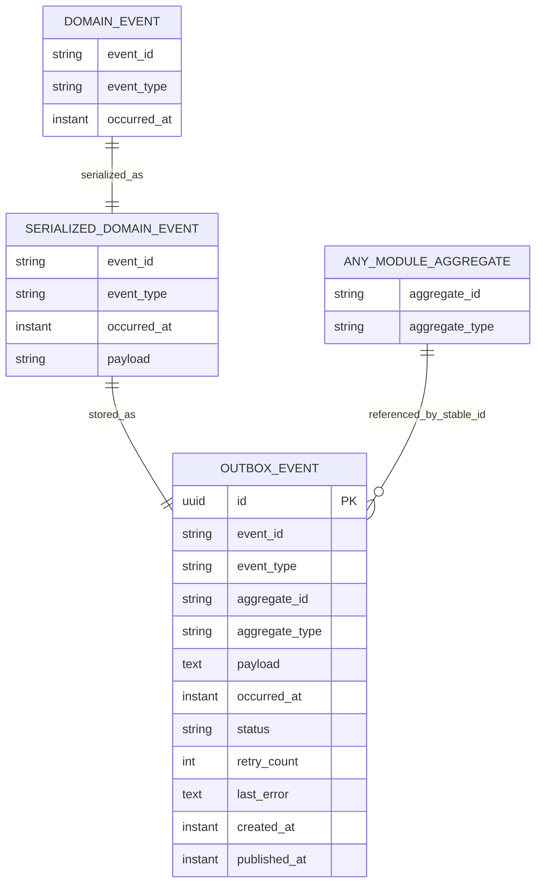

# HIDRA-PLATFORM-DATA-DEFINITION-DOCUMENT

```text
Document code       : HIDRA-PLATFORM-DDD
Repository          : HidraAPI
Canonical namespace : dz.sh.hidra
Module              : platform
Product             : Hidra — Hydrocarbon Intelligence for Data, Risk, and Analytics
Document type       : Data Definition Document
Version             : 1.0
Status              : Repository-aligned architecture baseline
Owner               : Sonatrach / TRC Digitalization Initiative
Author              : Abir MEDJERAB
CreatedOn           : 2025-06-26
UpdatedOn           : 2026-06-11
Scope               : Technical platform module only
```

---

## 1. Purpose

This document defines the **Platform Module** data and technical-support model for HidraAPI.

Unlike business modules such as topology, telemetry, workflow, incidents, or custody, the platform module does **not** own hydrocarbon transportation business facts. Its purpose is to provide reusable technical infrastructure required by all modules.

The platform module owns:

- technical outbox persistence;
- domain-event serialization support;
- technical security context access;
- request correlation and logging context;
- tenancy and organization-scope runtime context;
- technical configuration binding;
- exception mapping support;
- persistence and transaction infrastructure conventions.

The platform module must stay small and technical. It must never become a `common`, `shared`, `utils`, or business-service module.

---

## 2. Platform Ownership Boundary

### 2.1 Platform Owns

| Area | Platform responsibility |
|---|---|
| Events infrastructure | Outbox table, serialization, publication status, technical event store |
| Security plumbing | Reading Spring Security context, current technical actor resolution, anonymous/system actor constants |
| Tenancy context | Runtime tenant and organization-scope context holders |
| Observability | Correlation/request IDs, logging context keys, sensitive value masking, readiness checks |
| Exception infrastructure | Technical exception types and API error conversion |
| Configuration | Typed `hidra.platform.*` technical configuration |
| Persistence support | JPA configuration, migration metadata, transaction executor |

### 2.2 Platform Does Not Own

| Forbidden ownership | Correct owner |
|---|---|
| Users, roles, permissions, ABAC/RBAC policies | `identity` |
| Employees, organization units, responsibilities | `organization` |
| Business audit records and decision evidence | `audit` |
| Workflow instances and tasks | `workflow` |
| Topology assets | `topology` |
| Telemetry readings | `telemetry` |
| Business notifications | `notification` |
| Integration connector business mapping | `integration` |
| Analytics, reports, AI decisions | `analytics`, `reporting`, `agents` |

### 2.3 Boundary Rule

```text
Platform may provide technical mechanisms.
Platform must not define business meaning.
```

Examples:

```text
CurrentActorResolver       -> allowed in platform
UserAccount                -> forbidden in platform; belongs to identity
OrganizationScopeContext   -> allowed as technical context holder
OrganizationUnit           -> forbidden in platform; belongs to organization
OutboxEventEntity          -> allowed in platform
AuditRecord                -> forbidden in platform; belongs to audit
```

---

## 3. Platform Data Classification

| Category | Persistent? | Definition type | Notes |
|---|---:|---|---|
| Outbox event | Yes | JPA entity / table | Only real platform-owned persistence entity currently identified |
| Outbox status | No | Enum | Stored as string in outbox table |
| Serialized domain event | No | Technical record | Used before writing outbox payload |
| Tenant context | No | Runtime thread context | No database table |
| Organization scope context | No | Runtime thread context | No database table |
| Authenticated principal | No | Technical record | Derived from Spring Security context |
| Logging context | No | MDC key/value utility | No database table |
| Platform properties | No | Configuration properties | Bound from application configuration |
| Migration metadata | No | Technical convention object | No database table |
| Exception types | No | Technical classes | No database table |

---

# 4. Persistent Entity Definitions

## 4.1 OutboxEvent

### Entity

```text
Logical name        : OutboxEvent
Java class          : OutboxEventEntity
Package             : dz.sh.hidra.platform.events.outbox
Physical table      : hidra_platform_outbox_event
Ownership           : platform
Persistence status  : Implemented
Purpose             : Stores serialized domain events pending technical publication.
```

### Description

`OutboxEvent` is the technical persistence entity used by the platform outbox pattern. Business modules produce domain events. Platform serializes those events and stores them in the outbox table in the same transaction as the business change. A later dispatcher publishes them safely.

This table is not a business event-history table and must not be used as audit evidence. Audit belongs to the audit module.

### Fields

| Field | Logical type | Required | Description |
|---|---|---:|---|
| `id` | UUID | Yes | Technical outbox row identifier. Generated by platform. |
| `event_id` | String(120) | Yes | Stable domain-event identifier from the original domain event. |
| `event_type` | String(255) | Yes | Domain event type name, for example `TopologySnapshotApproved`. |
| `aggregate_id` | String(120) | No | Optional aggregate or target identifier associated with the event. |
| `aggregate_type` | String(255) | No | Optional aggregate or target type associated with the event. |
| `payload` | Text / JSON string | Yes | Serialized domain event payload. Stored as text. |
| `occurred_at` | Instant | Yes | Time at which the domain event occurred. |
| `status` | Enum string | Yes | Technical publication status: `PENDING`, `PUBLISHED`, or `FAILED`. |
| `retry_count` | Integer | Yes | Number of publication attempts already performed. Defaults to `0`. |
| `last_error` | Text | No | Last technical dispatch/serialization/publication error. |
| `created_at` | Instant | Yes | Time at which the outbox row was created. |
| `published_at` | Instant | No | Time at which publication succeeded. Null while pending or failed. |

### Relationships

| Source | Target | Cardinality | Relationship type | Notes |
|---|---|---|---|---|
| `OutboxEvent.aggregate_id` | Any module aggregate ID | Many-to-one logical reference | Stable reference only | No physical FK. Platform must not depend on business schemas. |
| `OutboxEvent.event_id` | `DomainEvent.eventId` | One-to-one logical reference | Technical copy | Comes from kernel domain event contract. |

### Constraints

| Constraint | Rule |
|---|---|
| Primary key | `id` |
| Required payload | `payload` must not be blank |
| Required event metadata | `event_id`, `event_type`, and `occurred_at` are mandatory |
| Status domain | `PENDING`, `PUBLISHED`, `FAILED` |
| Business isolation | No FK to business tables |

### Recommended indexes

| Index | Fields | Purpose |
|---|---|---|
| `idx_hidra_platform_outbox_status_created_at` | `status`, `created_at` | Fetch pending events in creation order |
| `idx_hidra_platform_outbox_event_id` | `event_id` | Idempotency/diagnostics |
| `idx_hidra_platform_outbox_aggregate` | `aggregate_type`, `aggregate_id` | Troubleshooting by aggregate |
| `idx_hidra_platform_outbox_occurred_at` | `occurred_at` | Time-based cleanup/search |

---

## 4.2 OutboxEventStatus

### Definition

```text
Logical name        : OutboxEventStatus
Java enum           : OutboxEventStatus
Package             : dz.sh.hidra.platform.events.outbox
Persistence         : Stored as string in OutboxEvent.status
Ownership           : platform
```

### Values

| Value | Description |
|---|---|
| `PENDING` | Event is stored and awaiting publication. |
| `PUBLISHED` | Event was successfully published. |
| `FAILED` | Event publication failed and requires retry or operational attention. |

### Boundary note

`OutboxEventStatus` is a technical publication state. It is not a domain status and must not be reused by business modules.

---

# 5. Non-Persistent Technical Definitions

## 5.1 SerializedDomainEvent

### Definition

```text
Logical name        : SerializedDomainEvent
Java record         : SerializedDomainEvent
Package             : dz.sh.hidra.platform.events.serialization
Persistence         : Non-persistent technical DTO
Ownership           : platform
```

### Description

Technical representation of a domain event after serialization and before outbox storage.

### Fields

| Field | Logical type | Required | Description |
|---|---|---:|---|
| `eventId` | String | Yes | Domain event identifier. |
| `eventType` | String | Yes | Domain event type. |
| `occurredAt` | Instant | Yes | Event occurrence timestamp. |
| `payload` | String / JSON text | Yes | Serialized event body. |

### Relationships

| Source | Target | Cardinality | Notes |
|---|---|---|---|
| `SerializedDomainEvent` | `OutboxEvent` | One-to-one technical transformation | `OutboxEvent.pending(...)` consumes serialized event data. |

---

## 5.2 TenantContext

### Definition

```text
Logical name        : TenantContext
Java class          : TenantContext
Package             : dz.sh.hidra.platform.tenancy
Persistence         : Non-persistent runtime context
Ownership           : platform
```

### Description

Thread-local holder for the current technical tenant identifier. This is a runtime context value, not a business organization model.

### Fields / Values

| Runtime value | Logical type | Required | Description |
|---|---|---:|---|
| `currentTenant` | String | No | Current tenant identifier stored in thread-local context. |

### Operations

| Operation | Description |
|---|---|
| `set(tenantId)` | Sets current tenant or clears if blank. |
| `current()` | Returns optional current tenant. |
| `currentOrDefault(defaultTenantId)` | Returns current tenant or fallback. |
| `clear()` | Removes tenant from current thread. |

### Boundary note

`TenantContext` must not become a `Tenant` master-data entity. If Hidra later needs tenant administration, that must be a dedicated module or platform-admin capability, not a hidden business object in platform runtime context.

---

## 5.3 OrganizationScopeContext

### Definition

```text
Logical name        : OrganizationScopeContext
Java class          : OrganizationScopeContext
Package             : dz.sh.hidra.platform.tenancy
Persistence         : Non-persistent runtime context
Ownership           : platform
```

### Description

Thread-local holder for the current technical organization-scope identifier. It is used by platform plumbing to carry scope through a request. It does not define organization units, employees, or responsibilities.

### Fields / Values

| Runtime value | Logical type | Required | Description |
|---|---|---:|---|
| `currentScope` | OrganizationScopeId | No | Current technical organization-scope identifier. |

### Operations

| Operation | Description |
|---|---|
| `set(OrganizationScopeId)` | Sets current organization scope. |
| `set(String)` | Creates `OrganizationScopeId` from string and sets it. |
| `current()` | Returns optional current organization scope. |
| `currentOrDefault(defaultScopeId)` | Returns current scope or fallback. |
| `clear()` | Removes scope from current thread. |

### Boundary note

`OrganizationScopeContext` references `OrganizationScopeId`, but it must not own `OrganizationUnit`, `Employee`, or authorization responsibility rules.

---

## 5.4 AuthenticatedPrincipal

### Definition

```text
Logical name        : AuthenticatedPrincipal
Java record         : AuthenticatedPrincipal
Package             : dz.sh.hidra.platform.security.context
Persistence         : Non-persistent runtime principal
Ownership           : platform security plumbing
```

### Description

Lightweight technical principal resolved from the Spring Security context. It carries only enough information for platform plumbing to identify the current actor.

### Fields

| Field | Logical type | Required | Description |
|---|---|---:|---|
| `actorId` | ActorId | Yes | Technical actor identifier. |
| `principalName` | String | Yes | Security principal display/name value. Defaults to actor ID if missing. |
| `authenticated` | Boolean | Yes | Indicates whether the principal is authenticated. |

### Boundary note

This is not `UserAccount`. It must not own username lifecycle, password, roles, permissions, policies, or ABAC attributes. Those belong to `identity`.

---

## 5.5 CurrentSecurityContext

### Definition

```text
Logical name        : CurrentSecurityContext
Java class          : CurrentSecurityContext
Package             : dz.sh.hidra.platform.security.context
Persistence         : Non-persistent runtime service
Ownership           : platform security plumbing
```

### Description

Reads the Spring Security context and converts it into a platform `AuthenticatedPrincipal` when available.

### Runtime values

| Runtime value | Logical type | Required | Description |
|---|---|---:|---|
| `authentication` | Spring Security Authentication | No | Current Spring Security authentication object. |
| `principal` | AuthenticatedPrincipal | No | Platform technical principal derived from authentication. |

### Operations

| Operation | Description |
|---|---|
| `currentAuthentication()` | Returns optional Spring authentication. |
| `currentPrincipal()` | Returns optional platform principal. |
| `isAuthenticated()` | Indicates if the current context contains a usable authentication. |
| `clear()` | Clears Spring Security context. |

---

## 5.6 CurrentActorResolver

### Definition

```text
Logical name        : CurrentActorResolver
Java class          : CurrentActorResolver
Package             : dz.sh.hidra.platform.security.context
Persistence         : Non-persistent service
Ownership           : platform security plumbing
```

### Description

Resolves the current technical actor identifier from `CurrentSecurityContext`.

### Fields / constants

| Field | Logical type | Required | Description |
|---|---|---:|---|
| `ANONYMOUS_ACTOR_ID` | ActorId | Yes | Constant actor ID for unauthenticated access. |
| `SYSTEM_ACTOR_ID` | ActorId | Yes | Constant actor ID for internal system operations. |
| `currentSecurityContext` | Service reference | Yes | Dependency used to read current security context. |

### Operations

| Operation | Description |
|---|---|
| `currentActorId()` | Returns authenticated actor ID or anonymous actor ID. |
| `systemActorId()` | Returns system actor ID. |

### Boundary note

This resolver does not authorize anything. It only resolves identity of the actor at a technical level. Authorization decisions belong to `identity`.

---

## 5.7 LoggingContext

### Definition

```text
Logical name        : LoggingContext
Java class          : LoggingContext
Package             : dz.sh.hidra.platform.observability.logging
Persistence         : Non-persistent MDC context
Ownership           : platform observability
```

### Description

Utility for storing safe platform context values in MDC for structured logs.

### Fields / keys

| Key | Logical type | Required | Description |
|---|---|---:|---|
| `correlationId` | String | No | Correlation identifier linking related operations. |
| `requestId` | String | No | Request identifier for one inbound request. |
| `actorId` | String | No | Current technical actor identifier. |
| `module` | String | No | Current module name. |
| `operation` | String | No | Current operation/use case name. |

### Operations

| Operation | Description |
|---|---|
| `putCorrelationId(value)` | Stores correlation ID after masking check. |
| `putRequestId(value)` | Stores request ID after masking check. |
| `putActorId(value)` | Stores actor ID after masking check. |
| `putModule(value)` | Stores module name. |
| `putOperation(value)` | Stores operation name. |
| `put(key, value)` | Stores arbitrary safe platform key/value. |
| `get(key)` | Reads MDC value. |
| `remove(key)` | Removes MDC value. |
| `clearPlatformContext()` | Clears standard platform keys. |

### Boundary note

Logs must not contain secrets, credentials, raw tokens, raw SCADA payloads, or sensitive operational values unless explicitly classified and masked.

---

## 5.8 HidraPlatformProperties

### Definition

```text
Logical name        : HidraPlatformProperties
Java record         : HidraPlatformProperties
Package             : dz.sh.hidra.platform.configuration
Configuration prefix: hidra.platform
Persistence         : Non-persistent configuration binding
Ownership           : platform configuration
```

### Description

Typed configuration object binding technical platform settings from application configuration.

### Top-level fields

| Field | Logical type | Required | Description |
|---|---|---:|---|
| `observability` | Observability | No | Correlation, request, and logging settings. Defaults are applied. |
| `security` | Security | No | Technical security settings such as CORS and CSRF. Defaults are applied. |
| `persistence` | Persistence | No | Auditing and optimistic-locking switches. Defaults are applied. |
| `events` | Events | No | Event/outbox settings. Defaults are applied. |
| `tenancy` | Tenancy | No | Technical tenancy settings. Defaults are applied. |

### Observability fields

| Field | Logical type | Default | Description |
|---|---|---|---|
| `observability.correlation.headerName` | String | `X-Correlation-Id` | Inbound/outbound correlation header. |
| `observability.correlation.responseHeaderEnabled` | Boolean | `true` | Whether to return correlation ID header. |
| `observability.request.headerName` | String | `X-Request-Id` | Request ID header. |
| `observability.request.responseHeaderEnabled` | Boolean | `true` | Whether to return request ID header. |
| `observability.logging.structured` | Boolean | `true` | Enables structured logging. |
| `observability.logging.maskSensitiveValues` | Boolean | `true` | Enables sensitive value masking. |

### Security fields

| Field | Logical type | Default | Description |
|---|---|---|---|
| `security.enabled` | Boolean | `true` | Enables platform security configuration. |
| `security.cors.enabled` | Boolean | `true` | Enables CORS. |
| `security.cors.allowedOrigins` | List<String> | `[]` | Allowed origins. Empty means environment-specific configuration required. |
| `security.cors.allowedMethods` | List<String> | GET, POST, PUT, PATCH, DELETE, OPTIONS | Allowed methods. |
| `security.cors.allowedHeaders` | List<String> | Authorization, Content-Type, X-Correlation-Id, X-Request-Id | Allowed headers. |
| `security.cors.exposedHeaders` | List<String> | X-Correlation-Id, X-Request-Id | Exposed headers. |
| `security.csrf.enabled` | Boolean | `false` | CSRF switch for API context. |

### Persistence fields

| Field | Logical type | Default | Description |
|---|---|---|---|
| `persistence.auditing.enabled` | Boolean | `true` | Enables technical persistence auditing support. Not business audit. |
| `persistence.optimisticLocking.enabled` | Boolean | `true` | Enables optimistic-locking support where entities use versioning. |

### Events fields

| Field | Logical type | Default | Description |
|---|---|---|---|
| `events.outbox.enabled` | Boolean | `true` | Enables outbox support. |
| `events.outbox.tableName` | String | `hidra_platform_outbox_event` | Outbox table name. |
| `events.outbox.batchSize` | Integer | `50` | Number of pending outbox rows to process per batch. |
| `events.outbox.maxRetryCount` | Integer | `5` | Maximum retry count before operational failure handling. |
| `events.outbox.cleanupEnabled` | Boolean | `false` | Enables cleanup of old published outbox rows. |

### Tenancy fields

| Field | Logical type | Default | Description |
|---|---|---|---|
| `tenancy.enabled` | Boolean | `false` | Enables technical tenancy handling. |
| `tenancy.defaultScope` | String | `SH` | Default technical scope code. |

---

## 5.9 MigrationMetadata

### Definition

```text
Logical name        : MigrationMetadata
Java class          : MigrationMetadata
Package             : dz.sh.hidra.platform.persistence.migration
Persistence         : Non-persistent convention helper
Ownership           : platform persistence support
```

### Fields / constants

| Field | Logical type | Value | Description |
|---|---|---|---|
| `LOCATION` | String | `classpath:db/migration` | Default Flyway migration location. |
| `VERSION_PREFIX` | String | `V` | Migration version prefix. |
| `DESCRIPTION_SEPARATOR` | String | `__` | Separator between version and description. |
| `SQL_SUFFIX` | String | `.sql` | SQL migration suffix. |

### Operation

| Operation | Description |
|---|---|
| `platformMigrationName(version, description)` | Builds normalized Flyway migration name. |

### Boundary note

Migration metadata defines naming conventions only. It must not own module table definitions.

---

# 6. Exception and Error Mapping Definitions

## 6.1 PlatformException

### Definition

```text
Logical name        : PlatformException
Java class          : PlatformException
Package             : dz.sh.hidra.platform.exception
Persistence         : Non-persistent exception type
Ownership           : platform
```

### Description

Base technical exception for platform infrastructure failures.

### Fields

| Field | Logical type | Required | Description |
|---|---|---:|---|
| `message` | String | Yes | Technical error message. |
| `cause` | Throwable | No | Underlying exception. |

## 6.2 InfrastructureException

### Definition

```text
Logical name        : InfrastructureException
Java class          : InfrastructureException
Package             : dz.sh.hidra.platform.exception
Persistence         : Non-persistent exception type
Ownership           : platform
```

### Description

Technical exception for infrastructure-level failures such as persistence, serialization, external technical adapters, or transaction support.

## 6.3 ApiErrorFactory / GlobalExceptionHandler

### Definition

```text
Logical name        : ApiErrorMapping
Java classes        : ApiErrorFactory, GlobalExceptionHandler
Package             : dz.sh.hidra.platform.exception
Persistence         : Non-persistent error mapping
Ownership           : platform API plumbing
```

### Description

Maps exceptions to stable API error responses. Business error codes still originate from the kernel or business modules; platform only performs HTTP/REST conversion.

---

# 7. Relationship Model



### Relationship Rules

| Rule | Description |
|---|---|
| No business FK | Outbox must not define foreign keys to business schemas. |
| Stable references only | `aggregate_id` and `aggregate_type` are diagnostic/dispatch references only. |
| One serialized event per outbox row | A domain event produces one serialized representation and one outbox row. |
| Outbox is not audit | Published/failed event status is technical, not business evidence. |

---

# 8. Platform Table Naming

## 8.1 Current implemented table

| Logical entity | Physical table |
|---|---|
| `OutboxEvent` | `hidra_platform_outbox_event` |

## 8.2 Recommended future platform tables

These are allowed only if needed by implementation, not by default.

| Logical entity | Physical table | Status | Notes |
|---|---|---|---|
| `OutboxPublicationAttempt` | `hidra_platform_outbox_publication_attempt` | Optional future | Stores detailed retry history if needed. |
| `IdempotencyRecord` | `hidra_platform_idempotency_record` | Optional future | Supports idempotent command execution. |
| `TechnicalJobLock` | `hidra_platform_job_lock` | Optional future | Supports safe scheduled job locking. |
| `TechnicalHealthSnapshot` | `hidra_platform_health_snapshot` | Optional future | Only if runtime health persistence is required. |

### Restriction

Platform must not create generic tables such as:

```text
common_entity
shared_reference
generic_status
app_config
business_history
```

---

# 9. Recommended Future Entity Definitions

These are not confirmed as current repository-backed entities, but they are valid platform-owned technical concerns if Hidra requires them.

## 9.1 IdempotencyRecord

### Entity

```text
Logical name        : IdempotencyRecord
Physical table      : hidra_platform_idempotency_record
Ownership           : platform
Status              : Recommended future technical entity
```

### Fields

| Field | Logical type | Required | Description |
|---|---|---:|---|
| `id` | UUID | Yes | Technical row ID. |
| `idempotency_key` | String(160) | Yes | Client or system idempotency key. |
| `module_name` | String(80) | Yes | Module executing the command. |
| `operation_name` | String(160) | Yes | Use case or operation name. |
| `request_hash` | String(128) | Yes | Hash of normalized request payload. |
| `target_type` | String(120) | No | Optional target type. |
| `target_id` | String(120) | No | Optional target ID. |
| `status` | String(40) | Yes | `IN_PROGRESS`, `COMPLETED`, `FAILED`, `EXPIRED`. |
| `response_hash` | String(128) | No | Optional response hash. |
| `expires_at` | Instant | Yes | Expiry time. |
| `created_at` | Instant | Yes | Creation time. |
| `updated_at` | Instant | Yes | Update time. |

### Boundary rule

Idempotency is technical. It must not store full business payloads unless encrypted/classified.

---

## 9.2 OutboxPublicationAttempt

### Entity

```text
Logical name        : OutboxPublicationAttempt
Physical table      : hidra_platform_outbox_publication_attempt
Ownership           : platform
Status              : Recommended future technical entity
```

### Fields

| Field | Logical type | Required | Description |
|---|---|---:|---|
| `id` | UUID | Yes | Attempt row ID. |
| `outbox_event_id` | UUID | Yes | Reference to outbox event. |
| `attempt_number` | Integer | Yes | Attempt sequence number. |
| `status` | String(40) | Yes | `SUCCESS` or `FAILED`. |
| `error_message` | Text | No | Technical failure message. |
| `started_at` | Instant | Yes | Attempt start time. |
| `completed_at` | Instant | No | Attempt completion time. |

### Relationship

```text
OutboxEvent 1 -> N OutboxPublicationAttempt
```

This is a platform-internal relationship and may use a physical FK if implemented in the same platform schema/table namespace.

---

# 10. Module Dependency Rules

## 10.1 Allowed Platform Dependencies

Platform may depend on:

```text
kernel
Spring Boot infrastructure
Spring Security infrastructure
Spring Data / JPA infrastructure
Jackson serialization
Micrometer / Actuator infrastructure
```

## 10.2 Forbidden Platform Dependencies

Platform must not depend on:

```text
identity.domain.model.UserAccount
organization.domain.model.Employee
topology.domain.model.Facility
telemetry.domain.model.TelemetryReading
workflow.domain.model.WorkflowInstance
audit.domain.model.AuditRecord
any business module infrastructure package
```

## 10.3 Business Module Usage Rule

Business modules may use platform mechanisms, but platform must not know business entities.

```text
business module -> platform technical service  : allowed
platform -> business module domain model      : forbidden
```

---

# 11. Validation Rules

| Rule | Description |
|---|---|
| Outbox payload required | `payload` must not be null or blank. |
| Event metadata required | `event_id`, `event_type`, and `occurred_at` must be present. |
| No business foreign key | `aggregate_id` must remain a stable reference string. |
| Actor context is technical | `ActorId` in platform does not imply authorization. |
| Tenant context is runtime only | Thread-local tenant must be cleared after request. |
| Organization scope is not organization data | Scope context does not replace organization module. |
| Log masking mandatory | Sensitive keys/values must be masked before logging. |
| Configuration defaults explicit | Platform properties must default safely. |

---

# 12. Implementation Checklist

| Item | Required? | Notes |
|---|---:|---|
| `hidra_platform_outbox_event` table | Yes | Already represented by `OutboxEventEntity`. |
| Outbox indexes | Yes | Required for dispatcher performance. |
| Outbox cleanup policy | Optional | Controlled by configuration. |
| Idempotency table | Recommended | Required before external write-heavy integrations. |
| Publication-attempt table | Optional | Add if auditability of technical publication attempts is required. |
| Correlation filter | Yes | Required for traceability. |
| Security context resolver | Yes | Required for current actor. |
| Organization scope context | Yes, if scoped operations enabled | Must remain technical. |
| Sensitive logging mask | Yes | Required for production. |

---

# 13. Final Platform Statement

The platform module is the **technical backbone** of HidraAPI. It provides outbox, security context, tenancy context, observability, exception mapping, configuration, migration conventions, and transaction support.

It must never become a home for business entities.

```text
kernel defines neutral primitives
platform provides technical infrastructure
business modules own business truth
```

For Hidra, the platform module should remain:

```text
small, technical, framework-facing, business-neutral, and dependency-safe
```
