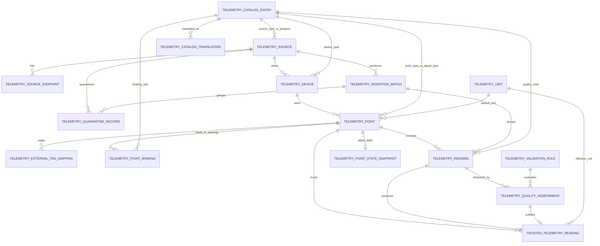

# HIDRA / HYFLO Telemetry Module — Data Definition Document

```text
Document code       : HIDRA-TELEMETRY-DDD
Document name       : Telemetry Module Data Definition Document
Repository lineage  : HyFloAPI first, HidraAPI modular redesign target
Canonical namespace : dz.sh.hidra.modules.telemetry
Product             : Hidra — Hydrocarbon Intelligence for Data, Risk, and Analytics
Module              : telemetry
Document type       : Logical data definition document
Version             : 1.0
Status              : Architecture baseline candidate
Author              : Abir MEDJERAB
CreatedOn           : 2026-06-11
Primary rule        : HyFlo operational telemetry model is the first source of truth.
```

---

## 1. Purpose

This document defines the logical data model for the **Telemetry** module.

Telemetry is the industrial acquisition bounded context. It owns:

```text
source -> device -> telemetry point -> topology binding -> reading -> quality -> trusted reading
```

Telemetry answers:

```text
Which source produced the signal?
Which device or tag produced it?
Which telemetry point represents it?
Which topology asset is it attached to?
When did the source produce it?
When did Hidra receive it?
What value, unit, quality, and state were received?
Can downstream modules trust the reading?
```

Telemetry does **not** own:

```text
physical topology
pipeline systems
facilities
pipeline segments
stations
equipment as topology assets
monitoring deviations
alarms
incidents
workflow approvals
audit records
flow calculation
hydraulic simulation
risk scoring
analytics models
reporting artifacts
custody-transfer fiscal records
maintenance work orders
```

---

## 2. Source-of-truth rule

The telemetry model follows this precedence:

| Priority | Source | Use |
|---:|---|---|
| 1 | HyFloAPI telemetry model and operational intent | Business meaning, acquisition process, topology binding, reading semantics |
| 2 | Current Hidra telemetry code | Implemented entity names, current fields, package alignment |
| 3 | Hidra modular architecture | Module boundaries, dependency rules, target structure |
| 4 | Redesign additions | Trusted readings, tag mappings, quarantine, validation, high-volume ingestion |

The current implemented backbone is retained:

```text
TelemetrySource
TelemetryDevice
TelemetryPoint
TelemetryPointBinding
TelemetryReading
TelemetryIngestionBatch
TelemetryTypeCatalog
TelemetryTypeTranslation
```

The target model extends this backbone without breaking module boundaries.

---

## 3. Module ownership and boundaries

### 3.1 Telemetry owns

| Area | Owned by telemetry? | Notes |
|---|---:|---|
| Acquisition sources | Yes | SCADA, historian, manual import source, edge gateway, OPC endpoint, API source |
| Source connection metadata | Yes | Endpoint/configuration metadata, no secrets in telemetry tables |
| Devices | Yes | RTU, PLC, flow computer, meter, transmitter, gateway, historian tag group |
| Telemetry points/tags | Yes | Canonical Hidra signal identity |
| External tag mapping | Yes | Maps SCADA/historian external names to telemetry points |
| Topology binding snapshot | Yes | Stores topology asset references only, not topology entities |
| Raw readings | Yes | Append-oriented received values |
| Quality codes | Yes | Controlled vocabulary for reading quality |
| Quality assessments | Yes | Validation outcome and trust decision evidence |
| Trusted readings | Yes | Clean downstream contract for monitoring/flow/risk/analytics |
| Ingestion batches | Yes | Grouped ingestion execution and counters |
| Quarantine records | Yes | Malformed/unresolved/rejected incoming payloads |
| Telemetry catalogs | Yes | Source type, protocol, device type, point type, signal type, unit, quality, aggregation method, binding role |

### 3.2 Telemetry references only

| External concept | Reference rule |
|---|---|
| Topology asset | Store `topologyAssetTypeCode`, `topologyAssetId`, `topologyAssetCode`, `topologyAssetNameSnapshot` |
| Topology snapshot | Store `topologySnapshotId` only when reading/binding must be tied to a versioned topology |
| Organization scope | Store `organizationScopeId` or snapshot only if required by security/filtering |
| Identity actor | Store `createdByActorId`, `updatedByActorId`, `receivedByActorId` as ID only |
| Workflow | Store `workflowInstanceId` only for approval of source/point configuration changes, if needed |
| Audit | Do not store audit records; emit audit events or call audit public port |
| Platform outbox | Use platform event publication/outbox infrastructure, not telemetry-owned outbox tables |

### 3.3 Forbidden ownership

Telemetry must not create or own tables such as:

```text
pipeline
pipeline_system
pipeline_segment
facility
equipment_as_topology_asset
station
terminal
alarm
incident
deviation
workflow_task
audit_record
risk_score
simulation_run
custody_fiscal_record
work_order
```

---

## 4. Logical type conventions

| Logical type | Description |
|---|---|
| `ID` | Stable string/UUID identifier. Recommended physical length: 80. |
| `CODE` | Stable business code. Recommended physical length: 80. |
| `TEXT_SHORT` | Short text, usually 160 characters. |
| `TEXT_MEDIUM` | Medium text, usually 500 characters. |
| `TEXT_LONG` | Long text / CLOB. |
| `BOOLEAN` | True/false. |
| `INTEGER` | Whole number. |
| `DECIMAL` | BigDecimal numeric measurement value. |
| `INSTANT` | UTC timestamp. |
| `DATE` | Local date only. |
| `JSON` | Structured technical payload. |
| `URI` | Endpoint URI or resource URI. |
| `REFERENCE` | Stable ID to another aggregate/table/module. |
| `SNAPSHOT_TEXT` | Denormalized snapshot for historical readability. |

---

## 5. Entity catalogue

| Entity | Ownership | Status | Purpose |
|---|---|---|---|
| `TelemetrySource` | Telemetry | Implemented baseline | Acquisition source such as SCADA, historian, OPC server, API feed, manual import source |
| `TelemetrySourceEndpoint` | Telemetry | Target addition | One or more endpoints/config profiles for a source |
| `TelemetryDevice` | Telemetry | Implemented baseline | Device or logical producer under a source |
| `TelemetryPoint` | Telemetry | Implemented baseline | Canonical Hidra telemetry tag/signal |
| `TelemetryExternalTagMapping` | Telemetry | Target addition | Maps external SCADA/historian tag identities to Hidra telemetry points |
| `TelemetryPointBinding` | Telemetry | Implemented baseline | Temporal binding from telemetry point to topology asset reference |
| `TelemetryIngestionBatch` | Telemetry | Implemented baseline | Groups one ingestion run/import/API batch |
| `TelemetryReading` | Telemetry | Implemented baseline | Raw received reading |
| `TelemetryQualityAssessment` | Telemetry | Target addition | Validation/quality evaluation result for a reading |
| `TrustedTelemetryReading` | Telemetry | Target addition | Downstream trustworthy reading contract |
| `TelemetryQuarantineRecord` | Telemetry | Target addition | Stores malformed/unmapped/invalid payloads that could not become accepted readings |
| `TelemetryCatalogEntry` | Telemetry | Implemented baseline as `TelemetryTypeCatalog` | Controlled vocabulary entry |
| `TelemetryCatalogTranslation` | Telemetry | Implemented baseline as `TelemetryTypeTranslation` | Multilingual catalog label/description |
| `TelemetryUnit` | Telemetry | Target refinement | Unit of measure with symbol/dimension/conversion metadata |
| `TelemetryValidationRule` | Telemetry | Target addition | Configurable rule for validating readings/points/sources |
| `TelemetryPointStateSnapshot` | Telemetry | Target addition | Latest state/cache for point health, last value, last trusted value |

---

# 6. Entity definitions

---

## 6.1 TelemetrySource

### Description

Represents an acquisition source that produces telemetry data. A source may be a SCADA system, historian, OPC-UA server, MQTT broker, CSV/API import stream, manual entry source, or edge gateway.

### Table

```text
hidra_telemetry_source
```

### Fields

| Field | Type | Required | Description |
|---|---|---:|---|
| `id` | ID | Yes | Stable source identifier. |
| `code` | CODE | Yes | Unique source code, for example `SCADA_TR_GAZ_OUEST`. |
| `nameAr` | TEXT_SHORT | No | Arabic source label. |
| `nameFr` | TEXT_SHORT | Yes | French source label. |
| `nameEn` | TEXT_SHORT | No | English source label. |
| `sourceTypeId` | REFERENCE | Yes | Reference to `TelemetryCatalogEntry` where `catalogName = SOURCE_TYPE`. |
| `protocolId` | REFERENCE | Yes | Reference to `TelemetryCatalogEntry` where `catalogName = PROTOCOL`. |
| `endpointUri` | URI | No | Legacy/simple endpoint URI. For multiple endpoints, use `TelemetrySourceEndpoint`. |
| `externalReference` | TEXT_MEDIUM | No | External source identifier from SCADA/historian/integration layer. |
| `status` | CODE | Yes | Lifecycle status: `DRAFT`, `ACTIVE`, `INACTIVE`, `SUSPENDED`, `RETIRED`. |
| `createdAt` | INSTANT | Yes | Creation timestamp. |
| `updatedAt` | INSTANT | Yes | Last update timestamp. |

### Rules

```text
code must be unique.
sourceTypeId must reference an active SOURCE_TYPE catalog entry.
protocolId must reference an active PROTOCOL catalog entry.
Only ACTIVE sources can ingest telemetry.
Secrets must never be stored in endpointUri or externalReference.
```

---

## 6.2 TelemetrySourceEndpoint

### Description

Represents one connection profile or endpoint for a telemetry source. This prevents overloading `TelemetrySource.endpointUri` and supports primary/secondary endpoints, polling, subscription, historian APIs, MQTT topics, OPC namespaces, or secure gateway paths.

### Table

```text
hidra_telemetry_source_endpoint
```

### Fields

| Field | Type | Required | Description |
|---|---|---:|---|
| `id` | ID | Yes | Stable endpoint identifier. |
| `sourceId` | REFERENCE | Yes | Parent `TelemetrySource`. |
| `code` | CODE | Yes | Endpoint code unique per source. |
| `endpointRole` | CODE | Yes | `PRIMARY`, `SECONDARY`, `FAILOVER`, `HISTORIAN_API`, `SUBSCRIPTION`, `POLLING`, `MANUAL_IMPORT`. |
| `protocolId` | REFERENCE | Yes | Protocol catalog entry. May differ from source default. |
| `endpointUri` | URI | No | Endpoint URI without credentials. |
| `host` | TEXT_SHORT | No | Hostname/IP if applicable. |
| `port` | INTEGER | No | Network port if applicable. |
| `pathOrTopic` | TEXT_MEDIUM | No | OPC path, MQTT topic, historian path, API route, import folder. |
| `pollingIntervalSeconds` | INTEGER | No | Polling interval if applicable. |
| `timeoutSeconds` | INTEGER | No | Connection timeout. |
| `credentialReference` | REFERENCE | No | Reference to secret in vault/platform secret manager. No secret value stored. |
| `connectionOptionsJson` | JSON | No | Non-secret technical options. |
| `active` | BOOLEAN | Yes | Whether endpoint is active. |
| `validFrom` | INSTANT | Yes | Start validity. |
| `validTo` | INSTANT | No | End validity. |
| `createdAt` | INSTANT | Yes | Creation timestamp. |
| `updatedAt` | INSTANT | Yes | Last update timestamp. |

### Rules

```text
A source may have many endpoints.
Only one active PRIMARY endpoint should exist per source and endpoint role unless an ADR allows load balancing.
credentialReference must point to a secret outside telemetry persistence.
```

---

## 6.3 TelemetryDevice

### Description

Represents a physical or logical telemetry-producing device under a source. Examples: RTU, PLC, flow computer, meter, sensor gateway, historian group, virtual device.

### Table

```text
hidra_telemetry_device
```

### Fields

| Field | Type | Required | Description |
|---|---|---:|---|
| `id` | ID | Yes | Stable device identifier. |
| `sourceId` | REFERENCE | Yes | Parent `TelemetrySource`. |
| `code` | CODE | Yes | Device code unique per source. |
| `nameAr` | TEXT_SHORT | No | Arabic device label. |
| `nameFr` | TEXT_SHORT | Yes | French device label. |
| `nameEn` | TEXT_SHORT | No | English device label. |
| `deviceTypeId` | REFERENCE | Yes | Reference to `TelemetryCatalogEntry` where `catalogName = DEVICE_TYPE`. |
| `externalReference` | TEXT_MEDIUM | No | External device identifier from source system. |
| `manufacturerPartyId` | REFERENCE | No | Optional reference to `party.Party`; telemetry stores ID only. |
| `modelReference` | TEXT_SHORT | No | Device model snapshot or code. |
| `serialNumber` | TEXT_SHORT | No | Device serial number when known. |
| `firmwareVersion` | TEXT_SHORT | No | Optional firmware/software version. |
| `status` | CODE | Yes | `PLANNED`, `ACTIVE`, `INACTIVE`, `MAINTENANCE`, `RETIRED`. |
| `createdAt` | INSTANT | Yes | Creation timestamp. |
| `updatedAt` | INSTANT | Yes | Last update timestamp. |

### Rules

```text
sourceId must reference an existing TelemetrySource.
deviceTypeId must reference active DEVICE_TYPE catalog entry.
Device is telemetry-owned; topology Equipment remains topology-owned.
If a telemetry device corresponds to topology Equipment, use TelemetryPointBinding or a neutral topology reference, not a direct topology import.
```

---

## 6.4 TelemetryPoint

### Description

Represents the canonical Hidra telemetry point/tag. It is the identity used by readings, bindings, quality assessment, and downstream consumers.

### Table

```text
hidra_telemetry_point
```

### Fields

| Field | Type | Required | Description |
|---|---|---:|---|
| `id` | ID | Yes | Stable point identifier. |
| `deviceId` | REFERENCE | Yes | Parent `TelemetryDevice`. |
| `code` | CODE | Yes | Canonical telemetry point code/tag. |
| `nameAr` | TEXT_SHORT | No | Arabic point label. |
| `nameFr` | TEXT_SHORT | Yes | French point label. |
| `nameEn` | TEXT_SHORT | No | English point label. |
| `pointTypeId` | REFERENCE | Yes | Reference to `TelemetryCatalogEntry` where `catalogName = POINT_TYPE`. |
| `signalTypeId` | REFERENCE | Yes | Reference to `TelemetryCatalogEntry` where `catalogName = SIGNAL_TYPE`. |
| `unitId` | REFERENCE | No | Reference to `TelemetryUnit` or unit catalog entry. |
| `defaultAggregationMethodId` | REFERENCE | No | Reference to `TelemetryCatalogEntry` where `catalogName = AGGREGATION_METHOD`. |
| `samplingPeriodSeconds` | INTEGER | No | Expected source sampling period. |
| `externalReference` | TEXT_MEDIUM | No | Legacy external tag reference. Prefer `TelemetryExternalTagMapping` for rich mapping. |
| `deadbandValue` | DECIMAL | No | Optional value deadband for noise filtering. |
| `minOperationalValue` | DECIMAL | No | Optional physical/engineering minimum for validation. |
| `maxOperationalValue` | DECIMAL | No | Optional physical/engineering maximum for validation. |
| `status` | CODE | Yes | `PLANNED`, `ACTIVE`, `INACTIVE`, `SUSPENDED`, `RETIRED`. |
| `createdAt` | INSTANT | Yes | Creation timestamp. |
| `updatedAt` | INSTANT | Yes | Last update timestamp. |

### Rules

```text
deviceId must reference an existing TelemetryDevice.
point code must be unique per device; global uniqueness may be enforced by deployment rule.
signalTypeId must determine compatible value shape: numeric/text/boolean.
unitId is required for numeric engineering measurements unless explicitly exempted by point type.
Only ACTIVE points should accept trusted readings.
```

---

## 6.5 TelemetryExternalTagMapping

### Description

Maps an external tag/identifier from SCADA, historian, PLC, OPC, MQTT, CSV, or API source to a canonical `TelemetryPoint`.

This avoids storing only one `externalReference` on the point and supports historical renames, multiple source aliases, and tag migration.

### Table

```text
hidra_telemetry_external_tag_mapping
```

### Fields

| Field | Type | Required | Description |
|---|---|---:|---|
| `id` | ID | Yes | Mapping identifier. |
| `sourceId` | REFERENCE | Yes | Source that produces the external tag. |
| `deviceId` | REFERENCE | No | Optional source device. |
| `pointId` | REFERENCE | Yes | Canonical telemetry point. |
| `externalTagName` | TEXT_MEDIUM | Yes | External tag name/path. |
| `externalTagId` | TEXT_MEDIUM | No | External immutable tag ID if available. |
| `externalNamespace` | TEXT_MEDIUM | No | OPC namespace, historian namespace, MQTT topic group, API namespace. |
| `externalDataType` | CODE | No | External raw data type. |
| `mappingMode` | CODE | Yes | `DIRECT`, `TRANSFORMED`, `ALIASED`, `HISTORICAL`. |
| `transformationExpression` | TEXT_LONG | No | Optional non-secret transformation expression or reference. |
| `active` | BOOLEAN | Yes | Active mapping flag. |
| `validFrom` | INSTANT | Yes | Start validity. |
| `validTo` | INSTANT | No | End validity. |
| `createdAt` | INSTANT | Yes | Creation timestamp. |
| `updatedAt` | INSTANT | Yes | Last update timestamp. |

### Rules

```text
External tag names are not canonical Hidra identifiers.
One external tag may map to one active point at a time for a source namespace.
A point may have multiple historical/external mappings.
```

---

## 6.6 TelemetryPointBinding

### Description

Represents a temporal binding between a `TelemetryPoint` and a topology asset reference. This is the bridge between telemetry and topology without violating module boundaries.

### Table

```text
hidra_telemetry_point_binding
```

### Fields

| Field | Type | Required | Description |
|---|---|---:|---|
| `id` | ID | Yes | Binding identifier. |
| `pointId` | REFERENCE | Yes | Bound telemetry point. |
| `topologyAssetTypeCode` | CODE | Yes | Asset type: `PIPELINE_SYSTEM`, `PIPELINE`, `PIPELINE_SEGMENT`, `FACILITY`, `EQUIPMENT`, `MEASUREMENT_LOCATION`, `TOPOLOGY_NODE`. |
| `topologyAssetId` | REFERENCE | Yes | Stable topology asset ID. |
| `topologyAssetCode` | CODE | Yes | Topology asset code snapshot. |
| `topologyAssetNameSnapshot` | SNAPSHOT_TEXT | No | Topology asset display name snapshot. |
| `topologySnapshotId` | REFERENCE | No | Optional topology version/snapshot ID used when binding was approved. |
| `bindingRoleId` | REFERENCE | Yes | Reference to `TelemetryCatalogEntry` where `catalogName = BINDING_ROLE`. |
| `active` | BOOLEAN | Yes | Whether binding is currently active. |
| `validFrom` | INSTANT | Yes | Start validity. |
| `validTo` | INSTANT | No | End validity. |
| `createdAt` | INSTANT | Yes | Creation timestamp. |
| `updatedAt` | INSTANT | Yes | Last update timestamp. |

### Rules

```text
Telemetry stores topology asset references only.
Telemetry must not import topology domain entities or write topology tables.
Only one active binding for the same point and binding role should exist for the same valid period unless explicitly permitted.
Bindings must be temporal; do not overwrite historical bindings.
```

---

## 6.7 TelemetryIngestionBatch

### Description

Represents a group of readings/payloads received from a source during one ingestion operation.

### Table

```text
hidra_telemetry_ingestion_batch
```

### Fields

| Field | Type | Required | Description |
|---|---|---:|---|
| `id` | ID | Yes | Batch identifier. |
| `sourceId` | REFERENCE | Yes | Source that produced the batch. |
| `endpointId` | REFERENCE | No | Source endpoint used. |
| `correlationId` | REFERENCE | No | Platform/kernel correlation ID. |
| `status` | CODE | Yes | `RECEIVED`, `PROCESSING`, `COMPLETED`, `COMPLETED_WITH_ERRORS`, `FAILED`. |
| `receivedCount` | INTEGER | Yes | Total received payload/reading count. |
| `acceptedCount` | INTEGER | Yes | Accepted count. |
| `rejectedCount` | INTEGER | Yes | Rejected count. |
| `duplicateCount` | INTEGER | Yes | Duplicate count. |
| `quarantinedCount` | INTEGER | Yes | Quarantined count. |
| `startedAt` | INSTANT | Yes | Start time. |
| `completedAt` | INSTANT | No | Completion time. |
| `failureReason` | TEXT_LONG | No | Failure reason when failed. |
| `createdByActorId` | REFERENCE | No | Actor/source of ingestion command. |

### Rules

```text
receivedCount, acceptedCount, rejectedCount, duplicateCount, quarantinedCount must be non-negative.
accepted + rejected + duplicate + quarantined must not exceed received.
Completed/failed batches are terminal.
```

---

## 6.8 TelemetryReading

### Description

Represents a raw received telemetry reading. It is append-oriented and records what was received before or during validation.

### Table

```text
hidra_telemetry_reading
```

### Fields

| Field | Type | Required | Description |
|---|---|---:|---|
| `id` | ID | Yes | Reading identifier. |
| `pointId` | REFERENCE | Yes | Telemetry point. |
| `numericValue` | DECIMAL | No | Numeric value when signal is numeric. |
| `textValue` | TEXT_LONG | No | Text/state value. |
| `booleanValue` | BOOLEAN | No | Boolean value. |
| `qualityCodeId` | REFERENCE | Yes | Quality code catalog entry or quality-code entity. |
| `sourceTimestamp` | INSTANT | Yes | Timestamp from source system. |
| `receivedAt` | INSTANT | Yes | Time received by Hidra. |
| `state` | CODE | Yes | `RECEIVED`, `ACCEPTED`, `REJECTED`, `DUPLICATE`, `QUARANTINED`, `TRUSTED`. |
| `ingestionBatchId` | REFERENCE | No | Batch reference. |
| `correlationId` | REFERENCE | No | Technical correlation ID. |
| `rejectionReason` | TEXT_LONG | No | Reason for rejection. |
| `sourceSequenceNumber` | TEXT_SHORT | No | Optional source sequence number. |
| `externalTagMappingId` | REFERENCE | No | Mapping used to resolve this reading. |
| `rawPayloadHash` | TEXT_SHORT | No | Hash for duplicate detection/idempotency. |
| `createdAt` | INSTANT | No | Persistence timestamp if separated from `receivedAt`. |

### Value shape rule

Exactly one of these should be populated, except for explicitly allowed null/state readings:

```text
numericValue
textValue
booleanValue
```

### Rules

```text
sourceTimestamp must not be null.
receivedAt must not be before sourceTimestamp beyond accepted clock-skew policy.
qualityCodeId must exist.
Raw readings should be append-oriented; avoid business updates except state/rejection metadata if implementation chooses mutable state.
```

---

## 6.9 TelemetryQualityAssessment

### Description

Represents validation/quality assessment applied to a raw reading. It explains why a reading was accepted, rejected, duplicated, quarantined, or trusted.

### Table

```text
hidra_telemetry_quality_assessment
```

### Fields

| Field | Type | Required | Description |
|---|---|---:|---|
| `id` | ID | Yes | Assessment identifier. |
| `readingId` | REFERENCE | Yes | Assessed raw reading. |
| `pointId` | REFERENCE | Yes | Denormalized point reference for query performance. |
| `assessmentStatus` | CODE | Yes | `PASSED`, `FAILED`, `WARNING`, `DUPLICATE`, `QUARANTINED`, `MANUAL_REVIEW`. |
| `inputQualityCodeId` | REFERENCE | Yes | Source quality code. |
| `resolvedQualityCodeId` | REFERENCE | Yes | Quality code after Hidra validation. |
| `trustLevel` | CODE | Yes | `UNTRUSTED`, `LOW`, `MEDIUM`, `HIGH`, `CERTIFIED`. |
| `validationRuleId` | REFERENCE | No | Rule that produced the decision. |
| `reasonCode` | CODE | No | Machine-readable reason. |
| `reasonMessage` | TEXT_LONG | No | Human-readable explanation. |
| `assessedAt` | INSTANT | Yes | Assessment time. |
| `assessedByActorId` | REFERENCE | No | Actor or system actor. |
| `workflowInstanceId` | REFERENCE | No | Optional manual review workflow reference. |

### Rules

```text
A reading may have multiple assessments, but only one latest/final assessment should be exposed as final quality decision.
TrustedTelemetryReading requires a passing assessment with acceptable trust level.
```

---

## 6.10 TrustedTelemetryReading

### Description

Represents the clean downstream contract for readings that telemetry considers trustworthy enough for monitoring, planning comparison, flow calculation, leak detection, risk, analytics, or reporting.

### Table

```text
hidra_telemetry_trusted_reading
```

### Fields

| Field | Type | Required | Description |
|---|---|---:|---|
| `id` | ID | Yes | Trusted reading identifier. |
| `readingId` | REFERENCE | Yes | Source raw reading. |
| `pointId` | REFERENCE | Yes | Telemetry point. |
| `numericValue` | DECIMAL | No | Trusted numeric value. |
| `textValue` | TEXT_LONG | No | Trusted text value. |
| `booleanValue` | BOOLEAN | No | Trusted boolean value. |
| `unitId` | REFERENCE | No | Effective unit. |
| `qualityCodeId` | REFERENCE | Yes | Final quality code. |
| `trustLevel` | CODE | Yes | `MEDIUM`, `HIGH`, `CERTIFIED`, etc. |
| `sourceTimestamp` | INSTANT | Yes | Source timestamp. |
| `trustedAt` | INSTANT | Yes | Trust decision time. |
| `qualityAssessmentId` | REFERENCE | Yes | Quality assessment that justified trust. |
| `topologyAssetTypeCode` | CODE | No | Snapshot from active binding at trust time. |
| `topologyAssetId` | REFERENCE | No | Snapshot from active binding at trust time. |
| `topologyAssetCode` | CODE | No | Snapshot from active binding at trust time. |
| `topologySnapshotId` | REFERENCE | No | Optional topology snapshot. |
| `ingestionBatchId` | REFERENCE | No | Batch reference. |

### Rules

```text
Trusted readings are downstream-facing.
Monitoring, flow, leak detection, risk, and analytics should consume trusted readings first, not raw readings.
Trusted reading must preserve the topology binding snapshot used at trust time.
```

---

## 6.11 TelemetryQuarantineRecord

### Description

Stores incoming telemetry payloads that cannot safely become accepted readings because of malformed structure, unresolved tag, missing point, invalid timestamp, impossible value, bad unit, duplicate conflict, security issue, or protocol decoding failure.

### Table

```text
hidra_telemetry_quarantine_record
```

### Fields

| Field | Type | Required | Description |
|---|---|---:|---|
| `id` | ID | Yes | Quarantine record identifier. |
| `sourceId` | REFERENCE | Yes | Source that sent the payload. |
| `endpointId` | REFERENCE | No | Endpoint used. |
| `ingestionBatchId` | REFERENCE | No | Batch reference. |
| `externalTagName` | TEXT_MEDIUM | No | External tag if extractable. |
| `sourceTimestamp` | INSTANT | No | Source timestamp if extractable. |
| `receivedAt` | INSTANT | Yes | Hidra receive time. |
| `reasonCode` | CODE | Yes | `UNKNOWN_TAG`, `INVALID_VALUE`, `MALFORMED_PAYLOAD`, `DUPLICATE_CONFLICT`, `UNSUPPORTED_UNIT`, `SECURITY_REJECTED`. |
| `reasonMessage` | TEXT_LONG | No | Detailed explanation. |
| `rawPayload` | JSON | No | Raw/sanitized payload. Avoid secrets. |
| `rawPayloadHash` | TEXT_SHORT | No | Payload hash. |
| `status` | CODE | Yes | `OPEN`, `RESOLVED`, `IGNORED`, `REPLAYED`. |
| `resolvedReadingId` | REFERENCE | No | Reading created after resolution/replay. |
| `resolvedAt` | INSTANT | No | Resolution time. |
| `resolvedByActorId` | REFERENCE | No | Actor/system that resolved it. |

### Rules

```text
Quarantine records are not trusted readings.
Replay must create new reading or link to existing resolved reading with evidence.
Raw payloads must be sanitized; no credentials or sensitive secrets.
```

---

## 6.12 TelemetryCatalogEntry

### Description

Represents configurable telemetry controlled vocabulary. This is the target name for the current generic `TelemetryTypeCatalog` table.

### Table

```text
hidra_telemetry_type_catalog
```

### Catalog names

Recommended catalog names:

```text
SOURCE_TYPE
PROTOCOL
DEVICE_TYPE
POINT_TYPE
SIGNAL_TYPE
QUALITY_CODE
AGGREGATION_METHOD
BINDING_ROLE
READING_STATE
TRUST_LEVEL
QUARANTINE_REASON
VALIDATION_RULE_TYPE
```

### Fields

| Field | Type | Required | Description |
|---|---|---:|---|
| `id` | ID | Yes | Catalog entry ID. |
| `catalogName` | CODE | Yes | Catalog family name. |
| `code` | CODE | Yes | Entry code unique in catalog. |
| `active` | BOOLEAN | Yes | Active flag. |
| `sortOrder` | INTEGER | Yes | UI sort order. |
| `systemDefined` | BOOLEAN | Yes | True when protected from user deletion. |
| `createdAt` | INSTANT | Yes | Creation timestamp. |
| `updatedAt` | INSTANT | Yes | Last update timestamp. |

### Rules

```text
Do not hard-code user-facing telemetry types as Java enums.
Status/state may be Java enum internally, but user-facing type taxonomies must be catalogs.
```

---

## 6.13 TelemetryCatalogTranslation

### Description

Stores localized labels and descriptions for telemetry catalog entries.

### Table

```text
hidra_telemetry_type_translation
```

### Fields

| Field | Type | Required | Description |
|---|---|---:|---|
| `id` | ID | Yes | Translation ID. |
| `typeId` | REFERENCE | Yes | Catalog entry ID. |
| `locale` | CODE | Yes | `ar`, `fr`, `en`. |
| `name` | TEXT_SHORT | Yes | Localized label. |
| `description` | TEXT_MEDIUM | No | Localized description. |
| `createdAt` | INSTANT | Yes | Creation timestamp. |
| `updatedAt` | INSTANT | Yes | Last update timestamp. |

### Rules

```text
One translation per catalog entry and locale.
French should be mandatory for operational UI unless product policy changes.
```

---

## 6.14 TelemetryUnit

### Description

Represents units used by telemetry values. Units need more structure than a generic catalog because downstream calculation may require symbol, dimension, base-unit conversion, and display precision.

### Table

```text
hidra_telemetry_unit
```

### Fields

| Field | Type | Required | Description |
|---|---|---:|---|
| `id` | ID | Yes | Unit identifier. |
| `code` | CODE | Yes | Unit code, for example `BAR`, `M3_H`, `DEGC`, `PERCENT`. |
| `symbol` | TEXT_SHORT | Yes | Display symbol, for example `bar`, `m³/h`, `°C`, `%`. |
| `dimension` | CODE | Yes | `PRESSURE`, `FLOW`, `TEMPERATURE`, `VOLUME`, `MASS`, `DENSITY`, `POWER`, `STATE`, `RATIO`. |
| `baseUnitId` | REFERENCE | No | Base unit for same dimension. |
| `toBaseFactor` | DECIMAL | No | Linear conversion factor. |
| `toBaseOffset` | DECIMAL | No | Linear conversion offset. |
| `displayPrecision` | INTEGER | No | Recommended decimal display precision. |
| `active` | BOOLEAN | Yes | Active flag. |
| `systemDefined` | BOOLEAN | Yes | Protected system unit. |
| `createdAt` | INSTANT | Yes | Creation timestamp. |
| `updatedAt` | INSTANT | Yes | Last update timestamp. |

### Rules

```text
Numeric telemetry points should reference a unit.
Conversion rules must not silently change historical readings.
If a unit is deprecated, do not delete it while readings reference it.
```

---

## 6.15 TelemetryValidationRule

### Description

Represents a configurable validation rule used to assess readings or telemetry points.

### Table

```text
hidra_telemetry_validation_rule
```

### Fields

| Field | Type | Required | Description |
|---|---|---:|---|
| `id` | ID | Yes | Rule ID. |
| `code` | CODE | Yes | Rule code. |
| `name` | TEXT_SHORT | Yes | Rule display name. |
| `scopeType` | CODE | Yes | `GLOBAL`, `SOURCE`, `DEVICE`, `POINT`, `SIGNAL_TYPE`, `TOPOLOGY_ASSET`. |
| `scopeReferenceId` | REFERENCE | No | ID of scope target when not global. |
| `ruleTypeId` | REFERENCE | Yes | Catalog entry for rule type. |
| `severity` | CODE | Yes | `INFO`, `WARNING`, `ERROR`, `CRITICAL`. |
| `actionOnFailure` | CODE | Yes | `WARN`, `REJECT`, `QUARANTINE`, `REQUIRE_REVIEW`. |
| `expression` | TEXT_LONG | No | Expression or rule configuration. |
| `configurationJson` | JSON | No | Structured rule configuration. |
| `active` | BOOLEAN | Yes | Active flag. |
| `validFrom` | INSTANT | Yes | Start validity. |
| `validTo` | INSTANT | No | End validity. |
| `createdAt` | INSTANT | Yes | Creation timestamp. |
| `updatedAt` | INSTANT | Yes | Last update timestamp. |

### Rules

```text
Validation rules are telemetry rules only.
Monitoring thresholds belong to monitoring/configuration, not telemetry validation.
Telemetry validation answers: can the reading be trusted as a telemetry fact?
Monitoring answers: is the operational state abnormal?
```

---

## 6.16 TelemetryPointStateSnapshot

### Description

Stores latest known state per telemetry point for fast dashboards and operational reads. This is a projection/cache, not the source of historical truth.

### Table

```text
hidra_telemetry_point_state_snapshot
```

### Fields

| Field | Type | Required | Description |
|---|---|---:|---|
| `pointId` | REFERENCE | Yes | Telemetry point ID. Primary key. |
| `lastReadingId` | REFERENCE | No | Last raw reading. |
| `lastTrustedReadingId` | REFERENCE | No | Last trusted reading. |
| `lastNumericValue` | DECIMAL | No | Last numeric trusted value. |
| `lastTextValue` | TEXT_LONG | No | Last text trusted value. |
| `lastBooleanValue` | BOOLEAN | No | Last boolean trusted value. |
| `lastQualityCodeId` | REFERENCE | No | Last final quality code. |
| `lastSourceTimestamp` | INSTANT | No | Last source timestamp. |
| `lastReceivedAt` | INSTANT | No | Last receive timestamp. |
| `communicationState` | CODE | Yes | `UNKNOWN`, `ONLINE`, `STALE`, `OFFLINE`, `BAD_QUALITY`. |
| `staleSince` | INSTANT | No | When point became stale. |
| `updatedAt` | INSTANT | Yes | Projection update time. |

### Rules

```text
This table can be rebuilt from readings and trusted readings.
Do not use it as the legal source of historical telemetry truth.
```

---

# 7. Relationships and cardinalities

| Relationship | Cardinality | Rule |
|---|---:|---|
| `TelemetrySource -> TelemetrySourceEndpoint` | 1:N | One source may have multiple endpoints. |
| `TelemetrySource -> TelemetryDevice` | 1:N | One acquisition source owns many telemetry devices. |
| `TelemetryDevice -> TelemetryPoint` | 1:N | One device owns many telemetry points. |
| `TelemetrySource -> TelemetryIngestionBatch` | 1:N | One source has many ingestion batches. |
| `TelemetryPoint -> TelemetryExternalTagMapping` | 1:N | One point may have multiple external aliases/mappings. |
| `TelemetryPoint -> TelemetryPointBinding` | 1:N | One point may be rebound over time. |
| `TelemetryPoint -> TelemetryReading` | 1:N | One point has many raw readings. |
| `TelemetryIngestionBatch -> TelemetryReading` | 1:N | A batch may contain many readings. |
| `TelemetryReading -> TelemetryQualityAssessment` | 1:N | A reading may have multiple assessments. |
| `TelemetryReading -> TrustedTelemetryReading` | 0:1 | A raw reading may result in one trusted reading. |
| `TelemetryQualityAssessment -> TrustedTelemetryReading` | 0:1 | A passing assessment may produce a trusted reading. |
| `TelemetrySource -> TelemetryQuarantineRecord` | 1:N | A source may produce quarantined records. |
| `TelemetryIngestionBatch -> TelemetryQuarantineRecord` | 0:N | A batch may have quarantined records. |
| `TelemetryCatalogEntry -> TelemetryCatalogTranslation` | 1:N | One catalog entry has localized labels. |
| `TelemetryUnit -> TelemetryPoint` | 1:N | One unit may be used by many points. |
| `TelemetryUnit -> TrustedTelemetryReading` | 1:N | Trusted numeric readings reference effective unit. |
| `TelemetryPoint -> TelemetryPointStateSnapshot` | 1:0..1 | Optional latest-state projection. |

---

# 8. External module reference relationships

| From telemetry entity | External target | Relationship type | Boundary rule |
|---|---|---|---|
| `TelemetryPointBinding.topologyAssetId` | topology asset | Stable ID/reference | No FK to topology table required. No topology domain import. |
| `TelemetryPointBinding.topologySnapshotId` | topology snapshot | Stable ID/reference | Optional snapshot reference. |
| `TelemetryDevice.manufacturerPartyId` | party | Stable ID/reference | Party module owns party data. |
| `TelemetryQualityAssessment.workflowInstanceId` | workflow | Stable ID/reference | Workflow owns task/approval lifecycle. |
| `createdByActorId`, `assessedByActorId`, `resolvedByActorId` | identity/platform actor | Stable ID/reference | Identity owns user/actor authorization. |
| Emitted audit event | audit | Public port/event | Audit owns audit records. |

---

# 9. Main flow

## 9.1 Configuration flow

```text
Create TelemetrySource
  -> define endpoints
  -> create TelemetryDevice
  -> create TelemetryPoint
  -> map external tags
  -> bind point to topology asset reference
  -> activate point
```

## 9.2 Ingestion flow

```text
Start TelemetryIngestionBatch
  -> receive external payloads
  -> resolve external tag mapping
  -> create TelemetryReading or TelemetryQuarantineRecord
  -> assess quality
  -> create TrustedTelemetryReading if accepted/trusted
  -> update TelemetryPointStateSnapshot
  -> complete batch counters
  -> publish telemetry events
```

## 9.3 Downstream consumption flow

```text
Monitoring / flow / leak detection / risk / analytics
  consume TrustedTelemetryReading
  optionally query TelemetryPointStateSnapshot
  avoid using raw TelemetryReading except for diagnostics/backtesting
```

---

# 10. Events

Telemetry should emit domain/application events such as:

| Event | Trigger |
|---|---|
| `TelemetrySourceCreated` | Source created. |
| `TelemetrySourceActivated` | Source activated. |
| `TelemetryDeviceRegistered` | Device registered. |
| `TelemetryPointRegistered` | Point registered. |
| `TelemetryPointBoundToTopology` | Point binding created/activated. |
| `TelemetryPointBindingEnded` | Binding closed. |
| `TelemetryIngestionBatchStarted` | Batch started. |
| `TelemetryReadingReceived` | Raw reading accepted into telemetry store. |
| `TelemetryReadingRejected` | Reading rejected. |
| `TelemetryReadingQuarantined` | Payload/reading quarantined. |
| `TelemetryReadingAssessed` | Quality assessment completed. |
| `TelemetryReadingTrusted` | Trusted reading produced. |
| `TelemetryPointBecameStale` | Snapshot detected stale point. |
| `TelemetryPointRecovered` | Stale/offline point recovered. |

Events must be published through platform outbox/infrastructure, not a telemetry-specific outbox.

---

# 11. Validation rules

## 11.1 Source/device/point lifecycle

```text
Only ACTIVE sources can ingest.
Only ACTIVE devices can produce trusted points.
Only ACTIVE points can produce trusted readings.
Inactive sources/devices/points may preserve historical data.
```

## 11.2 Reading validation

```text
Each reading must reference an existing point.
Each reading must have sourceTimestamp and receivedAt.
Each reading must have exactly one value shape unless null/state reading is explicitly allowed.
Numeric readings should have a unit through the point or effective reading unit.
Quality code is mandatory.
Duplicate detection should use pointId + sourceTimestamp + value hash/source sequence when available.
```

## 11.3 Topology binding validation

```text
TelemetryPointBinding must carry topology asset type/code/id snapshots.
Telemetry must not write topology tables.
Rebinding must close old binding with validTo instead of deleting history.
Trusted readings should snapshot active binding at trust time.
```

## 11.4 Catalog validation

```text
User-facing telemetry type taxonomies must be catalog entries, not hard-coded Java enums.
Do not delete catalog entries referenced by source/device/point/reading history.
Use active/deprecated/inactive lifecycle.
```

---

# 12. Recommended indexes and uniqueness

| Table | Constraint / index | Purpose |
|---|---|---|
| `hidra_telemetry_source` | unique `code` | Prevent duplicate source code. |
| `hidra_telemetry_device` | unique `(source_id, code)` | Device code unique under source. |
| `hidra_telemetry_point` | unique `(device_id, code)` | Point code unique under device. |
| `hidra_telemetry_external_tag_mapping` | unique active `(source_id, external_namespace, external_tag_name, valid_to null)` | Prevent ambiguous active tag mapping. |
| `hidra_telemetry_point_binding` | index `(point_id, active)` | Fast active binding lookup. |
| `hidra_telemetry_point_binding` | index `(topology_asset_type_code, topology_asset_id)` | Query points by topology asset. |
| `hidra_telemetry_reading` | index `(point_id, source_timestamp)` | Historical point time-series query. |
| `hidra_telemetry_reading` | index `(ingestion_batch_id)` | Batch traceability. |
| `hidra_telemetry_reading` | unique optional `(point_id, source_timestamp, raw_payload_hash)` | Duplicate control when hash available. |
| `hidra_telemetry_trusted_reading` | index `(point_id, source_timestamp)` | Downstream time-series query. |
| `hidra_telemetry_trusted_reading` | index `(topology_asset_type_code, topology_asset_id, source_timestamp)` | Topology-aware operational query. |
| `hidra_telemetry_quarantine_record` | index `(source_id, status, received_at)` | Quarantine dashboard. |
| `hidra_telemetry_type_catalog` | unique `(catalog_name, code)` | Controlled vocabulary uniqueness. |
| `hidra_telemetry_type_translation` | unique `(type_id, locale)` | Translation uniqueness. |
| `hidra_telemetry_point_state_snapshot` | primary key `point_id` | One latest snapshot per point. |

For high-volume production deployments, `TelemetryReading` and `TrustedTelemetryReading` should be partitioned by time, source, or point depending on PostgreSQL/TimescaleDB strategy.

---

# 13. Mermaid ER diagram



---

# 14. Physical naming recommendation

Use current table prefix style for continuity:

```text
hidra_telemetry_source
hidra_telemetry_source_endpoint
hidra_telemetry_device
hidra_telemetry_point
hidra_telemetry_external_tag_mapping
hidra_telemetry_point_binding
hidra_telemetry_ingestion_batch
hidra_telemetry_reading
hidra_telemetry_quality_assessment
hidra_telemetry_trusted_reading
hidra_telemetry_quarantine_record
hidra_telemetry_type_catalog
hidra_telemetry_type_translation
hidra_telemetry_unit
hidra_telemetry_validation_rule
hidra_telemetry_point_state_snapshot
```

If later adopting schema-per-module, map these tables under schema:

```text
hidratelemetry
```

but do not mix both strategies without an ADR.

---

# 15. Boundary decision tests

Before adding a telemetry field/table, ask:

```text
1. Is this about acquisition/source/device/point/reading/quality/trust?
   -> telemetry may own it.

2. Is this about physical pipeline/facility/equipment structure?
   -> topology owns it; telemetry stores only references.

3. Is this about abnormal operation/deviation/alarm?
   -> monitoring or alarms owns it.

4. Is this about approval tasks?
   -> workflow owns it.

5. Is this about immutable audit evidence?
   -> audit owns it.

6. Is this about hydraulic calculation or leak detection?
   -> simulation/leakdetection/flow owns it.

7. Is this about reporting/analytics/risk score?
   -> reporting/analytics/risk owns it.
```

---

# 16. Final model summary

```text
TelemetrySource
  -> TelemetrySourceEndpoint
  -> TelemetryDevice
      -> TelemetryPoint
          -> TelemetryExternalTagMapping
          -> TelemetryPointBinding -> topology reference only
          -> TelemetryReading
              -> TelemetryQualityAssessment
              -> TrustedTelemetryReading
          -> TelemetryPointStateSnapshot

TelemetryIngestionBatch
  -> TelemetryReading
  -> TelemetryQuarantineRecord

TelemetryCatalogEntry
  -> TelemetryCatalogTranslation

TelemetryUnit
  -> TelemetryPoint / TrustedTelemetryReading

TelemetryValidationRule
  -> TelemetryQualityAssessment
```

The telemetry module is therefore the trusted acquisition and signal-quality layer. It preserves HyFlo operational meaning while making Hidra clean, modular, topology-aware, and safe for downstream intelligence.
