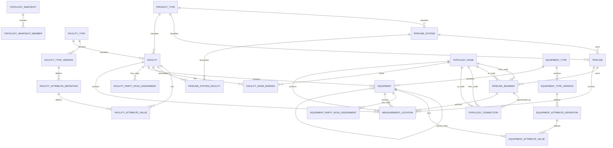

# HIDRA-TOPOLOGY-DATA-DEFINITION-DOCUMENT

```text
Document code       : HIDRA-DDD-TOPOLOGY
Repository          : HidraAPI / HyFlo operational lineage
Canonical namespace : dz.sh.hidra.modules.topology
Product             : Hidra — Hydrocarbon Intelligence for Data, Risk, and Analytics
Document type       : Data Definition Document
Module              : topology
Version             : 1.0
Status              : Architecture baseline draft
Author              : Abir MEDJERAB
UpdatedOn           : 2026-06-11
```

---

## 1. Purpose

This document defines the logical data model of the **Topology module**.

The Topology module owns the physical and logical representation of the hydrocarbon transportation network:

```text
PipelineSystem
  -> Pipeline
     -> PipelineSegment
        -> TopologyNode / TopologyConnection

Facility
  -> FacilityType
  -> configurable facility attributes
  -> pipeline-system association
  -> topology-node association
  -> equipment
  -> controlled party role assignments by reference

Equipment
  -> EquipmentType
  -> configurable equipment attributes
  -> controlled party role assignments by reference

MeasurementLocation
  -> topology-owned anchor point used by telemetry
```

This document is a **logical data definition**, not final PostgreSQL DDL. It is intended to guide domain modeling, persistence design, migrations, API contracts, validation, and module boundary enforcement.

---

## 2. Topology Module Boundary

### 2.1 Owns

The Topology module owns:

- pipeline systems;
- pipelines;
- pipeline segments;
- topology graph nodes;
- topology graph connections;
- physical facilities;
- facility type catalog;
- configurable facility type schemas;
- facility attribute values;
- pipeline-system/facility associations;
- facility/topology-node associations;
- equipment installed in or attached to topology assets;
- equipment type catalog;
- configurable equipment type schemas;
- equipment attribute values;
- measurement locations used as stable topology anchors for telemetry;
- topology snapshots and topology-versioned read models;
- topology-owned assignment between topology assets and external parties by reference.

### 2.2 Does Not Own

The Topology module does **not** own:

| Concept | Owning module | Topology usage |
|---|---|---|
| Employee, department, internal organization hierarchy | `organization` | Reference only by stable ID and snapshot. |
| Legal company, vendor, constructor, manufacturer, joint venture | `party` | Reference only by stable `partyId`; topology owns only role assignment to an asset. |
| User, role, permission, ABAC/RBAC policy | `identity` | Reference only through actor IDs in audit metadata. |
| Workflow task, approval, decision lifecycle | `workflow` | Reference only by `workflowInstanceId` or approval reference. |
| Audit records | `audit` | Topology emits audit intent / references audit IDs but does not store audit history as topology state. |
| Raw telemetry readings | `telemetry` | Telemetry references topology through `measurementLocationId` or topology asset references. |
| Custody / fiscal measurement | `custody` | Custody references topology measurement locations and facilities. |
| Contracts and procurement | `contracts` / `documents` / future commercial module | Topology may store `contractReferenceId` only as external reference. |

---

## 3. Design Principles

### 3.1 Hard-code the topology backbone, configure the asset details

The following entities are structural and should be explicitly modeled:

```text
PipelineSystem
Pipeline
PipelineSegment
TopologyNode
TopologyConnection
Facility
Equipment
MeasurementLocation
```

The following should be configurable, not hard-coded per Java class:

```text
FacilityType attributes
EquipmentType attributes
Facility-specific operational fields
Equipment-specific technical fields
```

Therefore, do **not** create one hard-coded table per facility profile such as `StationProfile`, `TerminalProfile`, or `ExportTerminalProfile`. Instead, use:

```text
FacilityType
FacilityTypeVersion
FacilityAttributeDefinition
FacilityAttributeValue
```

### 3.2 Do not store party names as free text

Do **not** store:

```text
Facility.ownerName
Facility.constructorName
Facility.vendorName
Facility.managerName
Equipment.vendorName
Equipment.manufacturerName
```

Instead, topology stores role assignments to controlled party master data:

```text
FacilityPartyRoleAssignment.partyId
EquipmentPartyRoleAssignment.partyId
```

`partyId` belongs to an external `party` bounded context.

### 3.3 Facilities may belong to multiple pipeline systems

A pipeline belongs to one pipeline system.

A facility may serve one or more pipeline systems.

Therefore:

```text
PipelineSystem 1 -> N Pipeline
PipelineSystem N -> N Facility through PipelineSystemFacility
```

A terminal may serve several systems. A station may usually serve one system but the data model must allow shared facilities.

### 3.4 Facility type is operator-managed but versioned

Operators may add or modify facility types and their configurable attributes.

However, once a facility type is used, it must not be physically deleted or destructively changed. Use versioning:

```text
FacilityType
  -> FacilityTypeVersion
     -> FacilityAttributeDefinition
```

Facilities should reference the active type and, where necessary, the version that governed the captured attributes.

---

## 4. Logical Field Type Conventions

| Logical type | Suggested database type | Description |
|---|---:|---|
| `TopologyId` | `varchar(80)` or `uuid` | Stable identifier for topology-owned entities. Current code frequently uses string IDs; UUID is acceptable for future hardening. |
| `ExternalRefId` | `varchar(120)` | Stable reference to another module/entity. No cross-module FK by default. |
| `Code` | `varchar(80)` | Stable business code, uppercase snake case recommended. |
| `ShortText` | `varchar(160)` | Short label/name. |
| `MediumText` | `varchar(500)` | Descriptions or comments. |
| `LongText` | `text` | Long description. |
| `DecimalQuantity` | `numeric(19,6)` | Decimal engineering quantity. |
| `GeoDecimal` | `numeric(10,7)` | Latitude/longitude. |
| `BooleanFlag` | `boolean` | True/false. |
| `StatusCode` | `varchar(40)` | Lifecycle/status code. |
| `DateOnly` | `date` | Date without time. |
| `Timestamp` | `timestamp with time zone` | Instant in time. |
| `JsonValue` | `jsonb` | Controlled flexible value for complex attribute data. |

---

## 5. Entity Catalogue

| Entity | Table name | Purpose |
|---|---|---|
| `ProductType` | `hidra_topology_product_type` | Hydrocarbon product classification used by systems, pipelines, and facilities. |
| `FacilityType` | `hidra_topology_facility_type` | Operator-managed facility type catalogue. |
| `FacilityTypeVersion` | `hidra_topology_facility_type_version` | Versioned schema/configuration for a facility type. |
| `FacilityAttributeDefinition` | `hidra_topology_facility_attribute_definition` | Configurable fields required/allowed for facilities of a given type version. |
| `Facility` | `hidra_topology_facility` | Physical facility in the network. |
| `FacilityAttributeValue` | `hidra_topology_facility_attribute_value` | Typed values for configurable facility attributes. |
| `PipelineSystem` | `hidra_topology_pipeline_system` | Operational grouping of pipelines and related facilities. |
| `Pipeline` | `hidra_topology_pipeline` | Pipeline belonging to one pipeline system. |
| `TopologyNode` | `hidra_topology_node` | Graph node representing physical/logical network connection point. |
| `TopologyConnection` | `hidra_topology_connection` | Graph connection/edge between topology nodes. |
| `PipelineSegment` | `hidra_topology_pipeline_segment` | Physical/logical section of a pipeline between two nodes. |
| `PipelineSystemFacility` | `hidra_topology_pipeline_system_facility` | Many-to-many association between pipeline systems and facilities. |
| `FacilityNodeBinding` | `hidra_topology_facility_node_binding` | Association between facilities and topology nodes. |
| `EquipmentType` | `hidra_topology_equipment_type` | Operator-managed equipment type catalogue. |
| `EquipmentTypeVersion` | `hidra_topology_equipment_type_version` | Versioned schema/configuration for equipment types. |
| `EquipmentAttributeDefinition` | `hidra_topology_equipment_attribute_definition` | Configurable fields required/allowed for equipment of a given type version. |
| `Equipment` | `hidra_topology_equipment` | Physical equipment installed in a facility or attached to a topology asset. |
| `EquipmentAttributeValue` | `hidra_topology_equipment_attribute_value` | Typed values for configurable equipment attributes. |
| `FacilityPartyRoleAssignment` | `hidra_topology_facility_party_role_assignment` | Topology-owned assignment of a controlled party to a facility role. |
| `EquipmentPartyRoleAssignment` | `hidra_topology_equipment_party_role_assignment` | Topology-owned assignment of a controlled party to an equipment role. |
| `MeasurementLocation` | `hidra_topology_measurement_location` | Stable topology anchor for telemetry and custody measurement. |
| `TopologySnapshot` | `hidra_topology_snapshot` | Approved versioned topology snapshot. |
| `TopologySnapshotMember` | `hidra_topology_snapshot_member` | Member assets included in a topology snapshot. |

---

# 6. Entity Definitions

---

## 6.1 ProductType

### Description

Defines controlled hydrocarbon product types used by pipeline systems, pipelines, facilities, and other topology assets.

Examples:

```text
CRUDE_OIL
NATURAL_GAS
CONDENSATE
LPG
MULTI_PRODUCT
WATER
```

### Fields

| Field | Type | Required | Description |
|---|---|---:|---|
| `id` | `TopologyId` | Yes | Stable product type identifier. |
| `code` | `Code` | Yes | Stable language-neutral code. Must be unique. |
| `nameAr` | `ShortText` | Yes | Arabic label. |
| `nameFr` | `ShortText` | Yes | French label. |
| `nameEn` | `ShortText` | Yes | English label. |
| `description` | `MediumText` | No | Product type description. |
| `status` | `StatusCode` | Yes | `ACTIVE`, `INACTIVE`, `DEPRECATED`. |
| `createdAt` | `Timestamp` | Yes | Creation timestamp. |
| `updatedAt` | `Timestamp` | Yes | Last update timestamp. |

### Constraints

| Constraint | Description |
|---|---|
| `uk_product_type_code` | `code` must be unique. |
| `chk_product_type_status` | Status must be controlled. |

### Relationships

```text
ProductType 1 -> N PipelineSystem
ProductType 1 -> N Pipeline
ProductType 1 -> N Facility
```

---

## 6.2 FacilityType

### Description

Operator-managed catalogue of facility classifications.

Examples:

```text
PUMPING_STATION
COMPRESSION_STATION
METERING_STATION
TERMINAL
EXPORT_TERMINAL
PRODUCTION_FACILITY
PROCESSING_FACILITY
STORAGE_FACILITY
GATHERING_CENTER
```

A facility type is not a Java enum. It is configurable business data.

### Fields

| Field | Type | Required | Description |
|---|---|---:|---|
| `id` | `TopologyId` | Yes | Stable facility type identifier. |
| `code` | `Code` | Yes | Stable business code. Must be unique. |
| `nameAr` | `ShortText` | Yes | Arabic label. |
| `nameFr` | `ShortText` | Yes | French label. |
| `nameEn` | `ShortText` | Yes | English label. |
| `description` | `MediumText` | No | Business description. |
| `category` | `Code` | Yes | Higher-level category: `STATION`, `TERMINAL`, `PRODUCTION`, `PROCESSING`, `EXPORT`, `STORAGE`, `OTHER`. |
| `operatorEditable` | `BooleanFlag` | Yes | Whether authorized operators may modify this type. |
| `requiresWorkflowApproval` | `BooleanFlag` | Yes | Whether changes require workflow approval. |
| `status` | `StatusCode` | Yes | `DRAFT`, `ACTIVE`, `DEPRECATED`, `INACTIVE`. |
| `createdByActorId` | `ExternalRefId` | No | Actor reference from identity/audit context. |
| `approvedByWorkflowId` | `ExternalRefId` | No | Workflow approval reference. |
| `createdAt` | `Timestamp` | Yes | Creation timestamp. |
| `updatedAt` | `Timestamp` | Yes | Last update timestamp. |

### Constraints

| Constraint | Description |
|---|---|
| `uk_facility_type_code` | `code` must be unique. |
| `chk_facility_type_status` | Status must be controlled. |
| `no_delete_if_used` | Application rule: facility type cannot be deleted when referenced by a facility. |

### Relationships

```text
FacilityType 1 -> N FacilityTypeVersion
FacilityType 1 -> N Facility
```

---

## 6.3 FacilityTypeVersion

### Description

Versioned schema/configuration of a facility type. Allows operators to evolve facility type fields without breaking existing facility data.

### Fields

| Field | Type | Required | Description |
|---|---|---:|---|
| `id` | `TopologyId` | Yes | Stable version identifier. |
| `facilityTypeId` | `TopologyId` | Yes | Parent facility type. |
| `versionNumber` | `integer` | Yes | Incremental version number. |
| `status` | `StatusCode` | Yes | `DRAFT`, `ACTIVE`, `RETIRED`. |
| `effectiveFrom` | `Timestamp` | No | Start validity date/time. |
| `effectiveTo` | `Timestamp` | No | End validity date/time. |
| `approvalWorkflowId` | `ExternalRefId` | No | Workflow instance that approved this version. |
| `changeReason` | `MediumText` | No | Reason for version creation/change. |
| `createdAt` | `Timestamp` | Yes | Creation timestamp. |
| `updatedAt` | `Timestamp` | Yes | Last update timestamp. |

### Constraints

| Constraint | Description |
|---|---|
| `uk_facility_type_version` | Unique pair: `facilityTypeId`, `versionNumber`. |
| `one_active_version_per_type` | At most one active version per facility type. |
| `valid_effective_range` | `effectiveTo` must be null or greater than `effectiveFrom`. |

### Relationships

```text
FacilityType 1 -> N FacilityTypeVersion
FacilityTypeVersion 1 -> N FacilityAttributeDefinition
```

---

## 6.4 FacilityAttributeDefinition

### Description

Defines configurable fields required or allowed for facilities of a given facility type version.

Example attributes for `EXPORT_TERMINAL`:

```text
EXPORT_MODE
HAS_MARINE_BERTH
HAS_FISCAL_METERING
STORAGE_CAPACITY
MAX_EXPORT_FLOW
CONTRACTUAL_DELIVERY_POINT
```

Example attributes for `PUMPING_STATION`:

```text
PUMP_COUNT
INSTALLED_POWER
NOMINAL_FLOW
HAS_BYPASS
CONTROL_MODE
```

### Fields

| Field | Type | Required | Description |
|---|---|---:|---|
| `id` | `TopologyId` | Yes | Attribute definition identifier. |
| `facilityTypeVersionId` | `TopologyId` | Yes | Parent facility type version. |
| `code` | `Code` | Yes | Attribute code. Unique within the version. |
| `labelAr` | `ShortText` | Yes | Arabic UI label. |
| `labelFr` | `ShortText` | Yes | French UI label. |
| `labelEn` | `ShortText` | Yes | English UI label. |
| `description` | `MediumText` | No | Description and usage guidance. |
| `dataType` | `Code` | Yes | `TEXT`, `NUMBER`, `BOOLEAN`, `DATE`, `TIMESTAMP`, `REFERENCE`, `CATALOG`, `JSON`. |
| `required` | `BooleanFlag` | Yes | Whether the attribute is mandatory. |
| `multiValue` | `BooleanFlag` | Yes | Whether multiple values are allowed. |
| `unitCategory` | `Code` | No | Engineering unit category: `FLOW`, `PRESSURE`, `VOLUME`, `POWER`, `TEMPERATURE`, etc. |
| `defaultUnitId` | `ExternalRefId` | No | Reference to unit catalogue/configuration. |
| `minNumber` | `DecimalQuantity` | No | Minimum numeric value. |
| `maxNumber` | `DecimalQuantity` | No | Maximum numeric value. |
| `minLength` | `integer` | No | Minimum text length. |
| `maxLength` | `integer` | No | Maximum text length. |
| `catalogCode` | `Code` | No | Controlled catalogue code for `CATALOG` attributes. |
| `referenceTargetType` | `Code` | No | Target type for `REFERENCE` values: `PARTY`, `DOCUMENT`, `EQUIPMENT`, etc. |
| `displayOrder` | `integer` | Yes | Display order in forms. |
| `searchable` | `BooleanFlag` | Yes | Whether value should be indexed/searchable. |
| `status` | `StatusCode` | Yes | `ACTIVE`, `DEPRECATED`, `INACTIVE`. |
| `createdAt` | `Timestamp` | Yes | Creation timestamp. |
| `updatedAt` | `Timestamp` | Yes | Last update timestamp. |

### Constraints

| Constraint | Description |
|---|---|
| `uk_facility_attribute_code_per_version` | Unique pair: `facilityTypeVersionId`, `code`. |
| `chk_facility_attribute_data_type` | Data type must be controlled. |
| `required_definition_validation` | If `dataType = CATALOG`, then `catalogCode` must not be null. |
| `reference_definition_validation` | If `dataType = REFERENCE`, then `referenceTargetType` must not be null. |

### Relationships

```text
FacilityTypeVersion 1 -> N FacilityAttributeDefinition
FacilityAttributeDefinition 1 -> N FacilityAttributeValue
```

---

## 6.5 Facility

### Description

Represents a physical facility connected to or participating in the hydrocarbon transportation network.

Examples:

```text
station
terminal
production facility
processing facility
export terminal
storage facility
gathering center
```

Facility stores only stable common fields. Variable, type-specific fields are stored through `FacilityAttributeValue`.

### Fields

| Field | Type | Required | Description |
|---|---|---:|---|
| `id` | `TopologyId` | Yes | Stable facility identifier. |
| `code` | `Code` | Yes | Unique facility business code. |
| `nameAr` | `ShortText` | No | Arabic name. |
| `nameFr` | `ShortText` | Yes | French name. |
| `nameEn` | `ShortText` | No | English name. |
| `facilityTypeId` | `TopologyId` | Yes | Reference to `FacilityType`. |
| `facilityTypeVersionId` | `TopologyId` | No | Facility type version used for current attribute schema. |
| `productTypeId` | `TopologyId` | Yes | Product type reference. |
| `status` | `StatusCode` | Yes | `PLANNED`, `ACTIVE`, `INACTIVE`, `UNDER_MAINTENANCE`, `RETIRED`, `DECOMMISSIONED`. |
| `latitude` | `GeoDecimal` | No | Latitude in decimal degrees. |
| `longitude` | `GeoDecimal` | No | Longitude in decimal degrees. |
| `elevationMeters` | `DecimalQuantity` | No | Elevation in meters. |
| `commissionedAt` | `DateOnly` | No | Commissioning date. |
| `decommissionedAt` | `DateOnly` | No | Decommissioning date. |
| `organizationUnitReferenceId` | `ExternalRefId` | No | Internal organization unit reference. Does not make organization data topology-owned. |
| `organizationUnitReferenceCode` | `Code` | No | Snapshot of organization unit code. |
| `organizationUnitReferenceName` | `ShortText` | No | Snapshot of organization unit name. |
| `createdAt` | `Timestamp` | Yes | Creation timestamp. |
| `updatedAt` | `Timestamp` | Yes | Last update timestamp. |

### Constraints

| Constraint | Description |
|---|---|
| `uk_facility_code` | `code` must be unique. |
| `fk_facility_type` | `facilityTypeId` references topology-owned facility type. |
| `fk_facility_product_type` | `productTypeId` references topology-owned product type. |
| `valid_facility_status` | Status must be controlled. |
| `valid_geo_coordinate` | Latitude and longitude must be in valid ranges when present. |

### Relationships

```text
Facility N -> 1 FacilityType
Facility N -> 1 ProductType
Facility 1 -> N FacilityAttributeValue
Facility N -> N PipelineSystem through PipelineSystemFacility
Facility N -> N TopologyNode through FacilityNodeBinding
Facility 1 -> N Equipment
Facility 1 -> N FacilityPartyRoleAssignment
Facility 1 -> N MeasurementLocation
```

---

## 6.6 FacilityAttributeValue

### Description

Stores actual values for configurable facility attributes. This avoids hard-coded profile tables and permits new facility types or fields without code changes.

### Fields

| Field | Type | Required | Description |
|---|---|---:|---|
| `id` | `TopologyId` | Yes | Attribute value identifier. |
| `facilityId` | `TopologyId` | Yes | Parent facility. |
| `attributeDefinitionId` | `TopologyId` | Yes | Attribute definition. |
| `valueText` | `LongText` | No | Text value. |
| `valueNumber` | `DecimalQuantity` | No | Numeric value. |
| `valueBoolean` | `BooleanFlag` | No | Boolean value. |
| `valueDate` | `DateOnly` | No | Date value. |
| `valueTimestamp` | `Timestamp` | No | Timestamp value. |
| `valueReferenceId` | `ExternalRefId` | No | Stable reference value. |
| `valueReferenceType` | `Code` | No | Reference type. |
| `valueCatalogCode` | `Code` | No | Catalogue value code. |
| `valueJson` | `JsonValue` | No | Complex structured value. |
| `unitId` | `ExternalRefId` | No | Unit used for numeric quantity. |
| `validFrom` | `Timestamp` | No | Start validity date/time. |
| `validTo` | `Timestamp` | No | End validity date/time. |
| `createdAt` | `Timestamp` | Yes | Creation timestamp. |
| `updatedAt` | `Timestamp` | Yes | Last update timestamp. |

### Constraints

| Constraint | Description |
|---|---|
| `one_value_column_per_row` | Exactly one value column should be populated according to definition `dataType`, except complex JSON use cases. |
| `valid_value_against_definition` | Value must satisfy definition data type, min/max, required, catalog, and reference rules. |
| `uk_facility_attribute_single_value` | For non-multi-value attributes, unique pair: `facilityId`, `attributeDefinitionId`, active validity period. |

### Relationships

```text
Facility 1 -> N FacilityAttributeValue
FacilityAttributeDefinition 1 -> N FacilityAttributeValue
```

---

## 6.7 PipelineSystem

### Description

Represents an operational pipeline system grouping one or more pipelines and associated facilities.

A pipeline system may own many pipelines. Facilities are associated through `PipelineSystemFacility` because some terminals/facilities may serve more than one system.

### Fields

| Field | Type | Required | Description |
|---|---|---:|---|
| `id` | `TopologyId` | Yes | Stable pipeline system identifier. |
| `code` | `Code` | Yes | Unique system business code. |
| `nameAr` | `ShortText` | No | Arabic name. |
| `nameFr` | `ShortText` | Yes | French name. |
| `nameEn` | `ShortText` | No | English name. |
| `description` | `MediumText` | No | System description. |
| `productTypeId` | `TopologyId` | Yes | Main product type. |
| `status` | `StatusCode` | Yes | `PLANNED`, `ACTIVE`, `INACTIVE`, `RETIRED`, `DECOMMISSIONED`. |
| `operationalOwnerReferenceId` | `ExternalRefId` | No | Reference to organization/party owning operational responsibility. |
| `operationalOwnerReferenceType` | `Code` | No | `ORGANIZATION_UNIT`, `PARTY`, etc. |
| `operationalOwnerCodeSnapshot` | `Code` | No | Snapshot code. |
| `operationalOwnerNameSnapshot` | `ShortText` | No | Snapshot name. |
| `createdAt` | `Timestamp` | Yes | Creation timestamp. |
| `updatedAt` | `Timestamp` | Yes | Last update timestamp. |

### Constraints

| Constraint | Description |
|---|---|
| `uk_pipeline_system_code` | `code` must be unique. |
| `fk_pipeline_system_product_type` | `productTypeId` references product type. |
| `valid_pipeline_system_status` | Status must be controlled. |

### Relationships

```text
PipelineSystem 1 -> N Pipeline
PipelineSystem N -> N Facility through PipelineSystemFacility
PipelineSystem 1 -> N TopologySnapshot
```

---

## 6.8 Pipeline

### Description

Represents a pipeline belonging to exactly one pipeline system.

### Fields

| Field | Type | Required | Description |
|---|---|---:|---|
| `id` | `TopologyId` | Yes | Stable pipeline identifier. |
| `pipelineSystemId` | `TopologyId` | Yes | Owning pipeline system. |
| `code` | `Code` | Yes | Unique pipeline business code. |
| `nameAr` | `ShortText` | No | Arabic name. |
| `nameFr` | `ShortText` | Yes | French name. |
| `nameEn` | `ShortText` | No | English name. |
| `description` | `MediumText` | No | Pipeline description. |
| `productTypeId` | `TopologyId` | Yes | Product type. |
| `nominalDiameterInches` | `DecimalQuantity` | No | Nominal diameter. |
| `designLengthKm` | `DecimalQuantity` | No | Design length. |
| `status` | `StatusCode` | Yes | Lifecycle status. |
| `createdAt` | `Timestamp` | Yes | Creation timestamp. |
| `updatedAt` | `Timestamp` | Yes | Last update timestamp. |

### Constraints

| Constraint | Description |
|---|---|
| `uk_pipeline_code` | `code` must be unique. |
| `fk_pipeline_system` | `pipelineSystemId` references `PipelineSystem`. |
| `valid_pipeline_length` | `designLengthKm` must be positive if present. |
| `valid_pipeline_diameter` | `nominalDiameterInches` must be positive if present. |

### Relationships

```text
PipelineSystem 1 -> N Pipeline
Pipeline 1 -> N PipelineSegment
Pipeline 1 -> N MeasurementLocation
```

---

## 6.9 TopologyNode

### Description

Represents a node in the operational topology graph.

Examples:

```text
station inlet node
station outlet node
pipeline junction
valve node
terminal manifold node
metering point node
```

### Fields

| Field | Type | Required | Description |
|---|---|---:|---|
| `id` | `TopologyId` | Yes | Stable topology node identifier. |
| `code` | `Code` | Yes | Unique node business code. |
| `name` | `ShortText` | Yes | Node display name. |
| `nodeTypeCode` | `Code` | Yes | Node type code. |
| `facilityId` | `TopologyId` | No | Facility reference when node belongs to a facility. |
| `equipmentId` | `TopologyId` | No | Equipment reference when node is attached to equipment. |
| `pipelineSegmentId` | `TopologyId` | No | Pipeline segment reference when relevant. |
| `latitude` | `GeoDecimal` | No | Latitude. |
| `longitude` | `GeoDecimal` | No | Longitude. |
| `elevationMeters` | `DecimalQuantity` | No | Elevation. |
| `status` | `StatusCode` | Yes | Lifecycle status. |
| `createdAt` | `Timestamp` | Yes | Creation timestamp. |
| `updatedAt` | `Timestamp` | Yes | Last update timestamp. |

### Constraints

| Constraint | Description |
|---|---|
| `uk_topology_node_code` | `code` must be unique. |
| `valid_topology_node_status` | Status must be controlled. |
| `valid_geo_coordinate` | Latitude/longitude must be valid when present. |

### Relationships

```text
TopologyNode 1 -> N PipelineSegment as fromNode
TopologyNode 1 -> N PipelineSegment as toNode
TopologyNode 1 -> N TopologyConnection as fromNode
TopologyNode 1 -> N TopologyConnection as toNode
TopologyNode N -> N Facility through FacilityNodeBinding
TopologyNode 1 -> N MeasurementLocation
```

---

## 6.10 TopologyConnection

### Description

Represents a graph edge or logical connection between topology nodes. It supports topology visualization and network traversal beyond simple pipeline segment modeling.

### Fields

| Field | Type | Required | Description |
|---|---|---:|---|
| `id` | `TopologyId` | Yes | Stable connection identifier. |
| `code` | `Code` | Yes | Unique connection code. |
| `fromNodeId` | `TopologyId` | Yes | Origin node. |
| `toNodeId` | `TopologyId` | Yes | Destination node. |
| `connectionType` | `Code` | Yes | `PIPELINE_SEGMENT`, `INTERNAL_FACILITY_LINK`, `MANIFOLD_LINK`, `BYPASS`, `VIRTUAL_LINK`, etc. |
| `pipelineSegmentId` | `TopologyId` | No | Linked segment when the connection represents a pipeline segment. |
| `facilityId` | `TopologyId` | No | Facility context for internal facility links. |
| `directionality` | `Code` | Yes | `UNIDIRECTIONAL`, `BIDIRECTIONAL`, `UNKNOWN`. |
| `normallyOpen` | `BooleanFlag` | No | Whether connection is normally open. |
| `status` | `StatusCode` | Yes | Lifecycle status. |
| `createdAt` | `Timestamp` | Yes | Creation timestamp. |
| `updatedAt` | `Timestamp` | Yes | Last update timestamp. |

### Constraints

| Constraint | Description |
|---|---|
| `uk_topology_connection_code` | `code` must be unique. |
| `no_self_connection` | `fromNodeId` must not equal `toNodeId`. |
| `valid_connection_type` | Connection type must be controlled. |

### Relationships

```text
TopologyNode 1 -> N TopologyConnection as fromNode
TopologyNode 1 -> N TopologyConnection as toNode
PipelineSegment 0..1 -> 1 TopologyConnection
Facility 0..1 -> N TopologyConnection
```

---

## 6.11 PipelineSegment

### Description

Represents a pipeline section between two topology nodes. This is the physical or logical transport segment used by operations, monitoring, simulation, integrity, and leak detection.

### Fields

| Field | Type | Required | Description |
|---|---|---:|---|
| `id` | `TopologyId` | Yes | Stable segment identifier. |
| `pipelineId` | `TopologyId` | Yes | Owning pipeline. |
| `code` | `Code` | Yes | Unique segment business code. |
| `name` | `ShortText` | Yes | Segment display name. |
| `fromNodeId` | `TopologyId` | Yes | Origin topology node. |
| `toNodeId` | `TopologyId` | Yes | Destination topology node. |
| `lengthKm` | `DecimalQuantity` | Yes | Segment length in kilometers. |
| `diameterInches` | `DecimalQuantity` | Yes | Segment diameter in inches. |
| `materialCode` | `Code` | No | Pipe material code. |
| `designPressureBar` | `DecimalQuantity` | No | Design pressure. |
| `maopBar` | `DecimalQuantity` | No | Maximum allowable operating pressure. |
| `startKilometerPoint` | `DecimalQuantity` | No | Start KP. |
| `endKilometerPoint` | `DecimalQuantity` | No | End KP. |
| `status` | `StatusCode` | Yes | Lifecycle status. |
| `createdAt` | `Timestamp` | Yes | Creation timestamp. |
| `updatedAt` | `Timestamp` | Yes | Last update timestamp. |

### Constraints

| Constraint | Description |
|---|---|
| `uk_pipeline_segment_code` | `code` must be unique. |
| `fk_segment_pipeline` | `pipelineId` references `Pipeline`. |
| `fk_segment_from_node` | `fromNodeId` references `TopologyNode`. |
| `fk_segment_to_node` | `toNodeId` references `TopologyNode`. |
| `no_segment_self_loop` | `fromNodeId` must not equal `toNodeId`. |
| `positive_segment_length` | `lengthKm` must be positive. |
| `positive_segment_diameter` | `diameterInches` must be positive. |

### Relationships

```text
Pipeline 1 -> N PipelineSegment
PipelineSegment N -> 1 TopologyNode as fromNode
PipelineSegment N -> 1 TopologyNode as toNode
PipelineSegment 1 -> N MeasurementLocation
PipelineSegment 0..1 -> 1 TopologyConnection
```

---

## 6.12 PipelineSystemFacility

### Description

Associates facilities with pipeline systems. This is required because terminals and shared facilities may belong to more than one system.

### Fields

| Field | Type | Required | Description |
|---|---|---:|---|
| `id` | `TopologyId` | Yes | Association identifier. |
| `pipelineSystemId` | `TopologyId` | Yes | Pipeline system reference. |
| `facilityId` | `TopologyId` | Yes | Facility reference. |
| `facilityRoleInSystem` | `Code` | Yes | `ORIGIN`, `DESTINATION`, `INTERMEDIATE_STATION`, `TERMINAL`, `EXPORT_TERMINAL`, `RECEIPT_POINT`, `DELIVERY_POINT`, `SHARED_TERMINAL`, etc. |
| `primaryForSystem` | `BooleanFlag` | Yes | Whether this is the primary facility for this role/system. |
| `sequenceOrder` | `integer` | No | Optional sequence/order in the system. |
| `kilometerPoint` | `DecimalQuantity` | No | Optional KP location. |
| `validFrom` | `Timestamp` | Yes | Start validity date/time. |
| `validTo` | `Timestamp` | No | End validity date/time. |
| `status` | `StatusCode` | Yes | `ACTIVE`, `INACTIVE`, `ENDED`. |
| `createdAt` | `Timestamp` | Yes | Creation timestamp. |
| `updatedAt` | `Timestamp` | Yes | Last update timestamp. |

### Constraints

| Constraint | Description |
|---|---|
| `uk_pipeline_system_facility_active_role` | Avoid duplicate active association for the same system/facility/role unless explicitly allowed. |
| `valid_pipeline_system_facility_range` | `validTo` must be null or greater than `validFrom`. |

### Relationships

```text
PipelineSystem 1 -> N PipelineSystemFacility
Facility 1 -> N PipelineSystemFacility
PipelineSystem N -> N Facility through PipelineSystemFacility
```

---

## 6.13 FacilityNodeBinding

### Description

Associates facilities with topology nodes. A facility may contain multiple nodes, and a node may be used to represent inlet/outlet/manifold/internal connection points.

### Fields

| Field | Type | Required | Description |
|---|---|---:|---|
| `id` | `TopologyId` | Yes | Binding identifier. |
| `facilityId` | `TopologyId` | Yes | Facility reference. |
| `nodeId` | `TopologyId` | Yes | Topology node reference. |
| `nodeRole` | `Code` | Yes | `INLET`, `OUTLET`, `INTERNAL`, `METERING`, `BYPASS`, `MANIFOLD`, `INTERFACE`. |
| `primaryNode` | `BooleanFlag` | Yes | Whether this node is the main node for the facility. |
| `validFrom` | `Timestamp` | Yes | Start validity date/time. |
| `validTo` | `Timestamp` | No | End validity date/time. |
| `status` | `StatusCode` | Yes | `ACTIVE`, `INACTIVE`, `ENDED`. |
| `createdAt` | `Timestamp` | Yes | Creation timestamp. |
| `updatedAt` | `Timestamp` | Yes | Last update timestamp. |

### Constraints

| Constraint | Description |
|---|---|
| `uk_facility_node_role_active` | Avoid duplicate active binding for same facility/node/role. |
| `valid_facility_node_binding_range` | `validTo` must be null or greater than `validFrom`. |

### Relationships

```text
Facility 1 -> N FacilityNodeBinding
TopologyNode 1 -> N FacilityNodeBinding
Facility N -> N TopologyNode through FacilityNodeBinding
```

---

## 6.14 EquipmentType

### Description

Operator-managed catalogue of equipment types.

Examples:

```text
PUMP
COMPRESSOR
VALVE
METER
TANK
FILTER
HEAT_EXCHANGER
SEPARATOR
MOTOR
ANALYZER
```

### Fields

| Field | Type | Required | Description |
|---|---|---:|---|
| `id` | `TopologyId` | Yes | Stable equipment type identifier. |
| `code` | `Code` | Yes | Stable equipment type code. |
| `nameAr` | `ShortText` | No | Arabic label. |
| `nameFr` | `ShortText` | Yes | French label. |
| `nameEn` | `ShortText` | No | English label. |
| `description` | `MediumText` | No | Description. |
| `category` | `Code` | Yes | `ROTATING`, `STATIC`, `INSTRUMENT`, `ELECTRICAL`, `SAFETY`, `METERING`, etc. |
| `operatorEditable` | `BooleanFlag` | Yes | Whether authorized operators may modify this type. |
| `requiresWorkflowApproval` | `BooleanFlag` | Yes | Whether changes require workflow approval. |
| `status` | `StatusCode` | Yes | `DRAFT`, `ACTIVE`, `DEPRECATED`, `INACTIVE`. |
| `createdAt` | `Timestamp` | Yes | Creation timestamp. |
| `updatedAt` | `Timestamp` | Yes | Last update timestamp. |

### Constraints

| Constraint | Description |
|---|---|
| `uk_equipment_type_code` | `code` must be unique. |
| `no_delete_if_used` | Equipment type cannot be deleted when referenced. |

### Relationships

```text
EquipmentType 1 -> N EquipmentTypeVersion
EquipmentType 1 -> N Equipment
```

---

## 6.15 EquipmentTypeVersion

### Description

Versioned schema/configuration of an equipment type.

### Fields

| Field | Type | Required | Description |
|---|---|---:|---|
| `id` | `TopologyId` | Yes | Equipment type version identifier. |
| `equipmentTypeId` | `TopologyId` | Yes | Parent equipment type. |
| `versionNumber` | `integer` | Yes | Version number. |
| `status` | `StatusCode` | Yes | `DRAFT`, `ACTIVE`, `RETIRED`. |
| `effectiveFrom` | `Timestamp` | No | Start validity date/time. |
| `effectiveTo` | `Timestamp` | No | End validity date/time. |
| `approvalWorkflowId` | `ExternalRefId` | No | Workflow approval reference. |
| `changeReason` | `MediumText` | No | Change reason. |
| `createdAt` | `Timestamp` | Yes | Creation timestamp. |
| `updatedAt` | `Timestamp` | Yes | Last update timestamp. |

### Constraints

| Constraint | Description |
|---|---|
| `uk_equipment_type_version` | Unique pair: `equipmentTypeId`, `versionNumber`. |
| `one_active_equipment_type_version` | At most one active version per equipment type. |

### Relationships

```text
EquipmentType 1 -> N EquipmentTypeVersion
EquipmentTypeVersion 1 -> N EquipmentAttributeDefinition
```

---

## 6.16 EquipmentAttributeDefinition

### Description

Defines configurable fields required or allowed for equipment of a given equipment type version.

Example attributes for `PUMP`:

```text
RATED_FLOW
RATED_HEAD
INSTALLED_POWER
MANUFACTURER_MODEL
SERIAL_NUMBER
```

Example attributes for `VALVE`:

```text
VALVE_CLASS
NOMINAL_DIAMETER
PRESSURE_RATING
ACTUATION_TYPE
FAIL_POSITION
```

### Fields

| Field | Type | Required | Description |
|---|---|---:|---|
| `id` | `TopologyId` | Yes | Attribute definition ID. |
| `equipmentTypeVersionId` | `TopologyId` | Yes | Parent equipment type version. |
| `code` | `Code` | Yes | Attribute code. |
| `labelAr` | `ShortText` | No | Arabic label. |
| `labelFr` | `ShortText` | Yes | French label. |
| `labelEn` | `ShortText` | No | English label. |
| `description` | `MediumText` | No | Description. |
| `dataType` | `Code` | Yes | `TEXT`, `NUMBER`, `BOOLEAN`, `DATE`, `TIMESTAMP`, `REFERENCE`, `CATALOG`, `JSON`. |
| `required` | `BooleanFlag` | Yes | Whether value is mandatory. |
| `multiValue` | `BooleanFlag` | Yes | Whether multiple values are allowed. |
| `unitCategory` | `Code` | No | Unit category. |
| `defaultUnitId` | `ExternalRefId` | No | Default unit reference. |
| `minNumber` | `DecimalQuantity` | No | Minimum numeric value. |
| `maxNumber` | `DecimalQuantity` | No | Maximum numeric value. |
| `catalogCode` | `Code` | No | Controlled catalogue code. |
| `referenceTargetType` | `Code` | No | Target reference type. |
| `displayOrder` | `integer` | Yes | Display order. |
| `searchable` | `BooleanFlag` | Yes | Whether indexed/searchable. |
| `status` | `StatusCode` | Yes | `ACTIVE`, `DEPRECATED`, `INACTIVE`. |
| `createdAt` | `Timestamp` | Yes | Creation timestamp. |
| `updatedAt` | `Timestamp` | Yes | Last update timestamp. |

### Relationships

```text
EquipmentTypeVersion 1 -> N EquipmentAttributeDefinition
EquipmentAttributeDefinition 1 -> N EquipmentAttributeValue
```

---

## 6.17 Equipment

### Description

Represents physical equipment installed in a facility or attached to another topology asset.

### Fields

| Field | Type | Required | Description |
|---|---|---:|---|
| `id` | `TopologyId` | Yes | Stable equipment identifier. |
| `code` | `Code` | Yes | Unique equipment business code/tag. |
| `nameAr` | `ShortText` | No | Arabic name. |
| `nameFr` | `ShortText` | Yes | French name. |
| `nameEn` | `ShortText` | No | English name. |
| `equipmentTypeId` | `TopologyId` | Yes | Equipment type reference. |
| `equipmentTypeVersionId` | `TopologyId` | No | Equipment type schema version. |
| `facilityId` | `TopologyId` | No | Facility where equipment is installed. |
| `parentEquipmentId` | `TopologyId` | No | Parent equipment for hierarchy. |
| `topologyNodeId` | `TopologyId` | No | Node reference if equipment is graph-relevant. |
| `pipelineSegmentId` | `TopologyId` | No | Segment reference if equipment is installed on a segment. |
| `serialNumber` | `ShortText` | No | Equipment serial number, if known. |
| `tagNumber` | `Code` | No | Engineering tag number. |
| `status` | `StatusCode` | Yes | `PLANNED`, `ACTIVE`, `INACTIVE`, `UNDER_MAINTENANCE`, `RETIRED`, `DECOMMISSIONED`. |
| `installedAt` | `DateOnly` | No | Installation date. |
| `commissionedAt` | `DateOnly` | No | Commissioning date. |
| `decommissionedAt` | `DateOnly` | No | Decommissioning date. |
| `createdAt` | `Timestamp` | Yes | Creation timestamp. |
| `updatedAt` | `Timestamp` | Yes | Last update timestamp. |

### Constraints

| Constraint | Description |
|---|---|
| `uk_equipment_code` | `code` must be unique. |
| `fk_equipment_type` | `equipmentTypeId` references topology equipment type. |
| `valid_equipment_asset_anchor` | At least one anchor should exist: facility, parent equipment, topology node, or pipeline segment. |
| `valid_equipment_status` | Status must be controlled. |

### Relationships

```text
Equipment N -> 1 EquipmentType
Facility 1 -> N Equipment
Equipment 1 -> N Equipment as parent/child
TopologyNode 0..1 -> N Equipment
PipelineSegment 0..1 -> N Equipment
Equipment 1 -> N EquipmentAttributeValue
Equipment 1 -> N EquipmentPartyRoleAssignment
Equipment 1 -> N MeasurementLocation
```

---

## 6.18 EquipmentAttributeValue

### Description

Stores typed configurable attribute values for equipment.

### Fields

| Field | Type | Required | Description |
|---|---|---:|---|
| `id` | `TopologyId` | Yes | Attribute value ID. |
| `equipmentId` | `TopologyId` | Yes | Parent equipment. |
| `attributeDefinitionId` | `TopologyId` | Yes | Equipment attribute definition. |
| `valueText` | `LongText` | No | Text value. |
| `valueNumber` | `DecimalQuantity` | No | Numeric value. |
| `valueBoolean` | `BooleanFlag` | No | Boolean value. |
| `valueDate` | `DateOnly` | No | Date value. |
| `valueTimestamp` | `Timestamp` | No | Timestamp value. |
| `valueReferenceId` | `ExternalRefId` | No | Reference value. |
| `valueReferenceType` | `Code` | No | Reference type. |
| `valueCatalogCode` | `Code` | No | Catalogue value. |
| `valueJson` | `JsonValue` | No | Complex structured value. |
| `unitId` | `ExternalRefId` | No | Unit reference. |
| `validFrom` | `Timestamp` | No | Start validity date/time. |
| `validTo` | `Timestamp` | No | End validity date/time. |
| `createdAt` | `Timestamp` | Yes | Creation timestamp. |
| `updatedAt` | `Timestamp` | Yes | Last update timestamp. |

### Relationships

```text
Equipment 1 -> N EquipmentAttributeValue
EquipmentAttributeDefinition 1 -> N EquipmentAttributeValue
```

---

## 6.19 FacilityPartyRoleAssignment

### Description

Associates a facility with a controlled party by role. The party itself is not owned by topology.

Examples:

```text
SONATRACH / OWNER
JV_PARTNER_X / CO_OWNER
EPC_COMPANY_Y / CONSTRUCTOR
SONATRACH_TRC / OPERATOR
MANUFACTURER_Z / SUPPLIER
```

### Fields

| Field | Type | Required | Description |
|---|---|---:|---|
| `id` | `TopologyId` | Yes | Assignment ID. |
| `facilityId` | `TopologyId` | Yes | Facility reference. |
| `partyId` | `ExternalRefId` | Yes | Reference to `party.Party`. |
| `partyTypeSnapshot` | `Code` | No | Snapshot of party type. |
| `partyCodeSnapshot` | `Code` | No | Snapshot of party code. |
| `partyNameSnapshot` | `ShortText` | No | Snapshot of party name. |
| `roleType` | `Code` | Yes | `OWNER`, `CO_OWNER`, `OPERATOR`, `MANAGER`, `CONSTRUCTOR`, `EPC_CONTRACTOR`, `VENDOR`, `SUPPLIER`, `MANUFACTURER`, `MAINTAINER`. |
| `ownershipPercentage` | `numeric(7,4)` | No | Ownership percentage for owner/co-owner roles. |
| `primaryRole` | `BooleanFlag` | Yes | Whether this is the primary party for the role. |
| `responsibilityScope` | `Code` | No | `FULL_FACILITY`, `PROCESS_UNIT`, `EQUIPMENT_CLASS`, `CONTRACT_SCOPE`, etc. |
| `contractReferenceId` | `ExternalRefId` | No | Reference to contract/document/commercial module. |
| `validFrom` | `Timestamp` | Yes | Start validity date/time. |
| `validTo` | `Timestamp` | No | End validity date/time. |
| `status` | `StatusCode` | Yes | `ACTIVE`, `ENDED`, `SUSPENDED`. |
| `createdAt` | `Timestamp` | Yes | Creation timestamp. |
| `updatedAt` | `Timestamp` | Yes | Last update timestamp. |

### Constraints

| Constraint | Description |
|---|---|
| `valid_ownership_percentage` | Percentage must be between 0 and 100 when present. |
| `valid_facility_party_range` | `validTo` must be null or greater than `validFrom`. |
| `no_free_text_party_name` | Application rule: party must be selected from controlled party master data. |

### Relationships

```text
Facility 1 -> N FacilityPartyRoleAssignment
Party 1 -> N FacilityPartyRoleAssignment by external reference only
```

---

## 6.20 EquipmentPartyRoleAssignment

### Description

Associates equipment with a controlled party by role. Used for manufacturer, supplier, vendor, installer, maintainer, certifier, etc.

### Fields

| Field | Type | Required | Description |
|---|---|---:|---|
| `id` | `TopologyId` | Yes | Assignment ID. |
| `equipmentId` | `TopologyId` | Yes | Equipment reference. |
| `partyId` | `ExternalRefId` | Yes | Reference to `party.Party`. |
| `partyCodeSnapshot` | `Code` | No | Snapshot of party code. |
| `partyNameSnapshot` | `ShortText` | No | Snapshot of party name. |
| `roleType` | `Code` | Yes | `MANUFACTURER`, `VENDOR`, `SUPPLIER`, `INSTALLER`, `MAINTAINER`, `CERTIFIER`. |
| `contractReferenceId` | `ExternalRefId` | No | External contract/document reference. |
| `purchaseReferenceId` | `ExternalRefId` | No | Procurement reference, if available. |
| `warrantyStartDate` | `DateOnly` | No | Warranty start. |
| `warrantyEndDate` | `DateOnly` | No | Warranty end. |
| `validFrom` | `Timestamp` | Yes | Start validity date/time. |
| `validTo` | `Timestamp` | No | End validity date/time. |
| `status` | `StatusCode` | Yes | `ACTIVE`, `ENDED`, `SUSPENDED`. |
| `createdAt` | `Timestamp` | Yes | Creation timestamp. |
| `updatedAt` | `Timestamp` | Yes | Last update timestamp. |

### Relationships

```text
Equipment 1 -> N EquipmentPartyRoleAssignment
Party 1 -> N EquipmentPartyRoleAssignment by external reference only
```

---

## 6.21 MeasurementLocation

### Description

Topology-owned stable anchor point where telemetry, fiscal measurement, monitoring, or simulation values may attach.

Telemetry does not own topology assets. It binds telemetry points to topology-owned measurement locations.

### Fields

| Field | Type | Required | Description |
|---|---|---:|---|
| `id` | `TopologyId` | Yes | Measurement location ID. |
| `code` | `Code` | Yes | Unique measurement location code. |
| `name` | `ShortText` | Yes | Display name. |
| `locationType` | `Code` | Yes | `PRESSURE_POINT`, `FLOW_POINT`, `TEMPERATURE_POINT`, `METERING_POINT`, `QUALITY_POINT`, `FISCAL_POINT`, etc. |
| `facilityId` | `TopologyId` | No | Facility reference. |
| `equipmentId` | `TopologyId` | No | Equipment reference. |
| `pipelineId` | `TopologyId` | No | Pipeline reference. |
| `pipelineSegmentId` | `TopologyId` | No | Pipeline segment reference. |
| `topologyNodeId` | `TopologyId` | No | Topology node reference. |
| `kilometerPoint` | `DecimalQuantity` | No | KP location on pipeline/segment. |
| `latitude` | `GeoDecimal` | No | Latitude. |
| `longitude` | `GeoDecimal` | No | Longitude. |
| `elevationMeters` | `DecimalQuantity` | No | Elevation. |
| `status` | `StatusCode` | Yes | Lifecycle status. |
| `validFrom` | `Timestamp` | Yes | Start validity. |
| `validTo` | `Timestamp` | No | End validity. |
| `createdAt` | `Timestamp` | Yes | Creation timestamp. |
| `updatedAt` | `Timestamp` | Yes | Last update timestamp. |

### Constraints

| Constraint | Description |
|---|---|
| `uk_measurement_location_code` | `code` must be unique. |
| `valid_measurement_anchor` | At least one anchor must exist: facility, equipment, pipeline, segment, or node. |
| `valid_measurement_location_range` | `validTo` must be null or greater than `validFrom`. |

### Relationships

```text
Facility 0..1 -> N MeasurementLocation
Equipment 0..1 -> N MeasurementLocation
Pipeline 0..1 -> N MeasurementLocation
PipelineSegment 0..1 -> N MeasurementLocation
TopologyNode 0..1 -> N MeasurementLocation
TelemetryPoint N -> 1 MeasurementLocation by external reference from telemetry module
```

---

## 6.22 TopologySnapshot

### Description

Represents a versioned, approved, immutable topology snapshot used by monitoring, simulation, leak detection, analytics, and reporting.

### Fields

| Field | Type | Required | Description |
|---|---|---:|---|
| `id` | `TopologyId` | Yes | Snapshot ID. |
| `code` | `Code` | Yes | Snapshot code. |
| `name` | `ShortText` | Yes | Snapshot name. |
| `versionNumber` | `integer` | Yes | Sequential topology version. |
| `status` | `StatusCode` | Yes | `DRAFT`, `APPROVED`, `ACTIVE`, `RETIRED`. |
| `effectiveFrom` | `Timestamp` | No | Start validity. |
| `effectiveTo` | `Timestamp` | No | End validity. |
| `approvalWorkflowId` | `ExternalRefId` | No | Workflow approval reference. |
| `approvedByActorId` | `ExternalRefId` | No | Actor that approved snapshot. |
| `approvedAt` | `Timestamp` | No | Approval timestamp. |
| `createdAt` | `Timestamp` | Yes | Creation timestamp. |
| `updatedAt` | `Timestamp` | Yes | Last update timestamp. |

### Constraints

| Constraint | Description |
|---|---|
| `uk_topology_snapshot_version` | `versionNumber` must be unique. |
| `one_active_topology_snapshot` | At most one active topology snapshot. |
| `valid_snapshot_range` | `effectiveTo` must be null or greater than `effectiveFrom`. |

### Relationships

```text
TopologySnapshot 1 -> N TopologySnapshotMember
```

---

## 6.23 TopologySnapshotMember

### Description

Stores membership of topology assets in a topology snapshot.

### Fields

| Field | Type | Required | Description |
|---|---|---:|---|
| `id` | `TopologyId` | Yes | Snapshot member ID. |
| `snapshotId` | `TopologyId` | Yes | Parent topology snapshot. |
| `assetType` | `Code` | Yes | `PIPELINE_SYSTEM`, `PIPELINE`, `PIPELINE_SEGMENT`, `TOPOLOGY_NODE`, `TOPOLOGY_CONNECTION`, `FACILITY`, `EQUIPMENT`, `MEASUREMENT_LOCATION`. |
| `assetId` | `TopologyId` | Yes | Asset ID. |
| `assetCodeSnapshot` | `Code` | No | Snapshot of asset code. |
| `assetNameSnapshot` | `ShortText` | No | Snapshot of asset name. |
| `assetHash` | `Code` | No | Optional hash/fingerprint of asset state. |
| `includedAt` | `Timestamp` | Yes | Inclusion timestamp. |

### Constraints

| Constraint | Description |
|---|---|
| `uk_snapshot_asset` | Unique pair: `snapshotId`, `assetType`, `assetId`. |
| `valid_snapshot_asset_type` | Asset type must be controlled. |

### Relationships

```text
TopologySnapshot 1 -> N TopologySnapshotMember
TopologySnapshotMember N -> 1 topology asset by assetType/assetId polymorphic reference
```

---

# 7. Relationship Summary

## 7.1 Core Ownership Relationships

| Parent | Child | Cardinality | Relationship type |
|---|---|---:|---|
| `PipelineSystem` | `Pipeline` | 1:N | Ownership |
| `Pipeline` | `PipelineSegment` | 1:N | Ownership |
| `Facility` | `Equipment` | 1:N | Installation / containment |
| `Equipment` | `Equipment` | 1:N | Parent/child equipment hierarchy |
| `FacilityType` | `FacilityTypeVersion` | 1:N | Versioning |
| `FacilityTypeVersion` | `FacilityAttributeDefinition` | 1:N | Configurable schema |
| `Facility` | `FacilityAttributeValue` | 1:N | Configurable values |
| `EquipmentType` | `EquipmentTypeVersion` | 1:N | Versioning |
| `EquipmentTypeVersion` | `EquipmentAttributeDefinition` | 1:N | Configurable schema |
| `Equipment` | `EquipmentAttributeValue` | 1:N | Configurable values |
| `TopologySnapshot` | `TopologySnapshotMember` | 1:N | Snapshot membership |

## 7.2 Graph Relationships

| Source | Target | Cardinality | Notes |
|---|---|---:|---|
| `PipelineSegment.fromNodeId` | `TopologyNode.id` | N:1 | Segment origin. |
| `PipelineSegment.toNodeId` | `TopologyNode.id` | N:1 | Segment destination. |
| `TopologyConnection.fromNodeId` | `TopologyNode.id` | N:1 | Graph connection origin. |
| `TopologyConnection.toNodeId` | `TopologyNode.id` | N:1 | Graph connection destination. |
| `TopologyConnection.pipelineSegmentId` | `PipelineSegment.id` | 0..1:1 | Optional segment-backed connection. |

## 7.3 Many-to-Many Relationships

| Entity A | Join entity | Entity B | Purpose |
|---|---|---|---|
| `PipelineSystem` | `PipelineSystemFacility` | `Facility` | Allows terminals/shared facilities to belong to multiple systems. |
| `Facility` | `FacilityNodeBinding` | `TopologyNode` | Allows facilities to contain/attach to many graph nodes. |

## 7.4 Cross-Module Reference Relationships

| Topology entity | External module | External reference | Rule |
|---|---|---|---|
| `FacilityPartyRoleAssignment` | `party` | `partyId` | Topology stores role assignment only; party master data is external. |
| `EquipmentPartyRoleAssignment` | `party` | `partyId` | No free-text vendor/manufacturer names. |
| `Facility.organizationUnitReferenceId` | `organization` | organization unit ID | Optional internal operational ownership reference. |
| `PipelineSystem.operationalOwnerReferenceId` | `organization` / `party` | owner reference | Snapshot allowed, no cross-module ownership. |
| `FacilityTypeVersion.approvalWorkflowId` | `workflow` | workflow instance ID | Workflow approves changes, but topology owns type definitions. |
| `TopologySnapshot.approvalWorkflowId` | `workflow` | workflow instance ID | Workflow approves snapshot, topology owns snapshot. |
| `MeasurementLocation.id` | `telemetry` | referenced by telemetry point binding | Telemetry references topology anchor. |

---

# 8. Validation Rules

## 8.1 Facility Type Rules

| Rule | Description |
|---|---|
| `FACILITY_TYPE_CODE_UNIQUE` | Facility type code must be globally unique. |
| `FACILITY_TYPE_NOT_DELETED_WHEN_USED` | A used facility type cannot be deleted. Use deprecation. |
| `FACILITY_TYPE_ACTIVE_VERSION_REQUIRED` | Active facility types must have one active version. |
| `FACILITY_ATTRIBUTE_REQUIRED_VALUES` | A facility must provide values for required attribute definitions of its active facility type version. |

## 8.2 Facility Rules

| Rule | Description |
|---|---|
| `FACILITY_CODE_UNIQUE` | Facility code must be unique. |
| `FACILITY_TYPE_ACTIVE` | New facilities must use an active facility type. |
| `FACILITY_PRODUCT_TYPE_ACTIVE` | New facilities must use an active product type. |
| `FACILITY_SHARED_SYSTEM_ALLOWED` | A facility may be associated with multiple pipeline systems. |
| `FACILITY_TERMINAL_MULTI_SYSTEM_ALLOWED` | Terminals/export terminals may belong to one or more systems. |
| `FACILITY_STATION_SYSTEM_EXPECTED` | Stations should normally be associated with at least one system. |

## 8.3 Party Assignment Rules

| Rule | Description |
|---|---|
| `NO_FREE_TEXT_PARTY_NAME` | Owner, constructor, vendor, manager, manufacturer must be selected from party master data. |
| `ACTIVE_PARTY_REQUIRED` | Party must be active when creating a new active assignment. |
| `OWNERSHIP_PERCENTAGE_RANGE` | Ownership percentage must be between 0 and 100. |
| `PRIMARY_ROLE_ONE_ACTIVE` | Only one primary party per role/facility unless an explicit exception is approved. |

## 8.4 Pipeline Rules

| Rule | Description |
|---|---|
| `PIPELINE_BELONGS_TO_ONE_SYSTEM` | Pipeline has exactly one owning pipeline system. |
| `SEGMENT_BELONGS_TO_ONE_PIPELINE` | Pipeline segment has exactly one owning pipeline. |
| `SEGMENT_FROM_TO_REQUIRED` | Segment must have from-node and to-node. |
| `SEGMENT_NO_SELF_LOOP` | Segment from-node cannot equal to-node. |
| `SEGMENT_LENGTH_POSITIVE` | Segment length must be positive. |

## 8.5 Snapshot Rules

| Rule | Description |
|---|---|
| `TOPOLOGY_SNAPSHOT_APPROVED_BEFORE_USE` | Simulation, monitoring, and leak detection should consume approved topology snapshots. |
| `ONE_ACTIVE_TOPOLOGY_SNAPSHOT` | There should be one active topology snapshot at a time unless multi-scenario operations are explicitly enabled. |
| `SNAPSHOT_IMMUTABLE_AFTER_APPROVAL` | Approved snapshots are immutable. Changes require a new snapshot. |

---

# 9. Recommended Indexes

| Table | Index | Columns | Purpose |
|---|---|---|---|
| `hidra_topology_facility` | `idx_facility_type` | `facilityTypeId` | Filter facilities by type. |
| `hidra_topology_facility` | `idx_facility_status` | `status` | Operational filtering. |
| `hidra_topology_facility` | `idx_facility_geo` | `latitude`, `longitude` | Map support. |
| `hidra_topology_pipeline` | `idx_pipeline_system` | `pipelineSystemId` | System-to-pipeline lookup. |
| `hidra_topology_pipeline_segment` | `idx_segment_pipeline` | `pipelineId` | Pipeline segment lookup. |
| `hidra_topology_pipeline_segment` | `idx_segment_from_node` | `fromNodeId` | Graph traversal. |
| `hidra_topology_pipeline_segment` | `idx_segment_to_node` | `toNodeId` | Graph traversal. |
| `hidra_topology_connection` | `idx_connection_nodes` | `fromNodeId`, `toNodeId` | Graph traversal. |
| `hidra_topology_pipeline_system_facility` | `idx_system_facility_system` | `pipelineSystemId` | Facilities for system. |
| `hidra_topology_pipeline_system_facility` | `idx_system_facility_facility` | `facilityId` | Systems for facility. |
| `hidra_topology_equipment` | `idx_equipment_facility` | `facilityId` | Facility equipment list. |
| `hidra_topology_measurement_location` | `idx_measurement_anchor` | `facilityId`, `equipmentId`, `pipelineSegmentId`, `topologyNodeId` | Anchor lookup. |
| `hidra_topology_facility_attribute_value` | `idx_facility_attr` | `facilityId`, `attributeDefinitionId` | Attribute lookup. |
| `hidra_topology_equipment_attribute_value` | `idx_equipment_attr` | `equipmentId`, `attributeDefinitionId` | Attribute lookup. |

---

# 10. Mermaid ER Diagram



---

# 11. Implementation Notes

## 11.1 JPA and module boundary rule

All topology persistence entities must live under:

```text
dz.sh.hidra.modules.topology.infrastructure.persistence.entity
```

No other module may import those persistence entities.

Other modules must interact with topology through:

```text
dz.sh.hidra.modules.topology.application.port.in
```

or stable public DTO/projection contracts.

## 11.2 Cross-module foreign keys

Do not use direct database foreign keys to other module schemas by default.

Allowed inside topology:

```text
Facility.facilityTypeId -> FacilityType.id
Pipeline.pipelineSystemId -> PipelineSystem.id
PipelineSegment.pipelineId -> Pipeline.id
PipelineSegment.fromNodeId -> TopologyNode.id
PipelineSegment.toNodeId -> TopologyNode.id
Equipment.facilityId -> Facility.id
```

Avoid cross-module FK:

```text
FacilityPartyRoleAssignment.partyId -> party.Party.id
Facility.organizationUnitReferenceId -> organization.OrganizationUnit.id
TopologySnapshot.approvalWorkflowId -> workflow.WorkflowInstance.id
```

These should be stable references, not hard FKs, unless an ADR explicitly authorizes cross-schema FK.

## 11.3 Attribute value storage

`FacilityAttributeValue` and `EquipmentAttributeValue` use typed value columns. The application/domain layer must enforce that only the correct value column is populated according to the attribute definition data type.

## 11.4 Audit requirement

Every create/update/deprecate/retire action on topology entities should emit audit evidence:

```text
actor
organization scope
target entity
action
before/after snapshot
reason
correlation id
workflow reference when applicable
```

Audit records are not topology-owned; topology must call audit ports or publish auditable events.

---

# 12. Final Topology Data Architecture Statement

The topology module must remain the **trusted physical-network backbone** of Hidra.

It should hard-code only the stable structural model:

```text
PipelineSystem -> Pipeline -> PipelineSegment -> TopologyNode / TopologyConnection
Facility -> Equipment -> MeasurementLocation
```

It should keep business variability configurable through:

```text
FacilityTypeVersion -> FacilityAttributeDefinition -> FacilityAttributeValue
EquipmentTypeVersion -> EquipmentAttributeDefinition -> EquipmentAttributeValue
```

It should never store free-text party names for owners, vendors, constructors, or managers. All such responsibilities must be controlled through:

```text
Party -> FacilityPartyRoleAssignment
Party -> EquipmentPartyRoleAssignment
```

This preserves operational flexibility while keeping topology clean, auditable, searchable, and safe for telemetry, monitoring, simulation, leak detection, integrity, custody, analytics, and AI.
